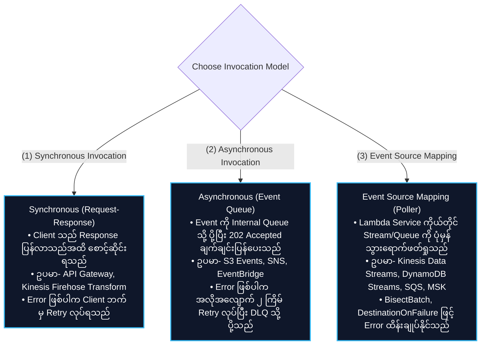
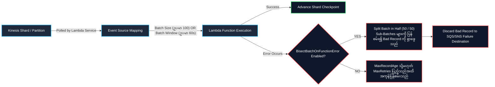
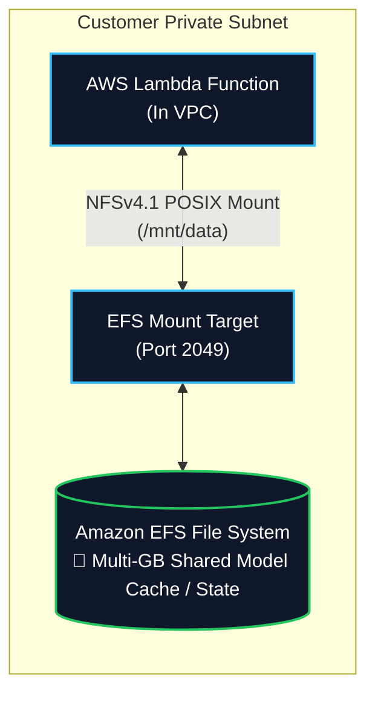
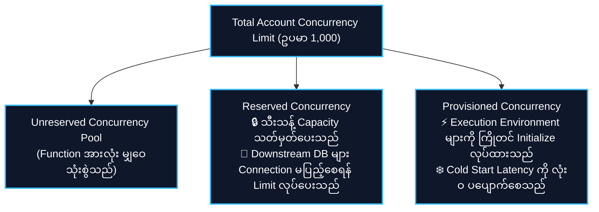

# ⚡ AWS Lambda (Serverless Event-Driven Compute & Data Transformation) (ဆာဗာမဲ့ အစီအစဉ်မောင်းနှင် ဒေတာပြုပြင်ခြင်း)

- **Category**: Compute (Serverless Compute & Event-Driven Processing)
- **Language / ဘာသာစကား**: [English Version](file:///home/monetine/Workspace/Wathon/aws-dea-c01/content/en/02-services/compute-containers/lambda.md) | **မြန်မာဘာသာ (Burmese)**
- **အဓိက အသုံးပြုမှု**: Real-time event-driven data processing၊ `[[kinesis]]` နှင့် `[[msk-kafka]]` တို့မှ streaming micro-batching ရယူခြင်း၊ lightweight ETL၊ S3 file ingestion triggers များနှင့် workflow orchestration glue အဖြစ် အသုံးပြုခြင်း။
- **Slide Reference**: Pages 289–310 in `[[AWSCertifiedDataEngineerSlides.pdf]]`
- **Hub Links**: `[[mm/index]]` | `[[en/index]]` | `[[kinesis]]` | `[[s3]]` | `[[dynamodb]]` | `[[redshift]]` | `[[efs-and-fsx]]` | `[[step-functions]]`

---

## ၁။ အကျဉ်းချုပ် (High-Level Summary)

**AWS Lambda** သည် ဆာဗာများကို ကြိုတင်စီမံခန့်ခွဲရန် မလိုဘဲ Event (ဖြစ်ရပ်များ) အပေါ် အခြေခံ၍ Code များကို အလိုအလျောက် မောင်းနှင်ပေးသည့် Fully Managed Serverless Compute ဝန်ဆောင်မှု ဖြစ်သည်။ Lambda သည် သုညမှ Concurrent Execution ထောင်သောင်းချီအထိ အလိုအလျောက် Scale လုပ်ပေးပြီး Code စတင်လည်ပတ်သည့် ကြာချိန်ကို 1-millisecond အဆင့်အထိ တိကျစွာ တွက်ချက်ခွင့်ပြုသည်။

Data Engineering စနစ်များတွင် AWS Lambda သည် မရှိမဖြစ် **Event-Driven Glue** အဖြစ် အောက်ပါနေရာများတွင် အလုပ်လုပ်သည်-
1. **Real-Time File Processing**: `[[s3]]` ပေါ်သို့ ဖိုင်အသစ် ရောက်ရှိလာသည့် Event (`s3:ObjectCreated:*`) ဖြင့် ချက်ချင်း အလုပ်လုပ်ပြီး Validation၊ Decompression သို့မဟုတ် Metadata ခွဲထုတ်ခြင်း။
2. **Stream Processing & Micro-Batching**: `[[kinesis]]` Data Streams၊ `[[dynamodb]]` Streams နှင့် `[[msk-kafka]]` တို့မှ Record များကို Batch လိုက် ဖတ်ယူသန့်စင်ခြင်း။
3. **Data Lake Hydration & Data Warehouse Loading**: `[[redshift]]` သို့ `COPY` command များ လှမ်းခေါ်ခြင်း သို့မဟုတ် `[[glue]]` Data Catalog တွင် Metadata Update ပြုလုပ်ခြင်း။
4. **Database Event Streaming**: Operational Database များမှ Change Events များကို `[[opensearch]]` သို့ ရှာဖွေနိုင်ရန် ပို့ပေးခြင်း သို့မဟုတ် `[[sqs-and-sns]]` ဖြင့် Alert ထုတ်ပေးခြင်း။

```mermaid
graph TB
    subgraph EventSources["Event Sources (အစပျိုး အကြောင်းရင်းများ)"]
        subgraph AsyncSources["(1) Asynchronous Triggers"]
            S3Event["Amazon S3<br/>(s3:ObjectCreated:*)"]
            SNSEvent["Amazon SNS Topics"]
            EBEvent["Amazon EventBridge (Cron/Events)"]
        end

        subgraph StreamSources["(2) Event Source Mapping (Polling)"]
            KinesisStream["Amazon Kinesis Data Streams"]
            DynamoStream["Amazon DynamoDB Streams"]
            MSKStream["Amazon MSK (Kafka)"]
            SQSQueue["Amazon SQS Queues"]
        end

        subgraph SyncSources["(3) Synchronous Invocations"]
            APIGW["Amazon API Gateway"]
            FirehoseTrans["Kinesis Data Firehose (Transform)"]
        end
    end

    subgraph LambdaEngine["AWS Lambda Compute Core"]
        Handler["Lambda Function Handler<br/>⚡ 128 MB - 10 GB RAM<br/>⏱️ 15-Minute Max Timeout<br/>📦 512 MB - 10 GB /tmp Storage"]
        EFSAttached["Mounted Amazon EFS<br/>(Multi-GB Shared Model / State)"]
        Layers["Lambda Layers (Pandas / PyArrow)"]
    end

    subgraph TargetDestinations["Downstream Storage & Analytics"]
        RedshiftDW[("Amazon Redshift<br/>(Trigger COPY Command)")]
        OpenSearchCluster[("Amazon OpenSearch<br/>(Log Indexing)")]
        CleanS3[("Amazon S3 (Silver Data Lake)")]
        DLQQueue[("Dead Letter Queue (SQS / SNS)<br/>(Failed Async Events)")]
    end

    S3Event -->|"Async Invoke (2 Retries)"| Handler
    SNSEvent --> Handler
    EBEvent --> Handler

    KinesisStream -->|"Polled in Batches"| Handler
    DynamoStream --> Handler
    MSKStream --> Handler
    SQSQueue --> Handler

    APIGW -->|"Sync Invoke"| Handler
    FirehoseTrans --> Handler

    Handler <--> EFSAttached
    Handler --- Layers

    Handler -->|"Execute Data API / COPY"| RedshiftDW
    Handler -->|"Index Documents"| OpenSearchCluster
    Handler -->|"Write Processed Output"| CleanS3
    Handler -.->|"On Failure (Async)"| DLQQueue

    classDef src fill:#1e293b,stroke:#f59e0b,stroke-width:2px,color:#fff;
    classDef lambda fill:#0f172a,stroke:#38bdf8,stroke-width:2px,color:#fff;
    classDef dest fill:#0f172a,stroke:#22c55e,stroke-width:2px,color:#fff;

    class S3Event,SNSEvent,EBEvent,KinesisStream,DynamoStream,MSKStream,SQSQueue,APIGW,FirehoseTrans src;
    class Handler,EFSAttached,Layers lambda;
    class RedshiftDW,OpenSearchCluster,CleanS3,DLQQueue dest;
```

---

## ၂။ နည်းပညာဆိုင်ရာ ကန့်သတ်ချက်များ (Compute Limits & Specs)

| Parameter / Resource | ကန့်သတ်ချက် (Limit) | Data Engineering အတွက် အရေးပါပုံ |
| :--- | :--- | :--- |
| **Max Execution Timeout** | **15 minutes (900 seconds)** | **Strict Hard Limit**: ၁၅ မိနစ်ထက် ကြာသော Spark သို့မဟုတ် ကြီးမားသည့် ETL များသည် `[[glue]]`၊ `[[emr]]`၊ `[[batch]]` သို့မဟုတ် `[[ecr-ecs-eks]]` ပေါ်တွင် run ရမည်။ |
| **Memory Allocation** | **128 MB မှ 10,240 MB (10 GB)** | 1 MB စီ တိုးမြှင့်နိုင်သည်။ **CPU သည် Memory အချိုးအစားအလိုက် အလိုအလျောက် တိုးတက်လာသည်** (1,769 MB တွင် 1 vCPU ရရှိပြီး 10 GB တွင် 6 vCPUs အထိ ရရှိသည်)။ |
| **Ephemeral Storage (`/tmp`)** | **512 MB မှ 10,240 MB (10 GB)** | Local ယာယီသိုလှောင်မှု။ ဖိုင်ကြီးများကို S3 သို့ မတင်မီ ဒေါင်းလုဒ်ဆွဲခြင်း၊ Uncompress လုပ်ခြင်းတို့အတွက် အသုံးပြုသည်။ |
| **Direct Deployment Package Size** | **50 MB** (zipped) / **250 MB** (unzipped) | Function Code နှင့် Unzipped Library များ စုစုပေါင်း အရွယ်အစား။ |
| **Container Image Deployment** | **Up to 10 GB** | Docker Container အဖြစ် `[[ecr-ecs-eks]]` (ECR) မှတစ်ဆင့် တင်သွင်းနိုင်သည်။ ကြီးမားသော ML Packages (PyTorch, TensorFlow) များအတွက် အထူးသင့်လျော်သည်။ |
| **Lambda Layers** | Max **5 layers** per function | မျှဝေသုံးစွဲနိုင်သော Library များ (`awswrangler`, `numpy`, `pandas`)။ |
| **Default Regional Concurrency** | **1,000 concurrent executions** | Region တစ်ခုအတွင်း Default ကန့်သတ်ချက် (Quota တောင်းခံ၍ တိုးမြှင့်နိုင်သည်)။ |

---

## ၃။ Invocation Models & Error Handling (ခေါ်ယူအသုံးပြုမှု ပုံစံများနှင့် အမှားစီမံခန့်ခွဲမှု)

### Event Source Mapping Stream Controls (Kinesis & DynamoDB Streams)

#### အဓိက Streaming Tuning Parameters များ:
1. **`BatchSize`**: Invocation တစ်ခုစီသို့ ပေးပို့မည့် အများဆုံး Record အရေအတွက် (1 မှ 10,000)။
2. **`MaximumBatchingWindowInSeconds`**: Record မပြည့်မီ စောင့်ဆိုင်းမည့် အများဆုံးကြာချိန် (0 မှ 300 စက္ကန့်)။ Low-throughput အချိန်များတွင် Batch ဖွဲ့စည်းပေးခြင်းဖြင့် Cost သက်သာစေသည်။
3. **`ParallelizationFactor`**: Shard တစ်ခုတည်းပေါ်တွင် **Concurrent Lambda Invocations ၁၀ ခုအထိ တစ်ပြိုင်နက် မောင်းနှင်နိုင်သည်** (Partition Key အလိုက် Order မပျက်စေပါ)။
4. **`BisectBatchOnFunctionError`**: Error ဖြစ်သော Batch ကို ထက်ဝက်စီ အဆင့်ဆင့် ခွဲခြမ်းပြီး ပြဿနာဖြစ်စေသော Poison Pill Record တစ်ခုတည်းကို ရှာဖွေဖယ်ထုတ်ပေးသည်။
5. **`DestinationOnFailure`**: ပျက်စီးနေသော Record များကို Amazon SQS သို့မဟုတ် SNS သို့ ပို့ဆောင်ပေးသည်။
6. **`TumblingWindows`**: အချိန်အပိုင်းအခြားအလိုက် Continuous Window Aggregations (၁၅ မိနစ်အထိ) တွက်ချက်ပေးနိုင်သည်။

---

## ၄။ Persistent Storage: Amazon EFS ချိတ်ဆက်မှု

- Lambda သည် **EFS Access Point** မှတစ်ဆင့် **Amazon EFS** ကို NFSv4.1 POSIX File System အဖြစ် တိုက်ရိုက် Mount လုပ်နိုင်သည်။
- **Data Engineering အကျိုးကျေးဇူး**: 10 GB `/tmp` ကန့်သတ်ချက်ကို ကျော်လွန်၍ ကြီးမားသော ML Model Weights များနှင့် မျှဝေသုံးစွဲရမည့် Reference Datasets များကို Lambda Invocations များစွာက တစ်ပြိုင်နက် ရယူနိုင်သည်။

---

## ၅။ Concurrency စီမံခန့်ခွဲမှု: Reserved vs. Provisioned Concurrency

1. **Reserved Concurrency**: Function တစ်ခုအတွက် အများဆုံး Concurrency ပမာဏကို ကန့်သတ်ပေးသည်။ Downstream Relational Databases (`[[rds-and-aurora]]`) များ Connection မပြည့်လျှံစေရန် Rate Limiter / Circuit Breaker အဖြစ် သုံးသည်။
2. **Provisioned Concurrency**: Execution Environment များကို ကြိုတင် ပြင်ဆင်ထားပေးခြင်းဖြင့် **Cold Start Latency ကို လုံးဝ ပပျောက်စေသည်**။

---

## ၆။ Data Engineering Production Architecture Patterns

### Pattern A: Event-Driven Redshift Data Warehouse Bulk Ingestion

---

## ၇။ DEA-C01 စာမေးပွဲ အဓိက အချက်အလက်များနှင့် ထောင်ချောက်များ (Exam Tips & Traps)

> [!IMPORTANT]
> **Key Exam Trigger Keywords**:
> - **"Event-driven serverless processing triggered by S3 uploads or Kinesis streams"** $\rightarrow$ **AWS Lambda**.
> - **"Loading large S3 files into Amazon Redshift via event trigger"** $\rightarrow$ **Lambda triggers Redshift `COPY` command via Redshift Data API** (Single SQL INSERT များ မသုံးရပါ!).
> - **"Prevent poison pill records from blocking a Kinesis data stream"** $\rightarrow$ **Enable `BisectBatchOnFunctionError: true` and configure `DestinationOnFailure` (SQS/SNS)**.
> - **"Eliminate cold start latency for critical Lambda workloads"** $\rightarrow$ **Provisioned Concurrency**.
> - **"Prevent bursty Lambda invocations from exhausting relational database connections"** $\rightarrow$ **Reserved Concurrency သို့မဟုတ် Amazon RDS Proxy**.
> - **"Serverless function requires multi-gigabyte shared ML model cache"** $\rightarrow$ **Attach Amazon EFS to Lambda via EFS Access Point**.

> [!WARNING]
> **Exam Traps (သတိထားရမည့် အချက်များ)**:
> 1. **15-Minute Timeout Trap**: ၁၅ မိနစ်ထက် ကြာမည့် Batch လုပ်ငန်းစဉ်များအတွက် Lambda ကို မရွေးချယ်ရပါ; **AWS Batch**, **AWS Glue ETL**, သို့မဟုတ် **Amazon EMR** ကို ရွေးချယ်ပါ။
> 2. **S3 Event Recursive Loop Trap**: Lambda Trigger ဖြစ်စေသော S3 Bucket/Prefix သို့ Output ပြန်ရေးမိပါက Infinite Loop ဖြစ်ပြီး Bill အဆမတန် တက်လာနိုင်သည်။ Output ကို အခြား Bucket သို့မဟုတ် Prefix အသစ်တွင် သိမ်းရမည်။

---

## 📌 ဆက်စပ် မှတ်စုများ (Related Notes)

- `[[batch]]` — AWS Batch (၁၅ မိနစ်ထက် ကျော်လွန်သော Container Batch များ)
- `[[glue]]` — AWS Glue Serverless Spark ETL
- `[[emr]]` — Amazon EMR Distributed Big Data Clusters
- `[[kinesis]]` — Amazon Kinesis Streaming Ingestion with Lambda
- `[[s3-event-notifications]]` — S3 Event Notifications & EventBridge
- `[[step-functions]]` — Step Functions ဖြင့် Multi-Step Lambda Workflows
