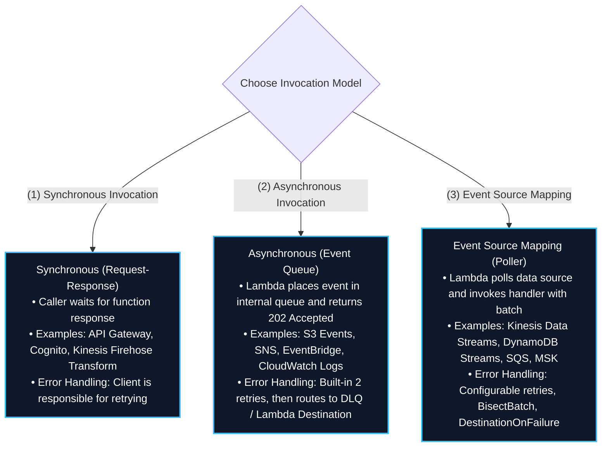
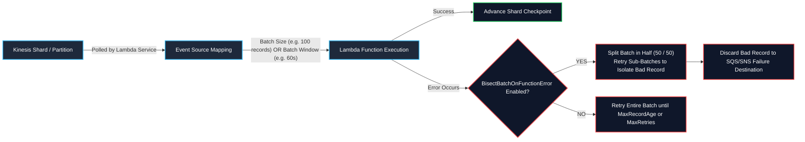
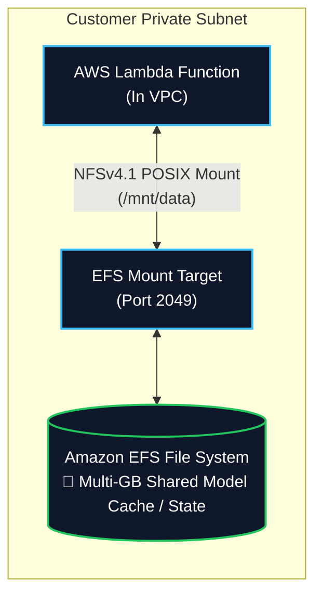
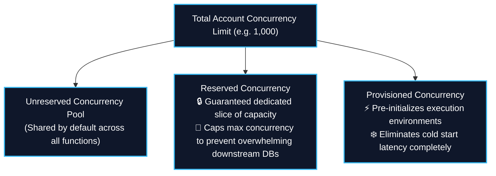
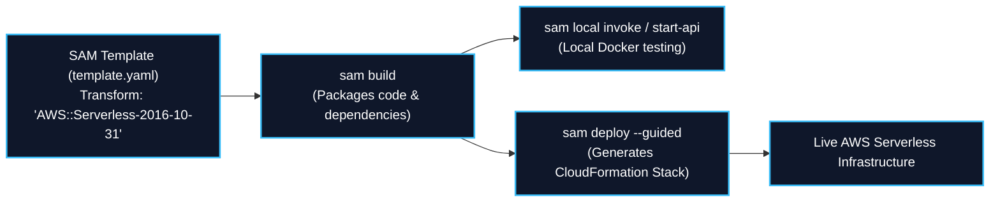
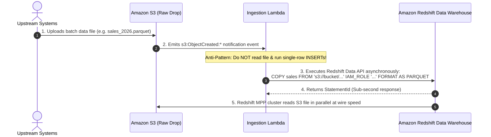

# ⚡ AWS Lambda (Serverless Event-Driven Compute & Data Transformation)

- **Category**: Compute (Serverless Compute & Event-Driven Processing)
- **Language / ဘာသာစကား**: [English (Original)](file:///home/monetine/Workspace/Wathon/aws-dea-c01/content/en/02-services/compute-containers/lambda.md) | **မြန်မာဘာသာ (Burmese)**
- **Primary Use Case**: Real-time event-driven data processing, [[kinesis]] နှင့် [[msk-kafka]] တို့မှ streaming micro-batching လုပ်ခြင်း၊ ပေါ့ပါးသော ETL၊ S3 file ingestion triggers များနှင့် workflow orchestration glue အဖြစ် အသုံးပြုခြင်း။
- **Slide Reference**: `[[AWSCertifiedDataEngineerSlides.pdf]]` မှ Pages 289–310 
- **Hub Links**: [[mm/index]] | [[service-catalog]] | [[domain-1-ingestion-and-processing]] | [[kinesis]] | [[s3]] | [[dynamodb]] | [[redshift]] | [[efs-and-fsx]] | [[step-functions]]

---

## 1. High-Level Summary

**AWS Lambda** သည် server များကို provision လုပ်ခြင်း သို့မဟုတ် စီမံခန့်ခွဲခြင်းများ မလိုအပ်ဘဲ event များတုံ့ပြန်မှုအဖြစ် code ကို run ပေးသော fully managed, event-driven serverless compute service တစ်ခုဖြစ်ပါသည်။ Lambda သည် သုညမှ သောင်းနှင့်ချီသော concurrent executions အထိ အလိုအလျောက် scale လုပ်ပေးနိုင်ပြီး 1-millisecond အပိုင်းအခြားဖြင့် compute ကြာမြင့်ချိန် (duration) ကိုသာ တိကျစွာ ငွေကောက်ခံပါသည်။

Data engineering architectures များတွင် AWS Lambda သည် မရှိမဖြစ်လိုအပ်သော **event-driven glue** အဖြစ် လုပ်ဆောင်ပေးပါသည်-
1. **Real-Time File Processing**: Validate လုပ်ရန်၊ decompress လုပ်ရန် သို့မဟုတ် metadata ထုတ်ယူရန် [[s3]] object creation events (`s3:ObjectCreated:*`) ဖြင့် ချက်ချင်း trigger လုပ်ပါသည်။
2. **Stream Processing & Micro-Batching**: [[kinesis]] Data Streams, [[dynamodb]] Streams, နှင့် [[msk-kafka]] တို့မှ streaming records များကိုဖတ်ရှုပြီး transform လုပ်ပါသည်။
3. **Data Lake Hydration & Data Warehouse Loading**: [[redshift]] အတွင်းသို့ bulk `COPY` commands ကို အစပျိုးပေးခြင်း သို့မဟုတ် [[glue]] Data Catalog တွင် metadata ကို update လုပ်ပေးခြင်း။
4. **Database Event Streaming**: Operational databases များမှ change events များကို [[opensearch]] ကဲ့သို့သော search indexes များသို့ ပွားယူခြင်း သို့မဟုတ် [[sqs-and-sns]] မှတစ်ဆင့် alerting topics များသို့ပေးပို့ခြင်း။

**AWS Certified Data Engineer – Associate (DEA-C01)** exam အတွက် သင် ကျွမ်းကျင်ထားရမည့်အချက်များ-
- **Invocation Models**: Synchronous နှင့် Asynchronous အပြင် Event Source Mapping (Stream/Queue Polling) အကြောင်း။
- **Stream Ingestion Tuning**: Batch size, batching window, parallelization factor, error handling (`BisectBatchOnFunctionError`), နှင့် tumbling windows.
- **Compute Limits & Storage**: တင်းကျပ်သော **15-minute execution limit**, memory allocation (128 MB မှ 10 GB အထိ), ephemeral storage (`/tmp` 10 GB အထိ), နှင့် multi-gigabyte persistent storage အတွက် **Amazon EFS** ကို mount လုပ်ခြင်း။
- **Concurrency & Cold Starts**: Reserved နှင့် Provisioned Concurrency ကြားကွာခြားချက်များ။
- **AWS SAM (Serverless Application Model)**: Serverless data pipelines များကို local နှင့် AWS တွင် deploy လုပ်ခြင်း။


---

## 2. Technical Specifications & Compute Limits

| Parameter / Resource | Hard / Soft Limit | Data Engineering Significance |
| :--- | :--- | :--- |
| **Max Execution Timeout** | **15 minutes (900 seconds)** | **Strict Hard Limit**: 15 မိနစ်ထက်ကျော်လွန်သော long-running Spark သို့မဟုတ် custom ETL jobs များကို [[glue]], [[emr]], [[batch]], သို့မဟုတ် [[ecr-ecs-eks]] တွင်မဖြစ်မနေ run ရပါမည်။ |
| **Memory Allocation** | **128 MB မှ 10,240 MB (10 GB) အထိ** | 1 MB တိုးနှုန်းများဖြင့် configure လုပ်နိုင်သည်။ **CPU သည် memory နှင့်အချိုးကျစွာ scale လုပ်ပါသည်** (1,769 MB တွင် Lambda သည် full vCPU 1 ခုကို ခွဲဝေချထားပေးပြီး၊ 10 GB တွင် 6 vCPUs အထိ ရရှိပါသည်)။ |
| **Ephemeral Storage (`/tmp`)** | **512 MB မှ 10,240 MB (10 GB) အထိ** | Configure လုပ်နိုင်သော local scratch disk space ဖြစ်သည်။ S3 သို့ upload မလုပ်မီ multi-gigabyte files များကို local တွင် download, uncompress နှင့် process လုပ်ရန်အတွက် မရှိမဖြစ်လိုအပ်ပါသည်။ |
| **Direct Deployment Package Size** | **50 MB** (zipped) / **250 MB** (unzipped) | Code နှင့် unzipped dependencies များပါဝင်ပါသည်။ |
| **Container Image Deployment** | **10 GB အထိ** | [[ecr-ecs-eks]] (Amazon ECR) တွင်သိမ်းဆည်းထားသော Docker container အနေဖြင့် package လုပ်ထားသည်။ ကြီးမားသော ML packages များ (TensorFlow, PyTorch) သို့မဟုတ် custom C++ libraries များအတွက် အထူးသင့်လျော်ပါသည်။ |
| **Lambda Layers** | Function တစ်ခုလျှင် အများဆုံး **5 layers** | Shared reusable libraries များ (ဥပမာ AWS SDK, `awswrangler`, `numpy`, `pandas`) ဖြစ်သည်။ Function ၏ unzipped size စုစုပေါင်းနှင့် layers အားလုံးပေါင်းသည် 250 MB ထက် မကျော်လွန်ရပါ။ |
| **Default Regional Concurrency** | **1,000 concurrent executions** | AWS Region တစ်ခုအတွက် Soft limit (quota request မှတစ်ဆင့် တိုးမြှင့်နိုင်ပါသည်)။ |

---

## 3. Lambda Invocation Models & Error Handling

Data pipeline ယုံကြည်စိတ်ချရမှုအတွက် invocation models သုံးခုကို နားလည်ထားရန် အရေးကြီးပါသည်-



### Event Source Mapping Stream Controls (Kinesis & DynamoDB Streams)

Lambda ဖြင့် streaming data များကို process လုပ်သောအခါ၊ poison pill records များမှ stream partitions များကို ရပ်တန့်မသွားစေရန် fine-grained batching နှင့် retry parameters များက ကာကွယ်ပေးပါသည်-



#### Key Streaming Tuning Parameters:
1. **`BatchSize`**: Invocation တစ်ခုတည်းတွင် function ထံသို့ ပေးပို့မည့် records အရေအတွက် အများဆုံး (1 မှ 10,000 အထိ)။
2. **`MaximumBatchingWindowInSeconds`**: Lambda သည် function ကို invoke မလုပ်မီ records များကို buffer လုပ်မည့် အများဆုံးအချိန် (0 မှ 300 စက္ကန့်)။ ကုန်ကျစရိတ်နှင့် downstream database ရေးသားမှုများကို အကောင်းဆုံးဖြစ်စေရန် throughput နည်းပါးချိန်များတွင် micro-records များကို batch လုပ်နိုင်စေပါသည်။
3. **`ParallelizationFactor`**: Throughput ကို scale လုပ်နေစဉ် partition key တစ်ခုချင်းစီအလိုက် in-order processing ကိုထိန်းသိမ်းထားပြီး **Kinesis shard တစ်ခုလျှင် အများဆုံး concurrent Lambda invocations 10 ခုအထိ** လုပ်ဆောင်နိုင်စေပါသည်။
4. **`BisectBatchOnFunctionError`**: Shard တစ်ခုလုံးကို ရပ်တန့်မသွားစေဘဲ ပျက်စီးနေသော မှတ်တမ်းတစ်ခု ("poison pill") ကို ခွဲထုတ်နိုင်ရန် ကျရှုံးခဲ့သော batch တစ်ခုကို ထက်ဝက်နှစ်ခု အလိုအလျောက်ခွဲပြီး တစ်ခုစီကို ထပ်မံကြိုးစား (retry) လုပ်ဆောင်ပေးပါသည်။
5. **`MaximumRecordAgeInSeconds` & `MaximumRetryAttempts`**: Stream စီးဆင်းမှုကို ပြန်လည်စတင်ရန် သက်တမ်းကုန်ဆုံးသွားသော streaming records များကို **Destination on Failure** (Amazon SQS သို့မဟုတ် SNS) သို့ ချန်လှပ် (drop) ထားခဲ့ပါသည်။
6. **`TumblingWindows`**: Stateful tumbling window calculations များကို လုပ်ဆောင်နိုင်စေပါသည် (15 မိနစ်အထိ အဆက်မပြတ် tumbling time windows များပေါ်တွင် aggregations လုပ်ခြင်း)။

---

## 4. Lambda VPC Networking & Amazon EFS Mounting

### 1. VPC Networking (ENI Architecture)
- ပုံမှန်အားဖြင့် (By default), Lambda သည် public internet နှင့် public AWS endpoints များသို့ တိုက်ရိုက်ချိတ်ဆက်ခွင့်ရှိသော လုံခြုံသည့် AWS-managed VPC တစ်ခုအတွင်းတွင် အလုပ်လုပ်ပါသည်။
- Private resources များ (ဥပမာ private subnets များအတွင်းရှိ Amazon RDS, Amazon Redshift, သို့မဟုတ် internal microservices) ကို ချိတ်ဆက်အသုံးပြုရန် Lambda function ကို **သင်၏ VPC အတွင်းရှိ private subnets များ** တွင် attach လုပ်ပါ။
- **Important**: VPC-enabled Lambda function မှ public internet သို့ ချိတ်ဆက်နိုင်ရန်၊ public subnet တစ်ခုအတွင်းရှိ **NAT Gateway** မှတစ်ဆင့် traffic ကို route လုပ်ပါ။

### 2. Persistent Storage: Amazon EFS Integration



- Lambda သည် **EFS Access Point** မှတစ်ဆင့် **Amazon EFS** file systems များကို mount လုပ်နိုင်ပါသည်။
- **Benefits for Data Engineering**:
  - (10 GB `/tmp` limit ကိုကျော်လွန်ပြီး) **အကန့်အသတ်မရှိသော storage capacity** ဖြင့် မျှဝေအသုံးပြုနိုင်သော, အမြဲတည်ရှိနေမည့် (persistent) POSIX file system တစ်ခုကို ထောက်ပံ့ပေးပါသည်။
  - တစ်ပြိုင်နက်လုပ်ဆောင်နေသော Lambda function invocations အများအပြားကို ကြီးမားသည့် machine learning model weights, search indexes, သို့မဟုတ် stateful reference datasets များအား မျှဝေအသုံးပြုနိုင်စေပါသည်။

---

## 5. Concurrency Management: Reserved vs. Provisioned Concurrency



1. **Reserved Concurrency**:
   - တိကျသော function တစ်ခုအတွက် အများဆုံး concurrent execution instances အရေအတွက်ကို အာမခံချက်ဖြင့် သီးသန့်ဖယ်ထားပေးပါသည်။
   - **Crucial Data Engineering Role**: အများအပြားသော events များ Lambda သို့ ဝင်ရောက်လာသည့်အခါ downstream transactional databases ([[rds-and-aurora]]) များကို connections ပြည့်သွားခြင်းမှ ကာကွယ်ပေးရန် **rate limiter (circuit breaker)** အနေဖြင့် လုပ်ဆောင်ပေးပါသည်။
2. **Provisioned Concurrency**:
   - တောင်းဆိုထားသော execution environments အရေအတွက်ကို ကြိုတင် (pre-initializes) ပြင်ဆင်ပေးပါသည် (code ကို download လုပ်ခြင်း, runtime ကို initialize လုပ်ခြင်း, initialization code များကို run ခြင်း)။
   - Real-time APIs သို့မဟုတ် synchronous stream transformations များအတွက် **cold start latency** ကို လုံးဝပပျောက်စေပါသည်။

---

## 6. AWS Serverless Application Model (AWS SAM)

**AWS SAM** သည် serverless data architectures များကို သတ်မှတ်ရန်၊ တည်ဆောက်ရန်၊ စမ်းသပ်ရန်နှင့် deploy လုပ်ရန် AWS CloudFormation ကို တိုးချဲ့ထားသော open-source framework တစ်ခုဖြစ်ပါသည်-



### SAM Template Example for Event-Driven Ingestion:
```yaml
AWSTemplateFormatVersion: '2010-09-09'
Transform: 'AWS::Serverless-2016-10-31'
Description: 'S3 Ingestion & Redshift Copy Trigger'

Resources:
  DataIngestFunction:
    Type: AWS::Serverless::Function
    Properties:
      Handler: app.lambda_handler
      Runtime: python3.11
      MemorySize: 1024
      Timeout: 60
      Policies:
        - S3ReadPolicy:
            BucketName: raw-data-lake-bucket
      Events:
        S3FileUpload:
          Type: S3
          Properties:
            Bucket: !Ref RawDataBucket
            Events: s3:ObjectCreated:*
            Filter:
              S3Key:
                Rules:
                  - Name: suffix
                    Value: .parquet

  RawDataBucket:
    Type: AWS::S3::Bucket
```

- **SAM Accelerate (`sam sync --watch`)**: လျင်မြန်သော cloud ဖွံ့ဖြိုးတိုးတက်မှုနှင့် စမ်းသပ်မှုအတွက် CloudFormation stack အပြည့်အစုံ update လုပ်ခြင်းကို ကျော်ဖြတ်ပြီး local code ပြောင်းလဲမှုများကို AWS သို့ real-time တိုက်ရိုက် synchronize လုပ်ပေးပါသည်။

---

## 7. Data Engineering Production Architecture Patterns

### Pattern A: Event-Driven Redshift Data Warehouse Bulk Ingestion



### Pattern B: Real-Time Stream Ingestion & OpenSearch Log Indexing
- **Scenario**: High-volume clickstream logs များသည် [[kinesis]] Data Streams အတွင်းသို့ စီးဝင်နေပါသည်။ Analytics dashboards များသည် စက္ကန့်ပိုင်းအတွင်း ရှာဖွေနိုင်သော documents များကို [[opensearch]] တွင် လိုအပ်ပါသည်။
- **Architecture**:
  - Kinesis Data Streams သည် log records များကို ဖမ်းယူပါသည်။
  - Lambda Event Source Mapping သည် `BatchSize: 500` နှင့် `MaximumBatchingWindowInSeconds: 10` ဖြင့် Kinesis ကို poll လုပ်ပါသည်။
  - Lambda သည် JSON records များကို transform လုပ်ပြီး၊ geolocation ကို ထုတ်ယူကာ Amazon OpenSearch Service ထဲသို့ bulk indexing requests များကို လုပ်ဆောင်ပါသည်။
  - ကျရှုံးသွားသော records များကို `BisectBatchOnFunctionError: true` ဖြင့် SQS Dead Letter Queue သို့ ပို့ဆောင်ပေးပါသည်။

---

## 8. High-Yield DEA-C01 Exam Tips & Traps

> [!IMPORTANT]
> **Key Exam Trigger Keywords**:
> - **"Event-driven serverless processing triggered by S3 uploads or Kinesis streams"** $\rightarrow$ **AWS Lambda**.
> - **"Loading large S3 files into Amazon Redshift via event trigger"** $\rightarrow$ **Lambda triggers Redshift `COPY` command via Redshift Data API** (Lambda အတွင်း line-by-line SQL `INSERT`s ကို ဘယ်တော့မှ မသုံးပါနှင့်!)။
> - **"Prevent poison pill records from blocking a Kinesis data stream"** $\rightarrow$ **`BisectBatchOnFunctionError: true` ကို enable လုပ်ပြီး `DestinationOnFailure` (SQS/SNS) ကို configure လုပ်ပါ**။
> - **"Eliminate cold start latency for critical Lambda workloads"** $\rightarrow$ **Provisioned Concurrency**.
> - **"Prevent bursty Lambda invocations from exhausting relational database connections"** $\rightarrow$ **Reserved Concurrency (acts as a throttling ceiling) သို့မဟုတ် Amazon RDS Proxy**.
> - **"Serverless function requires multi-gigabyte shared ML model cache or shared file system"** $\rightarrow$ **EFS Access Point မှတစ်ဆင့် Amazon EFS ကို Lambda သို့ attach လုပ်ပါ**.

> [!WARNING]
> **Exam Traps & Failure Modes**:
> 1. **The 15-Minute Execution Limit**:
>    - Lambda functions များသည် **15 မိနစ် (စက္ကန့် 900) တွင် အလိုအလျောက် ရပ်တန့် (terminate) သွားပါသည်**။ အကယ်၍ စာမေးပွဲမေးခွန်းတစ်ခုသည် 30 မိနစ် သို့မဟုတ် နာရီအတော်ကြာ လုပ်ဆောင်ရသော batch processing task အကြောင်းကို ဖော်ပြနေပါက Lambda သည် အဖြေမှားဖြစ်ပါသည်၊ **AWS Batch**, **AWS Glue ETL**, သို့မဟုတ် **Amazon EMR** ကို ရွေးချယ်ပါ။
> 2. **S3 Event Notification Recursion Trap**:
>    - အကယ်၍ Lambda function သည် S3 bucket upload ဖြင့် အစပျိုး (trigger) လုပ်ခံရပြီး ၎င်း၏ output file ကို **တူညီသော prefix ရှိသည့် တူညီသော S3 bucket သို့** ပြန်လည်ရေးသားပါက၊ ၎င်းသည် **infinite recursive execution loop** ကို ဖြစ်စေပြီး ကြီးမားလှသော AWS bills များကို ဖြစ်ပေါ်စေပါသည်! အမြဲတမ်း output ကို ကွဲပြားသော bucket သို့မဟုတ် သီးခြားဖြစ်သော prefix သို့ ရေးသားပါ။
> 3. **Asynchronous Retry Behavior**:
>    - Asynchronous invocations (S3, SNS, EventBridge မှ) များသည် DLQ သို့ မပို့ဆောင်မီ ကျရှုံးမှုဖြစ်ပေါ်သောအခါ **နှစ်ကြိမ် အလိုအလျောက် retry** လုပ်ပါသည်၊ ထို့ကြောင့် retry လုပ်ခြင်းသည် downstream databases တွင် ပုံတူ records များကို မဖြစ်ပေါ်စေရန် functions များသည် **idempotent** ဖြစ်ရပါမည်။

---

## 📌 Related Notes

- [[batch]] — 15 မိနစ်ထက်ကျော်လွန်သော long-running containerized batch computing အတွက် AWS Batch
- [[glue]] — Distributed serverless Spark ETL အတွက် AWS Glue
- [[emr]] — Petabyte-scale distributed cluster processing အတွက် Amazon EMR
- [[kinesis]] — Lambda consumers များဖြင့် streaming ingestion အတွက် Amazon Kinesis
- [[s3-event-notifications]] — S3 Event Notifications နှင့် EventBridge integration
- [[step-functions]] — Multi-step Lambda workflows များကို Orchestrating လုပ်ခြင်း
- [[domain-1-ingestion-and-processing]] — DEA-C01 Domain 1 Study Guide
- [[service-comparisons]] — Master DEA-C01 Service Decision Matrix
