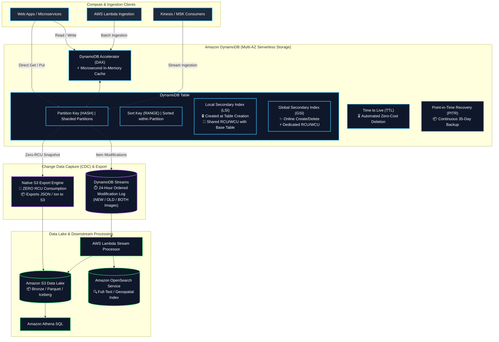
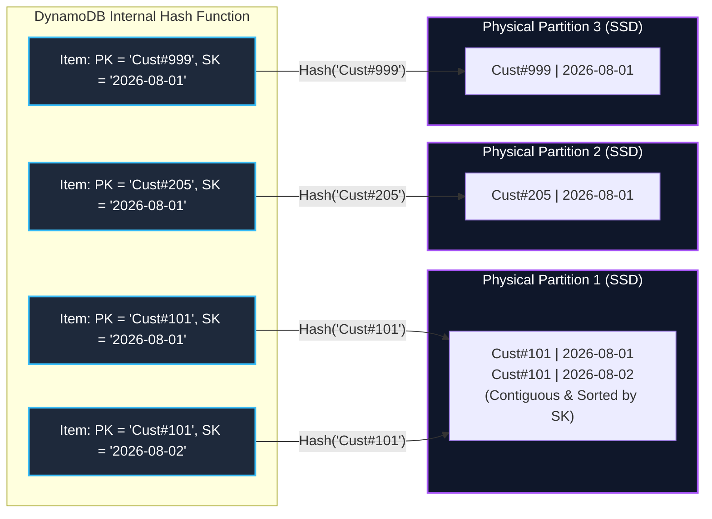
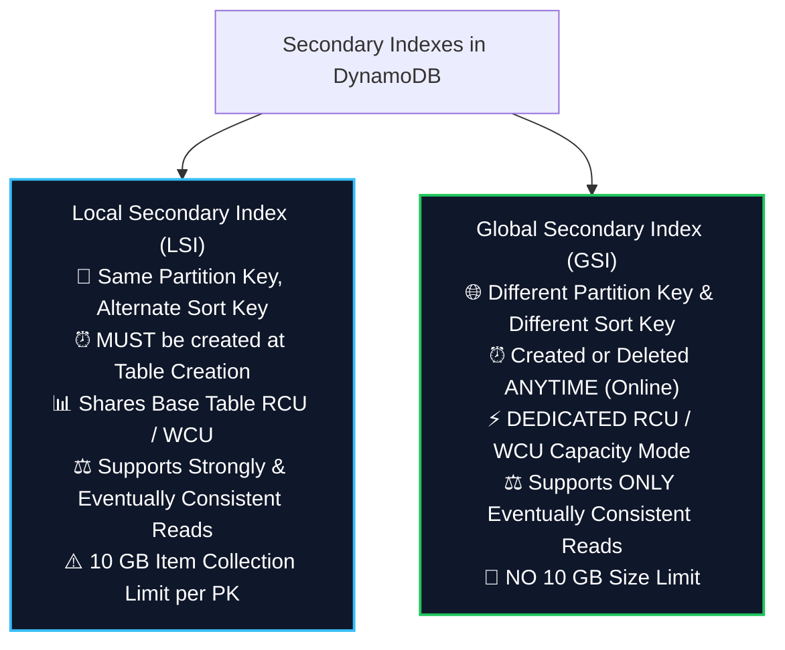
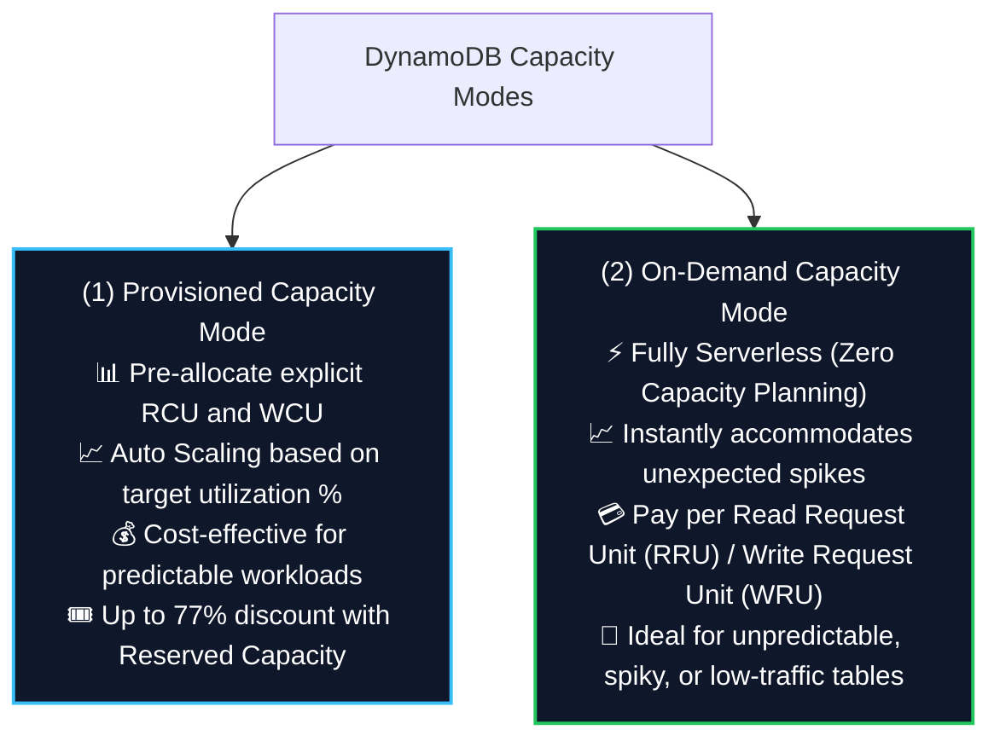
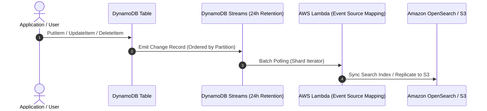
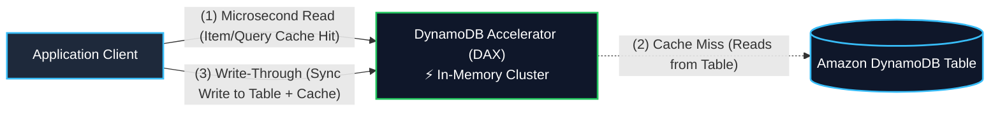
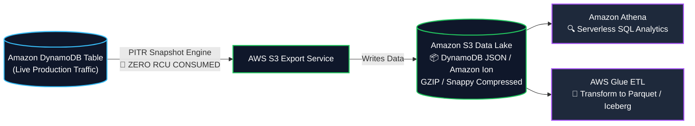

# ⚡ Amazon DynamoDB (Serverless NoSQL Key-Value & Document Database)

- **Category**: Database (Serverless NoSQL Key-Value & Document)
- **Language / ဘာသာစကား**: [English (Original)](file:///home/monetine/Workspace/Wathon/aws-dea-c01/content/en/02-services/database/dynamodb.md) | **မြန်မာဘာသာ (Burmese)**
- **Primary Use Case**: Ultra-low-latency single-digit millisecond operational data store, real-time feature stores, streaming pipeline state tracking, Change Data Capture (CDC) with DynamoDB Streams, နှင့် distributed metadata catalogs။
- **Slide Reference**: `[[AWSCertifiedDataEngineerSlides.pdf]]` မှ Pages 156–195
- **Hub Links**: [[mm/index]] | [[mm/service-catalog]] | [[mm/domain-2-data-store-management]] | [[mm/domain-1-ingestion-and-processing]] | [[mm/s3]] | [[mm/lambda]] | [[mm/glue]] | [[mm/redshift]]

---

## 1. High-Level Summary

**Amazon DynamoDB** သည် single-digit millisecond latency ကို မည်သည့် scale တွင်မဆို ရရှိစေရန် ဒီဇိုင်းပြုလုပ်ထားသော fully managed, serverless, multi-Region, multi-active NoSQL database ဖြစ်ပါသည်။ ၎င်းသည် AWS Region တစ်ခုအတွင်းရှိ Availability Zones (AZs) သုံးခုတွင် ကူးယူသိမ်းဆည်းထားသော (replicated) SSD storage များပေါ်ရှိ physical partition များအကြား data နှင့် traffic များကို အလိုအလျောက် ဖြန့်ဝေပေးပါသည်။

**AWS Certified Data Engineer – Associate (DEA-C01)** စာမေးပွဲအတွက် DynamoDB ကို အောက်ပါအချက်များအပေါ် အဓိကထားပြီး စစ်ဆေးလေ့ရှိပါသည်-
1. **Primary Key Design & Partitioning**: Partition Keys (HASH), Composite Keys (HASH + RANGE), write sharding နှင့် hot partition များ ရှောင်ရှားခြင်း။
2. **Secondary Indexes (LSI vs. GSI)**: Schema modification စည်းမျဉ်းများ၊ consistency guarantees များ၊ capacity allocation နှင့် GSI write backpressure.
3. **Throughput Modes & Exact Capacity Calculations**: On-Demand နှင့် Provisioned table များပေါ်ရှိ strong, eventual နှင့် transactional operation များအတွက် RCUs နှင့် WCUs များကို တွက်ချက်ခြင်း။
4. **Change Data Capture (CDC)**: **DynamoDB Streams** (သို့မဟုတ် Kinesis Data Streams for DynamoDB) အား AWS Lambda, EventBridge နှင့် S3 Data Lakes များနှင့်တွဲဖက်၍ item-level modification များကို process လုပ်ခြင်း။
5. **Zero-Impact Data Lake Integration**: Petabyte-scale ရှိသော DynamoDB table များကို table RCU မကုန်ဆုံးစေဘဲ **Amazon S3** သို့ export လုပ်ခြင်း။
6. **In-Memory Caching & Expiration**: **DynamoDB Accelerator (DAX)** အသုံးပြု၍ microsecond query acceleration ပြုလုပ်ခြင်း နှင့် **Time to Live (TTL)** မှတစ်ဆင့် automated lifecycle expiration ပြုလုပ်ခြင်း။

---

## 2. DynamoDB Data Model & Partition Key Architecture

DynamoDB သည် data များကို **Tables** များအဖြစ် သိမ်းဆည်းထားပြီး Table များတွင် **Items** (rows) များ ပါဝင်ကာ၊ item တစ်ခုချင်းစီတွင် **Attributes** (columns) များ ပါဝင်ပါသည်။ Item များသည် ပုံသေ schema မရှိသော (schemaless) ပုံစံရှိနိုင်ပြီး၊ အများဆုံး item size အနေဖြင့် **400 KB** ရှိပါသည်။

### Primary Key Types

1. **Simple Primary Key (Partition Key / HASH)**:
   - Attribute တစ်ခုတည်းဖြင့်သာ ဖွဲ့စည်းထားပါသည် (ဥပမာ `user_id`)။
   - Internal hash function သည် Partition Key တန်ဖိုးကို သီးခြား physical storage partition တစ်ခုသို့ ချိတ်ဆက် (map) ပေးပါသည်။
   - Table အတွင်းရှိ မည်သည့် item နှစ်ခုမျှ တူညီသော Partition Key မရှိနိုင်ပါ။
2. **Composite Primary Key (Partition Key + Sort Key / HASH + RANGE)**:
   - Attribute နှစ်ခုဖြင့် ဖွဲ့စည်းထားပါသည်- **Partition Key** (HASH) နှင့် **Sort Key** (RANGE) (ဥပမာ `device_id` (PK) + `timestamp` (SK))။
   - တူညီသော Partition Key ရှိသည့် Item များကို တူညီသော physical partition အတွင်း၌ စဉ်ဆက်မပြတ် သိမ်းဆည်းထားပြီး၊ Sort Key ဖြင့် ကြီးစဉ်ငယ်လိုက် စီထားပါသည်။
   - Range query များဖြစ်သော `=`, `<`, `<=`, `>`, `>=`, `BETWEEN` နှင့် `begins_with()` တို့ကို အသုံးပြုနိုင်ပါသည်။

### Partition Limits & Hot Partitions

- **Physical Partition Limits**: Internal partition တစ်ခုစီသည် data **10 GB**၊ **1,000 WCUs** နှင့် **3,000 RCUs** အထိ ထောက်ပံ့ပေးပါသည်။
- **Hot Partition Issue**: အကယ်၍ workload တစ်ခုသည် low-cardinality ရှိသော Partition Key သို့ မကြာခဏ read သို့မဟုတ် write လုပ်နေပါက (ဥပမာ `Status = 'ACTIVE'` သို့မဟုတ် `Date = '2026-08-10'`)၊ physical partition တစ်ခုတည်းက request များအားလုံးကို ကိုင်တွယ်ရပြီး throughput limit များကို ထိခိုက်ကာ `ProvisionedThroughputExceededException` ကို ဖြစ်စေပါသည်။
- **Mitigation (Write Sharding)**:
  - Partition Key သို့ ကျပန်း သို့မဟုတ် တွက်ချက်ထားသော suffix တစ်ခုကို ပေါင်းထည့်ပါ (ဥပမာ `Date_Suffix` တွင် suffix သည် `1` မှ `N` အထိ ကျပန်း integer ဖြစ်ပြီး၊ ဥပမာ `2026-08-10.1`, `2026-08-10.2`)။
  - ၎င်းသည် write များကို physical partition $N$ ခုတစ်လျှောက် ညီညာစွာ ဖြန့်ဝေပေးပါသည်။

---

## 3. Secondary Indexes Deep Dive: LSI vs. GSI

Secondary indexes များသည် primary key မှလွဲ၍ အခြား attribute များကို အသုံးပြု၍ data များကို query လုပ်ရန် ခွင့်ပြုပါသည်။ **Local Secondary Indexes (LSI)** နှင့် **Global Secondary Indexes (GSI)** တို့အကြား ဗိသုကာပိုင်းဆိုင်ရာ ကွာခြားချက်များကို နားလည်ခြင်းသည် အရေးအကြီးဆုံး စာမေးပွဲ ခေါင်းစဉ်များထဲမှ တစ်ခုဖြစ်ပါသည်။

### Comprehensive LSI vs. GSI Comparison Matrix

| Architectural Feature | Local Secondary Index (LSI) | Global Secondary Index (GSI) |
| :--- | :--- | :--- |
| **Partition Key (PK)** | **Base table PK နှင့် ကွက်တိတူညီရမည်** | **လုံးဝကွဲပြားသော PK** တစ်ခုကို သတ်မှတ်နိုင်သည် |
| **Sort Key (SK)** | Alternate attribute ကို SK အဖြစ်ရွေးချယ်ရမည် | Alternate attribute ကို SK အဖြစ် ရွေးချယ်နိုင်သည် (Optional) |
| **Creation Timing** | **Table တည်ဆောက်ချိန်တွင်သာ** (ထို့နောက် ပြောင်းလဲ၍မရပါ) | **အချိန်မရွေး** (Live table ပေါ်တွင် create, update, delete လုပ်နိုင်သည်) |
| **Index Limits** | Table တစ်ခုလျှင် အများဆုံး **5 LSIs** | Table တစ်ခုလျှင် **20 GSIs** အထိ (quota တိုး၍ရသည်) |
| **Capacity Sizing** | **Base table နှင့် RCU နှင့် WCU ကို မျှဝေသုံးစွဲသည်** | **၎င်း၏ကိုယ်ပိုင် independent provisioned/on-demand capacity ရှိသည်** |
| **Read Consistency** | **Strongly Consistent** နှင့် Eventually Consistent ကို ထောက်ပံ့သည် | **Eventually Consistent Reads ကိုသာ** ထောက်ပံ့သည် |
| **Storage & Collection Limit** | Partition Key တစ်ခုလျှင် အများဆုံး **10 GB** item collection | **Partition size limit မရှိပါ** (PBs အထိ ချဲ့နိုင်သည်) |
| **Write Throttling Impact** | Base table WCU ကုန်သွားပါက throttle ဖြစ်မည် | **GSI Write Backpressure**: GSI throttle ဖြစ်သွားပါက၊ **base table writes များပါ throttle ဖြစ်သွားမည်!** |

### Index Attribute Projections
Index တစ်ခုကို query လုပ်သောအခါ၊ လိုအပ်သော attribute များကိုသာ project လုပ်ခြင်းသည် storage cost ကို လျှော့ချပေးပြီး ဈေးကြီးသော base table fetch များကို ရှောင်ရှားစေပါသည်-
- `KEYS_ONLY`: Index တွင် base table PK, SK နှင့် index key များသာ ပါဝင်သည် (အသေးဆုံး storage နေရာယူမှု)။
- `INCLUDE`: Index တွင် key attribute များအပြင် သတ်မှတ်ထားသော non-key attribute များ ပါဝင်သည်။
- `ALL`: Index သည် base table မှ attribute အားလုံးကို ပုံတူကူးယူထားသည် (အမြင့်ဆုံး storage cost ဖြစ်သော်လည်း၊ base table သို့ သွားဖတ်ရန် လုံးဝမလိုကြောင်း အာမခံသည်)။

> [!WARNING]
> **The GSI Write Backpressure Trap (High-Frequency Exam Trap)**:
> DynamoDB တွင်၊ base table ပေါ်ရှိ write operation များကို ၎င်း၏ GSI အားလုံးသို့ asynchronous ပုံစံဖြင့် ကူးယူ (replicate) ပါသည်။ အကယ်၍ GSI တစ်ခုတွင် လုံလောက်သော write capacity (WCU) မရှိဘဲ throttle ဖြစ်သွားပါက၊ base table တွင် အသုံးမပြုရသေးသော WCU အလုံအလောက်ရှိနေသော်လည်း၊ **DynamoDB သည် BASE TABLE ပေါ်ရှိ write များကိုပါ throttle လုပ်ပစ်မည်ဖြစ်သည်**! GSI WCU များသည် base table WCU များနှင့် ညီမျှခြင်း သို့မဟုတ် ပိုများခြင်း ရှိရန် အမြဲသေချာစေပါ (သို့မဟုတ် On-Demand mode ကို အသုံးပြုပါ)။

---

## 4. Capacity Modes, Read Consistency & Mathematical Calculations

DynamoDB သည် capacity စီမံခန့်ခွဲမှု mode နှစ်ခုကို ထောက်ပံ့ပေးပါသည်- **Provisioned Mode** (auto-scaling ဖြင့်) နှင့် **On-Demand Mode**။

---

### Exact Capacity Unit Definitions & Mathematical Formulas

လိုအပ်သော **RCU** များနှင့် **WCU** များကို မည်သို့တွက်ချက်ရမည်ကို နားလည်ခြင်းသည် DEA-C01 စာမေးပွဲတွင် သေချာပေါက် ပါဝင်မည့်အချက်ဖြစ်ပါသည်။

#### 1. Read Capacity Units (RCU)
- **Baseline Rule**: 1 RCU သည်-
  - **4 KB** အထိရှိသော item တစ်ခုအတွက် စက္ကန့်လျှင် **1 Strongly Consistent Read**။
  - **4 KB** အထိရှိသော item တစ်ခုအတွက် စက္ကန့်လျှင် **2 Eventually Consistent Reads** (ဆိုလိုသည်မှာ 4 KB item တစ်ခုလျှင် **0.5 RCU**)။
  - **4 KB** အထိရှိသော item တစ်ခုအတွက် စက္ကန့်လျှင် **0.5 Transactional Read** (ဆိုလိုသည်မှာ 4 KB item တစ်ခုလျှင် **2 RCU**)။

$$\text{RCU (Strongly Consistent)} = \left\lceil \frac{\text{Item Size in KB}}{4\text{ KB}} \right\rceil \times \text{Reads per second}$$

$$\text{RCU (Eventually Consistent)} = \left\lceil \frac{\text{Item Size in KB}}{4\text{ KB}} \right\rceil \times \text{Reads per second} \times 0.5$$

$$\text{RCU (Transactional)} = \left\lceil \frac{\text{Item Size in KB}}{4\text{ KB}} \right\rceil \times \text{Reads per second} \times 2$$

#### 2. Write Capacity Units (WCU)
- **Baseline Rule**: 1 WCU သည်-
  - **1 KB** အထိရှိသော item တစ်ခုအတွက် စက္ကန့်လျှင် **1 Standard Write**။
  - **1 KB** အထိရှိသော item တစ်ခုအတွက် စက္ကန့်လျှင် **0.5 Transactional Write** (ဆိုလိုသည်မှာ 1 KB item တစ်ခုလျှင် **2 WCU**)။

$$\text{WCU (Standard Write)} = \left\lceil \frac{\text{Item Size in KB}}{1\text{ KB}} \right\rceil \times \text{Writes per second}$$

$$\text{WCU (Transactional Write)} = \left\lceil \frac{\text{Item Size in KB}}{1\text{ KB}} \right\rceil \times \text{Writes per second} \times 2$$

---

### Step-by-Step Calculation Examples (Exam Style)

#### Example 1: Read Capacity Calculation
- **Scenario**: Application တစ်ခုသည် **စက္ကန့်လျှင် 100 reads** လိုအပ်ပါသည်။ Item တစ်ခုစီ၏ အရွယ်အစားမှာ **10 KB** ဖြစ်ပါသည်။
- **Step 1 (Block rounding)**: Item အရွယ်အစားကို အနီးဆုံး 4 KB အစုအဖြစ် အပေါ်သို့ ကိန်းပြည့်ယူပါ $\rightarrow \lceil 10\text{ KB} / 4\text{ KB} \rceil = \lceil 2.5 \rceil = \mathbf{3\text{ chunks}}$။
- **Strongly Consistent**: $3 \times 100 = \mathbf{300\text{ RCU}}$။
- **Eventually Consistent**: $3 \times 100 \times 0.5 = \mathbf{150\text{ RCU}}$။
- **Transactional Read**: $3 \times 100 \times 2 = \mathbf{600\text{ RCU}}$။

#### Example 2: Write Capacity Calculation
- **Scenario**: IoT pipeline တစ်ခုသည် **စက္ကန့်လျှင် 50 records** ကို write လုပ်ပါသည်။ Record တစ်ခုစီ၏ အရွယ်အစားမှာ **3.5 KB** ဖြစ်ပါသည်။
- **Step 1 (Block rounding)**: Item အရွယ်အစားကို အနီးဆုံး 1 KB အစုအဖြစ် အပေါ်သို့ ကိန်းပြည့်ယူပါ $\rightarrow \lceil 3.5\text{ KB} / 1\text{ KB} \rceil = \lceil 3.5 \rceil = \mathbf{4\text{ chunks}}$။
- **Standard Write**: $4 \times 50 = \mathbf{200\text{ WCU}}$။
- **Transactional Write**: $4 \times 50 \times 2 = \mathbf{400\text{ WCU}}$။

---

## 5. Query vs. Scan Operations

| Dimension | `Query` Operation | `Scan` Operation |
| :--- | :--- | :--- |
| **Mechanism** | **Partition Key (`=`)** နှင့် ရွေးချယ်နိုင်သော **Sort Key conditions** (`=`, `<`, `BETWEEN`, `begins_with`) ကို အသုံးပြု၍ item များကို တိုက်ရိုက်ရှာဖွေသည် | Table တစ်ခုလုံးရှိ **item တိုင်းကို** partition တစ်ခုပြီးတစ်ခု ဖတ်သည် |
| **Efficiency** | **အလွန်ထိရောက်မှုရှိသည်**; ကိုက်ညီသော item များ ဖတ်ရန်အတွက်သာ RCU ကို အသုံးပြုသည် | **အလွန်ဈေးကြီးပြီး နှေးကွေးသည်**; scan လုပ်သမျှ item အားလုံးအတွက် RCU ကို အသုံးပြုသည် |
| **Data Size Limit** | Request တစ်ခုလျှင် ကိုက်ညီသော data အများဆုံး **1 MB** ကို ပြန်ပေးသည် (`LastEvaluatedKey` ကို အသုံးပြု၍ pagination လုပ်နိုင်သည်) | Filter များ မသက်ရောက်မီ **1 MB** အထိ scan လုပ်သည် (pagination လိုအပ်သည်) |
| **Filter Expressions** | PK/SK နှင့် ကိုက်ညီသော item များကို ဖတ်ပြီး*နောက်*တွင် သက်ရောက်သည် (အသုံးပြုသော RCU ကို မလျှော့ချပေးသော်လည်း၊ network transfer ကို လျှော့ချပေးသည်) | Table ကို scan လုပ်ပြီး*နောက်*တွင် သက်ရောက်သည် (full table RCU ကုန်ဆုံးသည်) |
| **Optimization Strategy** | သီးခြား data access pattern များကို query လုပ်ရန် composite primary key များနှင့် GSI များကို ဒီဇိုင်းဆွဲပါ | Worker thread များစွာဖြင့် **Parallel Scan** ကို အသုံးပြုပါ သို့မဟုတ် S3 သို့ export လုပ်ပါ |

### Accelerating Large Table Scans: Parallel Scan
အကယ်၍ full table scan တစ်ခု မဖြစ်မနေ လိုအပ်ပါက (ဥပမာ bulk export သို့မဟုတ် Apache Spark ETL job တစ်ခုသို့ feed ရန်)၊ **Parallel Scan** ကို အသုံးပြုပါ-
- Table ကို logical segment များအဖြစ် ခွဲခြားသည် (API ရှိ `Segment` နှင့် `TotalSegments` parameter များ)။
- Thread အများအပြား သို့မဟုတ် [[mm/emr]] / [[mm/glue]] worker task များသည် ၎င်းတို့၏ သက်ဆိုင်ရာ segment ကို ပြိုင်တူ (in parallel) scan ဖတ်ကြပြီး၊ provisioned throughput ကို အပြည့်အဝအသုံးပြုကာ အလွန်မြန်ဆန်စွာ ပြီးစီးစေပါသည်။

---

## 6. Change Data Capture (CDC): DynamoDB Streams

**DynamoDB Streams** သည် table အတွင်းရှိ item-level modification (INSERT, MODIFY, REMOVE) များကို အချိန်စဉ်ဆက်အတိုင်း (time-ordered sequence) near real-time ဖြင့် ဖမ်းယူထားပြီး၊ အပြောင်းအလဲများကို **24 နာရီ** ကြာ သိမ်းဆည်းထားပါသည်။

### Stream View Types

DynamoDB Streams ကို enable လုပ်သောအခါ၊ stream record တစ်ခုစီတွင် ရေးသားမည့် အချက်အလက်များကို ရွေးချယ်နိုင်ပါသည်-
1. `KEYS_ONLY`: ပြောင်းလဲသွားသော item ၏ key attribute များသာ။
2. `NEW_IMAGE`: ပြောင်းလဲပြီးနောက် ဖြစ်ပေါ်လာသော item တစ်ခုလုံး။
3. `OLD_IMAGE`: မပြောင်းလဲမီက ရှိခဲ့သော item တစ်ခုလုံး။
4. `NEW_AND_OLD_IMAGES`: Item ၏ ယခင်အခြေအနေနှင့် အသစ်ပြောင်းလဲသွားသော အခြေအနေ နှစ်ခုလုံး (audit log များနှင့် Delta lake merge update များအတွက် အထူးသင့်လျော်သည်)။

### DynamoDB Streams vs. Kinesis Data Streams for DynamoDB

| Feature | DynamoDB Streams | Amazon Kinesis Data Streams for DynamoDB |
| :--- | :--- | :--- |
| **Data Retention** | **24 နာရီ အတိအကျ** | **365 ရက်အထိ** (ပြင်ဆင်သတ်မှတ်နိုင်သည်) |
| **Concurrent Consumers** | Shard တစ်ခုလျှင် **process 2 ခုအထိ** | **5 ခုအထိ (Standard)** သို့မဟုတ် **20+ အထိ (Enhanced Fan-Out)** |
| **Downstream Integrations** | AWS Lambda native trigger, KCL | Kinesis Data Firehose, Kinesis Analytics (Flink), EventBridge |
| **Primary Use Case** | ချက်ချင်းတုံ့ပြန်သော event-driven trigger များ (Lambda, state machines) | Multi-subscriber data pipeline များ၊ ရေရှည် stream buffering၊ S3 Data Lake streaming |

---

## 7. Performance Optimization: DAX & Time to Live (TTL)

### 1. DynamoDB Accelerator (DAX)

**DAX** သည် DynamoDB အတွက် အထူးတည်ဆောက်ထားသော fully managed, highly available ဖြစ်သည့် multi-AZ in-memory cache cluster တစ်ခုဖြစ်ပါသည်။

- **Microsecond Latencies**: High-volume read workload များအတွက် read latency များကို single-digit millisecond မှ **microsecond** အထိ လျှော့ချပေးပါသည်။
- **Seamless Drop-In**: Application logic ကို ပြန်လည်ရေးသားရန် လုံးဝမလိုပါ; Developer များသည် standard DynamoDB SDK ကို DAX cluster endpoint သို့ ပြောင်းလဲချိတ်ဆက်လိုက်ရုံသာ ဖြစ်ပါသည်။
- **Cache Architecture**:
  - **Item Cache**: `GetItem` / `BatchGetItem` မှတစ်ဆင့် ရယူသော item တစ်ခုချင်းစီကို cache လုပ်ပါသည်။
  - **Query Cache**: `Query` / `Scan` မှတစ်ဆင့် ရယူသော item အစုလိုက်အပြုံလိုက်ကို cache လုပ်ပါသည်။
- **Write-Through**: DAX မှတစ်ဆင့် ပြုလုပ်သော write များသည် cache နှင့် အောက်ခြေရှိ DynamoDB table နှစ်ခုလုံးကို တစ်ပြိုင်တည်း (synchronously) update လုပ်ပါသည်။
- **When NOT to use DAX**:
  - Strongly consistent read လိုအပ်ချက်များ (DAX သည် strongly consistent read များကို cache မလုပ်ဘဲ DynamoDB သို့ တိုက်ရိုက်ပေးပို့သည်)။
  - Write-heavy workload များ (DAX သည် write များကို အရှိန်မြှင့်မပေးပါ)။

---

### 2. Time to Live (TTL)

**TTL** သည် သင့် table မှ သက်တမ်းကုန်နေသော item များကို နောက်ကွယ်မှနေ၍ **အခမဲ့** ( **0 WCU** နှင့် **0 RCU** သုံးစွဲသည်) အလိုအလျောက် သက်တမ်းကုန်ဆုံးစေပြီး ဖျက်ပစ်ပေးပါသည်။

- **Configuration**: **Unix Epoch timestamp in seconds** (ဥပမာ `1786272000`) ကို သိမ်းဆည်းမည့် attribute တစ်ခု သတ်မှတ်ပေးပါ။
- **Mechanics**: DynamoDB ၏ background scanner များသည် သက်တမ်းကုန်နေသော item များကို အဆက်မပြတ် ရှာဖွေပြီး၊ သက်တမ်းကုန်ဆုံးပြီးနောက် 48 နာရီအတွင်း ဖျက်ပစ်ပါသည်။
- **CDC Integration**: ဖျက်လိုက်သော item များကို အထူး metadata tag (`principalId: "dynamodb.amazonaws.com"`) ဖြင့် **DynamoDB Streams** သို့ ရေးသားပေးသောကြောင့်၊ Lambda သည် သက်တမ်းကုန်သွားသော item များကို မပျောက်ကွယ်မီ ဖမ်းယူပြီး **Amazon S3 Glacier** သို့ archive အဖြစ် သိမ်းဆည်းနိုင်ပါသည်။

---

## 8. DynamoDB Data Lake Integration: Native S3 Export & Import

ကြီးမားသော DynamoDB table များကို [[mm/athena]] ဖြင့် analytics query ပြုလုပ်ရန် သို့မဟုတ် [[mm/glue]] ဖြင့် ETL process ပြုလုပ်ရန် Amazon S3 သို့ export လုပ်ခြင်းသည် အရေးကြီးသော DEA-C01 architectural pattern တစ်ခုဖြစ်ပါသည်။

### Native S3 Export Advantages (Top Exam Rule)

1. **Zero RCU Impact**: Internal Point-in-Time Recovery (PITR) snapshot ယန္တရားများကို အသုံးပြုပါသည်။ Live table မှ **0 Read Capacity Units (RCUs) ကိုသာ သုံးစွဲသောကြောင့်**၊ production workload များအပေါ် စွမ်းဆောင်ရည် ကျဆင်းမှု သို့မဟုတ် throttling ဖြစ်ခြင်းမှ ကာကွယ်ပေးပါသည်။
2. **Point-in-Time Precision**: လွန်ခဲ့သော 35 ရက်အတွင်းရှိ မည်သည့်စက္ကန့်တွင်မဆို table ၏ အခြေအနေအတိအကျကို export လုပ်နိုင်သည် (PITR ကို enable လုပ်ထားရန် လိုအပ်သည်)။
3. **Output Formats**: Data များကို GZIP သို့မဟုတ် Snappy compression ဖြင့် **DynamoDB JSON** သို့မဟုတ် **Amazon Ion** format အနေဖြင့် ထုတ်ပေးပါသည်။
4. **Cross-Account & Cross-Region**: အခြား AWS account များ သို့မဟုတ် အခြား Region များရှိ S3 bucket များသို့ တိုက်ရိုက် export လုပ်နိုင်ပါသည်။

---

## 9. Global Tables (Multi-Region Active-Active Replication)

- **Architecture**: Fully managed multi-Region, active-active database replication ဖြစ်ပါသည်။
- **Sub-Second Replication**: ရွေးချယ်ထားသော AWS Region များအကြား အောက်ခြေရှိ DynamoDB Streams (`NEW_AND_OLD_IMAGES`) ကို အသုံးပြု၍ near real-time ဖြင့် item အပြောင်းအလဲများကို replicate လုပ်ပါသည်။
- **Conflict Resolution**: Timestamp metadata အပေါ်အခြေခံ၍ **Last-Writer-Wins (LWW)** ကို အသုံးပြုပါသည်။
- **Disaster Recovery & Latency**: ကမ္ဘာအနှံ့ ဖြန့်ကျက်နေသော user များအတွက် နေရာဒေသအလိုက် read နှင့် write latency များကို ပေးစွမ်းနိုင်ပြီး၊ zero downtime ဖြင့် active-active failover ကိုပါ ရရှိစေပါသည်။

---

## 10. Data Engineering Architecture Patterns

### Pattern A: Real-Time Change Data Capture (CDC) to OpenSearch & Data Lake

- **Challenge**: DynamoDB ရှိ e-commerce catalog တစ်ခုသည် လည်ပတ်နေသော database ၏ စွမ်းဆောင်ရည်ကို မထိခိုက်စေဘဲ မြန်ဆန်သော full-text product search နှင့် နေ့စဉ် historical analytics များ လိုအပ်နေပါသည်။
- **Solution**:
  - **DynamoDB Streams** (`NEW_AND_OLD_IMAGES`) ကို enable လုပ်ပါ။
  - Stream သို့ **AWS Lambda** function တစ်ခုကို ချိတ်ဆက်ပါ။
  - Lambda သည် sub-second search query များအတွက် **Amazon OpenSearch Service** တွင် အသစ်နှင့် ပြောင်းလဲထားသော product များကို index လုပ်ပေးပါသည်။
  - Lambda သည် အစုလိုက် (batched) update များကို **Amazon Kinesis Data Firehose** သို့ stream လုပ်ပေးပြီး၊ ၎င်းက record များကို Parquet သို့ပြောင်းကာ Athena ဖြင့် query လုပ်ရန် **Amazon S3** တွင် သိမ်းဆည်းပေးပါသည်။

### Pattern B: Serverless State Tracking & Distributed Job Idempotency

- **Challenge**: Distributed ETL pipeline များ (AWS Step Functions, Glue, Lambda) သည် တူညီသော transaction ID ကို ထပ်မံ process လုပ်ခြင်းမှ တားဆီးရန် (idempotency) နှင့် execution stage တိုးတက်မှုကို ခြေရာခံရန် လိုအပ်ပါသည်။
- **Solution**:
  - `PipelineID` (PK) + `TransactionID` (SK) ဆိုသည့် composite key ဖြင့် DynamoDB ကို အသုံးပြုပါ။
  - Record များကို တစ်ကြိမ်တိတိသာ process လုပ်ကြောင်း သေချာစေရန် **Conditional Writes** (`attribute_not_exists(TransactionID)`) ကို အသုံးပြုပါ။
  - ရက် 30 ကြာပြီးနောက် state record များကို အလိုအလျောက် သက်တမ်းကုန်စေရန် **TTL** attribute တစ်ခုကို သတ်မှတ်ပါ။

---

## 11. High-Frequency DEA-C01 Exam Tips & Traps

> [!IMPORTANT]
> **Key Exam Trigger Keywords**:
>
> - **"Single-digit millisecond latency operational NoSQL key-value store"** $\rightarrow$ **Amazon DynamoDB**.
> - **"Microsecond read latency for high-traffic read-heavy caching on DynamoDB"** $\rightarrow$ **DynamoDB Accelerator (DAX)**.
> - **"Capture real-time item modifications (CDC) for downstream processing"** $\rightarrow$ **DynamoDB Streams with AWS Lambda**.
> - **"Export large DynamoDB table to S3 Data Lake without impacting production performance or consuming RCU"** $\rightarrow$ **DynamoDB Native S3 Export (uses PITR snapshots)**.
> - **"Automatically delete old session or log items at zero cost without consuming WCU"** $\rightarrow$ **DynamoDB Time to Live (TTL)** with Epoch timestamp.
> - **"Query an existing table on a non-key attribute after table creation"** $\rightarrow$ **Global Secondary Index (GSI)**.
> - **"Enforce strict atomic all-or-nothing writes across multiple items/tables"** $\rightarrow$ **DynamoDB Transactions (`TransactWriteItems`)**.

> [!WARNING]
> **Common Exam Traps & Pitfalls**:
>
> 1. **LSI vs. GSI Creation Trap**:
>    - LSI များကို table တည်ဆောက်ပြီးနောက် ထပ်ထည့်၍ **မရပါ**; ၎င်းတို့ကို table စတင်တည်ဆောက်ချိန်တွင်သာ သတ်မှတ်ရပါမည်။
>    - GSI များကိုမူ live table များပေါ်တွင် အချိန်မရွေး create, update သို့မဟုတ် delete လုပ်နိုင်ပါသည်။
> 2. **GSI Throttling Backpressure**:
>    - အကယ်၍ GSI တစ်ခုသည် write capacity ကုန်သွားပါက၊ **base table သို့ write လုပ်ခြင်းများသည် throttling error များဖြင့် ကျရှုံးမည်ဖြစ်သည်**။ GSI WCU များသည် base table throughput နှင့် ညီမျှရန် သေချာစေပါ သို့မဟုတ် On-Demand mode ကို အသုံးပြုပါ။
> 3. **Scan vs. Query Cost Trap**:
>    - Online query များအတွက် `Scan` operation များကို ရှောင်ကြဉ်ပါ။ `FilterExpression` ဖြင့် `Scan` လုပ်ခြင်းသည် table တစ်ခုလုံးအတွက် RCU ကို ကုန်ဆုံးစေဆဲဖြစ်သည်! ယင်းအစား primary key များ သို့မဟုတ် GSI များပေါ်တွင် `Query` ကို အသုံးပြုပါ။
> 4. **RCU / WCU Calculation Rounding**:
>    - Read များကို အနီးဆုံး **4 KB** boundary အထိ အပေါ်သို့ ကိန်းပြည့်ယူပါ; Write များကို အနီးဆုံး **1 KB** boundary အထိ အပေါ်သို့ ကိန်းပြည့်ယူပါ။
>    - Eventual reads = 4 KB လျှင် 0.5 RCU; Strong reads = 4 KB လျှင် 1 RCU; Transactional reads = 4 KB လျှင် 2 RCU။
>    - Standard writes = 1 KB လျှင် 1 WCU; Transactional writes = 1 KB လျှင် 2 WCU။
> 5. **TTL Attribute Format**:
>    - TTL attribute သည် **Unix Epoch time in seconds** ကို ကိုယ်စားပြုသော **Number data type** ဖြစ်ရပါမည် (millisecond များ၊ ISO-8601 string များ သို့မဟုတ် date object များ မဟုတ်ပါ)။

---

## 📌 Related Notes

- [[mm/lambda]] — Serverless compute integration with DynamoDB Streams
- [[mm/s3]] — Amazon S3 Data Lake target for DynamoDB exports and archives
- [[mm/glue]] — AWS Glue ETL connectors for DynamoDB tables
- [[mm/athena]] — Querying exported DynamoDB tables in S3
- [[mm/opensearch]] — Search index replication from DynamoDB Streams
- [[mm/kinesis]] — Kinesis Data Streams for DynamoDB CDC pipelines
- [[mm/aws-backup]] — Centralized backup plans, PITR, and Vault Lock protection for DynamoDB
- [[mm/domain-2-data-store-management]] — DEA-C01 Domain 2 Study Guide
