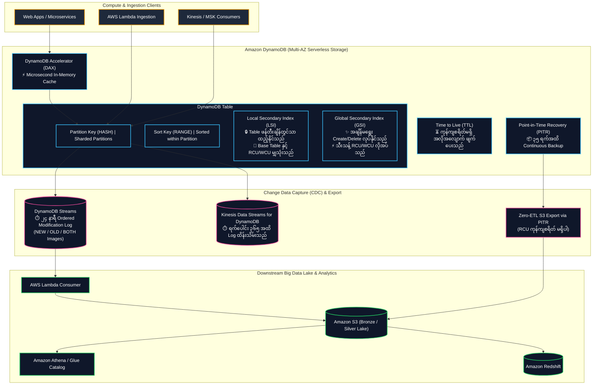
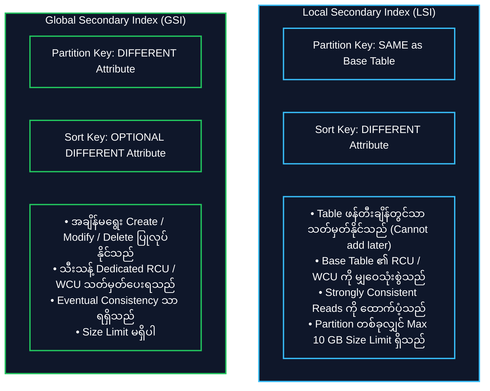

# ⚡ Amazon DynamoDB (Serverless NoSQL Key-Value & Document Database) (ဆာဗာမဲ့ NoSQL Key-Value ဒေတာဘေ့စ်)

- **Category**: Database (Serverless NoSQL Key-Value & Document)
- **Language / ဘာသာစကား**: [English Version](file:///home/monetine/Workspace/Wathon/aws-dea-c01/content/en/02-services/database/dynamodb.md) | **မြန်မာဘာသာ (Burmese)**
- **အဓိက အသုံးပြုမှု**: Single-digit Millisecond Latency ရှိသော Operational Data Store၊ Real-time Feature Stores၊ Streaming Pipeline State Tracking၊ DynamoDB Streams ဖြင့် Change Data Capture (CDC) ပြုလုပ်ခြင်း နှင့် Distributed Metadata Catalogs။
- **Slide Reference**: Pages 156–195 in `[[AWSCertifiedDataEngineerSlides.pdf]]`
- **Hub Links**: `[[mm/index]]` | `[[en/index]]` | `[[s3]]` | `[[lambda]]` | `[[glue]]` | `[[redshift]]`

---

## ၁။ အကျဉ်းချုပ် (High-Level Summary)

**Amazon DynamoDB** သည် ပမာဏ မည်မျှပင် ကြီးမားစေကာမူ Single-digit Millisecond Latency ကို အာမခံပေးသည့် Fully Managed, Serverless, Multi-Region NoSQL Database ဖြစ်သည်။ AWS Region တစ်ခုအတွင်းရှိ Availability Zones (AZs) ၃ ခုပေါ်တွင် SSD Storage များကို အသုံးပြု၍ ဒေတာများကို အလိုအလျောက် သုံးဆကူးယူ (Replicate) ထားရှိသည်။

---

## ၂။ Secondary Indexes: LSI vs. GSI နှိုင်းယှဉ်ချက် (Core Exam Focus)

### LSI vs. GSI နှိုင်းယှဉ်ချက် ဇယား

| Feature | Local Secondary Index (LSI) | Global Secondary Index (GSI) |
| :--- | :--- | :--- |
| **Partition Key** | **Base Table နှင့် တူညီရမည်** | **အခြား Column အသစ်ကို Partition Key အဖြစ် သုံးနိုင်သည်** |
| **Sort Key** | မတူညီသော Column အသစ် ဖြစ်ရမည် | မတူညီသော Column သို့မဟုတ် မထည့်ဘဲ ထားနိုင်သည် |
| **Creation Timing** | **Table ဖန်တီးချိန်တွင်သာ ထည့်သွင်းနိုင်သည်** | **အချိန်မရွေး (Online) အသစ်ထည့်နိုင်/ဖျက်နိုင်သည်** |
| **Capacity (RCU/WCU)** | **Base Table ၏ RCU/WCU ကို မျှဝေသုံးစွဲသည်** | **သီးသန့် Provisioned Capacity / Auto-scaling လိုအပ်သည်** |
| **Read Consistency** | Strongly Consistent သို့မဟုတ် Eventually Consistent | **Eventually Consistent သာ ရရှိသည်** |
| **GSI Throttling Trap** | N/A | **GSI တွင် WCU မလုံလောက်ပါက Base Table ပါ အတူတကွ Throttle ဖြစ်သည်!** |

---

## ၃။ Read & Write Capacity Units (RCU & WCU) တွက်ချက်မှုများ

| Capacity Type | အခြေခံ တွက်ချက်မှုယူနစ် | တွက်ချက်မှု ဥပမာ (Exam Math) |
| :--- | :--- | :--- |
| **1 RCU (Strongly Consistent)** | **4 KB** item per second | 8 KB item ကို 10 items/sec ဖတ်ပါက: $\lceil 8 / 4 \rceil \times 10 = \mathbf{20\text{ RCUs}}$ |
| **1 RCU (Eventually Consistent)** | **8 KB** item per second (2x efficiency) | 8 KB item ကို 10 items/sec ဖတ်ပါက: $(\lceil 8 / 4 \rceil / 2) \times 10 = \mathbf{10\text{ RCUs}}$ |
| **1 WCU (Standard Write)** | **1 KB** item per second | 3.5 KB item ကို 10 writes/sec ရေးပါက: $\lceil 3.5 / 1 \rceil \times 10 = \mathbf{40\text{ WCUs}}$ |
| **Transactional Operations** | ပုံမှန်ထက် **၂ ဆ (2x)** ကုန်ကျသည် | 1 Transactional Write (1 KB) = **2 WCUs**, 1 Transactional Read (4 KB) = **2 RCUs** |

---

## ၄။ Change Data Capture (CDC): DynamoDB Streams

- **DynamoDB Streams** သည် Table အတွင်းရှိ Item များ အသစ်ထည့်ခြင်း၊ ပြင်ဆင်ခြင်း၊ ဖျက်ခြင်း (INSERT, MODIFY, REMOVE) တိုင်းကို အချိန်အစီအစဉ်အတိုင်း **၂၄ နာရီကြာ** မှတ်တမ်းတင်ပေးသည့် Stream ဖြစ်သည်။
- **Stream View Types**:
  - `KEYS_ONLY`: ပြင်ဆင်သွားသော Item ၏ Key များကိုသာ ဖော်ပြသည်။
  - `NEW_IMAGE`: ပြင်ဆင်ပြီးနောက် ဖြစ်ပေါ်လာသော Item အသစ်တစ်ခုလုံး။
  - `OLD_IMAGE`: မပြင်ဆင်မီ ရှိခဲ့သော Item အဟောင်းတစ်ခုလုံး။
  - `NEW_AND_OLD_IMAGES`: အဟောင်းနှင့် အသစ် နှစ်မျိုးစလုံးကို ပြသသည်။
- **Zero-Impact S3 Export via PITR**: DynamoDB Data များကို Data Lake သို့ တင်ပို့ရန်အတွက် **Point-in-Time Recovery (PITR)** ကို အသုံးပြု၍ S3 သို့ Export လုပ်ပါက **Production Table ၏ RCU ကို လုံးဝ မသုံးစွဲဘဲ** S3 သို့ Parquet/JSON အဖြစ် ရောက်ရှိစေသည်။

---

## ၅။ DEA-C01 စာမေးပွဲ အဓိက အချက်အလက်များနှင့် ထောင်ချောက်များ (Exam Tips & Traps)

> [!IMPORTANT]
> **Key Exam Trigger Keywords**:
> - **"Ultra-low single-digit millisecond NoSQL key-value store"** $\rightarrow$ **Amazon DynamoDB**.
> - **"Microsecond latency in-memory cache for DynamoDB read-heavy workloads"** $\rightarrow$ **DynamoDB Accelerator (DAX)**.
> - **"Real-time Change Data Capture (CDC) pipeline triggering Lambda on item modification"** $\rightarrow$ **DynamoDB Streams with AWS Lambda**.
> - **"Export petabyte-scale DynamoDB table to S3 Data Lake without affecting production application performance or consuming RCUs"** $\rightarrow$ **DynamoDB Export to Amazon S3 (uses PITR underneath)**.
> - **"Automatically expire and delete stale session logs at zero cost"** $\rightarrow$ **DynamoDB Time to Live (TTL)**.

> [!WARNING]
> **Exam Traps (သတိထားရမည့် အချက်များ)**:
> 1. **GSI Write Throttling Backpressure**: Global Secondary Index (GSI) တွင် WCU မလုံလောက်ပါက Base Table ၏ Write Operations များပါ အတူတကွ **`ProvisionedThroughputExceededException`** ဖြင့် Throttle ဖြစ်သွားသည်။
> 2. **LSI Immutability Trap**: LSI ကို Table ဖန်တီးပြီးနောက် ထပ်မံထည့်သွင်း၍ မရပါ။ Table အသစ် ပြန်ဆောက်ရမည် သို့မဟုတ် GSI ကို သုံးရမည်။

---

## 📌 ဆက်စပ် မှတ်စုများ (Related Notes)

- `[[lambda]]` — AWS Lambda Ingestion and DynamoDB Streams
- `[[s3]]` — DynamoDB Export to Amazon S3 Data Lake
- `[[glue]]` — AWS Glue ETL integration with DynamoDB
- `[[rds-and-aurora]]` — Relational OLTP vs. DynamoDB NoSQL
