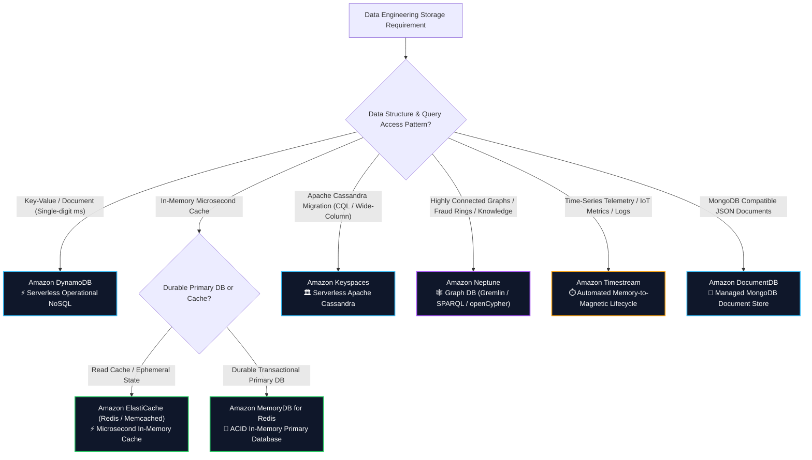
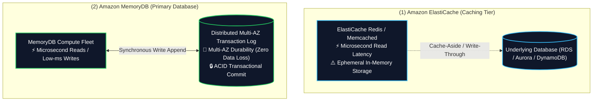
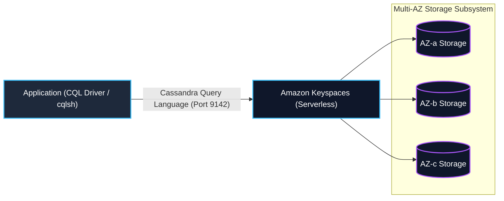
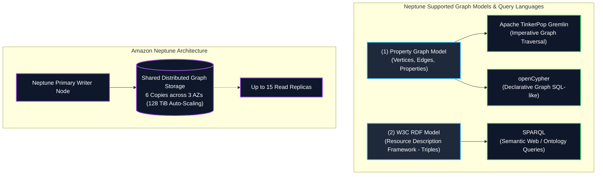
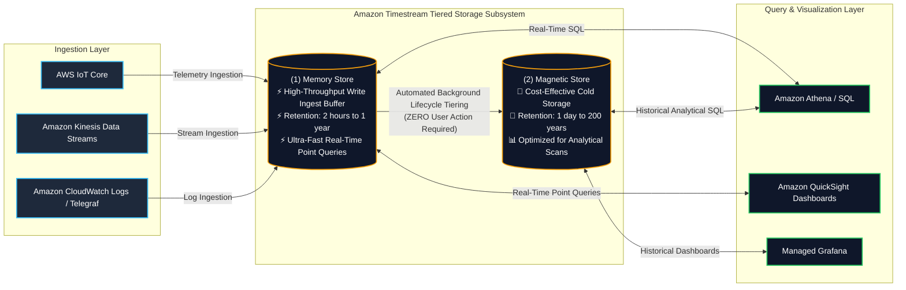
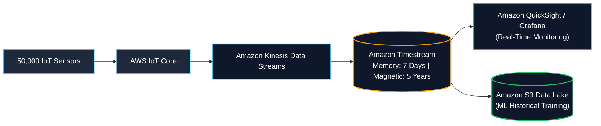

# 🔮 Specialized AWS Databases (ElastiCache, MemoryDB, Keyspaces, Neptune, Timestream, DocumentDB)

- **Category**: Database (Purpose-Built NoSQL & Specialized Engines)
- **Language / ဘာသာစကား**: [English (Original)](file:///home/monetine/Workspace/Wathon/aws-dea-c01/content/en/02-services/database/nosql-specialized-databases.md) | **မြန်မာဘာသာ (Burmese)**
- **Primary Use Case**: Microsecond in-memory caching, durable in-memory primary databases, managed Apache Cassandra, relationship graph traversal, time-series IoT telemetry, နှင့် managed MongoDB document storage အဖြစ် အသုံးပြုရန်။
- **Slide Reference**: `[[AWSCertifiedDataEngineerSlides.pdf]]` ၏ စာမျက်နှာ 214–219
- **Hub Links**: [[mm/index]] | [[mm/service-catalog]] | [[mm/domain-2-data-store-management]] | [[mm/domain-1-ingestion-and-processing]] | [[mm/dynamodb]] | [[mm/rds-and-aurora]] | [[mm/redshift]] | [[mm/kinesis]]

---

## 1. High-Level Summary & Purpose-Built Database Strategy

AWS သည် **Purpose-Built Database Strategy** ကို အားပေးပါသည်။ အမျိုးမျိုးသော access pattern များကို relational database အင်ဂျင်တစ်ခုတည်းထဲသို့ အတင်းအကျပ် ထည့်သွင်းမည့်အစား data engineers များသည် သီးသန့် data structures များ၊ query languages များနှင့် latency SLAs များအတွက် အကောင်းဆုံးဖြစ်အောင် ပြုလုပ်ထားသော specialized database နည်းပညာများကို ရွေးချယ်အသုံးပြုကြပါသည်။

**AWS Certified Data Engineer – Associate (DEA-C01)** စာမေးပွဲအတွက်၊ specialized database တစ်ခုစီကို မည်သည့်အချိန်တွင် ရွေးချယ်ရမည်ကို သိရှိရန် လိုအပ်ပါသည်-

---

## 2. Amazon ElastiCache vs. Amazon MemoryDB for Redis

### 1. Amazon ElastiCache (Redis OSS / Valkey vs. Memcached)

**Amazon ElastiCache** သည် fully managed in-memory data store service တစ်ခုဖြစ်ပြီး sub-millisecond response times ကို ပေးစွမ်းနိုင်ပါသည်။

| Architectural Dimension | ElastiCache Redis / Valkey | ElastiCache Memcached |
| :--- | :--- | :--- |
| **Complex Data Types** | ✅ **Yes** (Strings, Lists, Sets, Sorted Sets, Hashes, Bitmaps, HyperLogLogs, Geospatial) | ❌ **No** (ရိုးရှင်းသော key-value strings နှင့် objects များသာ) |
| **Multi-AZ & High Availability** | ✅ **Yes** (Primary တစ်ခုနှင့် read replicas ၅ ခုအထိ + automated failover ပါဝင်သည်) | ❌ **No** (replication မပါဝင်သော cluster အတွင်းရှိ သီးခြား node များဖြစ်သည်) |
| **Data Persistence / Backup** | ✅ **Yes** (RDB snapshots မှ S3 သို့၊ Append-Only File AOF) | ❌ **No** (အချက်အလက်များကို ခေတ္တသာမှတ်သားထားနိုင်သော memory သီးသန့်ဖြစ်သည်၊ restart လုပ်ပါက data များပျက်သွားမည်) |
| **Horizontal Sharding** | ✅ **Yes** (Cluster mode ဖြင့် shards ပေါင်း ၅၀၀ အထိ) | ✅ **Yes** (Multithreaded node scale-out ဖြင့်) |
| **Pub/Sub Messaging** | ✅ **Yes** (publish/subscribe channels များပါဝင်သည်) | ❌ **No** |
| **Primary Data Engineering Use Case** | Session management၊ leaderboard ranking၊ rate limiting၊ geospatial caching | Database queries နှင့် web page fragments များအတွက် pure multithreaded caching |

#### Key Caching Strategies for Data Pipelines
1. **Lazy Loading (Cache-Aside)**:
   - Application သည် cache မှ အရင်ဆုံး ရှာဖွေပါသည်။ Cache မတွေ့ရှိပါက (cache miss)၊ application သည် primary database မှ ဖတ်ပြီး၊ cache သို့ **Time To Live (TTL)** ဖြင့် data ဖြည့်တင်းကာ ပြန်လည်ပေးပို့ပါသည်။
   - *Pros*: တောင်းဆိုထားသော data များကိုသာ cache လုပ်ပါသည်။
   - *Cons*: ပထမဆုံးအကြိမ် read လုပ်ရာတွင် cache miss ကြောင့် latency ပိုများနိုင်သည်၊ database ကို တိုက်ရိုက် update လုပ်ထားပါက stale data ဖြစ်နိုင်ခြေရှိသည်။
2. **Write-Through**:
   - Application သည် database နှင့် cache နှစ်ခုစလုံးသို့ တစ်ပြိုင်နက်ရေးပါသည်။
   - *Pros*: Cache အတွင်းရှိ data သည် မည်သည့်အခါမျှ stale မဖြစ်ပါ။
   - *Cons*: Write လုပ်ရာတွင် latency ပိုကြာနိုင်သည်၊ ဖတ်မည်မဟုတ်သော data များကိုပါ cache လုပ်မိနိုင်သည် (cache churn)။

---

### 2. Amazon MemoryDB for Redis (Primary In-Memory Database)

- **Architecture**: **distributed Multi-AZ transaction log** ပေါ်တွင် တည်ဆောက်ထားသော Redis-compatible၊ durable in-memory database တစ်ခုဖြစ်ပါသည်။
- **Durability Guarantee**: Client သို့ အောင်မြင်ကြောင်း အကြောင်းမပြန်မီ၊ writes များကို AZs မျိုးစုံရှိ distributed transaction log သို့ commit လုပ်ပါသည်။
- **ElastiCache vs. MemoryDB Decision Rule**:
   - (RDS သို့မဟုတ် DynamoDB ကဲ့သို့) persistent database ၏ အရှေ့တွင် high-speed caching tier အနေဖြင့် လိုအပ်ပြီး၊ node အသစ်လဲလှယ်ချိန်တွင် cached data များ ပျက်သွားခြင်းကို လက်ခံနိုင်ပါက **Amazon ElastiCache** ကို ရွေးချယ်ပါ။
   - သင့် application သည် Redis ကို **အဓိက၊ အားထားရသော transactional database (primary, authoritative transactional database)** အနေဖြင့် အသုံးပြုပြီး၊ Multi-AZ failures ဖြစ်ပေါ်ချိန်တွင် data အပျက်အစီး လုံးဝမရှိစေရန် (zero data loss durability) လိုအပ်ပါက **Amazon MemoryDB** ကို ရွေးချယ်ပါ။

---

## 3. Amazon Keyspaces (for Apache Cassandra)

**Amazon Keyspaces** သည် scalable, highly available နှင့် fully managed serverless Apache Cassandra-compatible database service တစ်ခုဖြစ်ပါသည်။

### Key Architectural Characteristics
1. **Zero Infrastructure Management**: Apache Cassandra clusters များကို စီမံခန့်ခွဲခြင်း၊ JVM garbage collection tuning၊ compaction strategies များနှင့် node repair လုပ်ဆောင်ခြင်းတို့ကို ပြုလုပ်ရန်မလိုတော့ပါ။
2. **Serverless Capacity Modes**:
   - **On-Demand Capacity**: Read/write request အရသာ ပေးချေရသည်၊ ခန့်မှန်းရခက်သော workloads များအတွက် သင့်လျော်သည်။
   - **Provisioned Capacity**: Application Auto Scaling ဖြင့် Read/Write Capacity Units များကို ကြိုတင်သတ်မှတ်ထားနိုင်ပါသည်။
3. **Data Model**: Partition Keys (hash distribution) နှင့် Clustering Columns (partitions အတွင်း sorting) တို့ပါဝင်သော **CQL (Cassandra Query Language)** ကို အသုံးပြုထားသည့် Wide-column tables များ ဖြစ်ပါသည်။
4. **Built-in Enterprise Features**:
   - **Point-in-Time Recovery (PITR)**: ၃၅ ရက်အထိ continuous automated backups ပြုလုပ်ပေးပါသည်။
   - **Time to Live (TTL)**: Resource အကုန်အကျမရှိဘဲ သတ်မှတ်ချိန်ပြည့်ပါက records များကို အလိုအလျောက်ဖျက်ပေးပါသည်။
   - **Multi-AZ Durability**: AZs ၃ ခုသို့ replicate လုပ်ပြီး 99.999% durability ရရှိစေပါသည်။
5. **Top DEA-C01 Use Case**: On-premises တွင်ရှိသော **Apache Cassandra** applications များကို application code သို့မဟုတ် CQL data access logic များ ပြန်လည်ရေးသားစရာမလိုဘဲ AWS သို့ migrate လုပ်ခြင်း။

---

## 4. Amazon Neptune (Graph Database Engine)

**Amazon Neptune** သည် ရှုပ်ထွေးသော ဆက်စပ်မှုများကို သိမ်းဆည်းရန်နှင့် ဘီလီယံနှင့်ချီသော ချိတ်ဆက်ထားသည့် data points များကို millisecond latency ဖြင့် ရှာဖွေနိုင်ရန် အကောင်းဆုံးဖန်တီးထားသော purpose-built, high-performance graph database တစ်ခုဖြစ်ပါသည်။

### 1. Graph Data Models & Languages
- **Property Graph**: Data ကို **Nodes/Vertices** (entities), **Edges** (relationships), နှင့် **Properties** (key-value attributes) အဖြစ် model ပြုလုပ်ထားပါသည်။
  - *Query Languages*: **Apache TinkerPop Gremlin** (imperative traversal) နှင့် **openCypher** (declarative pattern matching)။
- **W3C RDF (Resource Description Framework)**: Data ကို **Subject-Predicate-Object triples** အဖြစ် model ပြုလုပ်ထားပါသည် (ဥပမာ `Alice` $\rightarrow$ `isFriendWith` $\rightarrow$ `Bob`)။
  - *Query Language*: **SPARQL**.

### 2. Advanced Neptune Capabilities
- **Neptune Serverless**: အသုံးပြုမှုပေါ်မူတည်၍ Neptune Capacity Units (NCUs) များကို အသေးစိတ် အလိုအလျောက် scale-up/down ပြုလုပ်ပေးပါသည်။
- **Neptune Analytics**: Vector search နှင့် ရှုပ်ထွေးသော graph algorithms များ (PageRank, Connected Components, Shortest Path) ကို ဘီလီယံဆယ်ချီသော edges များတစ်လျှောက် စက္ကန့်ပိုင်းအတွင်း ဆောင်ရွက်နိုင်ရန်အတွက် graph data များကို load လုပ်ပေးသော in-memory analytics engine ဖြစ်ပါသည်။
- **Neptune ML**: Gremlin/openCypher queries များမှတစ်ဆင့် Graph Neural Network (GNN) predictions များကို တိုက်ရိုက်လုပ်ဆောင်ရန်အတွက် Amazon SageMaker နှင့် တွဲဖက်လုပ်ဆောင်နိုင်ပါသည်။

### 3. Top DEA-C01 Use Cases for Neptune
- **Fraud Detection Rings**: လိပ်စာများ၊ ခရက်ဒစ်ကတ်များ သို့မဟုတ် ဖုန်းနံပါတ်များကို မျှဝေအသုံးပြုထားသည့် အကောင့်များ (fraud rings) ကို ရှာဖွေဖော်ထုတ်ခြင်း။
- **Identity Resolution & Knowledge Graphs**: Devices များအနှံ့တွင်ရှိသော ကွဲပြားသည့် user profiles များကို 360-degree customer graph တစ်ခုတည်းအဖြစ် ပေါင်းစပ်ချိတ်ဆက်ခြင်း။
- **Recommendation Engines**: Multi-hop network paths များအပေါ်အခြေခံ၍ သူငယ်ချင်း၏သူငယ်ချင်းများ (friends-of-friends) သို့မဟုတ် ဆက်စပ်ပစ္စည်းများကို ရှာဖွေအကြံပြုခြင်း။

---

## 5. Amazon Timestream (Serverless Time-Series Database)

**Amazon Timestream** သည် IoT sensors များ၊ application metrics များ၊ clickstreams များနှင့် operational telemetry များမှ တစ်နေ့လျှင် တြီလီယံပေါင်းများစွာသော time-stamped events များကို ingest လုပ်ရန်၊ သိမ်းဆည်းရန်နှင့် analyze လုပ်ရန်အတွက် အထူးဒီဇိုင်းရေးဆွဲထားသော serverless, purpose-built time-series database ဖြစ်ပါသည်။

### 1. Automated Two-Tier Storage Lifecycle (Crucial Exam Concept)

1. **Memory Store (Ingestion Buffer)**:
   - နောက်ဆုံးရ data များပေါ်တွင် high-throughput concurrent writes များနှင့် sub-second point queries များအတွက် optimized လုပ်ထားပါသည်။
   - Configurable retention: **၂ နာရီမှ ၁ နှစ်အထိ** သတ်မှတ်နိုင်ပါသည်။
2. **Magnetic Store (Historical Archive)**:
   - များပြားသော historical analytical queries များအတွက် optimized လုပ်ထားပြီး၊ ကုန်ကျစရိတ်သက်သာကာ highly durable ဖြစ်သော storage ဖြစ်ပါသည်။
   - Configurable retention: **၁ ရက်မှ နှစ် ၂၀၀ အထိ** သတ်မှတ်နိုင်ပါသည်။
3. **Automated Data Tiering**:
   - Custom ETL jobs များ သို့မဟုတ် lifecycle scripts များ ရေးရန်မလိုဘဲ သတ်မှတ်ထားသော retention period အပေါ်အခြေခံ၍ Timestream သည် data များကို **Memory Store မှ Magnetic Store သို့ အလိုအလျောက် ရွှေ့ပြောင်းပေးပါသည်။**

### 2. Timestream Data Model
- **Dimensions**: Data source ကို ခွဲခြားသတ်မှတ်ပေးသော metadata attributes များ (ဥပမာ- `device_id`, `region`, `sensor_model`) ဖြစ်သည်။ Dimensions များကို လျင်မြန်စွာ filter လုပ်နိုင်ရန် index လုပ်ထားပါသည်။
- **Measure Name & Measure Value**: မှတ်တမ်းတင်ထားသော အမှန်တကယ် metric (ဥပမာ- `temperature = 78.4`, `cpu_usage = 92.1`) ဖြစ်သည်။ Timestamped event တစ်ခုတည်းတွင် metrics အများအပြားကို သိမ်းဆည်းပေးသော (multi-measure records) ကို ပံ့ပိုးပေးပါသည်။
- **Time**: Nanosecond-precision ရှိသော timestamp ဖြစ်သည်။

### 3. Built-in Time-Series SQL Functions
Timestream သည် အောက်ပါ built-in analytical functions များပါဝင်သော ANSI SQL ကို အသုံးပြုထားပါသည်-
- **Interpolation**: Sensor မှ လွတ်သွားသော ဟာကွက် (gaps) များကို linear သို့မဟုတ် step interpolation ဖြင့် ဖြည့်တင်းပေးခြင်း။
- **Smoothing & Moving Averages**: ပြောင်းလဲနေသော အချိန်အတိုင်းအတာများအလိုက် (variable time windows) rolling calculations များ လုပ်ဆောင်ခြင်း။
- **Downsampling / Aggregation**: Raw telemetry အပေါ်တွင် နာရီအလိုက်/ရက်အလိုက် စုပေါင်းတွက်ချက်မှုများ (rollups) လုပ်ဆောင်ခြင်း။

---

## 6. Amazon DocumentDB (with MongoDB compatibility)

**Amazon DocumentDB** သည် အတိုင်းအတာကြီးမားသော JSON/BSON data များကို သိမ်းဆည်းရန်၊ query လုပ်ရန်နှင့် index လုပ်ရန်အတွက် ဒီဇိုင်းရေးဆွဲထားသော fully managed, scale-out document database service ဖြစ်ပါသည်။

- **Architecture**: (Amazon Aurora ကဲ့သို့ပင်) compute ကို storage မှ ခွဲထုတ်ထားပါသည်:
  - **AZs ၃ ခုအတွင်း ၆ ကြိမ်တိုင်တိုင် replicated လုပ်ထားသော** shared distributed storage volume (128 TiB အထိ auto-scaling storage) ကို အသုံးပြုထားပါသည်။
  - Sub-10ms replication latency ရှိသော **read replicas ၁၅ ခု** အထိ ထားရှိနိုင်ပါသည်။
- **Compatibility**: Apache 2.0 open-source MongoDB 3.6, 4.0, နှင့် 5.0 APIs များ၊ drivers များနှင့် တွဲဖက်အသုံးပြုနိုင်ပါသည်။
- **Top DEA-C01 Use Case**: ကိုယ်ပိုင် hosting လုပ်ထားသော **MongoDB** clusters များကို application queries များ သို့မဟုတ် data models များကို ပြန်ရေးစရာမလိုဘဲ AWS သို့ migrate လုပ်ခြင်း။

---

## 7. Comprehensive Database Selection Matrix for Data Engineers

| Service | Primary Data Model | Query Interface / API | Concurrency & Latency | Storage Lifecycle & Tiering | Top DEA-C01 Exam Fit |
| :--- | :--- | :--- | :--- | :--- | :--- |
| **Amazon DynamoDB** | Key-Value / Document | DynamoDB SDK / PartiQL | Millions req/s, single-digit ms | TTL to DynamoDB Streams / S3 Export | Operational NoSQL, session state, real-time CDC |
| **Amazon ElastiCache** | In-Memory Key-Value & Data Structures | Redis OSS / Memcached API | Millions req/s, **Microseconds** | Volatile in-memory with LRU/TTL eviction | Databases များအတွက် Read cache, web sessions, leaderboards |
| **Amazon MemoryDB** | In-Memory Document & Structures | Redis API (ACID Durable) | Sub-ms reads, low-ms writes | In-memory with Multi-AZ transaction log | Redis data types ကိုအသုံးပြုသော Primary transactional database |
| **Amazon Keyspaces** | Wide-Column Store | CQL (Cassandra Query Language) | Massive write scale, low ms | Native TTL & PITR backup | Managed Apache Cassandra migration |
| **Amazon Neptune** | Property Graph / W3C RDF | Gremlin, openCypher, SPARQL | Complex multi-hop graph queries | 128 TiB auto-scaling shared storage | Fraud ring detection, knowledge graphs, social networks |
| **Amazon Timestream** | Time-Series (Telemetry) | ANSI SQL + Time-Series Functions | High-throughput ingestion | **Automated Memory-to-Magnetic lifecycle** | IoT metrics, application monitoring, sensor analytics |
| **Amazon DocumentDB** | JSON / BSON Documents | MongoDB API | Read-heavy scale-out, low ms | 128 TiB auto-scaling shared storage | Managed MongoDB workload migration |
| **Amazon Redshift** | Columnar Relational (OLAP) | PostgreSQL-compatible SQL | Complex analytical joins on PBs | S3 Spectrum tiering & RMS storage | Data warehousing, enterprise BI, complex SQL queries |

---

## 8. Data Engineering Production Architecture Patterns

### Pattern A: Real-Time IoT Telemetry & Predictive Maintenance Pipeline

- **Challenge**: စက်မှုကုန်ထုတ်လုပ်ငန်းခွင်တစ်ခုသည် စက်ပစ္စည်းပေါင်း ၅၀,၀၀၀ မှ ထွက်ပေါ်လာသော အပူချိန်၊ တုန်ခါမှုနှင့် ဖိအား telemetry များကို စက္ကန့်တိုင်း စောင့်ကြည့်နေပါသည်။ စနစ်သည် real-time alerting ကို လိုအပ်ပြီး၊ ၅ နှစ်စာ historical trend analytics ကိုလည်း လိုအပ်ပါသည်။
- **Solution**:
  - Sensors များမှ data များကို **AWS IoT Core** $\rightarrow$ **Amazon Kinesis Data Streams** သို့ stream လုပ်ပါသည်။
  - Kinesis မှတစ်ဆင့် **Amazon Timestream** သို့ တိုက်ရိုက်ရေးသားပါသည်။
  - Timestream သည် (real-time Grafana dashboards များကို serve လုပ်ရန်အတွက်) **Memory Store တွင် ၇ ရက်** သိမ်းဆည်းထားပြီးနောက်၊ **Magnetic Store သို့ ၅ နှစ်စာ** အလိုအလျောက် tier ပြောင်းလဲသိမ်းဆည်းပေးပါသည်။
  - Scheduled queries များသည် နာရီအလိုက် ပျမ်းမျှတန်ဖိုးများကို တွက်ချက်ကာ၊ [[mm/sagemaker-and-ai]] တွင် machine learning training ပြုလုပ်ရန် Parquet datasets များအဖြစ် **Amazon S3** သို့ သိမ်းဆည်းပါသည်။

### Pattern B: Real-Time Financial Fraud Ring Detection with Neptune

- **Challenge**: လိမ်လည်သူများ (Fraudulent actors) သည် credit card applications ထောင်ပေါင်းများစွာတွင် မျှဝေထားသော ဘဏ်အကောင့်များ၊ ဖုန်းနံပါတ်များနှင့် IP လိပ်စာများကို အသုံးပြုကာ တုပဖန်တီးထားသော (synthetic) identities များကို ဖန်တီးကြပါသည်။ Relational SQL ဖြင့် join queries များ ပြုလုပ်ပါက မိနစ်ပေါင်းများစွာ ကြာမြင့်ပြီး time out ဖြစ်သွားတတ်ပါသည်။
- **Solution**:
  - Transaction records များကို AWS Lambda မှတစ်ဆင့် **Amazon Neptune** သို့ ingest လုပ်ပါသည်။
  - Neptune သည် users များ၊ cards များ၊ devices များနှင့် addresses များကို vertices များအနေဖြင့်လည်းကောင်း၊ မျှဝေအသုံးပြုထားသော (shared) ချိတ်ဆက်မှုများကို edges များအနေဖြင့်လည်းကောင်း model ဖန်တီးပါသည်။
  - Real-time **Gremlin / openCypher** graph traversal queries များသည် 4+ hops အထိ milliseconds အတွင်း ဖြတ်သန်းသွားလာကာ circular rings များကို ရှာဖွေဖော်ထုတ်ပြီး၊ သံသယဖြစ်ဖွယ် transactions များကို စစ်ဆေးရန် ချက်ချင်း အသိပေး (flag) ပါသည်။

---

## 9. DEA-C01 High-Frequency Exam Tips & Traps

> [!IMPORTANT]
> **Key Exam Trigger Keywords**:
>
> - **"Time-stamped IoT telemetry or metrics with automated lifecycle tiering from memory to cold storage"** $\rightarrow$ **Amazon Timestream**.
> - **"Relationship graph traversal, fraud ring detection, social connections, Apache TinkerPop Gremlin / SPARQL / openCypher"** $\rightarrow$ **Amazon Neptune**.
> - **"Migrate on-premises Apache Cassandra workload without code changes using CQL"** $\rightarrow$ **Amazon Keyspaces**.
> - **"Microsecond in-memory read caching with complex data structures (sets, sorted sets, leaderboards)"** $\rightarrow$ **Amazon ElastiCache for Redis**.
> - **"Primary in-memory database with ACID transactional durability across Multi-AZ"** $\rightarrow$ **Amazon MemoryDB for Redis**.
> - **"Migrate MongoDB JSON documents to a fully managed AWS database"** $\rightarrow$ **Amazon DocumentDB**.

> [!WARNING]
> **Common Exam Traps & Pitfalls**:
>
> 1. **ElastiCache vs. MemoryDB Trap**:
>    - ဇာတ်လမ်းသည် relational database ၏ အပေါ်မှ **in-memory cache** အကြောင်းကို ဖော်ပြပါက **ElastiCache** ကို ရွေးပါ။
>    - ဇာတ်လမ်းသည် node များ ပျက်ကျချိန်တွင် data ပျောက်ဆုံးမှုကို လုံးဝလက်မခံနိုင်သော **primary transactional database** အကြောင်းကို ဖော်ပြပါက **MemoryDB** ကို ရွေးပါ။
> 2. **Timestream Storage Tiering Trap**:
>    - Memory မှ Magnetic store သို့ Timestream data lifecycle ကူးပြောင်းခြင်းသည် **100% automated** ဖြစ်ပါသည်။ Time-series data များကို tiers များအကြား ရွှေ့ပြောင်းရန်အတွက် AWS Lambda၊ AWS Glue၊ သို့မဟုတ် S3 lifecycle rules များ မလိုအပ်ပါ။
> 3. **Neptune Query Language Trap**:
>    - Neptune သည် Property Graphs အတွက် **Gremlin** နှင့် **openCypher** ကို ပံ့ပိုးပေးပြီး၊ RDF graphs အတွက် **SPARQL** ကို ပံ့ပိုးပေးပါသည်။ Neptune သည် standard SQL ကို အသုံးမပြုပါ။
> 4. **Keyspaces vs. DynamoDB**:
>    - နှစ်ခုစလုံးသည် wide-column/key-value NoSQL engines များ ဖြစ်ကြသည်။ မေးခွန်းတွင် **Cassandra Query Language (CQL)** သို့မဟုတ် **Apache Cassandra migration** ကို ဖော်ပြပါက **Keyspaces** ကို ရွေးချယ်ပါ။ ယေဘုယျ AWS-native serverless key-value/document stores များအတွက်မူ **DynamoDB** ကို ရွေးချယ်ပါ။

---

## 📌 Related Notes

- [[mm/dynamodb]] — Serverless NoSQL operational database နှင့် DynamoDB Streams
- [[mm/rds-and-aurora]] — Relational OLTP database engines နှင့် Aurora distributed storage
- [[mm/redshift]] — Petabyte-scale OLAP data warehouse
- [[mm/kinesis]] — Streaming telemetry များကို specialized databases များသို့ Ingest လုပ်ခြင်း
- [[mm/s3]] — S3 Data Lake သိမ်းဆည်းခြင်းနှင့် downstream analytics
- [[mm/sagemaker-and-ai]] — Machine learning feature extraction နှင့် Neptune ML
- [[mm/service-comparisons]] — Master DEA-C01 Service Decision Matrix
- [[mm/domain-2-data-store-management]] — DEA-C01 Domain 2 Study Guide
