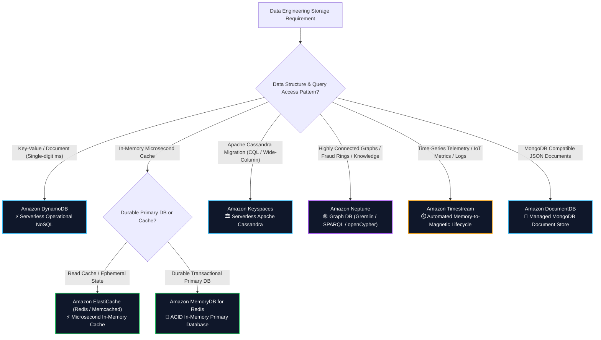
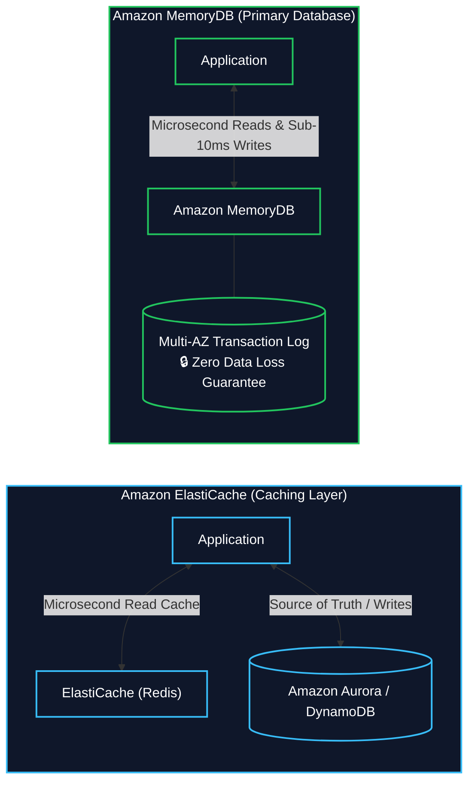

# 🔮 Specialized AWS Databases (ElastiCache, MemoryDB, Keyspaces, Neptune, Timestream, DocumentDB) (သီးသန့် ရည်ရွယ်ချက်သုံး AWS ဒေတာဘေ့စ်များ)

- **Category**: Database (Purpose-Built NoSQL & Specialized Engines)
- **Language / ဘာသာစကား**: [English Version](file:///home/monetine/Workspace/Wathon/aws-dea-c01/content/en/02-services/database/nosql-specialized-databases.md) | **မြန်မာဘာသာ (Burmese)**
- **အဓိက အသုံးပြုမှု**: Microsecond In-memory Caching၊ စိတ်ချရသော In-memory Primary Database၊ Managed Apache Cassandra၊ Graph Relationships & Fraud Detection၊ Time-Series IoT Telemetry နှင့် Managed MongoDB Document Storage။
- **Slide Reference**: Pages 214–219 in `[[AWSCertifiedDataEngineerSlides.pdf]]`
- **Hub Links**: `[[mm/index]]` | `[[en/index]]` | `[[dynamodb]]` | `[[rds-and-aurora]]` | `[[redshift]]` | `[[kinesis]]`

---

## ၁။ အကျဉ်းချုပ် & Purpose-Built Database မဟာဗျူဟာ

AWS သည် **Purpose-Built Database Strategy** ကို အကြံပြုထားပါသည်- မတူညီသော Data Access Patterns အားလုံးကို Relational DB တစ်ခုတည်းသို့ အတင်းထည့်သွင်းမည့်အစား သက်ဆိုင်ရာ Data Structure၊ Latency SLA နှင့် Query Language များအလိုက် အကောင်းဆုံး စွမ်းဆောင်နိုင်သော သီးသန့် Database များကို ရွေးချယ် အသုံးပြုခြင်း ဖြစ်သည်-

---

## ၂။ Amazon ElastiCache vs. Amazon MemoryDB for Redis

| Service | မည်သည့်နေရာတွင် အသုံးပြုသနည်း | Data Durability (ဒေတာ ခိုင်မြဲမှု) |
| :--- | :--- | :--- |
| **Amazon ElastiCache** | **In-memory Caching Layer** (Aurora/DynamoDB ရှေ့တွင် ထားရှိသည်) | Ephemeral Cache (Cluster ပျက်ပါက ဒေတာ ပြန်ဆွဲထုတ်ရသည်) |
| **Amazon MemoryDB for Redis** | **Primary Database (Source of Truth)** | **Ultra-Durable Multi-AZ Transaction Log** (Zero Data Loss) |

---

## ၃။ အခြား သီးသန့်ရည်ရွယ်ချက်သုံး Database များ

### ၁။ Amazon Neptune (Graph Database)
- **အသုံးပြုမှု**: Social Networks၊ **Fraud Detection Rings (လိမ်လည်မှု ကွန်ရက်များ ဖော်ထုတ်ခြင်း)**၊ Knowledge Graphs၊ Recommendation Engines။
- **Query Languages**: Apache TinkerPop **Gremlin**၊ W3C **SPARQL**၊ နှင့် **openCypher**။

### ၂။ Amazon Timestream (Time-Series Database)
- **အသုံးပြုမှု**: IoT Telemetry၊ Industrial Sensors၊ Server Metrics နှင့် Clickstream Time Logs။
- **Automated Lifecycle**: ဒေတာအသစ်များကို **In-Memory Store** တွင် မြန်ဆန်စွာ သိမ်းဆည်းပြီး သတ်မှတ်ချိန်ကျော်ပါက **Magnetic Store (S3-backed)** သို့ အလိုအလျောက် ရွှေ့ပြောင်းပေးသဖြင့် ကုန်ကျစရိတ် သက်သာစေသည်။

### ၃။ Amazon Keyspaces (Apache Cassandra)
- **အသုံးပြုမှု**: On-premise Apache Cassandra Workloads များကို Cloud သို့ Serverless ပြောင်းရွှေ့ခြင်း။ **Cassandra Query Language (CQL)** API ဖြင့် အလုပ်လုပ်သည်။

### ၄။ Amazon DocumentDB (MongoDB Compatible)
- **အသုံးပြုမှု**: JSON Document Workloads များနှင့် MongoDB Applications များကို Managed Cloud တွင် အသုံးပြုခြင်း။

---

## ၄။ DEA-C01 စာမေးပွဲ အဓိက အချက်အလက်များနှင့် ထောင်ချောက်များ (Exam Tips & Traps)

> [!IMPORTANT]
> **Key Exam Trigger Keywords**:
> - **"Microsecond latency caching in front of relational database"** $\rightarrow$ **Amazon ElastiCache**.
> - **"Durable primary in-memory database with ACID transactions for Redis workloads"** $\rightarrow$ **Amazon MemoryDB for Redis**.
> - **"Detect financial fraud rings and relationship mappings"** $\rightarrow$ **Amazon Neptune (Graph DB)**.
> - **"IoT sensor telemetry and server time-series metrics with automated lifecycle tiering"** $\rightarrow$ **Amazon Timestream**.
> - **"Migrate Apache Cassandra cluster without managing nodes"** $\rightarrow$ **Amazon Keyspaces**.
> - **"Managed MongoDB compatible JSON document database"** $\rightarrow$ **Amazon DocumentDB**.

---

## 📌 ဆက်စပ် မှတ်စုများ (Related Notes)

- `[[dynamodb]]` — Amazon DynamoDB NoSQL Key-Value Database
- `[[rds-and-aurora]]` — Amazon RDS & Aurora Relational OLTP
- `[[redshift]]` — Amazon Redshift OLAP Data Warehousing
- `[[service-comparisons]]` — Master AWS Database Decision Matrix
