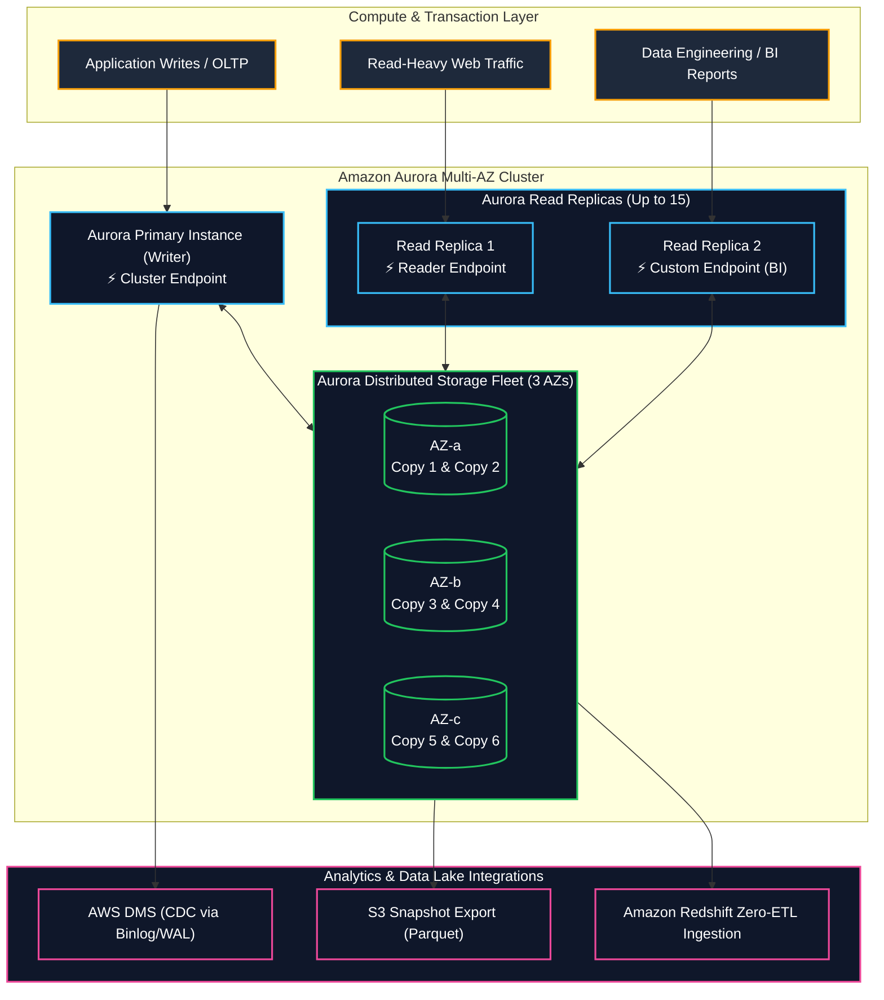
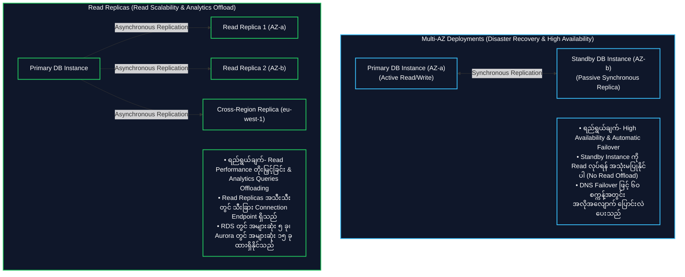
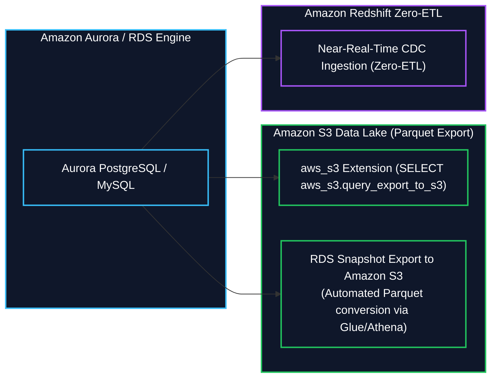

# 🐘 Amazon RDS & Amazon Aurora (Managed Relational OLTP Databases) (စီမံခန့်ခွဲပေးထားသော Relational OLTP ဒေတာဘေ့စ်များ)

- **Category**: Database (Relational OLTP & Cloud-Native Storage)
- **Language / ဘာသာစကား**: [English Version](file:///home/monetine/Workspace/Wathon/aws-dea-c01/content/en/02-services/database/rds-and-aurora.md) | **မြန်မာဘာသာ (Burmese)**
- **အဓိက အသုံးပြုမှု**: Transactional Operational Workloads များအတွက် စီမံခန့်ခွဲပေးထားသော Relational Databases၊ ACID Transactions၊ `[[dms-and-sct]]` ဖြင့် Change Data Capture (CDC) ရယူခြင်း၊ `[[redshift]]` သို့ Zero-ETL Integration နှင့် Amazon S3 သို့ Parquet တိုက်ရိုက် Export ပြုလုပ်ခြင်း။
- **Slide Reference**: Pages 196–213 in `[[AWSCertifiedDataEngineerSlides.pdf]]`
- **Hub Links**: `[[mm/index]]` | `[[en/index]]` | `[[redshift]]` | `[[dms-and-sct]]` | `[[s3]]` | `[[kms-and-secrets]]`

---

## ၁။ အကျဉ်းချုပ် (High-Level Summary)

**Amazon Relational Database Service (Amazon RDS)** သည် Cloud ပေါ်တွင် Relational Database များကို လွယ်ကူစွာ တည်ဆောက်၊ စီမံခန့်ခွဲနိုင်စေသည့် Fully Managed Web Service ဖြစ်ပြီး Database Engine ၆ မျိုး (**Amazon Aurora**၊ **PostgreSQL**၊ **MySQL**၊ **MariaDB**၊ **Oracle** နှင့် **Microsoft SQL Server**) ကို ထောက်ပံ့ပေးသည်။

**Amazon Aurora** သည် AWS ၏ MySQL နှင့် PostgreSQL compatible ဖြစ်သော Cloud-Native Database Engine ဖြစ်သည်။ Aurora သည် Compute နှင့် Storage ကို Decoupled ခွဲထုတ်ထားပြီး Availability Zones (AZs) ၃ ခုအတွင်း Distributed Storage Subsystem ကို အသုံးပြုထားသဖြင့် သမားရိုးကျ **MySQL ထက် ၅ ဆ**၊ **PostgreSQL ထက် ၃ ဆ ပိုမိုမြန်ဆန်သော Throughput** ကို ပေးစွမ်းသည်။

---

## ၂။ Multi-AZ Deployments vs. Read Replicas (Core Exam Focus)

---

## ၃။ Aurora Distributed Storage Architecture

- **6-Way Replication Across 3 AZs**: Aurora သည် ဒေတာ Block တစ်ခုချင်းစီကို Availability Zones ၃ ခုအတွင်း ကော်ပီ ၆ စောင် (AZ တစ်ခုစီတွင် ၂ စောင်စီ) အလိုအလျောက် သိမ်းဆည်းသည်။
- **Write Quorum (4 of 6)**: AZ တစ်ခုလုံး ပျက်စီးသွားပြီး အပို Node တစ်ခု ထပ်မံပျက်စီးသည့်တိုင် (2 of 6 down) Write Availability မပျက်စီးဘဲ ဆက်လက် အလုပ်လုပ်နိုင်သည်။
- **Read Quorum (3 of 6)**: AZ တစ်ခုလုံး ပျက်စီးသည့်တိုင် (3 of 6 down) Read Availability မပျက်စီးပါ။
- **Auto-Expanding Storage**: Storage ကို 10 GB မှစတင်၍ **128 TB အထိ** အလိုအလျောက် တိုးချဲ့ပေးသည်။

---

## ၄။ Data Lake & Analytics Integration Patterns

1. **Amazon Redshift Zero-ETL Integration**: Aurora MySQL/PostgreSQL မှ Transactional Data များကို Redshift သို့ Complex Data Pipeline ရေးစရာမလိုဘဲ စက္ကန့်ပိုင်းအတွင်း Replicate လုပ်ပေးသည်။
2. **RDS Snapshot Export to Amazon S3**: RDS Backup Snapshots များကို **Apache Parquet** ဖော်မတ်ဖြင့် S3 ပေါ်သို့ တိုက်ရိုက် Export လုပ်ပေးသည်။ AWS Glue Data Catalog နှင့် ချိတ်ဆက်၍ Athena ဖြင့် ချက်ချင်း Query လုပ်နိုင်သည်။

---

## ၅။ DEA-C01 စာမေးပွဲ အဓိက အချက်အလက်များနှင့် ထောင်ချောက်များ (Exam Tips & Traps)

> [!IMPORTANT]
> **Key Exam Trigger Keywords**:
> - **"Offload heavy reporting and BI queries from production transactional database"** $\rightarrow$ **Create Read Replicas (RDS) / Aurora Read Replicas with Custom Endpoint**.
> - **"High availability and automatic synchronous failover across AZs"** $\rightarrow$ **RDS Multi-AZ Deployment**.
> - **"Transactional replication to Redshift without writing ETL pipelines"** $\rightarrow$ **Amazon Aurora Zero-ETL integration with Amazon Redshift**.
> - **"Export RDS historical snapshot data to S3 in columnar format for Athena querying"** $\rightarrow$ **RDS Snapshot Export to S3 (converts to Apache Parquet automatically)**.
> - **"Capture incremental changes from relational database in real-time"** $\rightarrow$ **AWS DMS with Change Data Capture (CDC) reading from WAL / Binlogs**.

> [!WARNING]
> **Exam Traps (သတိထားရမည့် အချက်များ)**:
> 1. **Multi-AZ vs. Read Replica Trap**: စာမေးပွဲတွင် "Reporting queries are slowing down production DB" ဟု မေးပါက Multi-AZ ကို မရွေးပါနှင့် (Multi-AZ Standby သည် Query ဖတ်မရပါ); **Read Replica** ကိုသာ ရွေးချယ်ပါ။
> 2. **IAM Database Auth Token Expiration**: IAM DB Auth ဖြင့် ရရှိသော Authentication Token များသည် **၁၅ မိနစ်သာ** သက်တမ်းရှိသည်။

---

## 📌 ဆက်စပ် မှတ်စုများ (Related Notes)

- `[[redshift]]` — Amazon Redshift & Zero-ETL Ingestion
- `[[dms-and-sct]]` — AWS DMS Database Migration & CDC
- `[[s3]]` — RDS Snapshot Parquet Exports to S3
- `[[dynamodb]]` — NoSQL DynamoDB vs. Relational RDS
