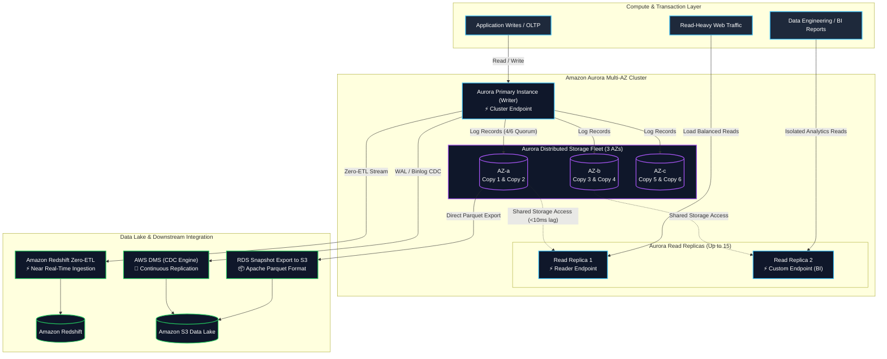
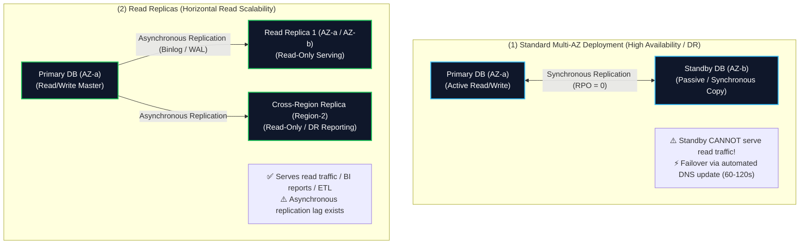
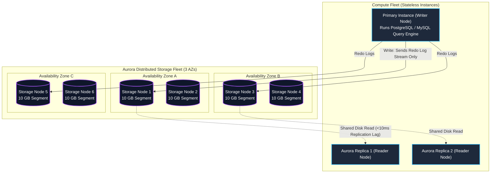
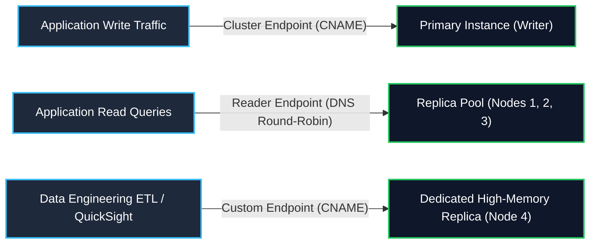
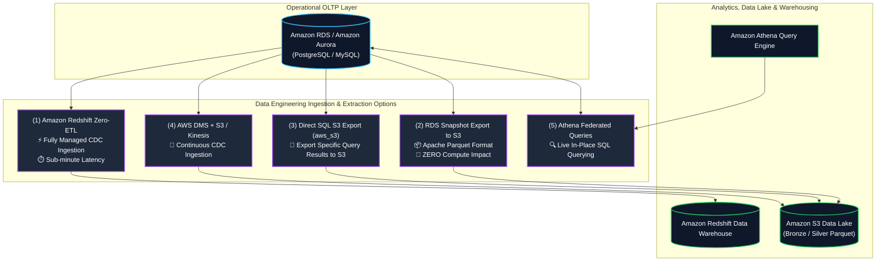
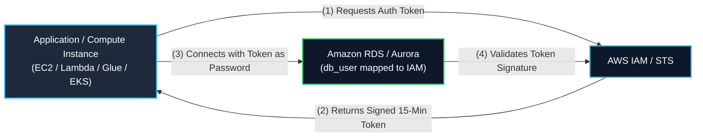

# 🐘 Amazon RDS & Amazon Aurora (Managed Relational OLTP Databases)

- **Category**: Database (Relational OLTP & Cloud-Native Storage)
- **Language / ဘာသာစကား**: [English (Original)](/en/02-services/database/rds-and-aurora) | **မြန်မာဘာသာ (Burmese)**
- **Primary Use Case**: Managed relational databases for transactional operational workloads, ACID transactions, Change Data Capture (CDC) ingestion, zero-ETL integration with [[redshift]], and direct S3 Parquet export. (transactional operational workload များ၊ ACID transaction များ၊ Change Data Capture (CDC) ingestion၊ [[redshift]] နှင့် zero-ETL integration လုပ်ခြင်းနှင့် S3 Parquet သို့ တိုက်ရိုက် export လုပ်ခြင်းတို့အတွက် Managed relational database များ)
- **Slide Reference**: Pages 196–213 in `[AWSCertifiedDataEngineerSlides.pdf](/docs/AWSCertifiedDataEngineerSlides.pdf)`
- **Hub Links**: [[mm/index]] | [[service-catalog]] | [[domain-2-data-store-management]] | [[domain-1-ingestion-and-processing]] | [[redshift]] | [[dms-and-sct]] | [[s3]] | [[kms-and-secrets]]

---

## 1. High-Level Summary (အကျဉ်းချုပ်)

**Amazon Relational Database Service (Amazon RDS)** သည် cloud ပေါ်တွင် relational database များကို set up လုပ်ရန်၊ operate လုပ်ရန်နှင့် scale ချဲ့ရန် လွယ်ကူစေသည့် fully managed web service တစ်ခုဖြစ်သည်။ ၎င်းတွင် **Amazon Aurora**, **PostgreSQL**, **MySQL**, **MariaDB**, **Oracle**, နှင့် **Microsoft SQL Server** ဟူ၍ database engine (၆) မျိုးပါဝင်သည်။

**Amazon Aurora** သည် AWS ၏ ကိုယ်ပိုင် cloud-native relational database engine ဖြစ်ပြီး MySQL နှင့် PostgreSQL တို့နှင့် compatible ဖြစ်သည်။ Aurora သည် compute နှင့် storage ကို ခွဲထုတ် (decouple) ထားပြီး distributed, self-healing, multi-AZ storage subsystem တစ်ခုအနေဖြင့် အလုပ်လုပ်သည်။ ထို့ကြောင့် **standard MySQL ထက် throughput ၅ ဆ** နှင့် **standard PostgreSQL ထက် throughput ၃ ဆ** ပိုမိုမြန်ဆန်စေသည်။

**AWS Certified Data Engineer – Associate (DEA-C01)** exam အတွက် သင်သည် အောက်ပါတို့ကို ကျွမ်းကျင်စွာ သိရှိထားရမည်-
1. **Multi-AZ Deployments vs. Read Replicas**: High Availability (HA) အတွက် failover နှင့် horizontal read scalability (analytics query များ offload လုပ်ခြင်း) အကြား ကွာခြားချက်။
2. **Aurora Distributed Storage Architecture**: 3 AZs တွင် 6-way replication ပြုလုပ်ခြင်း (4/6 write quorum နှင့် 3/6 read quorum ဖြင့်)။
3. **Data Lake & Analytics Integrations**: S3 သို့ **Apache Parquet** format ဖြင့် native snapshot export လုပ်ခြင်း၊ direct SQL S3 export (`aws_s3`) အသုံးပြုခြင်းနှင့် **Amazon Redshift Zero-ETL integration**။
4. **Change Data Capture (CDC)**: PostgreSQL WAL သို့မဟုတ် MySQL binlogs မှ transactional change များကို [[dms-and-sct]] (AWS DMS) အသုံးပြု၍ extract လုပ်ခြင်း။
5. **Security & Authentication**: **IAM Database Authentication** (temporary tokens များ) နှင့် [[kms-and-secrets]] (AWS Secrets Manager) ဖြင့် automated credential rotation ပြုလုပ်ခြင်း။



---

## 2. Amazon RDS Core Architecture

### 1. Storage Volume Subsystems in Standard RDS (Standard RDS မှ Storage Volume Subsystem များ)

Standard RDS instance များ (PostgreSQL, MySQL, MariaDB, Oracle, SQL Server) သည် အောက်ခံတွင် Amazon EBS volume များကို အသုံးပြုသည်-

| Volume Type | Technical Characteristics (နည်းပညာဆိုင်ရာ ဝိသေသလက္ခဏာများ) | Max IOPS / Throughput | Best Data Engineering Use Case (အကောင်းဆုံး အသုံးပြုနိုင်သောနေရာ) |
| :--- | :--- | :--- | :--- |
| **General Purpose SSD (`gp3`)** | Baseline 3,000 IOPS နှင့် 125 MB/s အခမဲ့ပါဝင်သည်။ IOPS နှင့် throughput ကို သီးခြားစီ scale ချဲ့နိုင်သည်။ | 16,000 IOPS / 1,000 MB/s | Development, testing နှင့် standard production OLTP workload များအတွက် **အကြံပြုထားသော default** ဖြစ်သည်။ |
| **Provisioned IOPS SSD (`io1` / `io2 Block Express`)** | Sub-millisecond latency ဖြင့် dedicated sustained I/O performance ကို ပေးစွမ်းသည်။ `io2` တွင် 5 9's durability ရှိသည်။ | အများဆုံး **256,000 IOPS** / 4,000 MB/s အထိ | Mission-critical ဖြစ်သော၊ throughput မြင့်မားသော OLTP database များနှင့် intensive random I/O လိုအပ်သော နေရာများတွင် အသုံးပြုသည်။ |
| **Storage Auto-Scaling** | Free disk space သည် 10% အောက် ရောက်သွားသည့်အခါ storage volume size ကို အလိုအလျောက် **64 TiB** အထိ dynamic expand လုပ်ပေးသည်။ | N/A | Storage ပြည့်သွားခြင်းကြောင့် database downtime ဖြစ်ပေါ်ခြင်းကို ကာကွယ်ပေးသည်။ (မှတ်ချက်- Storage သည် scale **up** (တိုး) သာ လုပ်နိုင်ပြီး၊ အောက်သို့ ပြန်ချုံ့၍ မရပါ။) |

---

### 2. Multi-AZ Deployments vs. Read Replicas (Core Exam Distinction) (အဓိက စာမေးပွဲ ခွဲခြားချက်)

**Multi-AZ** (High Availability အတွက်) နှင့် **Read Replicas** (Scalability အတွက်) တို့၏ ဗိသုကာပိုင်းဆိုင်ရာ ကွာခြားချက်ကို နားလည်ခြင်းသည် DEA-C01 စာမေးပွဲတွင် အများဆုံး မေးလေ့ရှိသော အကြောင်းအရာတစ်ခုဖြစ်သည်။



### Multi-AZ vs. Read Replicas Comparison Matrix (နှိုင်းယှဉ်ချက် ဇယား)

| Architectural Feature | Standard Multi-AZ Deployment | Read Replicas | Multi-AZ DB Cluster (Two Readable Standbys) |
| :--- | :--- | :--- | :--- |
| **Primary Purpose (အဓိက ရည်ရွယ်ချက်)** | **High Availability (HA) & Disaster Recovery** | **Horizontal Read Scalability & BI Offloading** | **HA + Fast Failover + Read Scalability** |
| **Replication Type** | **Synchronous** (Zero data loss, RPO = 0) | **Asynchronous** (Replication lag ရှိနိုင်သည်) | **Quorum-based** (Semi-synchronous မှ 2 standbys သို့) |
| **Active Read Traffic?** | ❌ **No** (Standby သည် passive ဖြစ်ပြီး၊ application များမှ မမြင်နိုင်ပါ) | ✅ **Yes** (Read-only query များအတွက် Dedicated DNS endpoint များရှိသည်) | ✅ **Yes** (Standby နှစ်ခုစလုံးက read traffic ကို serve လုပ်သည်) |
| **Failover Mechanism** | **Automatic**: DNS record ကို standby သို့ ပြောင်းပေးသည် (စက္ကန့် ၆၀–၁၂၀ ကြာသည်) | **Manual Promotion**: Standalone အဖြစ် manual promote လုပ်ပေးရမည် | **Automatic**: စက္ကန့် ၃၅ အောက် failover ဖြစ်သည် |
| **Region Scope** | **Single Region** (Across 2 AZs) | **Same Region OR Cross-Region** | **Single Region** (Across 3 AZs) |
| **Performance Impact** | Write latency အနည်းငယ် ကြန့်ကြာမှုရှိသည် (sync ack ကို စောင့်ရသောကြောင့်) | Primary အပေါ် write latency သက်ရောက်မှု မရှိပါ | Write latency သက်ရောက်မှု အလွန်နည်းပါးသည် |
| **Max Instances** | 1 Primary + 1 Standby | အများဆုံး **5** (Standard RDS) သို့မဟုတ် **15** (Aurora) အထိ | 1 Writer + 2 Readable Standbys |

---

## 3. Amazon Aurora Cloud-Native Architecture

Amazon Aurora သည် compute ကို storage မှ ခွဲထုတ် (decouple) ပြီး၊ logging layer ကို purpose-built distributed storage fleet သို့ ရွှေ့ပြောင်းခြင်းဖြင့် ရိုးရာ relational database ကို re-architect လုပ်ထားသည်။



### Key Aurora Storage Innovations (အဓိက Aurora Storage တီထွင်ဆန်းသစ်မှုများ)

1. **6-Way Replication Across 3 AZs**:
   - Aurora သည် သင့် database storage volume ကို **10 GB segment** များအဖြစ် အလိုအလျောက် ပိုင်းခြားပေးပြီး၊ segment တစ်ခုစီကို **Availability Zone ၃ ခုအနှံ့ ၆ ကြိမ် (6 times)** (AZ တစ်ခုလျှင် 2 copies ဖြင့်) replicate လုပ်ပေးသည်။
2. **Quorum Model (Fault Tolerance)**:
   - **Write Quorum ($4/6$)**: Write လုပ်ရာတွင် node **၆ ခုအနက် ၄ ခု (4 out of 6 nodes)** က log record လက်ခံရရှိကြောင်း acknowledge လုပ်သည်နှင့်တပြိုင်နက် commit လုပ်သည်။ Aurora သည် AZ တစ်ခုလုံး ကျသွားပြီး နောက်ထပ် storage node တစ်ခုပါ ထပ်မံပျက်စီးသွားသည့်တိုင်အောင် write availability ကို မဆုံးရှုံးဘဲ ဆက်လက်လည်ပတ်နိုင်သည်။
   - **Read Quorum ($3/6$)**: Read လုပ်ရန်အတွက် node ၆ ခုအနက် ၃ ခု၏ acknowledgment လိုအပ်သည်။
3. **Log is the Database**:
   - ကွန်ရက်ပေါ်မှ ညစ်ညမ်းသော (dirty) buffer page များနှင့် database file များကို ရေးမည့်အစား (standard RDS ကဲ့သို့)၊ Aurora compute engine သည် **redo log record များကိုသာ** storage fleet သို့ တိုက်ရိုက် ရေးသည်။
   - Storage node များသည် redo log များကို background တွင် parallel အဖြစ် apply လုပ်ပေးသောကြောင့် write amplification နှင့် I/O bottleneck များကို ဖယ်ရှားပေးသည်။
4. **Self-Healing & Auto-Expanding Storage**:
   - Storage သည် ပျက်စီးနေသော (corrupted) disk sector များကို အဆက်မပြတ် scan ဖတ်ပြီး၊ background တွင် 10 GB အပိုင်းများအဖြစ် အလိုအလျောက် ပြန်လည်ပြုပြင် (repair) ပေးသည်။
   - Storage သည် 10 GB မှ စတင်၍ **128 TiB** အထိ (10 GB အပိုင်းများဖြင့်) အလိုအလျောက် ကြီးထွားလာနိုင်သည် (ထို့ပြင် data များကို ဖျက်လိုက်သည့်အခါ အလိုအလျောက် ပြန်လည်ချုံ့သွားသည်)။

---

### Aurora Endpoints Architecture

Aurora သည် သင့်လျော်သော compute instance များသို့ traffic လမ်းညွှန်ရန် DNS endpoint (၄) မျိုးကို ပံ့ပိုးပေးသည်-



1. **Cluster Endpoint (Writer Endpoint)**: လက်ရှိ primary DB instance ကို ညွှန်ပြသည်။ Failover ဖြစ်ပြီးနောက် အသစ်ဖြစ်လာသော primary သို့ အလိုအလျောက် ပြောင်းလဲညွှန်ပြသည်။
2. **Reader Endpoint**: Active ဖြစ်နေသော Aurora Read Replica များအားလုံးအကြား DNS round-robin load balancing ကို ပံ့ပိုးပေးသည်။
3. **Custom Endpoint**: အသုံးပြုသူ သတ်မှတ်ထားသော DB instance အုပ်စုကို ကိုယ်စားပြုသည်။ အခြား user read traffic များကို မထိခိုက်စေဘဲ heavy analytical query များ သို့မဟုတ် ETL job များကို သီးခြား ပိုကြီးသော instance size များသို့ လမ်းညွှန်ရန် အထူးသင့်လျော်သည်။
4. **Instance Endpoint**: Cluster အတွင်းရှိ သီးခြား DB instance တစ်ခုသို့ တိုက်ရိုက် ချိတ်ဆက်မှု။

---

### Aurora Advanced Deployment Options

#### 1. Aurora Serverless v2
- Application ၏ လိုအပ်ချက်ပေါ်မူတည်၍ စက္ကန့်ပိုင်းအတွင်း compute capacity ကို အလိုအလျောက် အတက်အကျ (scale up/down) ပြုလုပ်ပေးသည်။
- Capacity ကို **Aurora Capacity Units (ACUs)** ဖြင့် တိုင်းတာပြီး၊ **0.5 ACU မှ 128 ACUs** အထိ (1 ACU $\approx$ 2 GiB RAM, ၎င်းနှင့်ကိုက်ညီသော CPU နှင့် networking) scale လုပ်နိုင်သည်။
- Database connection များကို မပြတ်တောက်စေဘဲ CPU နှင့် memory capacity ကို fine-grained အဆင့်ဖြင့် ချိန်ညှိပေးသည်။
- Spiky, unpredictable, multi-tenant နှင့် dev/test workload များအတွက် အထူးသင့်လျော်သည်။

#### 2. Aurora Global Database
- အများအားဖြင့် စက္ကန့်ပိုင်းအောက် replication latency ဖြင့် (ပုံမှန်အားဖြင့် **< 1 second**) AWS Region အများအပြားကို လွှမ်းခြုံထားသည်။
- Replication ကို dedicated storage layer က တိုက်ရိုက်လုပ်ဆောင်သည် (primary compute အပေါ် performance ကျဆင်းမှု လုံးဝမရှိပါ)။
- RPO < 1s နှင့် RTO < 1 minute ဖြင့် disaster recovery ကို ပံ့ပိုးပေးသည့်အပြင်၊ ကမ္ဘာတစ်ဝှမ်း ultra-low latency local read များကိုပါ ရရှိစေသည်။

#### 3. Aurora Parallel Query
- SQL query processing ကို Aurora ၏ distributed storage fleet သို့ ဆင်း၍ အလုပ်လုပ်စေသည်။
- Storage node ထောင်ပေါင်းများစွာက data segment များကို parallel အနေဖြင့် scan ဖတ်ခြင်းနှင့် filter လုပ်ခြင်းတို့ကို လုပ်ဆောင်နိုင်စေသည်။
- Data warehouse သို့ data ရွှေ့ပြောင်းရန် မလိုအပ်ဘဲ transactional table များပေါ်တွင် analytical query များ (`COUNT`, `SUM`, `AVG`, large table scans) ကို **10x မှ 100x** အထိ ပိုမိုမြန်ဆန်စေသည်။

#### 4. Aurora Fast Database Cloning
- **Copy-on-Write** storage ကိုအသုံးပြု၍ Aurora cluster ၏ သီးခြား (isolated) clone များကို ချက်ချင်းဖန်တီးပေးသည်။
- Database အရွယ်အစား မည်မျှပင်ကြီးမားစေကာမူ (50+ TB database များပင်လျှင်) ကနဦး ထပ်ဆောင်း storage ကုန်ကျစရိတ် လုံးဝမရှိဘဲ မိနစ်ပိုင်းအတွင်း clone များကို ဖန်တီးနိုင်သည်။
- Staging, schema migration များ test လုပ်ခြင်း သို့မဟုတ် intensive ဖြစ်သော တစ်ကြိမ်သုံး data extraction pipeline များ run ရန်အတွက် အထူးသင့်လျော်သည်။

---

## 4. Data Engineering Integrations & Data Lake Pipelines



### 1. Amazon Redshift Zero-ETL Integration (Top Exam Focus)
- Transactional data များကို Amazon Aurora (MySQL/PostgreSQL) နှင့် Amazon RDS မှ **Amazon Redshift** သို့ အလိုအလျောက် replicate လုပ်ပေးသည့် fully managed, serverless integration ဖြစ်သည်။
- **Mechanics**: Aurora တွင် ရေးလိုက်သော data များကို စက္ကန့်ပိုင်းအတွင်း Redshift storage သို့ အလိုအလျောက် replicate လုပ်ပေးသည်။
- **Why use it?**: Glue သို့မဟုတ် DMS ကိုအသုံးပြု၍ ရှုပ်ထွေးသော ETL/ELT pipeline များကို design ဆွဲခြင်း၊ တည်ဆောက်ခြင်းနှင့် ထိန်းသိမ်းခြင်းတို့ လိုအပ်မှုကို ဖယ်ရှားပေးသည်။ Transactional data များပေါ်တွင် တိုက်ရိုက် real-time analytics နှင့် BI dashboard များကို အသုံးပြုနိုင်စေသည်။

### 2. RDS Snapshot Export to Amazon S3 (Parquet Export)
- Amazon RDS သို့မဟုတ် Aurora snapshot မှ data များကို **Amazon S3 သို့ Apache Parquet format** ဖြင့် တိုက်ရိုက် export လုပ်ပေးသည်။
- **Zero Impact on Production**: Export လုပ်ငန်းစဉ်သည် AWS managed background fleet တွင် လုံးဝ run သောကြောင့်၊ active database instance ပေါ်တွင် **CPU/RAM/IOPS လုံးဝ (0) အသုံးမပြုပါ**။
- **Analytical Optimization**: Parquet file များသည် အလိုအလျောက် columnar-formatted ဖြစ်ခြင်း၊ Snappy ဖြင့် compress လုပ်ထားခြင်းနှင့် partition ခွဲထားခြင်းတို့ကြောင့် [[athena]], [[glue]] ဖြင့် ချက်ချင်း query လုပ်နိုင်သည် (သို့မဟုတ်) [[redshift]] ထဲသို့ load လုပ်နိုင်သည်။

### 3. Direct SQL S3 Integration (`aws_s3` Extension for PostgreSQL)
- RDS/Aurora PostgreSQL တွင် native `aws_s3` extension ကိုအသုံးပြု၍၊ ၎င်းမှ query result များကို S3 သို့ တိုက်ရိုက် export လုပ်နိုင်သည်-

```sql
-- Export query results directly to an S3 bucket in CSV format
SELECT * FROM aws_s3.query_export_to_s3(
   'SELECT customer_id, transaction_date, amount FROM customer_transactions WHERE transaction_date >= ''2026-01-01''',
   aws_commons.create_s3_uri('my-data-lake-bucket', 'raw/transactions_2026.csv', 'us-east-1'),
   options => 'format csv, header true'
);
```

### 4. Change Data Capture (CDC) via AWS DMS
- **AWS Database Migration Service (AWS DMS)** သည် transactional transaction log များ (PostgreSQL WAL သို့မဟုတ် MySQL binary log များ) ကို အဆက်မပြတ် ဖတ်သည်။
- Stream processing အတွက် near real-time ဖြင့် INSERT များ၊ UPDATE များနှင့် DELETE များကို **Amazon S3**, **Amazon Kinesis Data Streams**, သို့မဟုတ် **Amazon MSK** သို့ replicate လုပ်ပေးသည်။

---

## 5. Security, Authentication & Credential Governance



### 1. IAM Database Authentication
- Hardcode ရေးထားသော database user password များ လိုအပ်မှုကို ဖယ်ရှားပေးသည်။
- Application များသည် RDS/Aurora MySQL သို့မဟုတ် PostgreSQL သို့ ချိတ်ဆက်ရာတွင် (AWS credentials များဖြင့် sign လုပ်ထားသော၊ 15 မိနစ် အသက်ဝင်သည့်) ယာယီ **IAM authentication tokens** များကို အသုံးပြု၍ authenticate လုပ်သည်။
- **IAM Policy Action**: `rds-db:connect`.

### 2. AWS Secrets Manager Credential Rotation
- Database master credential များနှင့် application connection string များကို လုံခြုံစွာ သိမ်းဆည်းပေးသည်။
- Application အလုပ်လုပ်ဆောင်မှုကို မထိခိုက်စေဘဲ automated AWS Lambda rotation function ကို အသုံးပြု၍ database password များကို သတ်မှတ်ထားသော အချိန်ဇယား (ဥပမာ- ရက် ၃၀ လျှင် တစ်ကြိမ်) အတိုင်း အလိုအလျောက် rotate (ပြောင်းလဲ) ပေးသည်။

### 3. Encryption at Rest & In Transit
- **At Rest**: AWS KMS (CMK သို့မဟုတ် AWS managed key `aws/rds`). DB instance၊ automated backup များအားလုံး၊ read replica များနှင့် snapshot များအားလုံး ပါဝင်သည်။ (Database စတင်ဖန်တီးချိန်တွင် encryption ကို enable လုပ်ရမည်။ လက်ရှိ unencrypted database တစ်ခုကို in-place အနေဖြင့် encrypt လုပ်၍ မရပါ - snapshot ယူပြီးမှသာ လုပ်နိုင်သည်)။
- **In Transit**: SSL/TLS encryption ကို parameter `rds.force_ssl = 1` (PostgreSQL) သို့မဟုတ် `require_secure_transport = ON` (MySQL) အဖြစ် သတ်မှတ်၍ အတင်းအကြပ် အသုံးပြုစေသည်။

---

## 6. Multi-Dimensional Comparison: RDS vs. Aurora vs. Redshift vs. DynamoDB

| Architectural Dimension | Amazon RDS (Postgres/MySQL) | Amazon Aurora | Amazon Redshift | Amazon DynamoDB |
| :--- | :--- | :--- | :--- | :--- |
| **Data Model** | Relational (SQL) | Relational (SQL) | Relational (SQL / Columnar) | NoSQL (Key-Value / Document) |
| **Workload Type** | **OLTP (Transactional)** | **OLTP (High-Performance)** | **OLAP (Analytics / DW)** | **OLTP (Massive Concurrency)** |
| **Storage Architecture** | Dedicated EBS Volumes | **Distributed Shared Cluster** (3 AZs, 6 copies) | Columnar Managed Storage (Redshift Managed Storage - RMS) | Distributed Partitioned SSDs |
| **Max Storage Size** | 64 TiB | **128 TiB** (Auto-scaling) | Petabytes / Exabytes | Virtually Infinite (အကန့်အသတ်မရှိနီးပါး) |
| **Query Latency** | Single-digit milliseconds | Single-digit milliseconds | Seconds to minutes (Complex aggregation) | **Single-digit milliseconds (Microseconds with DAX)** |
| **Replication** | Asynchronous / Synchronous Multi-AZ | **Sub-10ms shared storage** | Multi-AZ clusters / S3 replication | Sub-second Global Tables |
| **Primary DEA-C01 Fit** | ပုံမှန် transactional app များ, relational migration များ | **High-throughput OLTP, Zero-ETL to Redshift** | **Complex SQL analytics, aggregation, data warehouse** | **Real-time key-value lookups, session state, CDC** |

---

## 7. Data Engineering Production Architecture Patterns

### Pattern A: Zero-ETL Real-Time Analytics Pipeline with Redshift

- **Challenge**: E-commerce platform တစ်ခုသည် real-time inventory နှင့် revenue dashboard များ လိုအပ်နေသည်။ Transactional database ပေါ်တွင် heavy aggregation query များ run ခြင်းသည် primary CPU spike ဖြစ်စေပြီး checkout table များကို lock ကျစေသည်။
- **Solution**: **Amazon Aurora PostgreSQL Zero-ETL integration with Amazon Redshift** ကို configure လုပ်ပါ။
- **Architecture**:
  - Web application များသည် checkout transaction များကို Aurora Primary သို့ ရေးသည်။
  - Transaction များကို Zero-ETL မှတစ်ဆင့် Redshift သို့ near real-time ဖြင့် (< 15 seconds) replicate လုပ်ပေးသည်။
  - Business Intelligence tool များ ([[quicksight]]) က Redshift ပေါ်တွင် multi-table join များနှင့် aggregation query များကို တိုက်ရိုက် run သည်။

### Pattern B: Zero-Compute Production Data Lake Hydration (Snapshot Export to S3)

- **Challenge**: Data engineering team သည် နေ့စဉ် နေ့လယ် peak hour များအတွင်း active OLTP instance များ၏ performance ကို မကျဆင်းစေဘဲ၊ database table အဟောင်းများအားလုံးကို S3 Data Lake သို့ ingest လုပ်ရန် လိုအပ်သည်။
- **Solution**: **RDS Automated Snapshot Export to Amazon S3** ကို အသုံးပြုပါ။
- **Architecture**:
  - RDS automated backup များက နေ့စဉ် snapshot တစ်ခုကို ယူသည်။
  - AWS Backup သို့မဟုတ် EventBridge က ထို snapshot ကို S3 သို့ တိုက်ရိုက် export လုပ်ပေးရန် trigger လုပ်သည်။
  - Export engine က database table များကို S3 အတွင်းရှိ date အလိုက် partition ခွဲထားသော snappy-compressed **Apache Parquet files** များအဖြစ် ပြောင်းလဲပေးသည်။
  - Live database ပေါ်တွင် **CPU/IOPS impact လုံးဝ (Zero) မရှိပါ**။

---

## 8. High-Yield DEA-C01 Exam Tips & Traps

> [!IMPORTANT]
> **Key Exam Trigger Keywords (စာမေးပွဲ အဓိက သော့ချက်စကားလုံးများ)**:
>
> - **"High availability, synchronous replication across 2 AZs with automated failover, passive standby"** $\rightarrow$ **Amazon RDS Multi-AZ**.
> - **"Horizontal read scalability, asynchronous replication, offload analytical queries or BI reporting"** $\rightarrow$ **RDS / Aurora Read Replicas**.
> - **"High-performance cloud-native MySQL/PostgreSQL with 6 storage copies across 3 AZs and 4/6 write quorum"** $\rightarrow$ **Amazon Aurora**.
> - **"Near real-time replication from Aurora to Redshift without custom ETL pipelines"** $\rightarrow$ **Amazon Redshift Zero-ETL integration**.
> - **"Export historical relational data to S3 Data Lake in Parquet format without impacting DB instance CPU or IOPS"** $\rightarrow$ **RDS Snapshot Export to Amazon S3**.
> - **"Authenticate compute applications to RDS without storing passwords"** $\rightarrow$ **IAM Database Authentication (`rds-db:connect`)**.
> - **"Automatically rotate database credentials on a schedule"** $\rightarrow$ **AWS Secrets Manager**.

> [!WARNING]
> **Exam Traps & Failure Modes (စာမေးပွဲ ထောင်ချောက်များနှင့် အမှားများ)**:
>
> 1. **Multi-AZ Standby is NOT for Read Queries**:
>    - Standard RDS Multi-AZ တွင်၊ standby instance သည် passive သက်သက်သာဖြစ်ပြီး **read သို့မဟုတ် write connection များကို လက်ခံနိုင်ခြင်းမရှိပါ**။ အကယ်၍ စာမေးပွဲမေးခွန်းက read reporting traffic ကို offload လုပ်ရန် မေးလာပါက၊ အဖြေသည် **Read Replicas** သာဖြစ်ပြီး၊ Multi-AZ မဟုတ်ပါ။ (Readable standby 2 ခုပါဝင်သော Multi-AZ DB Cluster မှလွဲ၍)။
> 2. **Encrypting Unencrypted Existing RDS Databases**:
>    - Run နေသော လက်ရှိ RDS database (unencrypted) ကို ချက်ချင်း in-place encryption လုပ်၍မရပါ။ အောက်ပါအတိုင်း လုပ်ဆောင်ရမည်- **Snapshot ယူပါ $\rightarrow$ KMS encryption enable လုပ်ထားသော snapshot အဖြစ် copy ကူးပါ $\rightarrow$ ထို snapshot မှတဆင့် encrypted DB အသစ်တစ်ခုကို ပြန်လည် restore လုပ်ပါ**။
> 3. **Aurora Storage Quorum Mechanics**:
>    - Write Quorum = **4 of 6 copies** (write availability မဆုံးရှုံးဘဲ 2 copies ဆုံးရှုံးခံနိုင်သည်)။
>    - Read Quorum = **3 of 6 copies** (read availability မဆုံးရှုံးဘဲ 3 copies ဆုံးရှုံးခံနိုင်သည်)။
> 4. **Storage Shrinking Trap**:
>    - Standard RDS EBS volume များကို အလိုအလျောက် **UP (တိုး)** လုပ်နိုင်သော်လည်း၊ **down (ချုံ့) ၍ မရပါ**။ သို့သော် Aurora storage ကမူ အလိုအလျောက် scale up လုပ်နိုင်သကဲ့သို့၊ table/data များ ဖျက်လိုက်သည့်အခါတွင်လည်း **အလိုအလျောက် shrink (ချုံ့)** သွားသည်။
> 5. **OLTP (RDS/Aurora) vs. OLAP (Redshift)**:
>    - Billions of rows ပေါ်တွင် heavy historical aggregation ပြုလုပ်ရန်အတွက် RDS သို့မဟုတ် Aurora ကို မရွေးချယ်ပါနှင့်; **Amazon Redshift** ကို ရွေးချယ်ပါ။ High-frequency transactional single-row lookup များအတွက် Redshift ကို မရွေးချယ်ပါနှင့်; **RDS/Aurora** သို့မဟုတ် **DynamoDB** ကို ရွေးချယ်ပါ။

---

## 📌 Related Notes

- [[redshift]] — Petabyte-scale OLAP data warehouse and Zero-ETL target
- [[dynamodb]] — Serverless NoSQL operational database comparisons
- [[dms-and-sct]] — AWS Database Migration Service for CDC replication from RDS
- [[s3]] — S3 Data Lake target for RDS Snapshot Parquet exports
- [[athena]] — Querying RDS S3 exports and Athena Federated Queries
- [[kms-and-secrets]] — KMS database encryption and Secrets Manager credential rotation
- [[aws-backup]] — Centralized backup plans, PITR, and Vault Lock protection for RDS
- [[service-comparisons]] — Master DEA-C01 Service Decision Matrix
- [[domain-2-data-store-management]] — DEA-C01 Domain 2 Study Guide
