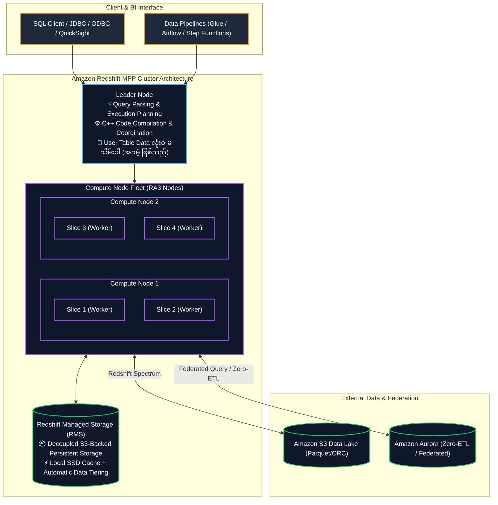
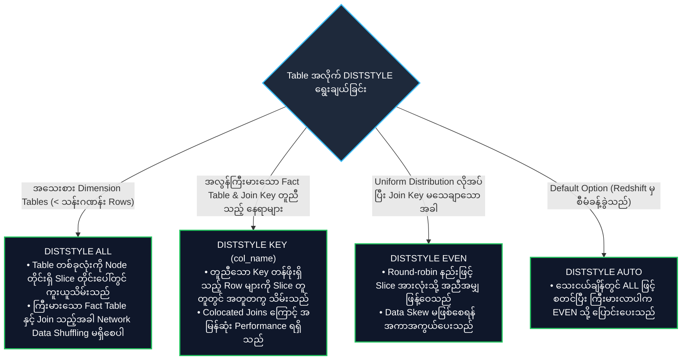
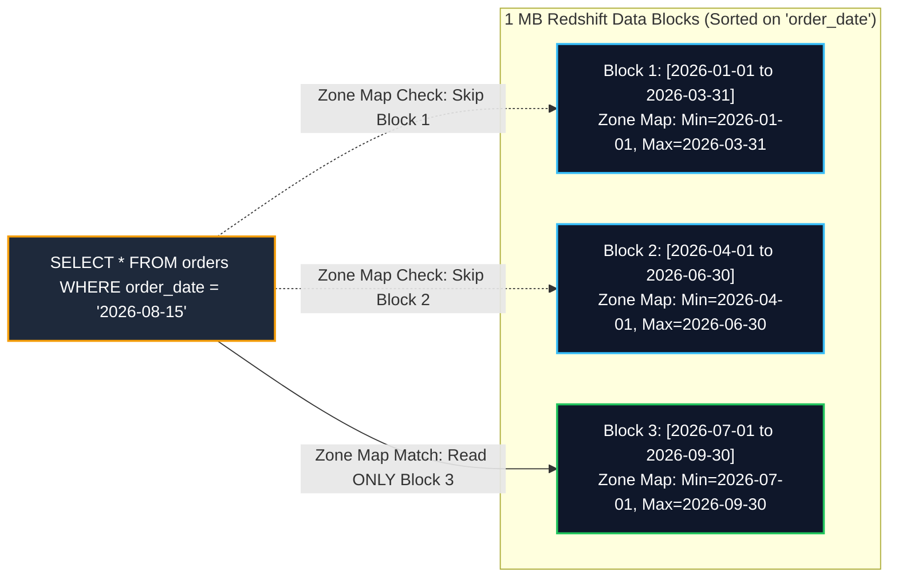
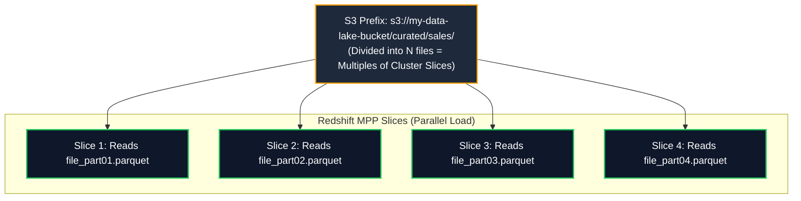

# 🔴 Amazon Redshift (Petabyte-Scale Cloud Data Warehouse & Lakehouse) (Petabyte အဆင့် Cloud Data Warehouse)

- **Category**: Database (Petabyte-Scale Columnar OLAP Data Warehouse)
- **Language / ဘာသာစကား**: [English Version](file:///home/monetine/Workspace/Wathon/aws-dea-c01/content/en/02-services/database/redshift.md) | **မြန်မာဘာသာ (Burmese)**
- **အဓိက အသုံးပြုမှု**: Enterprise Data Warehousing၊ မြန်ဆန်သော Complex SQL Analytics၊ BI Reporting၊ Redshift Spectrum ဖြင့် Data Lakehouse Query များ ပြုလုပ်ခြင်း၊ Serverless Data Processing၊ Zero-ETL Replication နှင့် Real-time Streaming Ingestion။
- **Slide Reference**: Pages 220–265 in `[[AWSCertifiedDataEngineerSlides.pdf]]`
- **Hub Links**: `[[mm/index]]` | `[[en/index]]` | `[[athena]]` | `[[glue]]` | `[[s3]]` | `[[rds-and-aurora]]` | `[[kinesis]]` | `[[kms-and-secrets]]`

---

## ၁။ အကျဉ်းချုပ် (High-Level Summary)

**Amazon Redshift** သည် Petabyte အဆင့်အထိ Scale လုပ်နိုင်သော Fully Managed Columnar Massively Parallel Processing (MPP) Data Warehouse ဝန်ဆောင်မှု ဖြစ်သည်။ Analytical (OLAP) Query များကို Compute Node များစွာနှင့် Slices များပေါ်တွင် Parallelize တွက်ချက်ပေးခြင်း၊ Columnar Storage Layout နှင့် Hardware-Accelerated Local Cache များကို S3 Decoupled Storage ဖြင့် တွဲဖက် အသုံးပြုထားသဖြင့် သမားရိုးကျ Relational Databases များထက် **၁၀ ဆ ပိုမိုမြန်ဆန်သည်**။



---

## ၂။ Distribution Styles (DISTSTYLE) မဟာဗျူဟာများ

Table များအတွင်း ဒေတာများကို Node Slices များဆီသို့ ခွဲဝေဖြန့်ကြက်ရန်အတွက် Distribution Styles ၄ မျိုး ရှိပါသည်-



---

## ၃။ Sort Keys (SORTKEY) နှင့် Zone Maps

Redshift သည် 1 MB အရွယ်အစားရှိသော Disk Blocks များတွင် ဒေတာများကို သိမ်းဆည်းပြီး Block တစ်ခုစီအတွက် Min/Max တန်ဖိုးများပါဝင်သည့် **Zone Maps** များကို Memory တွင် ထိန်းသိမ်းထားသည်-



1. **Compound Sort Keys (Default & Most Common)**: Prefix Order ဖြင့် Sort လုပ်ထားသည်။ `WHERE col1 = '...' AND col2 = '...'` စသည့် အစီအစဉ်လိုက် Filter ပြုလုပ်သည့်အခါ အလွန်မြန်ဆန်သည်။
2. **Interleaved Sort Keys**: Column အသီးသီးကို အလေးချိန်တူညီစွာ Sort လုပ်ပေးသည်။ မတူညီသော Column များဖြင့် မကြာခဏ အမျိုးမျိုး Filter လုပ်ရသည့် Query များအတွက် သင့်လျော်သည်။

---

## ၄။ Redshift Bulk Ingestion: The `COPY` Command (Exam Critical)

Redshift ထဲသို့ ဒေတာသွင်းရာတွင် `INSERT` command များကို လုံးဝ (လုံးဝ) မသုံးရပါ။ **`COPY` command** တစ်ခုတည်းကိုသာ သုံးရမည်-

```sql
COPY sales_fact
FROM 's3://my-data-lake-bucket/curated/sales/'
IAM_ROLE 'arn:aws:iam::123456789012:role/RedshiftS3ReadRole'
FORMAT AS PARQUET;
```



### Ingestion Best Practices:
- **File Splitting**: S3 ဖိုင်အရေအတွက်သည် Cluster တစ်ခုလုံးရှိ **Slice အရေအတွက်၏ အဆ (Multiples of Slices)** ဖြစ်စေရမည်။
- **Manifest Files**: တိကျသော ဖိုင်များကိုသာ ရွေးချယ်သွင်းရန်နှင့် မလိုလားအပ်သော ဖိုင်များ မပါဝင်စေရန် `manifest` file ကို အသုံးပြုပါ။
- **Compression Encodings**: `AZ64` (ဂဏန်းများနှင့် ရက်စွဲများအတွက် အကောင်းဆုံး) သို့မဟုတ် `ZSTD` ကို အသုံးပြုပါ။

---

## ၅။ Redshift Spectrum vs. Serverless vs. Zero-ETL

| Feature | Redshift Spectrum | Redshift Serverless | Aurora Zero-ETL Ingestion |
| :--- | :--- | :--- | :--- |
| **Architectural Model** | Exabyte S3 Data Lake ကို Redshift မှ External Tables အဖြစ် တိုက်ရိုက် Query လုပ်ခြင်း | Serverless Data Warehouse (RPUs - Redshift Processing Units ဖြင့် Auto-scale လုပ်သည်) | Amazon Aurora မှ Transactional Data များကို Redshift သို့ စက္ကန့်ပိုင်းအတွင်း အလိုအလျောက် Replicate လုပ်ပေးခြင်း |
| **ETL Requirements** | **Zero ETL** (S3 Parquet/ORC ကို In-place ဖတ်သည်) | ပုံမှန် SQL/ETL Pipelines | **Zero ETL / Zero Pipeline Maintenance** |
| **Cost Model** | Scan လုပ်သည့် Data ပမာဏအလိုက် ($5 per TB scanned) | Run သည့် RPU-hours အလိုက် ပေးချေရသည် | Aurora I/O + Redshift Serverless RPUs |

---

## ၆။ DEA-C01 စာမေးပွဲ အဓိက အချက်အလက်များနှင့် ထောင်ချောက်များ (Exam Tips & Traps)

> [!IMPORTANT]
> **Key Exam Trigger Keywords**:
> - **"High-performance petabyte-scale columnar OLAP data warehousing"** $\rightarrow$ **Amazon Redshift**.
> - **"Fastest parallel bulk load into Redshift"** $\rightarrow$ **`COPY` command from Amazon S3 with files split into multiples of node slices + Parquet / AZ64 encoding**.
> - **"Query S3 data lake files directly without loading them into Redshift"** $\rightarrow$ **Redshift Spectrum** (External schema & external tables via Glue Data Catalog).
> - **"Near-real-time analytics on transactional data without building custom ETL"** $\rightarrow$ **Amazon Aurora Zero-ETL integration with Amazon Redshift**.
> - **"Eliminate join overhead for small dimension tables"** $\rightarrow$ **`DISTSTYLE ALL`**.
> - **"Eliminate join overhead for massive fact table joining on customer_id"** $\rightarrow$ **`DISTSTYLE KEY(customer_id)` on both tables (Colocated join)**.

> [!WARNING]
> **Exam Traps (သတိထားရမည့် အချက်များ)**:
> 1. **Single-row INSERT Trap**: Redshift သို့ Data ထည့်သွင်းရာတွင် `INSERT` command များကို Loop ပတ်သုံးခြင်းသည် Cluster တစ်ခုလုံးကို အလွန်နှေးကွေးစေသည်။ အမြဲတမ်း S3 ပေါ်သို့ File အဖြစ် ချပြီး `COPY` command ကို သုံးပါ။
> 2. **Interleaved Sort Key Vacuuming Trap**: Interleaved Sort Keys များကို Data အများအပြား အသစ်ထည့်ပြီးပါက `VACUUM REINDEX` မဖြစ်မနေ run ပေးရမည်။

---

## 📌 ဆက်စပ် မှတ်စုများ (Related Notes)

- `[[athena]]` — Amazon Athena Serverless S3 Querying
- `[[glue]]` — AWS Glue ETL & Data Catalog
- `[[s3]]` — Amazon S3 Data Lake
- `[[rds-and-aurora]]` — Amazon Aurora Zero-ETL & RDS
- `[[service-comparisons]]` — Redshift vs Athena vs EMR
