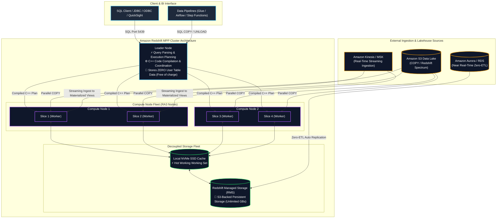
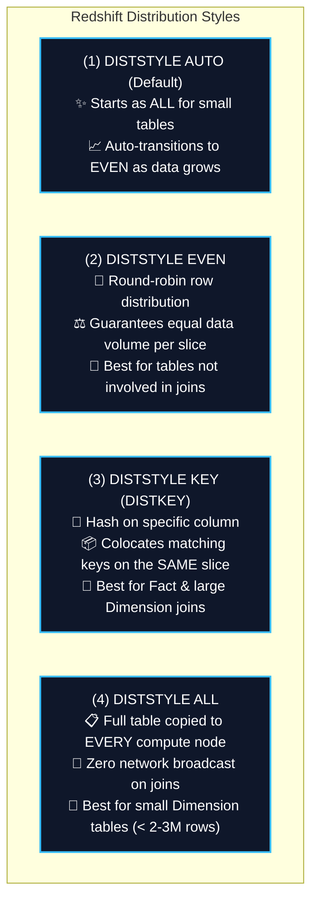
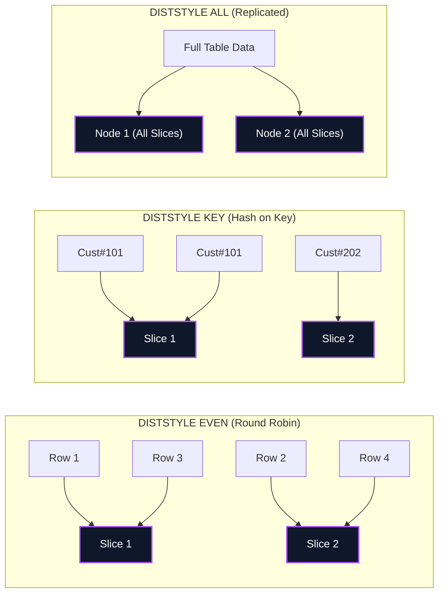
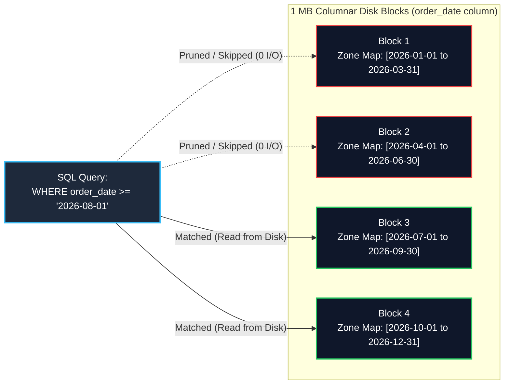
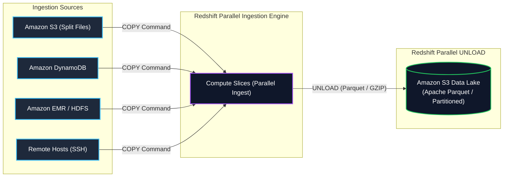
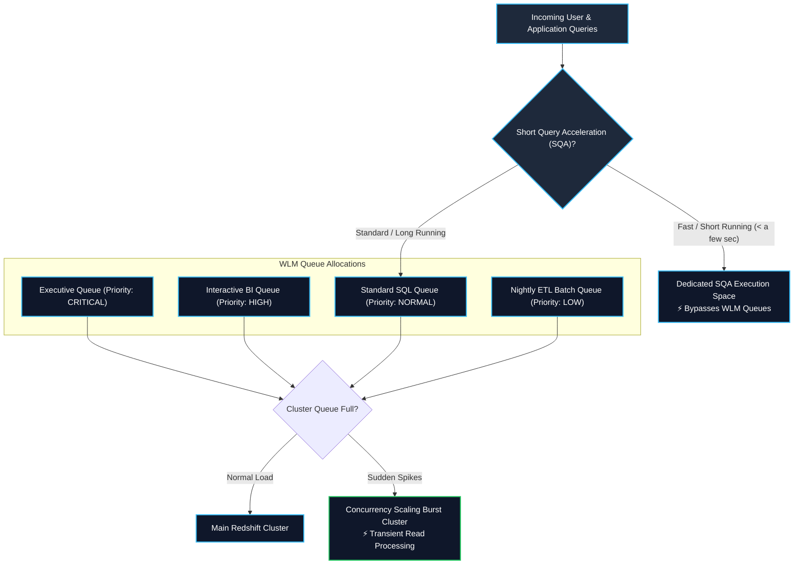
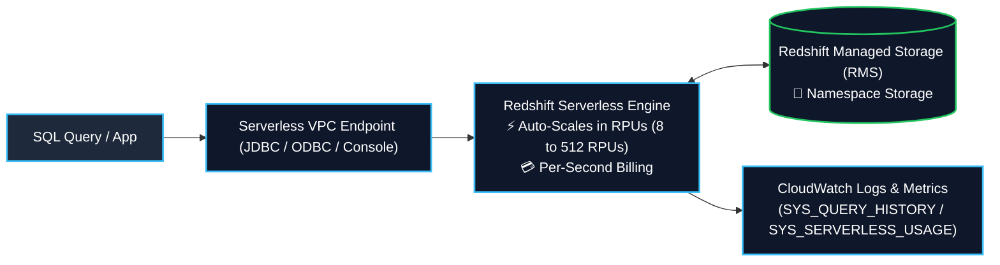
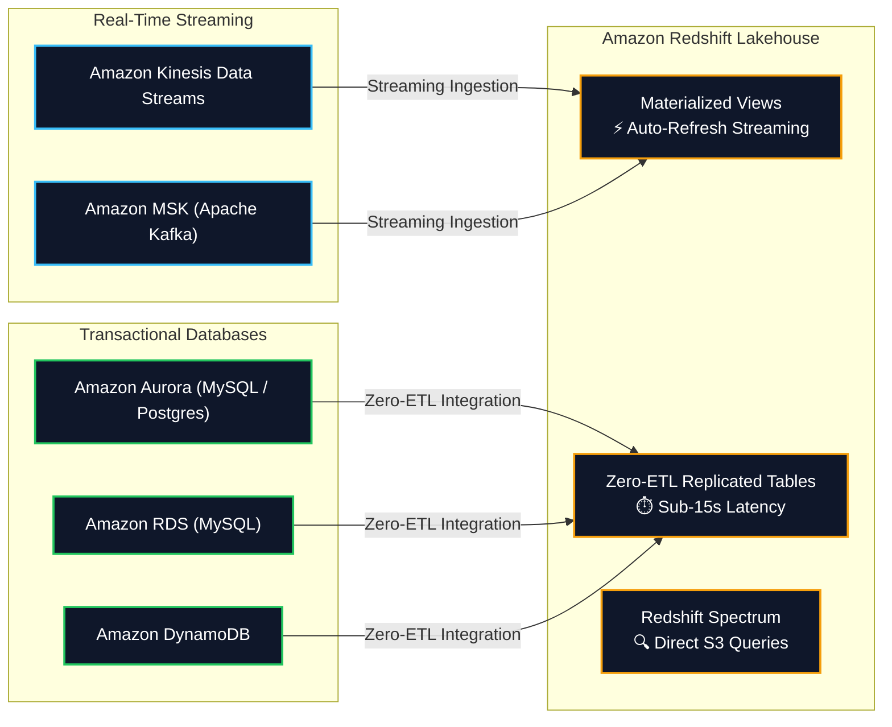

# 🔴 Amazon Redshift (Petabyte-Scale Cloud Data Warehouse & Lakehouse)

- **Category**: Database (Petabyte-Scale Columnar OLAP Data Warehouse)
- **Language / ဘာသာစကား**: [English (Original)](/en/02-services/database/redshift) | **မြန်မာဘာသာ (Burmese)**
- **Primary Use Case**: Enterprise data warehousing, high-performance complex SQL analytics, BI reporting, Data Lakehouse querying with Redshift Spectrum, Serverless data processing, Zero-ETL replication, နှင့် real-time streaming ingestion.
- **Slide Reference**: Pages 220–265 in `[AWSCertifiedDataEngineerSlides.pdf](/docs/AWSCertifiedDataEngineerSlides.pdf)`
- **Hub Links**: [[mm/index|index]] | [[mm/00-hub/service-catalog|service-catalog]] | [[mm/01-domains/domain-2-data-store-management|domain-2-data-store-management]] | [[mm/01-domains/domain-1-ingestion-and-processing|domain-1-ingestion-and-processing]] | [[mm/02-services/analytics-streaming/athena/athena|athena]] | [[mm/02-services/analytics-streaming/glue/glue|glue]] | [[mm/02-services/storage/s3/s3|s3]] | [[mm/02-services/database/rds-and-aurora|rds-and-aurora]] | [[mm/02-services/analytics-streaming/kinesis/kinesis|kinesis]] | [[mm/02-services/security-governance/kms-and-secrets|kms-and-secrets]]

---

## 1. High-Level Summary (အကျဉ်းချုပ်)

**Amazon Redshift** သည် fully managed ဖြစ်သော၊ petabyte-scale၊ columnar Massively Parallel Processing (MPP) data warehouse service တစ်ခုဖြစ်ပါသည်။ ၎င်းသည် ရိုးရာ relational database များထက် analytical queries (OLAP) များအတွက် **10x higher performance** ကိုပေးစွမ်းနိုင်ပါသည်။ ထိုသို့လုပ်ဆောင်ရာတွင် query execution များကို compute node cluster တစ်ခုအတွင်း ဖြန့်ဝေ၍ ပြိုင်တူလုပ်ဆောင်စေခြင်း (parallelizing)၊ columnar storage ကိုအသုံးပြုခြင်းနှင့် hardware-accelerated local cache ကို decoupled cloud storage နှင့် တွဲဖက်အသုံးပြုခြင်းတို့ဖြင့် ဆောင်ရွက်ပါသည်။

**AWS Certified Data Engineer – Associate (DEA-C01)** exam အတွက်၊ Redshift ကို အောက်ပါအချက်များအပေါ် အခြေခံ၍ စမ်းသပ်မေးမြန်းလေ့ရှိပါသည်-
1. **MPP & Decoupled Storage Architecture**: Leader node coordination, compute node slices, နှင့် persistent S3-backed **Redshift Managed Storage (RMS)**.
2. **Table Design & Performance Tuning**: အကောင်းဆုံးသော **Distribution Styles (`DISTSTYLE KEY / ALL / EVEN / AUTO`)** ကို ရွေးချယ်ခြင်းနှင့် **Sort Keys (`Compound` vs. `Interleaved` & Zone Maps)** အသုံးပြုခြင်း။
3. **High-Throughput Bulk Ingestion**: **`COPY` command**, manifest files, S3 file splitting math ($N \times \text{Slices}$), နှင့် columnar encodings (**`AZ64` / `ZSTD`**) များကို အသုံးပြု၍ parallel loading ပြုလုပ်ခြင်း။
4. **Data Lakehouse & Federation**: **Redshift Spectrum** ကို အသုံးပြု၍ exabytes အရွယ်အစားရှိသော open-format S3 data များကို query ပြုလုပ်ခြင်းနှင့် **Federated Queries** နှင့် **Zero-ETL Ingestion** တို့မှတဆင့် transactional operational data များကို ချိတ်ဆက်အသုံးပြုခြင်း။
5. **Workload Management (WLM) & Scalability**: Automatic WLM, Short Query Acceleration (SQA), Concurrency Scaling, နှင့် **Redshift Serverless (RPUs)**.
6. **Data Sharing, Data API & In-Database ML**: Zero-copy cross-cluster **Redshift Data Sharing**, asynchronous **Redshift Data API**, နှင့် SQL-based **Redshift ML**.



---

## 2. Massively Parallel Processing (MPP) & Storage Architecture

### 1. Leader Node vs. Compute Nodes & Slices
- **Leader Node**:
  - JDBC/ODBC client connection များအတွက် master endpoint အဖြစ် လုပ်ဆောင်ပေးပါသည်။
  - ဝင်ရောက်လာသော SQL statement များကို parse လုပ်ခြင်း၊ အကောင်းဆုံးသော query execution tree များကို တည်ဆောက်ခြင်း၊ ၎င်းတို့ကို executable C++ binary များအဖြစ် compile လုပ်ခြင်းနှင့် compute node များထံသို့ code များကို ဖြန့်ဝေပေးခြင်းတို့ကို ပြုလုပ်ပါသည်။
  - Compute node များမှ ရရှိလာသော intermediate query result များကို စုစည်းပေးပြီးနောက် client ထံသို့ အပြီးသတ် record များကို ပြန်ပေးပါသည်။
  - **Cost Rule**: Compute node နှစ်ခု သို့မဟုတ် နှစ်ခုထက်ပိုသော cluster များကို အသုံးပြုသည့်အခါ Leader node အတွက် **အခမဲ့ (free of charge)** ဖြစ်ပါသည်။ User table data များကို Leader node ပေါ်တွင် **ဘယ်တော့မှ သိမ်းဆည်းထားလေ့မရှိပါ**။
- **Compute Nodes & Slices**:
  - Compute node များသည် ၎င်းတို့ထံ ခွဲဝေချထားပေးသော data partition များပေါ်တွင် compile လုပ်ထားသော query code များကို အပြိုင် (parallel) အလုပ်လုပ်ဆောင်ပေးပါသည်။
  - Compute node တစ်ခုစီကို **Slices** ဟုခေါ်သော logical processing unit များအဖြစ် ထပ်မံခွဲခြားထားပါသည်။
  - Slice တစ်ခုစီအတွက် သီးသန့် CPU, memory, နှင့် disk space များကို ခွဲဝေချထားပေးပါသည် (ဥပမာ- `ra3.4xlarge` တွင် slice ၄ ခုပါဝင်ပြီး၊ `ra3.16xlarge` တွင် slice ၁၆ ခု ပါဝင်ပါသည်)။
  - Cluster အတွင်းရှိ slice အားလုံးသည် query step များကို တစ်ပြိုင်နက်တည်း လုပ်ဆောင်ကြပါသည်။

### 2. Node Families: RA3 vs. Dense Compute (DC2)

| Node Family | Architecture & Storage Model | Best DEA-C01 Use Case |
| :--- | :--- | :--- |
| **RA3 Nodes (`ra3.xlplus`, `ra3.4xlarge`, `ra3.16xlarge`)** | **Decoupled Compute & Storage**: မြင့်မားသောစွမ်းဆောင်ရည်ရှိသည့် local NVMe SSD cache နှင့် Amazon S3 ကို အခြေခံထားသော persistent **Redshift Managed Storage (RMS)** တို့ကို ပေါင်းစပ်အသုံးပြုထားပါသည်။ Storage ကို node တစ်ခုလျှင် **128 TB** အထိ အလိုအလျောက် scale လုပ်နိုင်ပါသည်။ | Production workload များအားလုံးအတွက် **အကြံပြုထားသော ခေတ်သစ် default** ဖြစ်ပါသည်။ Compute နှင့် storage များကို သီးခြားစီ scale လုပ်နိုင်စေပါသည်။ |
| **Dense Compute (`dc2.large`, `dc2.8xlarge`)** | **Tightly Coupled Compute & Local SSD**: ပုံသေဖြစ်သော local NVMe SSD storage ဖြစ်ပါသည်။ Compute node များ ထပ်မံပေါင်းထည့်ခြင်းမပြုဘဲ storage ကို scale လုပ်၍ မရပါ။ | အပြောင်းအလဲမရှိသော storage နှင့် အပြင်းအထန် compute လုပ်ရန်လိုအပ်သည့် အသေးစား data mart များ (< 500 GB) သို့မဟုတ် development environment များအတွက် သင့်လျော်ပါသည်။ |

### 3. Columnar Storage & 1 MB Blocks
- **Columnar Layout**: Data များကို row အလိုက် မဟုတ်ဘဲ column အလိုက် disk ပေါ်တွင် ရုပ်ပိုင်းဆိုင်ရာအရ နေရာချထားပါသည်။ Query များသည် SQL `SELECT` list တွင် တိကျစွာ တောင်းဆိုထားသော column များကိုသာ ဆွဲယူသောကြောင့် disk I/O ကို အလွန်သိသာစွာ လျှော့ချပေးပါသည်။
- **1 MB Immutable Blocks**: Redshift သည် data များကို 1 MB disk block များအဖြစ် သိမ်းဆည်းပါသည်။ Block တစ်ခုစီသည် column တစ်ခုတည်းအတွက်သာ တန်ဖိုးများကို သိမ်းဆည်းထားပြီး၊ မြင့်မားသော compression ratio များကို ရရှိစေပါသည်။

---

## 3. Table Design: Distribution Styles (`DISTSTYLE`)

မှန်ကန်သော Distribution Style (`DISTSTYLE`) ကို ရွေးချယ်ခြင်းသည် `JOIN` နှင့် `GROUP BY` operation များပြုလုပ်နေစဉ်အတွင်း compute slice များအကြား network I/O နှင့် data ရွေ့လျားမှုတို့ကို အနည်းဆုံးဖြစ်စေပါသည်။





### Distribution Style Matrix & Decision Rules

| Style | Syntax Example | Placement Behavior | Ideal Data Engineering Use Case |
| :--- | :--- | :--- | :--- |
| **`KEY`** | `DISTSTYLE KEY DISTKEY(customer_id)` | Hashing algorithm သည် တူညီသော key value ရှိသည့် row များကို **အတိအကျတူညီသော slice** ပေါ်တွင် ထားရှိပေးပါသည်။ | တူညီသော join key တွင် ကြီးမားသော Dimension table များနှင့် မကြာခဏ join ပြုလုပ်လေ့ရှိသော **Large Fact Tables** များအတွက် အသင့်လျော်ဆုံးဖြစ်ပါသည်။ |
| **`ALL`** | `DISTSTYLE ALL` | Table တစ်ခုလုံးကို **compute node တိုင်းရှိ node 0 သို့ ကူးယူ (replicate)** ပြုလုပ်ပါသည်။ | **အသေးစား၊ ဖြည်းဖြည်းချင်းပြောင်းလဲသော Dimension Tables များ** (Row ၂-၃ သန်းအောက် သို့မဟုတ် GB အနည်းငယ်အောက်) အတွက် အသင့်လျော်ဆုံးဖြစ်ပါသည်။ |
| **`EVEN`** | `DISTSTYLE EVEN` | Row များကို slice အားလုံးပေါ်တွင် **round-robin** ပုံစံဖြင့် အညီအမျှ ဖြန့်ဝေပေးပါသည်။ | အခြား table များနှင့် join မလုပ်သော table များအတွက် (သို့) ရှင်းလင်းသော join key မရှိသည့်အခါမျိုးတွင် အသုံးပြုရန်။ |
| **`AUTO`** | `DISTSTYLE AUTO` | Redshift သည် distribution ကို စီမံပေးပါသည်: table သေးငယ်ချိန်တွင် `ALL` သတ်မှတ်ပေးပြီး၊ data ကြီးထွားလာသည်နှင့်အမျှ `EVEN` သို့ ပြောင်းလဲပေးပါသည်။ | Query access pattern များကို မသတ်မှတ်ရသေးချိန်တွင် Default အဖြစ်အသုံးပြုပါသည်။ |

### Diagnosing Data Redistribution in Query Plans (`EXPLAIN`)
- **`DS_DIST_NONE` (Optimal)**: Network ပေါ်တွင် data ရွေ့လျားမှု လုံးဝမရှိပါ။ Table နှစ်ခုစလုံးသည် တူညီသော `DISTKEY` များ သို့မဟုတ် `DISTSTYLE ALL` မှတဆင့် တူညီသော slice များပေါ်တွင် အတူတကွ တည်ရှိနေပါသည်။
- **`DS_BCAST_INNER` (Acceptable for Small Tables)**: Inner table ကို network မှတဆင့် compute node များအားလုံးသို့ broadcast လုပ်ပါသည်။
- **`DS_DIST_BOTH` (Worst Performance)**: Table နှစ်ခုစလုံးကို network မှတဆင့် ပြန်လည်ဖြန့်ဝေရမည်ဖြစ်ပါသည်။ ၎င်းသည် `DISTKEY` များကို ညံ့ဖျင်းစွာ ဒီဇိုင်းဆွဲထားခြင်း သို့မဟုတ် မပါဝင်ခြင်းကို ပြသနေပါသည်။

---

## 4. Table Design: Sort Keys, Zone Maps & Compression

### 1. In-Memory Zone Maps (Block-Skipping Mechanism)
- 1 MB disk block တစ်ခုစီအတွက်၊ Redshift သည် column တစ်ခုစီ၏ **`MIN` နှင့် `MAX` value များ** ကို memory ပေါ်တွင် အလိုအလျောက် သိမ်းဆည်းပေးပါသည်။ ၎င်းတို့ကို **Zone Maps** ဟုခေါ်ပါသည်။
- Query တစ်ခုက `WHERE` clause ဖြင့် filter လုပ်သည့်အခါ (ဥပမာ၊ `WHERE order_date BETWEEN '2026-08-01' AND '2026-08-10'`)၊ Redshift သည် Zone Map များကိုစစ်ဆေးပြီး **မကိုက်ညီသော 1 MB disk block များကို လုံးဝကျော်သွား (prune)** ပါသည်။ ထိုသို့ပြုလုပ်ခြင်းဖြင့် မလိုအပ်သော disk I/O ကို ရှောင်ရှားနိုင်ပါသည်။



### 2. Compound Sort Key vs. Interleaved Sort Key

| Sort Key Type | Technical Mechanics | Best Query Pattern |
| :--- | :--- | :--- |
| **Compound Sort Key (Default)** | တင်းကျပ်သော အဆင့်ဆင့် sort လုပ်သည့်အစီအစဉ် `(col1, col2)` ဖြစ်ပါသည်။ `col1` ဖြင့် ဦးစွာ sort လုပ်ပြီး၊ `col1` အတွင်းတွင် `col2` ဖြင့် ထပ်မံ၍ sort လုပ်ပါသည်။ | **Prefix / ရှေ့ဆုံး column များ** ကို အသုံးပြု၍ filter လုပ်သော query များအတွက်ဖြစ်ပါသည် (ဥပမာ၊ `WHERE col1 = 'val'` သို့မဟုတ် `WHERE col1 = 'val' AND col2 = 'val'`)။ Date/timestamp series များအတွက် အလွန်ကောင်းမွန်ပါသည်။ |
| **Interleaved Sort Key** | Sort key တွင်ပါဝင်သော column တိုင်းကို တူညီသောအလေးချိန် (equal weighting) ပေးပါသည်။ | **ကျပန်း၊ လွတ်လပ်သော column ပေါင်းစပ်မှုများ** ကို အသုံးပြု၍ filter လုပ်သော query များအတွက်ဖြစ်ပါသည် (ဥပမာ၊ `WHERE col2 = 'val'` သီးသန့်အသုံးပြုခြင်း)။ |
| **Maintenance Warning** | ပြုပြင်ထိန်းသိမ်းရန် အနည်းငယ်သာလိုအပ်ပါသည်။ (Low maintenance overhead). | မြင့်မားသော maintenance လိုအပ်ပါသည်: bulk data များသွင်းပြီးနောက် မကြာခဏ `VACUUM REINDEX` ပြုလုပ်ရန်လိုအပ်ပြီး၊ unsorted ဖြစ်နေပါက စွမ်းဆောင်ရည်ကျဆင်းနိုင်ပါသည်။ |

### 3. Column Compression Encodings
- **`AZ64`**: Numeric (`INT`, `BIGINT`, `DECIMAL`), `DATE`, နှင့် `TIMESTAMP` column များအတွက် ရည်ရွယ်ထုတ်လုပ်ထားသော AWS ၏ ကိုယ်ပိုင် algorithm ဖြစ်ပါသည်။ SIMD hardware vectorization ကိုအသုံးပြု၍ အမြင့်မားဆုံးသော compression ratio နှင့် အမြန်ဆန်ဆုံး query execution ကို ပေးစွမ်းပါသည်။
- **`ZSTD`**: ရှည်လျားသော string များ၊ အစီအစဉ်မကျသော text များနှင့် `VARCHAR` များအတွက် အထွေထွေသုံး မြင့်မားသော compression ဖြစ်ပါသည်။
- **`RAW`**: Uncompressed (range scan အမြန်နှုန်းကို အများဆုံးရရှိစေရန် sort key ၏ ရှေ့ဆုံး column များအတွက် default အဖြစ် အသုံးပြုပါသည်)။

---

## 5. Bulk Data Ingestion & Export (`COPY` & `UNLOAD`)



### 1. `COPY` Command Best Practices (Golden Exam Rules)
- **Bulk data များကိုထည့်သွင်းရန် SQL `INSERT` ကို လုံးဝမသုံးပါနှင့် (NEVER use SQL `INSERT` for bulk data)**: Single `INSERT` statement များသည် Leader node ကို ဖြတ်သန်းကာ အစဉ်လိုက်လုပ်ဆောင်ပြီး uncompressed block များကို ရေးသားပါသည်။ ထို့ကြောင့် parallel `COPY` command ကို အမြဲတမ်းအသုံးပြုပါ။
- **S3 File Splitting Math**: S3 input file များကို cluster အတွင်းရှိ **slice အရေအတွက်၏ ဆတိုး (multiple of total slices)** အဖြစ် ခွဲခြမ်းပါ။ ဥပမာ၊ 16-slice cluster အတွက်ဆိုလျှင် data များကို 16, 32 သို့မဟုတ် 64 files အရေအတွက်ရှိပြီး အရွယ်အစားတူညီသော (1 MB မှ 1 GB compressed အထိ) file များအဖြစ် ခွဲခြမ်းပါ။
- **Manifest Files**: S3 file path များကို အတိအကျသတ်မှတ်ရန်နှင့် တူညီသော prefix များရှိသည့် မလိုအပ်သော file များ ဝင်ရောက်လာခြင်းကို ရှောင်ရှားရန် JSON manifest file (`manifest`) တစ်ခုကို အသုံးပြုပါ။
- **Example `COPY` Command**:
```sql
COPY public.customer_transactions
FROM 's3://my-analytics-lake/manifests/2026_transactions.manifest'
IAM_ROLE 'arn:aws:iam::123456789012:role/RedshiftS3LoadRole'
FORMAT AS PARQUET
MANIFEST;
```

### 2. Parallel `UNLOAD` to Amazon S3
- Compute slice အားလုံးမှ query result များကို Amazon S3 သို့ **Apache Parquet**, CSV, သို့မဟုတ် text format ဖြင့် အပြိုင် (parallel) export လုပ်ပေးပါသည်-
```sql
UNLOAD ('SELECT * FROM customer_sales WHERE sale_date >= \'2026-01-01\'')
TO 's3://my-lakehouse-bucket/unloaded_sales/'
IAM_ROLE 'arn:aws:iam::123456789012:role/RedshiftUnloadRole'
FORMAT AS PARQUET
PARTITION BY (sale_region)
MANIFEST;
```
- **Parquet Unload Advantages**: Text unload ထက် 2x ပိုမြန်ဆန်ပြီး၊ S3 ပေါ်တွင် storage အသုံးပြုမှုကို 6x အထိ သက်သာစေသည့်အပြင် Athena, EMR, နှင့် Redshift Spectrum တို့မှ ချက်ချင်း query ပြုလုပ်၍ရနိုင်ပါသည်။

### 3. Spatial Data Types & `DBLINK`
- **Spatial Types**: Geospatial SQL function များ (`ST_Distance`, `ST_Contains`) အတွက် `GEOMETRY` နှင့် `GEOGRAPHY` data type များကို ပင်ကိုယ်ပံ့ပိုးမှု (native support) ရှိပါသည်။
- **`DBLINK`**: Redshift ကို PostgreSQL / RDS PostgreSQL database များနှင့် တိုက်ရိုက်ချိတ်ဆက်၍ cross-database query များကို ပြုလုပ်နိုင်စေပါသည်။

---

## 6. Workload Management (WLM), Concurrency Scaling & SQA

Workload Management (WLM) သည် အချိန်ကြာမြင့်စွာ အလုပ်လုပ်သော၊ resource အများအပြားလိုအပ်သော ETL query များက မြန်ဆန်သော interactive BI query များကို မပိတ်ဆို့စေရန် ကာကွယ်ပေးပါသည်။



### 1. Automatic WLM (Auto WLM)
- Query queue များ၊ concurrency level များနှင့် memory ခွဲဝေမှုများကို အလိုအလျောက် စီမံခန့်ခွဲရန် machine learning ကို အသုံးပြုပါသည်။
- **Queue ၈ ခု** အထိ ဖန်တီးပေးနိုင်ပါသည် (Default အနေဖြင့် memory အညီအမျှခွဲဝေပေးထားသော queue ၅ ခုဖြစ်ပါသည်)။
- **Query Priorities**: User group များအပေါ်အခြေခံ၍ priority အဆင့်များ (`CRITICAL`, `HIGH`, `NORMAL`, `LOW`) ကို သတ်မှတ်နိုင်ပါသည်။

### 2. Manual WLM
- သတ်မှတ်ထားသော memory ရာခိုင်နှုန်းနှင့် concurrency level များဖြင့် ဖွဲ့စည်းထားသော service class များဖြစ်ပါသည်။
- Default configuration: Concurrency level 5 (query ၅ ခုကို တစ်ပြိုင်နက်တည်း လုပ်ဆောင်နိုင်သည်) ရှိသော queue ၁ ခု + Concurrency level 1 ရှိသော Superuser queue ၁ ခု။

### 3. Short Query Acceleration (SQA)
- အမြန်လုပ်ဆောင်နိုင်သော query များကို ခွဲခြားသိမြင်ရန် machine learning ကို အသုံးပြုပြီး ၎င်းတို့ကို သီးသန့် SQA execution space သို့ ပေးပို့ပါသည်။
- မြန်ဆန်သော dashboard query များသည် အလွန်ကြာရှည်စွာ လုပ်ဆောင်နေသော ETL aggregation များ၏ အနောက်တွင် စောင့်ဆိုင်းရခြင်းမှ ကာကွယ်ပေးပါသည်။

### 4. Concurrency Scaling
- တစ်ပြိုင်နက်တည်း ဝင်ရောက်လာသော read query အမြောက်အမြားကို အချိန်ဆိုင်းငံ့ခြင်းမရှိဘဲ ကိုင်တွယ်ဖြေရှင်းရန်အတွက် ယာယီ (transient) compute cluster capacity ကို အလိုအလျောက် ပေါင်းထည့်ပေးပါသည်။
- **Credit Rule**: Redshift cluster များသည် cluster အလုပ်လုပ်နေသည့် ၂၄ နာရီတိုင်းအတွက် **Concurrency Scaling credit ၁ နာရီစာ** ကို အခမဲ့ရရှိပါသည်။

---

## 7. Cluster Operations, Maintenance & Diagnostics

### 1. Cluster Resizing: Elastic Resize vs. Classic Resize

| Dimension | Elastic Resize (Recommended) | Classic Resize |
| :--- | :--- | :--- |
| **Operation Duration** | **မိနစ်ပိုင်းသာကြာသည် (ပုံမှန်အားဖြင့် < ၁၀-၁၅ မိနစ်)** | **နာရီပေါင်းများစွာမှ ရက်အထိ ကြာမြင့်နိုင်သည်** (Dataset တစ်ခုလုံးကို row အလိုက် ကူးယူပါသည်) |
| **Availability During Resize** | Node restart လုပ်နေစဉ်အတွင်း မိနစ်အနည်းငယ်မျှသာ cluster သည် **unavailable / read-only** ဖြစ်နေပါမည် | နာရီပေါင်းများစွာကြာသည့် လုပ်ငန်းစဉ်တစ်ခုလုံးအတွက် Cluster သည် **read-only mode** တွင် ရှိနေပါမည် |
| **Node Flexibility** | တူညီသော type ရှိသည့် node များကို အတိုး/အလျှော့ (သို့မဟုတ် node အရေအတွက်ကို နှစ်ဆ/တစ်ဝက်) လုပ်နိုင်ပါသည်; RA3 node type များအကြား ပြောင်းလဲနိုင်ပါသည် | မည်သည့် node type သို့မဟုတ် configuration ကိုမဆို ပြောင်းလဲနိုင်ပါသည် |
| **Disk Space Redistribution** | Redshift Managed Storage (RMS) ပေါ်ရှိ Metadata pointer များကို ချက်ချင်း update လုပ်ပေးပါသည် | အသစ်ဖွဲ့စည်းထားသော cluster ထဲသို့ physical data တစ်ခုလုံးကို အပြည့်အဝ ကူးယူပေးရပါသည် |

### 2. The `VACUUM` & `ANALYZE` Commands
- **`VACUUM FULL`**: ဖျက်လိုက်သော row များမှ disk space ကို ပြန်လည်ရယူပြီး၊ unsorted ဖြစ်နေသော row များအားလုံးအတွက် sort အစီအစဉ်ကို ပြန်လည်ပြင်ဆင်ပေးပါသည် (အပြည့်စုံဆုံးဖြစ်ပါသည်)။
- **`VACUUM SORT ONLY`**: ဖျက်လိုက်သော disk space များကို ပြန်လည်မရယူဘဲ sort အစီအစဉ်ကိုသာ ပြန်လည်ပြင်ဆင်ပေးပါသည်။
- **`VACUUM DELETE ONLY`**: ပြန်လည် sort မလုပ်ဘဲ ဖျက်လိုက်သော disk space များကိုသာ ပြန်လည်ရယူပေးပါသည်။
- **`VACUUM REINDEX`**: Interleaved sort index ကို အသစ်ပြန်လည်တည်ဆောက်ပေးပါသည် (Interleaved Sort Key များရှိသော table များထဲသို့ bulk load လုပ်ပြီးနောက် မဖြစ်မနေပြုလုပ်ရပါမည်)။
- **Auto Vacuum**: Redshift သည် cluster အနားယူနေသည့်အချိန်များတွင် နောက်ကွယ်မှ vacuum operation များကို အလိုအလျောက် လုပ်ဆောင်ပေးပါသည်။
- **`ANALYZE`**: Optimizer ၏ table statistics metadata များကို update လုပ်ပေးပြီး၊ query planner အား အကောင်းဆုံးသော execution plan များကို ဖန်တီးနိုင်စေပါသည်။

### 3. System Tables & Diagnostic Views

| Prefix | Type | Storage & Description |
| :--- | :--- | :--- |
| **`SYS_`** | Serverless & Provisioned Monitoring | Query history, load metrics, နှင့် serverless အသုံးပြုမှုများကို စောင့်ကြည့်ရန် (`SYS_QUERY_HISTORY`, `SYS_LOAD_HISTORY`). |
| **`STV_`** | Snapshot Data | လက်ရှိ system လုပ်ဆောင်မှုများ၏ ယာယီ in-memory snapshot များ. |
| **`SVV_`** | Object Metadata | Database object metadata များကို ပြသရန် STV table များကို ရည်ညွှန်းထားသော view များ (`SVV_TABLE_INFO`, `SVV_EXTERNAL_SCHEMAS`). |
| **`STL_`** | Disk Persisted Logs | Disk ပေါ်တွင် အတည်တကျသိမ်းဆည်းထားသော log view များ (`STL_LOAD_ERRORS`, `STL_QUERY`, `STL_WLM_QUERY`). |
| **`SVCS_` / `SVL_`** | Query Details | Main နှင့် Concurrency Scaling cluster များပေါ်ရှိ လုပ်ဆောင်မှုအသေးစိတ်များ (`SVL_QLOG`). |

---

## 8. Amazon Redshift Serverless

**Amazon Redshift Serverless** သည် ပြောင်းလဲနေသော workload များအပေါ်မူတည်၍ data warehouse capacity ကို အလိုအလျောက် သတ်မှတ်ပေးခြင်းနှင့် scale လုပ်ပေးခြင်းတို့ကို ပြုလုပ်ပေးပြီး၊ တက်ကြွစွာ query လုပ်ဆောင်သည့်အချိန်အတွက်သာ ငွေကြေးပေးဆောင်ရပါသည်။



### Technical Details of Redshift Serverless
1. **Redshift Processing Units (RPUs)**:
   - Capacity ကို **RPUs** ဖြင့် တိုင်းတာပါသည်။ Query execution ၏ **စက္ကန့်အလိုက် RPU-hours** နှင့် storage အတွက် ပေးဆောင်ရမည်ဖြစ်ပါသည်။
   - **Base Capacity**: **8 မှ 512 RPUs** အထိ ပြင်ဆင်သတ်မှတ်နိုင်ပါသည် (defaults ကို AUTO အဖြစ်ထားရှိပါသည်)။
   - **Max Usage Limits**: နေ့စဉ် သို့မဟုတ် လစဉ် ကုန်ကျစရိတ်များကို ထိန်းချုပ်နိုင်ရန် အများဆုံး RPU အကန့်အသတ်များကို သတ်မှတ်နိုင်ပါသည်။
2. **Serverless Setup & IAM**:
   - **Workgroup** (compute configuration, VPC subnets, security groups) နှင့် **Namespace** (database name, admin credentials, KMS encryption, audit logging) တို့ဖြင့် ဖွဲ့စည်းထားပါသည်။
   - `redshift-serverless:*` permissions ပါဝင်သော IAM policy လိုအပ်ပါသည်။
3. **What Serverless Does NOT Have (Serverless တွင် မပါဝင်သောအရာများ)**:
   - Parameter Groups များ မပါဝင်ပါ။
   - Manual Workload Management (WLM) configuration မပါဝင်ပါ (ML မှတဆင့် အလိုအလျောက် စီမံပေးပါသည်)။
   - Maintenance window များ သို့မဟုတ် manual version track configuration များ မပါဝင်ပါ။
   - VPC (သို့မဟုတ် VPC endpoint) အတွင်းမှသာ အသုံးပြု၍ရနိုင်ပါသည်။
4. **Monitoring Serverless**:
   - System views: `SYS_QUERY_HISTORY`, `SYS_LOAD_HISTORY`, `SYS_SERVERLESS_USAGE`.
   - CloudWatch log များကို `/aws/redshift/serverless/` အောက်တွင် အလိုအလျောက် ပေးပို့ပေးပါသည်။

---

## 9. Data Lakehouse, Federation & Modern Ecosystem Integrations



### 1. Redshift Spectrum & Lakehouse Querying
- Redshift table များအတွင်းသို့ data များကို ထည့်သွင်းရန်မလိုဘဲ **Amazon S3 Data Lakes** အတွင်းရှိ exabytes အရွယ်အစားရှိသော open-format data များ (Parquet, ORC, JSON, CSV) ကို query ပြုလုပ်နိုင်ပါသည်။
- Table schema များအတွက် **AWS Glue Data Catalog** ကို အသုံးပြုပါသည် (`CREATE EXTERNAL SCHEMA ... FROM DATA CATALOG`)။
- External table များကို local Redshift table များနှင့်အတူ SQL query တစ်ခုတည်းတွင် ပေါင်းစပ် (join) နိုင်ပြီး **scan လုပ်သော ၁ TB လျှင် $5.00** ကုန်ကျမည်ဖြစ်ပါသည်။

### 2. Redshift Federated Queries
- Redshift ကို ETL pipeline များတည်ဆောက်ရန်မလိုဘဲ **Amazon RDS** နှင့် **Amazon Aurora (PostgreSQL နှင့် MySQL)** တို့ရှိ တိုက်ရိုက် operational database များနှင့် ချိတ်ဆက်ပေးပါသည်။
- Database credential များကို **AWS Secrets Manager** တွင် သိမ်းဆည်းပြီး external schema ကို ဖန်တီးရပါမည် (`CREATE EXTERNAL SCHEMA ... FROM POSTGRES/MYSQL`)။

### 3. Redshift Materialized Views
- ထပ်ခါတလဲလဲ အသုံးပြုရသော BI dashboard များအတွက် ရှုပ်ထွေးသော multi-table join များနှင့် aggregation များကို ကြိုတင်တွက်ချက်ပေးထားပါသည်။
- Incremental refresh လုပ်ခြင်းကို ပံ့ပိုးပေးပါသည် (`REFRESH MATERIALIZED VIEW` သို့မဟုတ် `AUTO REFRESH YES`)။

### 4. Amazon Redshift Zero-ETL Integration
- **Amazon Aurora**, **Amazon RDS**, နှင့် **Amazon DynamoDB** တို့မှ Redshift အတွင်းသို့ near real-time (< 15 စက္ကန့်) transactional replication ကို fully managed အနေဖြင့် ထောက်ပံ့ပေးပါသည်။

### 5. Amazon Redshift Streaming Ingestion
- **Amazon Kinesis Data Streams** နှင့် **Amazon MSK** တို့မှ streaming data များကို S3 staging အသုံးပြုရန်မလိုဘဲ Redshift Materialized Views အတွင်းသို့ sub-second latency ဖြင့် တိုက်ရိုက်ထည့်သွင်းပေးပါသည်။

### 6. Redshift Data Sharing
- **Data များကို ကူးယူခြင်း သို့မဟုတ် ETL pipeline များ တည်ဆောက်ရန်မလိုဘဲ** Redshift cluster များ၊ AWS account များ၊ သို့မဟုတ် AWS Region များအကြား လုံခြုံစိတ်ချရသော၊ တိုက်ရိုက် read-only data sharing ကို ပြုလုပ်နိုင်စေပါသည်။
- **RA3 node types** နှင့် **encrypted clusters** များလိုအပ်ပါသည်။

### 7. Redshift Lambda User-Defined Functions (UDFs)
- `CREATE EXTERNAL FUNCTION` ကို အသုံးပြု၍ Redshift SQL statement များအတွင်းမှ ကိုယ်ပိုင် (custom) AWS Lambda function များကို တိုက်ရိုက်ခေါ်ယူနိုင်စေပါသည်။
- Redshift သည် Lambda နှင့် ဆက်သွယ်ရာတွင် batched JSON payload များကို အသုံးပြုပါသည်။

### 8. Amazon Redshift Data API
- အမြဲတမ်းချိတ်ဆက်နေသော JDBC/ODBC connection များ သို့မဟုတ် driver များကို စီမံခန့်ခွဲရန်မလိုဘဲ လုံခြုံသော asynchronous HTTP/REST endpoint များမှတဆင့် SQL statement များကို လုပ်ဆောင်ပေးပါသည်။
- **AWS Step Functions**, **Amazon EventBridge**, နှင့် AWS SDKs တို့နှင့် ချိတ်ဆက်လုပ်ဆောင်နိုင်ပါသည်။
- Quotas: ၂၄ နာရီ max query duration, 100 MB result size, active query ၅၀၀ စီး, 100 KB statement size.

### 9. Amazon Redshift ML
- ပုံမှန် SQL (`CREATE MODEL ...`) ကို အသုံးပြု၍ SageMaker machine learning model များကို တိုက်ရိုက် train, compile, နှင့် run လုပ်နိုင်ပါသည်။

---

## 10. Security, Governance & Anti-Patterns

### 1. Redshift Security & Encryption
- **Hardware Security Module (HSM)**: Client နှင့် server certificate များကို အသုံးပြု၍ Redshift နှင့် HSM အကြား ယုံကြည်စိတ်ချရသော connection များကို ပြင်ဆင်သတ်မှတ်ပါ။ (Unencrypted cluster မှ HSM သို့ ပြောင်းရွှေ့ရန်အတွက်၊ encrypted cluster အသစ်တစ်ခုကို ဖန်တီးပြီး data ကို restore ပြုလုပ်ပါ)။
- **AWS KMS Encryption**: Data block များ၊ snapshot များ၊ နှင့် replica များကို လွှမ်းခြုံထားသော AES-256 encryption at rest ဖြစ်ပါသည်။
- **Cross-Region Snapshot Copy**: လက်ခံမည့် Region (destination) တွင် KMS key တစ်ခုကို ဖန်တီးပြီး ၎င်းကို **Snapshot Copy Grant** နှင့် ချိတ်ဆက်ပေးရန် လိုအပ်ပါသည်။
- **Access Control**: SQL `GRANT` နှင့် `REVOKE` command များ၊ Column-Level Security (CLS), နှင့် Row-Level Security (RLS) တို့ပါဝင်ပါသည်။

### 2. Redshift Anti-Patterns (When NOT to use Redshift)
- **Small Datasets ($< \text{GB အနည်းငယ်သာရှိလျှင်}$)**: ၎င်းအစား **Amazon RDS** ကို အသုံးပြုပါ။
- **OLTP / Transactional Workloads**: ၎င်းအစား **Amazon RDS** သို့မဟုတ် **Amazon DynamoDB** ကို အသုံးပြုပါ။ Redshift သည် လျင်မြန်သော single-row insert/update များအတွက် မဟုတ်ဘဲ OLAP aggregation များအတွက်သာ ရည်ရွယ်ထုတ်လုပ်ထားခြင်းဖြစ်ပါသည်။
- **Unstructured Data**: **Amazon EMR** သို့မဟုတ် **AWS Glue** ကို အသုံးပြု၍ data များကို ဦးစွာ ETL နှင့် structure လုပ်ပါ။
- **BLOB Data (Images, Audio, Videos)**: Binary file များကို **Amazon S3** တွင် သိမ်းဆည်းပြီး၊ Redshift တွင် S3 URI string အညွှန်းများကိုသာ သိမ်းဆည်းပါ။

---

## 11. High-Frequency DEA-C01 Exam Tips & Traps

> [!IMPORTANT]
> **Key Exam Trigger Keywords**:
>
> - **"Petabyte-scale columnar OLAP data warehouse with complex SQL joins"** $\rightarrow$ **Amazon Redshift**.
> - **"Query S3 data lake using SQL without loading data into warehouse"** $\rightarrow$ **Redshift Spectrum** (via Glue Catalog).
> - **"Asynchronous SQL query execution for Step Functions ETL without JDBC drivers"** $\rightarrow$ **Redshift Data API**.
> - **"Zero-copy live read-only data sharing across clusters/accounts"** $\rightarrow$ **Redshift Data Sharing** (RA3 နှင့် encryption လိုအပ်ပါသည်).
> - **"Near real-time replication from Aurora to Redshift without custom Glue pipelines"** $\rightarrow$ **Amazon Redshift Zero-ETL integration**.
> - **"Fastest bulk load into Redshift"** $\rightarrow$ **Slice အရေအတွက်၏ ဆတိုးအဖြစ် file များကို ခွဲခြမ်းပြီး S3 မှ `COPY` command အသုံးပြုခြင်း**.
> - **"Avoid network broadcast on fact-dimension joins"** $\rightarrow$ **အသေးစား dimension အတွက် `DISTSTYLE ALL`, fact table အတွက် `DISTSTYLE KEY`**.
> - **"Prevent short interactive dashboard queries from getting stuck behind long ETL jobs"** $\rightarrow$ **Short Query Acceleration (SQA)**.

> [!WARNING]
> **Common Exam Traps & Pitfalls**:
>
> 1. **SQL `INSERT` vs. `COPY`**: Redshift တွင် bulk data ထည့်သွင်းရန် SQL `INSERT` statement များကို လုံးဝမသုံးပါနှင့်။ `COPY` ကိုသာ အမြဲတမ်းရွေးချယ်ပါ။
> 2. **S3 File Count for `COPY`**: 100 GB ရှိသော ကြီးမားသည့် file တစ်ခုတည်းကို ထည့်သွင်းပါက slice ၁ ခုကိုသာ အသုံးပြုပြီး အခြား slice များအားလုံးကို အလုပ်မလုပ်ဘဲ ထားရှိစေပါမည်။ File များကို slice အရေအတွက်နှင့် ကိုက်ညီစေရန် သို့မဟုတ် ဆတိုးဖြစ်စေရန် အမြဲတမ်းခွဲခြမ်းပါ။
> 3. **`DISTSTYLE ALL` on Large Fact Tables**: အလွန်ကြီးမားသော fact table များအတွက် `DISTSTYLE ALL` ကို ဘယ်တော့မှ အသုံးမပြုပါနှင့်။ ၎င်းသည် node တိုင်းသို့ row ပေါင်း ဘီလီယံချီ၍ duplicate လုပ်စေပြီး storage ကို ကုန်ခမ်းစေပါမည်။
> 4. **Redshift Serverless Limitations**: Redshift Serverless သည် manual WLM သို့မဟုတ် Parameter Group များကို မပံ့ပိုးပါ။
> 5. **Cross-Region KMS Snapshot Copies**: လက်ခံမည့် Region (destination) တွင် KMS key တစ်ခုကို ဖန်တီးပြီး ၎င်းကို **Snapshot Copy Grant** နှင့် ချိတ်ဆက်ပေးရန် လိုအပ်ပါသည်။

---

## 📌 Related Notes

- [[mm/02-services/analytics-streaming/athena/athena|athena]] — Serverless SQL on S3 vs. Redshift Spectrum
- [[mm/02-services/storage/s3/s3|s3]] — Amazon S3 Data Lake target for COPY and UNLOAD commands
- [[mm/02-services/analytics-streaming/glue/glue|glue]] — AWS Glue Data Catalog integration for Redshift Spectrum
- [[mm/02-services/database/rds-and-aurora|rds-and-aurora]] — Amazon Aurora Zero-ETL integration with Redshift
- [[mm/02-services/analytics-streaming/kinesis/kinesis|kinesis]] — Streaming ingestion into Redshift Materialized Views
- [[mm/02-services/database/dynamodb|dynamodb]] — Exporting DynamoDB to S3 and Redshift
- [[mm/02-services/security-governance/kms-and-secrets|kms-and-secrets]] — KMS encryption and Secrets Manager integration
- [[mm/04-exam-tips/service-comparisons|service-comparisons]] — Master DEA-C01 Service Decision Matrix
- [[mm/01-domains/domain-2-data-store-management|domain-2-data-store-management]] — DEA-C01 Domain 2 Study Guide
