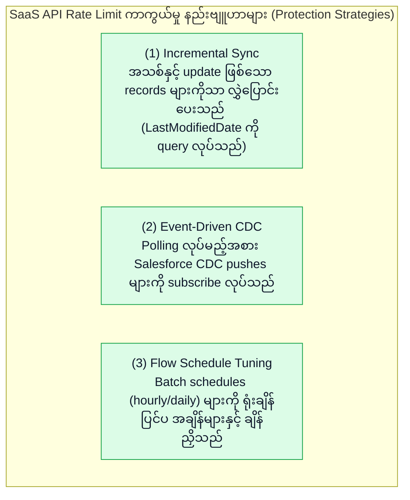

# 🔍 Amazon AppFlow Comparison, API Quota Management & Production Troubleshooting (မြန်မာဘာသာ)

- **Category**: Application Integration / Service Comparison, API Governance & Production Triage
- **Language / ဘာသာစကား**: [English (Original)](/en/02-services/integration/appflow/appflow-comparison-and-troubleshooting) | **မြန်မာဘာသာ (Burmese)**
- **Primary Use Case**: AppFlow ကို AWS Glue, Lambda, EventBridge တို့နှင့် နှိုင်းယှဉ်ခြင်း၊ SaaS API quotas များကို စီမံခန့်ခွဲခြင်းနှင့် အဖြစ်များသော production authentication, staging နှင့် network errors များကို ဖြေရှင်းခြင်း။
- **Slide Reference**: `[AWSCertifiedDataEngineerSlides.pdf](/docs/AWSCertifiedDataEngineerSlides.pdf)` ရှိ စာမျက်နှာ 530–537
- **Hub Links**: `[[mm/index|index]]` | `[[mm/02-services/integration/appflow/appflow|appflow]]` | `[[mm/02-services/analytics-streaming/glue/glue|glue]]` | `[[mm/02-services/networking-monitoring/cloudwatch-and-eventbridge|cloudwatch-and-eventbridge]]` | `[[mm/01-domains/domain-3-data-operations-and-support|domain-3-data-operations-and-support]]`

---

## 1. High-Level Summary

SaaS data integration အတွက် သင့်လျော်မှန်ကန်သော tool ကို ရွေးချယ်ခြင်းသည် data engineering ၏ အဓိက တာဝန်တစ်ခု ဖြစ်ပါသည်။ AWS Lambda ရှိ custom scripts များ သို့မဟုတ် ရှုပ်ထွေးသော AWS Glue jobs များဖြင့် SaaS data များကို ingest လုပ်နိုင်သော်လည်း၊ **Amazon AppFlow** သည် operational overhead ကို လျှော့ချပေးပြီး AWS security services များနှင့် natively ချိတ်ဆက်ပေးနိုင်သည့် zero-code, fully managed solution အဖြစ် အထူးထုတ်လုပ်ဖန်တီးထားခြင်း ဖြစ်ပါသည်။

**DEA-C01** စာမေးပွဲအတွက် AppFlow ကို AWS Glue သို့မဟုတ် EventBridge အစား မည်သည့်အချိန်တွင် ရွေးချယ်ရမည်၊ **SaaS API rate limiting** ဖြစ်ပေါ်ခြင်းကို မည်သို့ ကာကွယ်ရမည်၊ နှင့် **Redshift staging bucket permission issues** များကို မည်သို့ debug လုပ်ရမည်ကို မဖြစ်မနေ သိရှိထားရပါမည်။

---

## 2. Ingestion Service Comparison Matrix

| Evaluation Dimension | Amazon AppFlow | AWS Glue (Spark / Python) | Amazon EventBridge | Custom AWS Lambda |
| :--- | :--- | :--- | :--- | :--- |
| **Primary Design** | **Zero-Code SaaS Ingestion** နှင့် bidirectional sync။ | Heavy ETL, data lake transformations နှင့် Spark jobs များ။ | Serverless Event Bus နှင့် SaaS Event Routing။ | Custom microservice code နှင့် lightweight execution။ |
| **SaaS Connectors** | **Native Pre-Built Connectors** များ (Salesforce, SAP, ServiceNow, Zendesk)။ | Generic JDBC / Custom connectors များ (Glue Marketplace)။ | **Native SaaS Partner Event Sources** (webhook push)။ | Python/Node.js ဖြင့် ရေးသားထားသော Custom REST API calls များ။ |
| **Code Required** | **လုံးဝမလိုပါ (None)** (UI / CloudFormation / Terraform)။ | များပြားသည် (High) (PySpark / Scala / Python scripts)။ | မလိုပါ (None) (JSON Event Pattern Rules)။ | များပြားသည် (High) (Custom code, auth handling, error retries)။ |
| **Max Data Volume** | **flow run တစ်ခုလျှင် 100 GB အထိ (Up to 100 GB per flow run)**။ | Terabytes မှ Petabytes အထိ (distributed Spark clusters)။ | Payload တစ်ခုလျှင် **256 KB** အထိ။ | Payload 6 MB အထိ (Synchronous) / 256 KB (SQS)။ |
| **Transformations** | Field mapping, PII masking, filtering, Parquet conversion။ | **စိတ်ကြိုက် ရှုပ်ထွေးသော transformations များ (Arbitrary complex transformations)**, joins, aggregations, ML။ | Content filtering, input payload reshaping။ | Custom code transformations များ။ |
| **Private Networking** | **AWS PrivateLink** (Salesforce, SAP, Snowflake)။ | Private VPC subnets အတွင်းရှိ Glue Connections များ။ | VPC Endpoints (PrivateLink)။ | VPC အတွင်းရှိ Lambda။ |
| **Pricing Model** | flow run တစ်ခုလျှင် \$0.001 + processed data တစ် GB လျှင် \$0.02။ | DPU-Hour လျှင် \$0.44 (တစ်စက္ကန့်ချင်းစီ တွက်ချက်သည်)။ | ingested events တစ်သန်းလျှင် \$1.00။ | Compute duration (GB-seconds) + invocation count။ |

---

## 3. Managing Third-Party SaaS API Rate Limits

SaaS application များသည် တင်းကျပ်သော API rate limiting များကို သတ်မှတ်ထားလေ့ရှိပါသည် (ဥပမာ- Salesforce daily REST API request limits):

---

## 4. Master Troubleshooting Cheat Sheet

| Symptom / Production Failure | Root Cause | Resolution / Fix |
| :--- | :--- | :--- |
| **Flow သည် `InvalidCredentials` သို့မဟုတ် `TokenRevoked` ဖြင့် ကျရှုံးခြင်း** | OAuth refresh token သက်တမ်းကုန်ဆုံးသွားခြင်း သို့မဟုတ် SaaS platform တွင် admin က connected app permissions ကို ပယ်ဖျက်လိုက်ခြင်း။ | AWS Secrets Manager တွင် OAuth token အသစ်တစ်ခု generate ပြုလုပ်ရန် Amazon AppFlow console တွင် connection ကို ပြန်လည် re-authorize လုပ်ပါ။ |
| **Salesforce flow သည် `REQUEST_LIMIT_EXCEEDED` ဖြင့် ကျရှုံးခြင်း** | Polling frequency အလွန်များနေခြင်း သို့မဟုတ် ကြီးမားသော objects များပေါ်တွင် Full Transfer လုပ်ဆောင်နေခြင်း။ | Transfer mode ကို **Scheduled Incremental Transfer** သို့ ပြောင်းပါ သို့မဟုတ် **Event-Driven Flow** တစ်ခု configure လုပ်ပါ။ |
| **Flow run နေစဉ် S3 bucket မှ `Access Denied` ပြန်ပေးခြင်း** | S3 bucket policy တွင် `appflow.amazonaws.com` အတွက် permissions မရှိခြင်း။ | `appflow.amazonaws.com` သို့ `s3:PutObject` နှင့် `s3:GetBucketAcl` ခွင့်ပြုပေးသော S3 bucket policy statement တစ်ခု ထည့်သွင်းပါ။ |
| **`COPY` command run နေစဉ် Redshift flow ကျရှုံးခြင်း** | Target Redshift cluster တွင် S3 staging bucket ကို ဖတ်ရှုရန် IAM role permissions မရှိခြင်း။ | Staging bucket ပေါ်တွင် `s3:GetObject` ပါဝင်သော IAM role တစ်ခုကို Redshift သို့ attach လုပ်ပါ သို့မဟုတ် Redshift security group inbound rules များကို ပြင်ဆင်ပါ။ |
| **Athena queries များက AppFlow မှ ရေးသားထားသော partitions အသစ်များကို ရှာမတွေ့ခြင်း** | Flow ပေါ်တွင် AWS Glue Data Catalog integration ကို enable မလုပ်ထားခြင်း။ | AppFlow flow settings တွင် **Register table with AWS Glue Data Catalog** ကို ရွေးချယ်ပြီး Glue database တစ်ခုကို ရွေးပေးပါ။ |
| **Salesforce သို့ PrivateLink connection timeout ဖြစ်ခြင်း** | Salesforce Private Connect status သည် `Pending` ဖြစ်နေခြင်း သို့မဟုတ် DNS resolution မအောင်မြင်ခြင်း။ | Private Connect endpoint ကို AWS VPC နှင့် Salesforce Setup နှစ်ခုစလုံးတွင် provision လုပ်ထားပြီး approve ဖြစ်မဖြစ် စစ်ဆေးပါ။ |

---

## 5. DEA-C01 Exam Essentials

> [!IMPORTANT]
> **AppFlow နှိုင်းယှဉ်မှုနှင့် ပြဿနာဖြေရှင်းခြင်းဆိုင်ရာ အဓိက စာမေးပွဲ Decision Triggers များ (Key Exam Decision Triggers for AppFlow Comparison & Triage)**:
>
> - **"ကုမ္ပဏီတစ်ခုသည် အနည်းဆုံး development effort ဖြင့် custom connector code မလိုဘဲ Salesforce data များကို S3 data lake ထဲသို့ ingest လုပ်ရန် လိုအပ်သည်"** $\rightarrow$ AWS Glue သို့မဟုတ် AWS Lambda အစား **Amazon AppFlow** ကို ရွေးချယ်ပါ။
> - **"နာရီအလိုက် data lake synchronization ပြုလုပ်နေစဉ် daily Salesforce API limits ပြည့်သွားခြင်းကို ကာကွယ်ရန်"** $\rightarrow$ AppFlow ကို **Scheduled Incremental Transfer mode** ဖြင့် configure လုပ်ပါ။
> - **"AppFlow ရှိ Redshift data loading errors များကို ဖြေရှင်းရန်"** $\rightarrow$ **Amazon S3 intermediate staging bucket** ကို စစ်ဆေးပြီး **Redshift IAM Role S3 read permissions** များကို စစ်ဆေးပါ။
> - **"Ingestion ပြီးနောက် SaaS data ပေါ်တွင် ကြီးမားသော multi-table distributed joins များနှင့် machine learning transformations များ လိုအပ်သည်"** $\rightarrow$ **Amazon AppFlow** ဖြင့် S3 ထဲသို့ ingest လုပ်ပြီးနောက် **AWS Glue (Spark)** ဖြင့် ဆက်လက် process လုပ်ပါ။

---

## 📌 Related Notes
- `[[mm/02-services/integration/appflow/appflow|appflow]]` — Amazon AppFlow Master Hub
- `[[mm/02-services/analytics-streaming/glue/glue|glue]]` — AWS Glue ETL & Spark Processing
- `[[mm/02-services/networking-monitoring/cloudwatch-and-eventbridge|cloudwatch-and-eventbridge]]` — Amazon EventBridge Routing
- `[[mm/01-domains/domain-3-data-operations-and-support|domain-3-data-operations-and-support]]` — Troubleshooting & Operations
