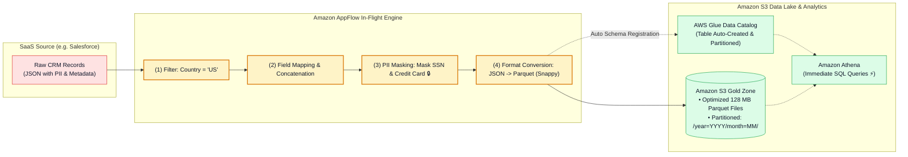
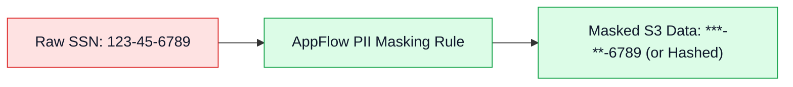

# 🛠️ Amazon AppFlow Data Transformations, PII Masking, Parquet & Glue Catalog

- **Category**: Application Integration / In-Flight Data Preparation, PII Governance & Cataloging
- **Language / ဘာသာစကား**: [English (Original)](/en/02-services/integration/appflow/appflow-data-transformation-masking-and-catalog) | **မြန်မာဘာသာ (Burmese)**
- **Primary Use Case**: In-flight field mapping များကို အသုံးပြုခြင်း၊ persistence မပြုလုပ်မီ sensitive PII များကို mask ပြုလုပ်ခြင်း၊ SaaS records များကို Snappy compression ဖြင့် Apache Parquet သို့ ပြောင်းလဲခြင်း (convert) နှင့် AWS Glue Data Catalog တွင် tables များကို auto-register ပြုလုပ်ခြင်း။
- **Slide Reference**: `[AWSCertifiedDataEngineerSlides.pdf](/docs/AWSCertifiedDataEngineerSlides.pdf)` ရှိ Pages 530–537
- **Hub Links**: `[[mm/index]]` | `[[appflow]]` | `[[appflow-triggers-and-transfer-modes]]` | `[[glue-data-catalog]]` | `[[athena]]`

---

## 1. High-Level Summary

Amazon AppFlow သည် ရိုးရှင်းသော data pipeline connector တစ်ခုထက်မကဘဲ စွမ်းဆောင်ရည်မြင့်မားသည့် **in-flight data transformation engine** တစ်ခု ပါဝင်သည်။

Raw SaaS JSON များကို S3 ထဲသို့ တိုက်ရိုက်သိမ်းဆည်းပြီး ဒေတာများကို clean လုပ်ရန်နှင့် mask လုပ်ရန်အတွက် ကုန်ကျစရိတ်များသော Glue Spark jobs များကို ရေးသားရမည့်အစား၊ AppFlow သည် data engineer များအတွက် ingestion phase အတွင်း တိုက်ရိုက် **records များကို filter ပြုလုပ်ခြင်း**၊ **sensitive PII များကို mask ပြုလုပ်ခြင်း**၊ **ဒေတာများကို columnar Apache Parquet သို့ convert လုပ်ခြင်း** နှင့် **AWS Glue Data Catalog တွင် table schemas များကို register ပြုလုပ်ခြင်း** တို့ကို ဆောင်ရွက်ပေးနိုင်သည်။

---

## 2. In-Flight Data Transformation & Mapping

Amazon AppFlow သည် built-in transformation tasks အများအပြားကို ထောက်ပံ့ပေးထားသည် -

1. **Source-to-Destination Field Mapping**:
   - **Direct 1-to-1 Mapping**: SaaS attributes များကို target columns များသို့ တိုက်ရိုက် map လုပ်ပေးခြင်း (ဥပမာ - Salesforce `BillingCity` $\rightarrow$ S3 column `city`)။
   - **Field Concatenation / Formula Calculations**: Source fields အများအပြားကို single destination field တစ်ခုအဖြစ် ပေါင်းစပ်ပေးခြင်း (ဥပမာ - `FirstName` + `" "` + `LastName` $\rightarrow$ `customer_full_name`)။
2. **Source Record Filtering**:
   - မလိုလားအပ်သော records များကို network ပေါ်မှ မပို့လွှတ်မီ source တွင်ပင် ကြိုတင် filter လုပ်ထုတ်ပေးခြင်း (ဥပမာ - `StageName = 'Closed Won'` နှင့် `Amount >= 50000`) ဖြစ်ပြီး၊ storage နှင့် bandwidth ကုန်ကျစရိတ်များကို လျှော့ချပေးသည်။
3. **Data Validation & Error Handling**:
   - Fields များကို သတ်မှတ်ထားသော စည်းမျဉ်းများနှင့်အညီ validate ပြုလုပ်ခြင်း (ဥပမာ - `ZipCode` သည် numeric format ဟုတ်မဟုတ် စစ်ဆေးခြင်း)။ အကယ်၍ record တစ်ခုသည် validation မအောင်မြင်ပါက၊ AppFlow သည် **flow ကို ရပ်တန့်ခြင်း (terminate)** သို့မဟုတ် **မမှန်ကန်သော record ကို လျစ်လျူရှု/ဖယ်ထုတ်ခြင်း (ignore/drop)** ဖြင့် ဆက်လက် process လုပ်ဆောင်နိုင်သည်။

---

## 3. PII Masking & Data Privacy Compliance

ကမ္ဘာလုံးဆိုင်ရာ စည်းမျဉ်းစည်းကမ်းများဆိုင်ရာ မူဘောင်များ (**GDPR, HIPAA, PCI-DSS, CCPA**) ကို လိုက်နာရန်အတွက် ထိလွယ်ရှလွယ်သော Personally Identifiable Information (PII) များကို analytics data lakes များထဲတွင် encrypt မလုပ်ထားသော၊ ဖတ်ရှုရလွယ်ကူသည့် format များဖြင့် မသိမ်းဆည်းရပါ။

- **Masking Capabilities**:
  - Field values တစ်ခုလုံးကို asterisks များဖြင့် mask လုပ်ခြင်း (`***`)။
  - ပထမ $N$ လုံး သို့မဟုတ် နောက်ဆုံး $N$ လုံးကို partially mask လုပ်ခြင်း (ဥပမာ - credit card ၏ နောက်ဆုံးဂဏန်း ၄ လုံးကိုသာ ပြသခြင်း)။
  - Amazon S3 သို့မဟုတ် Amazon Redshift ထဲသို့ မရေးသားမီ sensitive identifiers များကို truncate သို့မဟုတ် hash ပြုလုပ်ခြင်း။

---

## 4. File Formatting & S3 Partitioning

Amazon S3 ထဲသို့ ရေးသားသည့်အခါ AppFlow သည် file layout optimization ကို စီမံဆောင်ရွက်ပေးသည် -

| Optimization Feature | AppFlow မှ မည်သို့ အကောင်အထည်ဖော်သနည်း | Athena & Spark အတွက် အကျိုးကျေးဇူး |
| :--- | :--- | :--- |
| **Columnar Format Conversion** | Row-based SaaS JSON ကို **Apache Parquet** သို့ convert လုပ်ပေးသည်။ | Athena scan query ကုန်ကျစရိတ်များကို ($5/TB) 90% အထိ လျှော့ချပေးသည်။ |
| **Data Compression** | Parquet/CSV files များသို့ **Snappy သို့မဟုတ် GZIP** compression ကို အသုံးပြုသည်။ | S3 storage footprint ကို လျှော့ချပေးပြီး I/O စွမ်းဆောင်ရည်ကို မြန်ဆန်စေသည်။ |
| **Small File Aggregation** | သေးငယ်သော individual event records များကို ပိုမိုကြီးမားသော files များ (ဥပမာ - 128 MB blocks) အဖြစ် စုစည်း (aggregate) ပေးသည်။ | Spark နှင့် Athena တို့တွင် **Small File Problem ကို ကာကွယ်ပေးသည်**။ |
| **Dynamic S3 Partitioning** | Time-based S3 prefixes များကို အလိုအလျောက် ဖန်တီးပေးသည် (`/year=YYYY/month=MM/day=DD/`)။ | Analytical SQL queries များ run သည့်အခါ ထိရောက်သော partition pruning ကို လုပ်ဆောင်နိုင်စေသည်။ |

---

## 5. Automatic AWS Glue Data Catalog Registration

ရိုးရိုး traditional architectures များတွင် files များ S3 ထဲသို့ ရောက်ရှိပြီးနောက် data engineer များသည် table schemas များကို register လုပ်ရန်အတွက် **AWS Glue Crawler** သို့မဟုတ် manual `MSCK REPAIR TABLE` commands များကို run ရလေ့ရှိသည်။

### AppFlow ၏ Built-In Catalog Integration:
- AppFlow ကို **AWS Glue Data Catalog တွင် tables များကို အလိုအလျောက် ဖန်တီးရန်နှင့် update လုပ်ရန် (automatically create and update)** configure ပြုလုပ်နိုင်သည်။
- S3 partitions များထဲသို့ Parquet files အသစ်များ ရေးသားသည်နှင့်တစ်ပြိုင်နက် AppFlow သည် schema နှင့် partitions များကို ချက်ချင်း register လုပ်ပေးသည်။
- **ရလဒ် (Result)**: Data analyst များသည် အသစ်ရောက်ရှိလာသော Salesforce သို့မဟုတ် ServiceNow ဒေတာများကို **Amazon Athena** တွင် crawler delay လုံးဝမရှိဘဲ ချက်ချင်း query ပြုလုပ်နိုင်သည်။

---

## 6. DEA-C01 Exam Essentials

> [!IMPORTANT]
> **Transformations & Cataloging အတွက် အဓိက Exam Decision Triggers များ**:
>
> - **"Transfer data from Salesforce into an Amazon S3 data lake in Apache Parquet format while masking credit card numbers, without writing custom code"** $\rightarrow$ **Amazon AppFlow flow ကို PII Masking နှင့် Apache Parquet output format** ဖြင့် configure လုပ်ပါ။
> - **"Make Salesforce data in Amazon S3 immediately queryable via Amazon Athena without running an AWS Glue Crawler"** $\rightarrow$ **Amazon AppFlow flow settings အတွင်း AWS Glue Data Catalog integration ကို တိုက်ရိုက် enable ပြုလုပ်ပါ**။
> - **"Avoid creating thousands of tiny 1 KB files in S3 when ingesting streaming SaaS events"** $\rightarrow$ Records များကို သင့်လျော်သော file sizes များ (ဥပမာ - 128 MB) အဖြစ် စုစည်းပေးရန် **AppFlow တွင် File Aggregation ကို enable ပြုလုပ်ပါ**။

---

## 📌 ဆက်စပ် မှတ်စုများ (Related Notes)
- `[[appflow]]` — Amazon AppFlow Master Hub
- `[[appflow-triggers-and-transfer-modes]]` — Flow Triggers & Synchronization
- `[[glue-data-catalog]]` — AWS Glue Data Catalog Deep-Dive
- `[[athena]]` — Serverless SQL Analytics with Amazon Athena
