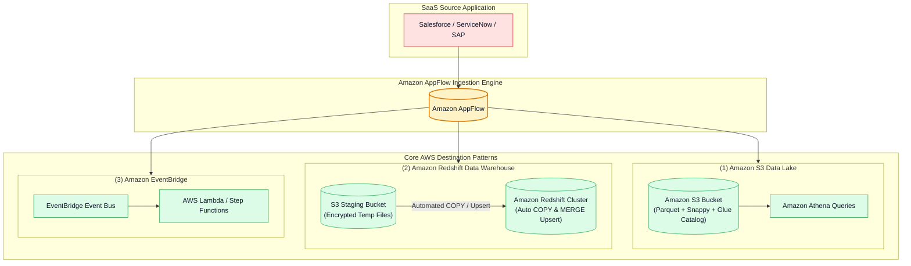
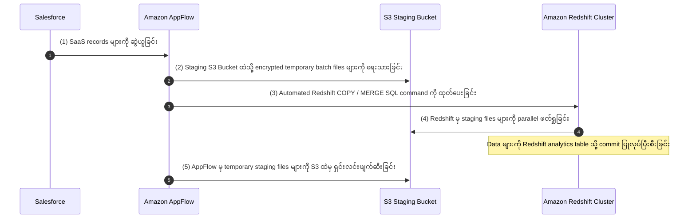

# 🎯 Amazon AppFlow Destination Patterns (Amazon S3, Redshift & EventBridge) (မြန်မာဘာသာ)

- **Category**: Application Integration / Destination Architectures, Redshift Upsert & Event Routing
- **Language / ဘာသာစကား**: [English (Original)](/en/02-services/integration/appflow/appflow-destination-patterns-s3-redshift-eventbridge) | **မြန်မာဘာသာ (Burmese)**
- **Primary Use Case**: Amazon S3 Data Lakes, Amazon Redshift Data Warehouses (staging buckets များနှင့် automated MERGE upserts များပါဝင်သော) နှင့် Amazon EventBridge event buses များအပါအဝင် AppFlow destinations များကို architect ပြုလုပ်ခြင်း။
- **Slide Reference**: Pages 530–537 in `[[AWSCertifiedDataEngineerSlides.pdf]]`
- **Hub Links**: `[[mm/index]]` | `[[appflow]]` | `[[s3]]` | `[[redshift]]` | `[[cloudwatch-and-eventbridge]]`

---

## 1. High-Level Summary (အကျဉ်းချုပ် ခြုံငုံသုံးသပ်ချက်)

Amazon AppFlow သည် အဓိက AWS destination သုံးခုဖြစ်သော **Amazon S3** (data lakes များအတွက်)၊ **Amazon Redshift** (data warehousing နှင့် automated upserts များအတွက်)၊ နှင့် **Amazon EventBridge** (serverless event-driven architectures များအတွက်) တို့ထံသို့ တိုက်ရိုက် fully managed ပေးပို့ခြင်း (direct, managed delivery) ကို ထောက်ပံ့ပေးပါသည်။

AppFlow သည် destination တစ်ခုစီသို့ data load လုပ်ဆောင်သည့် technical mechanics များ—အထူးသဖြင့် **Redshift S3 staging architecture** နှင့် **MERGE write operations** များကို နားလည်ထားခြင်းသည် **DEA-C01** စာမေးပွဲတွင် အဓိကစစ်ဆေးမေးမြန်းသော အချက်ဖြစ်ပါသည်။

---

## 2. Destination Pattern 1: Amazon S3 (Data Lake Ingestion)

SaaS records များကို Amazon S3 data lake ထဲသို့ ရေးသားခြင်းသည် အသုံးအများဆုံး AppFlow pattern ဖြစ်ပါသည်။

### Key Configuration Options (အဓိက Configuration ရွေးချယ်စရာများ):
1. **Target S3 Bucket & Prefix**: စိတ်ကြိုက် folder hierarchies များကို သတ်မှတ်နိုင်ခြင်း (ဥပမာ `s3://my-lakehouse/salesforce/accounts/`)။
2. **File Formatting**: Data များကို **Apache Parquet**, CSV, သို့မဟုတ် JSON အဖြစ် ရေးသားနိုင်ခြင်း။
3. **Partitioning**: Dynamic timestamp prefixes များကို configure ပြုလုပ်နိုင်ခြင်း (`/year=YYYY/month=MM/day=DD/`)။
4. **AWS Glue Catalog Integration**: **Amazon Athena** တွင် ချက်ချင်း query ပြုလုပ်နိုင်ရန် table partitions များကို automatically register လုပ်ပေးပြီး update ပြုလုပ်ပေးခြင်း။

---

## 3. Destination Pattern 2: Amazon Redshift (Data Warehouse Loading)

SaaS applications များမှ data များကို Amazon Redshift table ထဲသို့ တိုက်ရိုက် load ပြုလုပ်ခြင်းတွင် automated multi-step staging architecture ပါဝင်သည်:

---

### Redshift Write Operations (Redshift ရေးသားမှု လုပ်ဆောင်ချက်များ):
| Write Mode | How It Works (အလုပ်လုပ်ပုံ) | Ideal Use Case (အသင့်တော်ဆုံး အသုံးပြုမှု) |
| :--- | :--- | :--- |
| **Insert (Append)** | ဝင်ရောက်လာသော records အားလုံးကို Redshift table ထဲသို့ rows အသစ်များအဖြစ် ထည့်သွင်းပေးခြင်း (append)။ | ပြောင်းလဲမှုမရှိသော (Immutable) event logs များ၊ audit trails များနှင့် clickstreams များ။ |
| **Upsert (MERGE / Update)** | သတ်မှတ်ထားသော **Primary Key** ကို အသုံးပြု၍ ဝင်ရောက်လာသော records များကို ရှိပြီးသား rows များနှင့် နှိုင်းယှဉ်ခြင်း။ ကိုက်ညီမှုတွေ့ရှိပါက row ကို **update** လုပ်ပြီး၊ မတွေ့ရှိပါက row အသစ်အဖြစ် **insert** လုပ်ခြင်း။ | မိတ္တူပွားများ (duplicates) မဖြစ်ပေါ်စေဘဲ CRM Account နှင့် Customer records များကို တစ်ပြေးညီ synchronize ဖြစ်စေခြင်း။ |
| **Truncate & Insert** | Destination table တစ်ခုလုံးကို ရှင်းလင်း (clear) ပြီး dataset အသစ်ကို အစားထိုးထည့်သွင်းခြင်း။ | ညစဉ်ပြုလုပ်သော full dimension table refresh များ။ |

> [!IMPORTANT]
> **Prerequisites for Redshift Ingestion (Redshift Ingestion အတွက် ကြိုတင်လိုအပ်ချက်များ)**:
> 1. **Intermediate S3 Staging Bucket**: Temporary files များကို ယာယီသိမ်းဆည်းရန် AppFlow သည် တူညီသော AWS Region အတွင်းရှိ S3 bucket တစ်ခု လိုအပ်ပါသည်။
> 2. **Redshift IAM Role**: Amazon Redshift တွင် S3 staging bucket ထံမှ ဖတ်ရှုခွင့် permissions (`s3:GetObject`, `s3:ListBucket`) ပါရှိသော IAM role တစ်ခု ချိတ်ဆက်ထားရမည်။
> 3. **Database Credentials**: **AWS Secrets Manager** တွင် သိမ်းဆည်းထားသော Redshift master username/password ဖြစ်ရမည်။

---

## 4. Destination Pattern 3: Amazon EventBridge (Event-Driven Routing)

SaaS applications များမှ real-time operational events များ ထွက်ပေါ်လာသောအခါ (ဥပမာ ServiceNow တွင် high-priority incident တစ်ခု log လုပ်ခြင်း သို့မဟုတ် Salesforce တွင် enterprise lead တစ်ခု ဖန်တီးခြင်းကဲ့သို့):

- AppFlow သည် event ကို **Amazon EventBridge custom event bus** ထံသို့ တိုက်ရိုက် route လုပ်ပေးပါသည်။
- **EventBridge Rules** များသည် event pattern ကို စစ်ဆေးအကဲဖြတ်ပြီး downstream actions များကို trigger လုပ်ပေးပါသည်:
  - Multi-step approval workflows များအတွက် **AWS Step Functions state machine** ကို invoke ပြုလုပ်ခြင်း။
  - ချက်ချင်း alerting သို့မဟုတ် webhook notifications များအတွက် **AWS Lambda function** ကို trigger ပြုလုပ်ခြင်း။
  - Decoupled asynchronous processing ပြုလုပ်နိုင်ရန် event ကို **Amazon SQS queue** သို့ ပေးပို့ခြင်း။

---

## 5. DEA-C01 Exam Essentials (စာမေးပွဲအတွက် မဖြစ်မနေသိရမည့် အချက်များ)

> [!IMPORTANT]
> **Key Exam Decision Triggers for AppFlow Destinations (AppFlow Destinations ဆိုင်ရာ အဓိက စာမေးပွဲ Decision Triggers များ)**:
>
> - **"Synchronize customer records from Salesforce into Amazon Redshift, updating existing customers and inserting new ones without writing custom MERGE scripts"** $\rightarrow$ Primary key ဖြင့် **Upsert write operation ကို အသုံးပြု၍ Amazon Redshift ထံသို့ Amazon AppFlow flow တစ်ခုကို configure လုပ်ပါ**။
> - **"What auxiliary AWS resource is required when configuring Amazon AppFlow with Amazon Redshift as the destination?"** $\rightarrow$ **Amazon S3 intermediate staging bucket** တစ်ခု လိုအပ်ပါသည်။
> - **"Trigger a serverless Step Functions workflow whenever a Salesforce Opportunity stage changes to 'Closed Won'"** $\rightarrow$ Amazon EventBridge သို့ events များ ပေးပို့သော **Event-Driven trigger ဖြင့် Amazon AppFlow ကို အသုံးပြုပါ**။

---

## 📌 Related Notes (ဆက်စပ် မှတ်စုများ)
- `[[appflow]]` — Amazon AppFlow Master Hub
- `[[appflow-data-transformation-masking-and-catalog]]` — Transformations & Glue Catalog
- `[[redshift]]` — Amazon Redshift Data Warehouse Deep-Dive
- `[[cloudwatch-and-eventbridge]]` — Amazon EventBridge Routing
