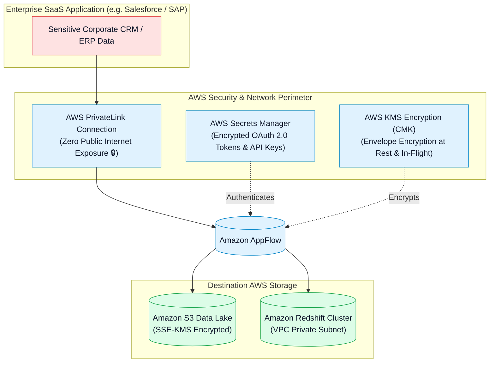

# 🛡️ Amazon AppFlow Security, AWS PrivateLink, KMS Encryption & IAM Governance (မြန်မာဘာသာ)

- **Category**: Application Integration / Enterprise SaaS Security, Private Networking & Key Management
- **Language / ဘာသာစကား**: [English (Original)](/en/02-services/integration/appflow/appflow-security-privatelink-and-kms) | **မြန်မာဘာသာ (Burmese)**
- **Primary Use Case**: AWS PrivateLink မှတစ်ဆင့် SaaS application များနှင့် AWS အကြား private connection များ တည်ဆောက်ရန်၊ AWS KMS CMKs ဖြင့် in-flight နှင့် at-rest data များကို encrypt ပြုလုပ်ရန်နှင့် OAuth credentials များကို စီမံခန့်ခွဲရန်။
- **Slide Reference**: `[AWSCertifiedDataEngineerSlides.pdf](/docs/AWSCertifiedDataEngineerSlides.pdf)` မှ Pages 530–537
- **Hub Links**: `[[mm/index|index]]` | `[[mm/02-services/integration/appflow/appflow|appflow]]` | `[[mm/02-services/security-governance/kms-and-secrets|kms-and-secrets]]` | `[[mm/02-services/security-governance/iam|iam]]` | `[[mm/02-services/networking-monitoring/vpc-and-networking|vpc-and-networking]]`

---

## 1. High-Level Summary

Enterprise SaaS data integration ပြုလုပ်ရာတွင် တင်းကျပ်သော security control များ လိုအပ်ပါသည်။ Amazon AppFlow သည် **AWS PrivateLink** (အရေးကြီး sensitive data များ public internet ပေါ် ဖြတ်သန်းသွားလာခြင်းမှ ကာကွယ်ပေးခြင်း)၊ **AWS KMS Customer Managed Key encryption** နှင့် AWS Secrets Manager မှတစ်ဆင့် **automated OAuth token management** ပြုလုပ်ခြင်းတို့မှတစ်ဆင့် enterprise-grade governance ကို ထောက်ပံ့ပေးပါသည်။

**DEA-C01** စာမေးပွဲအတွက် **Salesforce နှင့် SAP အတွက် PrivateLink architecture**၊ AppFlow အတွက် လိုအပ်သော **S3 Bucket Policy များ** နှင့် **KMS key permission များ** ကို သေချာစွာ ကျွမ်းကျင်နားလည်ထားရပါမည်။



---

## 2. AWS PrivateLink for SaaS Applications

မူလအားဖြင့် (By default) SaaS integration များသည် HTTPS/TLS ကို အသုံးပြု၍ public internet ပေါ်မှ ဆက်သွယ်ဆောင်ရွက်ကြပါသည်။ စည်းမျဉ်းစည်းကမ်း တင်းကျပ်သော လုပ်ငန်းကဏ္ဍများ (healthcare၊ finance၊ government) အတွက် အရေးကြီး sensitive record များကို public internet ပေါ်မှ ပေးပို့ခြင်းသည် compliance mandate များကို ချိုးဖောက်ရာ ရောက်ပါသည်။

### PrivateLink Architecture with AppFlow:
- Amazon AppFlow သည် **AWS PrivateLink** နှင့် **Salesforce Private Connect / SAP PrivateLink** တို့နှင့် တိုက်ရိုက် (natively) ချိတ်ဆက်အလုပ်လုပ်ပါသည်။
- SaaS vendor ၏ cloud infrastructure နှင့် သင်၏ AWS environment အကြားတွင် သီးသန့်ဖြစ်သော isolated network tunnel တစ်ခုကို တိုက်ရိုက် ချိတ်ဆက်တည်ဆောက် (provision) ပေးပါသည်။
- **Key Advantage (အဓိက အားသာချက်)**: Data များသည် private AWS global network backbone ပေါ်တွင်သာ လုံးဝ စီးဆင်းသွားလာသောကြောင့် internet-based security vector များ (ဥပမာ - DNS spoofing သို့မဟုတ် man-in-the-middle attack များ) ၏ အန္တရာယ်ထိတွေ့မှုကို လုံးဝ ဖယ်ရှားပေးပါသည်။

---

## 3. Data Encryption at Rest & In Transit

1. **Encryption in Transit**:
   - SaaS endpoint များ၊ AppFlow နှင့် AWS service များအကြား network communication အားလုံးကို **TLS 1.2 သို့မဟုတ် TLS 1.3** အသုံးပြု၍ encrypt ပြုလုပ်ထားပါသည်။
2. **Encryption at Rest**:
   - AppFlow သည် **AWS KMS** ကို အသုံးပြု၍ flow များကို process လုပ်နေစဉ်အတွင်း data များကို အလိုအလျောက် encrypt ပြုလုပ်ပေးပါသည်။
   - **KMS Customer Managed Keys (CMK)**: သင်၏ data key များအပေါ် အပြည့်အဝ cryptographic control ရရှိရန်နှင့် key rotation များကို enable ပြုလုပ်နိုင်ရန် custom KMS CMK တစ်ခုကို ရွေးချယ်အသုံးပြုနိုင်ပါသည်။

---

## 4. Destination S3 Bucket Policy Requirements

Amazon AppFlow အား Amazon S3 bucket အတွင်းသို့ file များ ရေးသားခွင့်ပြုရန်အတွက် S3 bucket policy တွင် **`appflow.amazonaws.com` service principal** သို့ permission များကို တိကျစွာ (explicitly) ခွင့်ပြုပေးရပါမည်:

```json
{
  "Version": "2012-10-17",
  "Statement": [
    {
      "Sid": "AllowAppFlowToWriteToS3",
      "Effect": "Allow",
      "Principal": {
        "Service": "appflow.amazonaws.com"
      },
      "Action": [
        "s3:PutObject",
        "s3:GetBucketAcl",
        "s3:PutObjectAcl"
      ],
      "Resource": [
        "arn:aws:s3:::my-production-saas-datalake",
        "arn:aws:s3:::my-production-saas-datalake/*"
      ],
      "Condition": {
        "StringEquals": {
          "aws:SourceAccount": "123456789012"
        }
      }
    }
  ]
}
```

---

## 5. Authentication & OAuth Token Governance

- **OAuth 2.0 Integrations**: Salesforce၊ Slack၊ Zendesk၊ Marketo နှင့် Google Analytics တို့အတွက် ထောက်ပံ့ပေးထားပါသည်။
- **Automated Token Management**: AppFlow တွင် SaaS connection တစ်ခုကို authorize ပြုလုပ်သည့်အခါ AWS သည် OAuth refresh token များကို **AWS Secrets Manager** အတွင်း၌ လုံခြုံစွာ သိမ်းဆည်းပေးပါသည် (KMS ဖြင့် encrypt လုပ်ထားသည်)။
- AppFlow သည် administrator များထံမှ manual re-authentication ပြုလုပ်ရန် မလိုဘဲ သက်တမ်းကုန်ဆုံးသွားသော access token များကို background တွင် အလိုအလျောက် refresh ပြုလုပ်ပေးပါသည်။

---

## 6. DEA-C01 Exam Essentials

> [!IMPORTANT]
> **Key Exam Decision Triggers for AppFlow Security**:
>
> - **"Transfer highly sensitive financial data between Salesforce and Amazon S3 without exposing traffic to the public internet"** $\rightarrow$ **AWS PrivateLink (Salesforce Private Connect) ဖြင့် တွဲဖက်ထားသော Amazon AppFlow** ကို အသုံးပြုပါ။
> - **"S3 bucket returns Access Denied when an AppFlow flow runs"** $\rightarrow$ `appflow.amazonaws.com` သို့ `s3:PutObject`၊ `s3:GetBucketAcl` နှင့် `s3:PutObjectAcl` permission များ ခွင့်ပြုပေးထားသည့် **S3 Bucket Policy** တစ်ခုကို attach ပြုလုပ်ပါ။
> - **"Customer requires full control and audit logging of encryption keys used by AppFlow"** $\rightarrow$ AppFlow ကို **AWS KMS Customer Managed Key (CMK)** ဖြင့် configure ပြုလုပ်ပါ။

---

## 📌 Related Notes
- `[[mm/02-services/integration/appflow/appflow|appflow]]` — Amazon AppFlow Master Hub
- `[[mm/02-services/security-governance/kms-and-secrets|kms-and-secrets]]` — AWS KMS Encryption & Secrets Manager
- `[[mm/02-services/security-governance/iam|iam]]` — IAM Policies & Service Principals
- `[[mm/02-services/networking-monitoring/vpc-and-networking|vpc-and-networking]]` — AWS PrivateLink & Interface Endpoints
