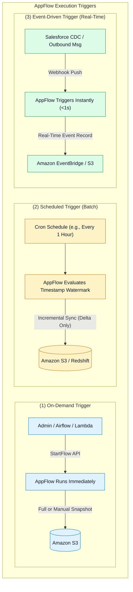
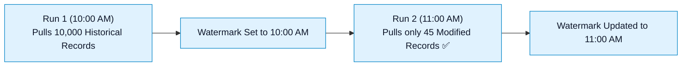

# ⏱️ Amazon AppFlow Triggers, Incremental Transfer & Event-Driven Execution

- **Category**: Application Integration / Flow Execution Triggers & Synchronization Modes
- **Language / ဘာသာစကား**: [English (Original)](/en/02-services/integration/appflow/appflow-triggers-and-transfer-modes) | **မြန်မာဘာသာ (Burmese)**
- **Primary Use Case**: Third-party API quota များကို ထိန်းသိမ်းရင်း SaaS ingestion pipeline များကို optimize ဖြစ်စေရန် On-Demand, Scheduled (Incremental Sync), နှင့် Event-Driven flow trigger များကို configure ပြုလုပ်ခြင်း။
- **Slide Reference**: Pages 530–537 in `[AWSCertifiedDataEngineerSlides.pdf](/docs/AWSCertifiedDataEngineerSlides.pdf)`
- **Hub Links**: `[[mm/index|index]]` | `[[mm/02-services/integration/appflow/appflow|appflow]]` | `[[mm/02-services/integration/appflow/appflow-data-transformation-masking-and-catalog|appflow-data-transformation-masking-and-catalog]]` | `[[mm/02-services/integration/appflow/appflow-destination-patterns-s3-redshift-eventbridge|appflow-destination-patterns-s3-redshift-eventbridge]]`

---

## 1. High-Level Summary

Amazon AppFlow သည် batch နှင့် real-time data engineering pattern နှစ်မျိုးလုံးအတွက် ကိုက်ညီအဆင်ပြေစေရန် ကွဲပြားသော execution trigger ၃ မျိုးကို ထောက်ပံ့ပေးထားပါသည်: **On-Demand**, **Scheduled**, နှင့် **Event-Driven**။

**DEA-C01** စာမေးပွဲအတွက် scheduled flow များတွင် **Incremental Transfer** မည်သို့ အလုပ်လုပ်သည် (delta change များကိုသာ transfer လုပ်ရန် timestamp watermark များကို ခြေရာခံမှတ်သားခြင်း) နှင့် မည်သည့် SaaS source များက **Event-Driven real-time streaming** ကို support လုပ်သည်ကို နားလည်ထားရပါမည်။

---

## 2. Deep Dive: The 3 Flow Trigger Types

### 1. On-Demand Trigger:
- AWS Management Console မှတစ်ဆင့် manual အနေဖြင့်သော်လည်းကောင်း၊ AWS CLI / Boto3 SDK (`appflow.start_flow(flowName='SalesforceToS3')`) မှတစ်ဆင့် programmatic နည်းလမ်းဖြင့်သော်လည်းကောင်း execute လုပ်ဆောင်သည်။
- *အသင့်တော်ဆုံး အသုံးပြုမှုများ (Best For)*: တစ်ကြိမ်တည်း လုပ်ဆောင်သော historical data backfill များ၊ ad-hoc pipeline testing များ သို့မဟုတ် **AWS Step Functions** သို့မဟုတ် **Apache Airflow (MWAA)** ကဲ့သို့သော external workflow tool များမှ orchestration ပြုလုပ်ခြင်းများအတွက် ဖြစ်သည်။

---

### 2. Scheduled Trigger (Batch Synchronization):
- သတ်မှတ်ထားသော အချိန်အပိုင်းအခြားများ (ဥပမာ - ၅ မိနစ်တစ်ကြိမ်၊ နာရီအလိုက်၊ နေ့စဉ် သို့မဟုတ် custom cron expression များ) အလိုက် အလိုအလျောက် run သည်။
- **Transfer Modes**:
  1. **Incremental Transfer (Recommended)**: AppFlow သည် source SaaS object ၏ `LastModifiedDate` သို့မဟုတ် timestamp watermark ကို ခြေရာခံမှတ်သားထားသည်။ Scheduled run တစ်ခုစီတွင် AppFlow သည် **ယခင် flow run ပြီးနောက်ပိုင်း အသစ်ဖန်တီးထားသော သို့မဟုတ် update လုပ်ထားသော record များကိုသာ transfer လုပ်ပေးပါသည်**။ ထို့ကြောင့် API quota သုံးစွဲမှုကို အလွန်အမင်း သက်သာစေပြီး downstream compute cost များကို လျှော့ချပေးပါသည်။
  2. **Full Transfer**: Execution run တိုင်းတွင် dataset တစ်ခုလုံးကို ဆွဲယူပြီး destination တွင် overwrite သို့မဟုတ် append ပြုလုပ်သည်။

---

### 3. Event-Driven Trigger (Real-Time Ingestion):
- AppFlow သည် SaaS provider နှင့် persistent listener သို့မဟုတ် webhook integration ကို ချိတ်ဆက်တည်ဆောက်ထားသည်။
- Business event တစ်ခု ဖြစ်ပေါ်လာသည်နှင့် (ဥပမာ - Salesforce တွင် opportunity အသစ်တစ်ခု ဖန်တီးခြင်း သို့မဟုတ် Zendesk တွင် support ticket တစ်ခု update ဖြစ်ခြင်း) SaaS provider သည် AppFlow ထံသို့ notify ပေးပို့ပြီး AppFlow က ၎င်း record ကို ချက်ချင်း process လုပ်ကာ AWS destination သို့ real-time ပေးပို့ပါသည်။
- *Supported Sources*: Salesforce (Change Data Capture / Platform Events မှတစ်ဆင့်), Zendesk, Slack, Marketo။

---

## 3. Flow Triggers & Transfer Modes Comparison

| Trigger Type | Execution Latency | Transfer Mode Options | API Quota Impact | Common Use Case |
| :--- | :--- | :--- | :--- | :--- |
| **On-Demand** | Invoke လုပ်သည်နှင့် ချက်ချင်း run သည်။ | Full သို့မဟုတ် Incremental (timestamp ပေးထားပါက)။ | Manual run လုပ်မှုအပေါ် မူတည်ထိန်းချုပ်သည်။ | Backfills, disaster recovery, test runs, MWAA DAG triggers များ။ |
| **Scheduled** | Interval-based (၁ မိနစ် မှ ရက် ၃၀ အထိ)။ | **Incremental Transfer** သို့မဟုတ် Full Transfer။ | နည်းပါးသည် (delta change များကိုသာ query လုပ်သည်)။ | Nightly ERP sync, hourly CRM data lake update များ။ |
| **Event-Driven** | Real-time (sub-second မှ seconds အတွင်း)။ | Single-event streaming။ | Event-based push ဖြစ်သည် (အမြဲတမ်း polling API call များ ခေါ်ယူရန်မလို)။ | Real-time fraud detection, instant customer onboarding alerts များ။ |

---

## 4. Managing SaaS API Rate Limits & Quotas

Enterprise SaaS application များ (ဥပမာ - Salesforce နှင့် ServiceNow) သည် organization တစ်ခုချင်းစီအလိုက် တင်းကျပ်သော နေ့စဉ် REST/SOAP API call limit များကို သတ်မှတ်ထားပါသည်:

> [!TIP]
> **Production Best Practice for API Optimization**:
> 1. မပြောင်းလဲသော record ရာထောင်ချီကို ဆွဲယူခြင်းမှ ကာကွယ်ရန် scheduled batch flow များအတွက် **Incremental Transfer ကို အမြဲရွေးချယ်ပါ**။
> 2. High-volume CRM environment များအတွက် အချိန်တို (၁ မိနစ်) polling interval များ ဆက်တိုက် run နေမည့်အစား push လုပ်ပေးသော event များကို လက်ခံရယူနိုင်ရန် **Salesforce Change Data Capture (CDC) ဖြင့် Event-Driven flow များကို configure ပြုလုပ်ပါ**။

---

## 5. DEA-C01 Exam Essentials

> [!IMPORTANT]
> **Key Exam Decision Triggers for AppFlow Triggers**:
>
> - **"Synchronize only new and modified records from Salesforce into Amazon S3 every hour without writing custom ETL scripts"** $\rightarrow$ **Scheduled Trigger နှင့် Incremental Transfer mode ပါဝင်သော Amazon AppFlow flow** တစ်ခုကို ဖန်တီးပါ။
> - **"Ingest Salesforce Opportunity records into Amazon Redshift in real time as soon as sales reps update their pipeline"** $\rightarrow$ **Event-Driven trigger ပါဝင်သော Amazon AppFlow flow** တစ်ခုကို configure လုပ်ပါ။
> - **"Trigger an AppFlow data transfer as part of a complex AWS Step Functions or Airflow data pipeline"** $\rightarrow$ Flow ကို **On-Demand trigger** ဖြင့် configure လုပ်ပြီး `StartFlow` API မှတစ်ဆင့် invoke လုပ်ပါ။

---

## 📌 Related Notes
- `[[mm/02-services/integration/appflow/appflow|appflow]]` — Amazon AppFlow Master Hub
- `[[mm/02-services/integration/appflow/appflow-data-transformation-masking-and-catalog|appflow-data-transformation-masking-and-catalog]]` — Field Transformations & PII Masking
- `[[mm/02-services/integration/appflow/appflow-destination-patterns-s3-redshift-eventbridge|appflow-destination-patterns-s3-redshift-eventbridge]]` — Destinations: S3, Redshift & EventBridge
- `[[mm/02-services/integration/mwaa-airflow|mwaa-airflow]]` — Orchestrating AppFlow from MWAA Airflow
