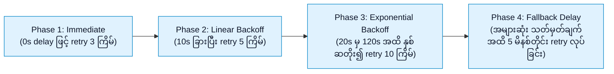
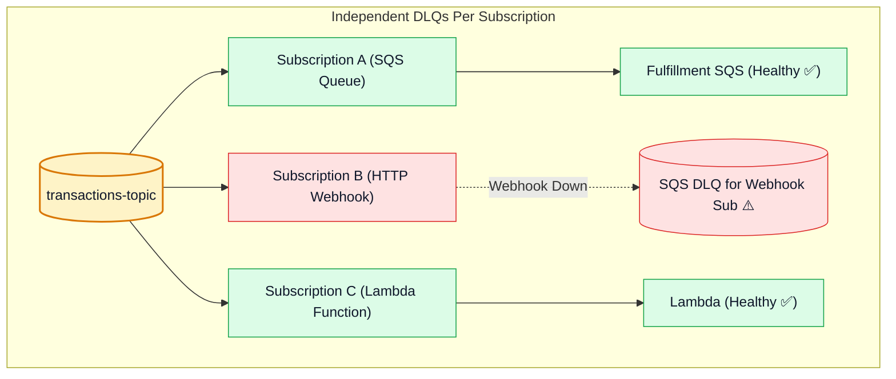

# 🔁 Amazon SNS Delivery Policies, Retry Mechanics & Subscription Dead-Letter Queues (DLQ)

- **Category**: Application Integration / Reliable Delivery, Retries & Subscription-Level DLQ
- **Language / ဘာသာစကား**: [English (Original)](/en/02-services/integration/sns/sns-delivery-retries-and-dead-letter-queues) | **မြန်မာဘာသာ (Burmese)**
- **Primary Use Case**: Downstream subscriber endpoint များ fail သည့်အခါ delivery retry policy များ configure လုပ်ခြင်း၊ SNS subscription များတွင် Amazon SQS Dead-Letter Queues (DLQs) ချိတ်ဆက်ခြင်း၊ နှင့် ပြန်လည်မရရှိနိုင်သော message drops ဖြစ်ပေါ်မှုကို ကာကွယ်ခြင်း။
- **Slide Reference**: `[AWSCertifiedDataEngineerSlides.pdf](/docs/AWSCertifiedDataEngineerSlides.pdf)` မှ Pages 499–525
- **Hub Links**: `[[mm/index|index]]` | `[[mm/02-services/integration/sns/sns|sns]]` | `[[mm/02-services/integration/sqs/sqs-dead-letter-queues-and-error-handling|sqs-dead-letter-queues-and-error-handling]]` | `[[mm/01-domains/domain-3-data-operations-and-support|domain-3-data-operations-and-support]]`

---

## 1. High-Level Summary

Amazon SNS သည် ရေရှည် message storage မပါရှိသော ephemeral **Push-based** service တစ်ခုဖြစ်သောကြောင့် downstream endpoint များ fail ဖြစ်သည့်အခါ (ဥပမာ- target HTTP server down ခြင်း၊ Lambda throttled ဖြစ်ခြင်း သို့မဟုတ် SQS queue permission revoked ဖြစ်ခြင်း) reliable delivery သေချာစေရန်မှာ အလွန်အရေးကြီးပါသည်။

Amazon SNS သည် အဓိက mechanisms (၂) ခုဖြင့် fault tolerance ကို အာမခံပေးပါသည်-
1. **Automated Delivery Retry Policies**: စနစ်တကျ ပြုလုပ်ထားသော multi-phase retries (immediate, linear, နှင့် exponential backoff)။
2. **Subscription-Level Dead-Letter Queues (DLQ)**: Delivery retry များအားလုံး ကုန်ဆုံးသွားပြီးနောက် message များကို သီးခြားခွဲထုတ်သိမ်းဆည်းရန် သတ်မှတ်ထားသော subscription ပေါ်တွင် configure လုပ်ထားသည့် Amazon SQS queue တစ်ခု။

```mermaid
graph TD
    subgraph SNS_Delivery_Flow["SNS Reliable Delivery & DLQ Architecture"]
        Topic[("Amazon SNS Topic<br/>alerts-topic")] --> Sub["Subscription to External Endpoint<br/>(HTTP Webhook / Partner API)"]

        Sub -->|Push Delivery Attempt| Target["Downstream Endpoint<br/>(HTTP 500 Server Error 💥)"]

        Target -.->|Delivery Fails| Retry["SNS 4-Phase Retry Policy<br/>• Immediate Retries<br/>• Linear Backoff<br/>• Exponential Backoff<br/>• Fallback Delay"]
        Retry -->|Re-attempts Push| Target

        Retry -.->|All Retries Exhausted| DLQ[("Amazon SQS DLQ (Attached to Subscription)<br/>failed-deliveries-dlq")]

        DLQ --> Alert["CloudWatch Alarm & Ops Investigation 🚨"]
    end

    classDef topic fill:#fef3c7,stroke:#d97706,stroke-width:2px,color:#0f172a;
    classDef sub fill:#e0f2fe,stroke:#0284c7,stroke-width:1px,color:#0f172a;
    classDef fail fill:#fee2e2,stroke:#dc2626,stroke-width:1px,color:#0f172a;
    classDef dlq fill:#dcfce7,stroke:#16a34a,stroke-width:2px,color:#0f172a;

    class Topic topic;
    class Sub sub;
    class Target,Retry fail;
    class DLQ,Alert dlq;
```



---

## 2. SNS Delivery Retry Policies (HTTP / HTTPS Endpoints)

HTTP/HTTPS endpoints များအတွက် Amazon SNS သည် စိတ်ကြိုက်ပြင်ဆင်နိုင်သော **4-Phase Delivery Policy** ကို လုပ်ဆောင်ပေးပါသည်-



1. **Immediate Retries**: ခေတ္တခဏဖြစ်ပေါ်သော network ပြဿနာများမှ ပြန်လည်သက်သာစေရန် ချက်ချင်း retry လုပ်ခြင်း။
2. **Linear Backoff**: Endpoint များကို restart လုပ်ရန် အချိန်ရစေရန် ပုံမှန်အချိန်အပိုင်းအခြားများဖြင့် retry လုပ်ခြင်း။
3. **Exponential Backoff**: ပြန်လည်ကောင်းမွန်လာသော server များပေါ်တွင် load မပိစေရန် ကြိုးပမ်းမှုများကို ဖြည်းဖြည်းချင်း အချိန်ခြား၍ retry လုပ်ခြင်း။
4. **Fallback Phase**: Delivery ကြိုးပမ်းမှုကို အပြီးသတ်မရပ်တန့်မီ ပုံမှန် retry လုပ်ခြင်း (configure လုပ်ထားပါက ၂၃ ရက်ကျော်အတွင်း စုစုပေါင်း အကြိမ် ၁၀၀ အထိ retry ပြုလုပ်နိုင်သည်)။

---

## 3. Subscription-Level Dead-Letter Queues (DLQ)

> [!IMPORTANT]
> **High-Yield Architectural Difference Between SQS and SNS**:
> - **Amazon SQS** တွင် DLQ ကို **Source Queue** (`RedrivePolicy`) ပေါ်တွင် ချိတ်ဆက်ထားပါသည်။
> - **Amazon SNS** တွင် DLQ ကို SNS Topic ပေါ်တွင် မဟုတ်ဘဲ **Individual Subscription** ပေါ်တွင် ချိတ်ဆက်ထားပါသည်! ၎င်းသည် မတူညီသော subscriber တစ်ခုချင်းစီအတွက် failure handling ကို သီးခြားစီ စီမံခန့်ခွဲနိုင်စေပါသည်။



---

## 4. Setting Up an SNS Subscription DLQ

SNS subscription တစ်ခုသို့ SQS Dead-Letter Queue ချိတ်ဆက်ရန်-

1. **SQS DLQ Queue ကို ဖန်တီးပါ** (တူညီသော AWS Region နှင့် Account အတွင်း)။
2. `sns.amazonaws.com` ကို messages ပေးပို့ခွင့်ပြုသည့် **SQS Queue Policy ကို configure လုပ်ပါ**:
   ```json
   {
     "Version": "2012-10-17",
     "Statement": [
       {
         "Effect": "Allow",
         "Principal": {
           "Service": "sns.amazonaws.com"
         },
         "Action": "sqs:SendMessage",
         "Resource": "arn:aws:sqs:us-east-1:123456789012:my-subscription-dlq",
         "Condition": {
           "ArnEquals": {
             "aws:SourceArn": "arn:aws:sns:us-east-1:123456789012:my-topic"
           }
         }
       }
     ]
   }
   ```
3. `deadLetterTargetArn` ကို SQS DLQ ARN သို့ ညွှန်ပြလျက် **SNS Subscription ပေါ်တွင် `RedrivePolicy` ကို သတ်မှတ်ပါ**။

---

## 5. DEA-C01 Exam Essentials

> [!IMPORTANT]
> **Key Exam Decision Triggers for Delivery & Error Handling**:
>
> - **"Where is a Dead-Letter Queue attached when an SNS HTTP/Lambda subscriber fails?"** $\rightarrow$ Dead-Letter Queue ကို SNS topic ပေါ်တွင် မဟုတ်ဘဲ **SNS Subscription** ပေါ်တွင် configure လုပ်ပါ။
> - **"What type of AWS resource serves as an SNS Dead-Letter Queue?"** $\rightarrow$ **Amazon SQS Queue** တစ်ခု (Standard Topic subscription အတွက် Standard SQS၊ FIFO Topic subscription အတွက် SQS FIFO) ဖြစ်သည်။
> - **"Required Permission for SNS DLQ"** $\rightarrow$ SQS queue ၏ access policy သည် **`sns.amazonaws.com` service principal** အား `sqs:SendMessage` လုပ်ဆောင်ခွင့် ပြုထားရပါမည်။
> - **"Capture unroutable or failed messages from third-party webhook push deliveries"** $\rightarrow$ HTTP/HTTPS SNS subscription တွင် **SQS DLQ** ကို ချိတ်ဆက်ပါ။

---

## 📌 Related Notes
- `[[mm/02-services/integration/sns/sns|sns]]` — SNS Master Hub
- `[[mm/02-services/integration/sqs/sqs-dead-letter-queues-and-error-handling|sqs-dead-letter-queues-and-error-handling]]` — SQS DLQs and Redrive
- `[[mm/02-services/integration/sns/sns-subscription-filter-policies|sns-subscription-filter-policies]]` — Subscription Filter Policies
- `[[mm/01-domains/domain-3-data-operations-and-support|domain-3-data-operations-and-support]]` — CloudWatch & Incident Recovery
