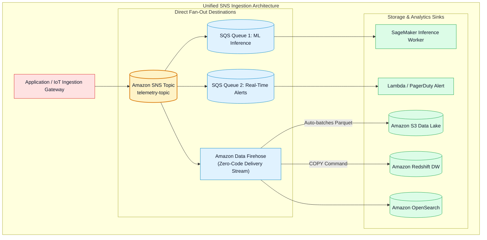
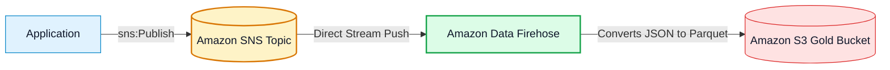

# 🔀 Amazon SNS Fan-Out Pattern, Firehose Ingestion & EventBridge Comparison

- **Category**: Application Integration / Event Fan-Out, Direct Firehose Streaming & Event Router Comparison
- **Language / ဘာသာစကား**: [English (Original)](/en/02-services/integration/sns/sns-fanout-firehose-and-eventbridge) | **မြန်မာဘာသာ (Burmese)**
- **Primary Use Case**: SNS+SQS Fan-Out pattern ကို architect ပြုလုပ်ခြင်း၊ serverless S3/Redshift data lake ingestion အတွက် SNS topics များမှ Amazon Data Firehose ထဲသို့ တိုက်ရိုက် deliver ပြုလုပ်ခြင်း၊ နှင့် SNS နှင့် Amazon EventBridge တို့အကြား ရွေးချယ်အသုံးပြုခြင်း။
- **Slide Reference**: `[AWSCertifiedDataEngineerSlides.pdf](/docs/AWSCertifiedDataEngineerSlides.pdf)` မှ Pages 499–525
- **Hub Links**: `[[mm/index|index]]` | `[[mm/02-services/integration/sns/sns|sns]]` | `[[mm/02-services/integration/sqs/sqs|sqs]]` | `[[mm/02-services/analytics-streaming/kinesis/kinesis-firehose|kinesis-firehose]]` | `[[mm/02-services/networking-monitoring/cloudwatch-and-eventbridge|cloudwatch-and-eventbridge]]`

---

## 1. High-Level Summary

Distributed data pipelines များတွင် Amazon SNS ကို အခြားသော AWS services များနှင့် တွဲဖက်၍ scalable ဖြစ်ပြီး event-driven ဖြစ်သော ingestion backbones များ တည်ဆောက်ရန် မကြာခဏ အသုံးပြုကြသည်။

**DEA-C01** စာမေးပွဲအတွက် **SNS + SQS Fan-Out Pattern**၊ custom ingestion code ရေးသားရန်မလိုဘဲ SNS သည် **Amazon Data Firehose** နှင့် natively မည်သို့ချိတ်ဆက်ပုံ၊ နှင့် **Amazon SNS နှင့် Amazon EventBridge** တို့အကြား architectural trade-offs များကို သေချာစွာ ကျွမ်းကျင်နားလည်ထားရပါမည်။

---

## 2. The Classic SNS + SQS Fan-Out Architecture

Decoupled ဖြစ်နေသော consumer services အများအပြားသည် တူညီသော business events များကို သီးခြားစီ (independently) process လုပ်ရန် လိုအပ်သည့်အခါ:

1. **Publisher Isolation**: Producer သည် event ကို **Amazon SNS Topic** တစ်ခုတည်းသို့သာ တစ်ကြိမ် (only once) publish လုပ်သည်။
2. **Parallel Delivery**: SNS သည် event ကို replicate လုပ်ပြီး subscribe လုပ်ထားသော **Amazon SQS Queue** တိုင်းသို့ copy တစ်ခုစီ push လုပ်ပေးသည်။
3. **Independent Worker Scaling**: Worker fleet တစ်ခုစီသည် မိမိတို့၏ dedicated SQS queue မှ message များကို အခြားသော consumers များကို block မဖြစ်စေဘဲ သို့မဟုတ် မထိခိုက်စေဘဲ မိမိတို့၏ ကိုယ်ပိုင် အရှိန်နှုန်းဖြင့် poll လုပ်ကြသည်။
4. **Resilience**: ML pipeline ပျက်ကျသွားလျှင်ပင် Real-Time Alerting queue သည် မည်သည့်အနှောင့်အယှက်မှ မရှိဘဲ ဆက်လက် process လုပ်ဆောင်နေမည် ဖြစ်သည်။

---

## 3. Direct SNS Ingestion into Amazon Data Firehose

Data engineering ရှိ အဓိက architectural pattern တစ်ခုမှာ transactional events များကို capture လုပ်ပြီး servers များကို manage လုပ်ရန် သို့မဟုတ် Lambda code ရေးသားရန် မလိုဘဲ data lake သို့မဟုတ် data warehouse ထဲသို့ persist ပြုလုပ်ခြင်း ဖြစ်သည်။

- **Zero-Code Delivery**: SNS topics များသည် records များကို **Amazon Data Firehose** delivery stream ထံသို့ တိုက်ရိုက် push လုပ်နိုင်သည်။
- **Data Firehose Capabilities**:
  - Data များကို အလိုအလျောက် buffer လုပ်ပေးခြင်း (ဥပမာ - 5 မိနစ် သို့မဟုတ် 128 MB)။
  - Raw JSON များကို columnar **Apache Parquet သို့မဟုတ် ORC** formats များသို့ ပြောင်းလဲပေးခြင်း။
  - Files များကို compress လုပ်ခြင်း (GZIP, Snappy) နှင့် **Amazon S3, Amazon Redshift, သို့မဟုတ် Amazon OpenSearch Service** ထံသို့ တိုက်ရိုက် ရေးသားပေးခြင်း။

---

## 4. Amazon SNS vs. Amazon EventBridge

SNS နှင့် EventBridge နှစ်ခုစလုံးသည် AWS ပေါ်တွင် events များကို route လုပ်ပေးသော်လည်း ၎င်းတို့သည် မတူညီသော latency, throughput, နှင့် architectural needs များကို ဦးတည်ထားပါသည်:

| Evaluation Dimension | Amazon SNS | Amazon EventBridge |
| :--- | :--- | :--- |
| **Primary Architecture** | High-throughput Pub/Sub messaging ဖြစ်ခြင်း။ | Intelligent event bus နှင့် SaaS integration router ဖြစ်ခြင်း။ |
| **Throughput & Latency** | **Virtually unlimited throughput** နှင့် ultra-low latency ($< 30\text{ ms}$) ဖြစ်ခြင်း။ | High throughput ဖြစ်ပြီး latency မှာ ပုံမှန်အားဖြင့် $\approx 500\text{ ms}$ ဖြစ်ခြင်း။ |
| **SaaS & AWS Sources** | Custom code / AWS services များမှ တိုက်ရိုက် publish လုပ်ခြင်း။ | **300+ SaaS vendors များနှင့် တိုက်ရိုက် ချိတ်ဆက်နိုင်ခြင်း** (Salesforce, Zendesk, GitHub)။ |
| **Event Replayability** | **မရပါ (No)** (Ephemeral delivery ဖြစ်ပြီး event store မရှိပါ)။ | **ရပါသည် (Yes - Archive & Replay)** (ယခင် past events များကို archive လုပ်ထားနိုင်ပြီး ပြန်လည် replay ပြုလုပ်နိုင်သည်)။ |
| **Schema Management** | မရှိပါ (Payload agnostic ဖြစ်သည်)။ | **EventBridge Schema Registry** & Schema Discovery ပါဝင်ခြင်း။ |
| **Content Transformation**| အခြေခံ attribute/body filtering သာ ရရှိခြင်း။ | **Input Transformers** ပါဝင်ခြင်း (Target delivery မတိုင်မီ event payload shape ကို transform ပြုလုပ်ပေးသည်)။ |
| **Target Ecosystem** | SQS, Lambda, Firehose, HTTP, SMS, Email။ | **35+ AWS targets** ကျော် ရရှိနိုင်ခြင်း (Step Functions, ECS tasks, Kinesis, SSM, စသည်တို့)။ |

---

## 5. DEA-C01 Exam Essentials

> [!IMPORTANT]
> **Key Exam Decision Triggers for Fan-Out & Routing**:
>
> - **"Stream events from an SNS topic to an S3 data lake with zero maintenance overhead"** $\rightarrow$ **Amazon Data Firehose ကို SNS Topic subscriber အဖြစ် configure လုပ်ပါ**; Firehose သည် convert လုပ်ပြီး Amazon S3 ထံသို့ တိုက်ရိုက် ရေးသားပေးမည် ဖြစ်သည်။
> - **"Choose between SNS and EventBridge for 300+ Third-Party SaaS Integrations"** $\rightarrow$ **Amazon EventBridge** ကို ရွေးချယ်ပါ (native SaaS partner event buses)။
> - **"Choose between SNS and EventBridge for replaying past failed events"** $\rightarrow$ **Amazon EventBridge** ကို ရွေးချယ်ပါ (Archive & Replay ကို support လုပ်သည်; SNS သည် ephemeral ဖြစ်သည်)။
> - **"Broadcast millions of high-velocity messages per second to SQS queues with lowest latency"** $\rightarrow$ **Amazon SNS Fan-Out to Amazon SQS** ကို ရွေးချယ်ပါ။

---

## 📌 Related Notes
- `[[mm/02-services/integration/sns/sns|sns]]` — SNS Master Hub
- `[[mm/02-services/integration/sqs/sqs|sqs]]` — SQS Modular Suite
- `[[mm/02-services/analytics-streaming/kinesis/kinesis-firehose|kinesis-firehose]]` — Amazon Data Firehose Delivery
- `[[mm/02-services/networking-monitoring/cloudwatch-and-eventbridge|cloudwatch-and-eventbridge]]` — EventBridge Rules & Schema Registry
