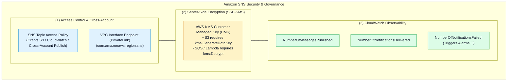

# 🛡️ Amazon SNS Security, Topic Access Policies, KMS Encryption & Observability

- **Category**: Application Integration / Topic Security Governance, Encryption & CloudWatch Monitoring
- **Language / ဘာသာစကား**: [English (Original)](/en/02-services/integration/sns/sns-security-access-policies-and-encryption) | **မြန်မာဘာသာ (Burmese)**
- **Primary Use Case**: Topic Access Policies မှတစ်ဆင့် AWS services များနှင့် cross-account publishers များအား ခွင့်ပြုချက်ပေးခြင်း (authorizing)၊ AWS KMS ဖြင့် data at rest မက်ဆေ့ဂျ်များကို encrypt ပြုလုပ်လုံခြုံစေခြင်း၊ VPC PrivateLink မှတစ်ဆင့် လမ်းကြောင်းပေးပို့ခြင်း (routing) နှင့် delivery health ကို စောင့်ကြည့်စစ်ဆေးခြင်း။
- **Slide Reference**: Pages 499–525 in `[[AWSCertifiedDataEngineerSlides.pdf]]`
- **Hub Links**: `[[mm/index]]` | `[[sns]]` | `[[sns-standard-vs-fifo-topics]]` | `[[sns-delivery-retries-and-dead-letter-queues]]` | `[[domain-3-data-operations-and-support]]`

---

## 1. High-Level Summary

Enterprise data platforms များတွင် Amazon SNS topics များကို လုံခြုံစိတ်ချရအောင် ပြုလုပ်ရန်အတွက် **Resource-Based Topic Policies** များကို configure လုပ်ခြင်း၊ server-side encryption အတွက် **AWS KMS key permissions** များ သတ်မှတ်ပေးခြင်းနှင့် **AWS PrivateLink VPC Endpoints** မှတစ်ဆင့် private traffic စီးဆင်းမှုကို ခွင့်ပြုပေးခြင်းတို့ လိုအပ်ပါသည်။

**DEA-C01** စာမေးပွဲအတွက် AWS services များ (ဥပမာ Amazon S3 သို့မဟုတ် CloudWatch ကဲ့သို့သော) သည် encrypted SNS topics များသို့ publish လုပ်သည့်အခါ လိုအပ်သော IAM နှင့် KMS permissions များကို နားလည်ထားရမည်ဖြစ်ပြီး delivery failures များကို မည်သို့ triage လုပ်ရမည်ကို သိရှိနားလည်ထားရပါမည်။



---

## 2. Topic Access Policies & Cross-Account Publishing

### 1. Amazon S3 အား SNS သို့ Publish ပြုလုပ်ခွင့် ပေးအပ်ခြင်း (Granting Amazon S3 Permission to Publish to SNS):
S3 bucket တစ်ခုအား SNS topic သို့ event notifications များ publish ပြုလုပ်ခွင့်ပြုရန် **SNS Topic Access Policy** တစ်ခုကို တွဲချိတ် (attach) ပေးပါ:

```json
{
  "Version": "2012-10-17",
  "Statement": [
    {
      "Sid": "AllowS3ToPublishEvents",
      "Effect": "Allow",
      "Principal": {
        "Service": "s3.amazonaws.com"
      },
      "Action": "sns:Publish",
      "Resource": "arn:aws:sns:us-east-1:123456789012:data-lake-events",
      "Condition": {
        "ArnEquals": {
          "aws:SourceArn": "arn:aws:s3:::my-production-data-lake-bucket"
        }
      }
    }
  ]
}
```

---

### 2. Cross-Account Subscriptions:
- **Account A** သည် SNS Topic ကို ပိုင်ဆိုင်သည်။
- **Account B** သည် ထို topic ကို subscribe လုပ်ထားသော SQS Queue ကို ပိုင်ဆိုင်သည်။
- *လိုအပ်ချက်များ (Requirements)*:
  1. Account A ၏ **SNS Topic Policy** သည် Account B အား `sns:Subscribe` ခေါ်ယူခွင့်ကို ခွင့်ပြုပေးရမည်။
  2. Account B ၏ **SQS Queue Policy** သည် Account A ၏ SNS topic အား `sqs:SendMessage` ခေါ်ယူခွင့်ကို ခွင့်ပြုပေးရမည်။

---

## 3. Server-Side Encryption (SSE-KMS) သတိပြုဖွယ်ရာများ (Gotchas)

SNS topic တစ်ခုပေါ်တွင် SSE-KMS encryption ကို enable ပြုလုပ်သည့်အခါ:

> [!WARNING]
> **High-Yield DEA-C01 KMS Key Policy ထောင်ချောက် (Trap)**:
> AWS service တစ်ခု (ဥပမာ Amazon S3 သို့မဟုတ် CloudWatch Alarms ကဲ့သို့သော) သည် AWS KMS Customer Managed Key (CMK) ဖြင့် encrypt လုပ်ထားသော SNS topic သို့ publish လုပ်သည့်အခါ KMS Key Policy တွင် service principal အတွက် ခွင့်ပြုချက် (permissions) များကို တိတိလင်းလင်း (explicitly) ခွင့်မပြုထားပါက **publish ပြုလုပ်မှုသည် မည်သည့် error မှမပြဘဲ တိတ်တဆိတ် ကျရှုံးသွားပါမည် (silently FAIL)**!

### S3 အတွက် လိုအပ်သော KMS Key Policy Statement:
```json
{
  "Sid": "AllowS3ToUseKMSKey",
  "Effect": "Allow",
  "Principal": {
    "Service": "s3.amazonaws.com"
  },
  "Action": [
    "kms:GenerateDataKey*",
    "kms:Decrypt"
  ],
  "Resource": "*"
}
```

---

## 4. VPC Interface Endpoints (AWS PrivateLink)

- Private VPC subnets များအတွင်း (Internet Gateway သို့မဟုတ် NAT Gateway မရှိဘဲ) run နေသော applications များအား Amazon SNS သို့ messages များကို လုံခြုံစိတ်ချစွာ publish ပြုလုပ်နိုင်စေသည်။
- **AWS PrivateLink** (`com.amazonaws.region.sns`) ကို အသုံးပြုသည်။
- Traffic သည် private AWS network backbone မှ အပြင်သို့ မည်သည့်အခါမျှ မထွက်ခွာသဖြင့် data transfer ကုန်ကျစရိတ်များကို လျှော့ချပေးပြီး HIPAA/PCI-DSS compliance လိုအပ်ချက်များနှင့် ကိုက်ညီမှုရှိစေသည်။

---

## 5. Master Troubleshooting Cheat Sheet

| Production Issue / Symptom | Root Cause | Remediation / Long-Term Fix |
| :--- | :--- | :--- |
| **S3 bucket event notifications များ SNS သို့ publish လုပ်မရဘဲ ကျရှုံးခြင်း** | SNS Topic Access Policy မရှိခြင်း သို့မဟုတ် မှားယွင်းနေခြင်း။ | SNS Topic Policy ထဲသို့ `s3.amazonaws.com` ကို `sns:Publish` action နှင့် `aws:SourceArn` condition ဖြင့် ထည့်သွင်းပေးပါ။ |
| **KMS-encrypted SNS topic ပေါ်တွင် အသံတိတ် publishing ကျရှုံးမှုများ ဖြစ်ပေါ်ခြင်း** | S3 သို့မဟုတ် publisher သည် KMS CMK Key Policy တွင် `kms:GenerateDataKey*` permission မရှိခြင်း။ | Publisher service principal အား data keys များ generate ပြုလုပ်ခွင့်ရရှိရန် KMS Key Policy ကို update လုပ်ပါ။ |
| **SQS subscriber queue သို့ မက်ဆေ့ဂျ်များ မရောက်ရှိဘဲ ကျရှုံးခြင်း** | SQS Queue Policy တွင် SNS topic ARN အတွက် permission မရှိခြင်း။ | SNS topic ARN အား `sqs:SendMessage` ခွင့်ပြုရန် SQS Queue Policy ကို update လုပ်ပါ။ |
| **Subscribers များ မသက်ဆိုင်သော မက်ဆေ့ဂျ် ထောင်ပေါင်းများစွာကို လက်ခံရရှိနေခြင်း** | Subscription Filter Policies များ မရှိခြင်း။ | Subscriber endpoint ပေါ်တွင် **Subscription Filter Policies** (attribute သို့မဟုတ် message-body matching) ကို configure လုပ်ပါ။ |
| **Downstream HTTP server ပြတ်တောက်ချိန်များတွင် ပြန်လည်မရနိုင်သော message ဆုံးရှုံးမှုများ ဖြစ်ပေါ်ခြင်း** | Subscription ပေါ်တွင် Dead-Letter Queue configure မလုပ်ထားခြင်း။ | SNS subscription ထဲသို့ **Amazon SQS Dead-Letter Queue (DLQ)** တစ်ခုကို ချိတ်ဆက် (attach) ပေးပါ။ |

---

## 6. DEA-C01 Exam Essentials

> [!IMPORTANT]
> **SNS Security & Governance အတွက် Key Exam Decision Triggers များ**:
>
> - **"S3 bucket event notifications cannot trigger an encrypted SNS topic"** $\rightarrow$ **KMS Key Policy** တွင် `s3.amazonaws.com` အား permissions များ (`kms:GenerateDataKey*` နှင့် `kms:Decrypt`) ပေးအပ်ပါ။
> - **"Allow an SQS queue in Account B to receive events from an SNS topic in Account A"** $\rightarrow$ **Account A ၏ Topic Policy** (subscribe ခွင့်ပြုရန်) နှင့် **Account B ၏ SQS Policy** (topic ARN မှ `sqs:SendMessage` ခွင့်ပြုရန်) နှစ်ခုစလုံးကို update လုပ်ပါ။
> - **"Publish messages from private EC2/Lambda instances to SNS without traversing the internet"** $\rightarrow$ `com.amazonaws.region.sns` အတွက် **VPC Interface Endpoint (PrivateLink)** တစ်ခု ဖန်တီးပါ။
> - **"Detect failing subscriber deliveries"** $\rightarrow$ **`NumberOfNotificationsFailed`** metric ပေါ်တွင် CloudWatch Alarm တစ်ခု ဖန်တီးပါ။

---

## 📌 Related Notes
- `[[sns]]` — SNS Master Hub
- `[[sns-standard-vs-fifo-topics]]` — Standard vs FIFO Topics
- `[[sns-delivery-retries-and-dead-letter-queues]]` — Delivery Retries & DLQs
- `[[sqs-security-monitoring-and-troubleshooting]]` — SQS Security & Access Governance
