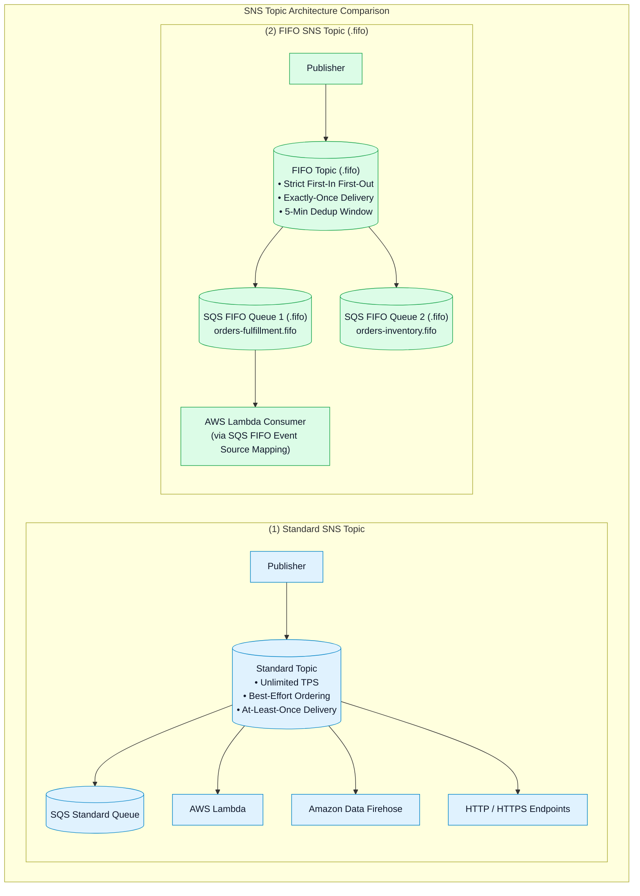
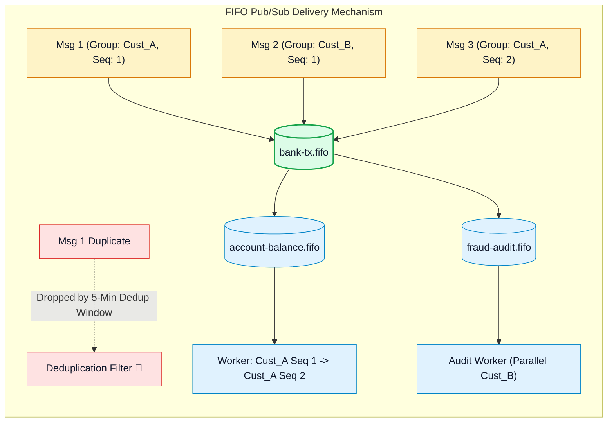

# ⚖️ Amazon SNS Standard vs. FIFO Topics, Deduplication & SQS FIFO Integration

- **Category**: Application Integration / Topic Ordering, Deduplication & FIFO Fanout
- **Language / ဘာသာစကား**: [English (Original)](/en/02-services/integration/sns/sns-standard-vs-fifo-topics) | **မြန်မာဘာသာ (Burmese)**
- **Primary Use Case**: Standard နှင့် FIFO topic semantics များအကြား ရွေးချယ်ခြင်း၊ subscriber queue အများအပြားတစ်လျှောက် message sequence ကို ထိန်းသိမ်းခြင်း၊ Content-Based Deduplication ကို enable ပြုလုပ်ခြင်းနှင့် FIFO topic များကို SQS FIFO queue များနှင့် ပေါင်းစပ်ချိတ်ဆက် (integrate) ခြင်း။
- **Slide Reference**: `[AWSCertifiedDataEngineerSlides.pdf](/docs/AWSCertifiedDataEngineerSlides.pdf)` မှ Pages 499–525
- **Hub Links**: `[[mm/index]]` | `[[sns]]` | `[[sqs-standard-vs-fifo-queues]]` | `[[sns-subscription-filter-policies]]`

---

## 1. High-Level Summary

Amazon SNS သည် သီးခြားကွဲပြားသော topic architecture နှစ်မျိုးဖြစ်သည့် **Standard Topics** နှင့် **FIFO (First-In, First-Out) Topics** တို့ကို support လုပ်ပေးသည်။

Standard Topics များသည် အလွန်မြင့်မားသော throughput နှင့် ကျယ်ပြန့်သော protocol support (HTTP, Lambda, SQS, Email, Firehose) ကို ပေးဆောင်သော်လည်း FIFO Topics များသည် sequence-sensitive ဖြစ်သော data streams များ (ဥပမာ financial ledgers များနှင့် inventory reservations များ) အတွက် တိကျသော message အစီအစဉ် (strict ordering) နှင့် exactly-once delivery ကို ပေးဆောင်သည်။

---

## 2. Standard Topics Deep Dive

1. **Massive Throughput**: Standard topics များသည် sub-10ms delivery latency ဖြင့် တစ်စက္ကန့်လျှင် အကန့်အသတ်မရှိ (virtually unlimited) messages များကို support လုပ်ပေးသည်။
2. **Delivery Semantics**: At-least-once message delivery စနစ်ဖြစ်သည်။ Message အစီအစဉ်သည် best-effort ဖြစ်သည် (network routing သို့မဟုတ် retries များကြောင့် delivery sequence မှာ တစ်ခါတစ်ရံ ပြောင်းလဲသွားနိုင်သည်)။
3. **Broad Protocol Ecosystem**: Standard topics များသည် အောက်ပါတို့ဆီသို့ messages များကို push ပေးပို့နိုင်သည်:
   - **Amazon SQS Standard Queues**
   - **AWS Lambda functions**
   - **Amazon Data Firehose delivery streams** (S3 / Redshift / OpenSearch ဆီသို့ တိုက်ရိုက်)
   - **HTTP / HTTPS webhooks**
   - **Email / Email-JSON**
   - **SMS & Mobile Push Notifications (APNs, FCM)**

---

## 3. FIFO Topics Deep Dive

Amazon SNS FIFO topics များသည် message sequence ပျက်ယွင်း၍ မရနိုင်သော၊ နှင့် duplicate events များကြောင့် state corruption သို့မဟုတ် financial discrepancy (ငွေစာရင်းကွဲလွဲမှု) ဖြစ်ပေါ်နိုင်သော distributed architectures များအတွက် သီးသန့်တည်ဆောက်ထားခြင်း ဖြစ်သည်။

### 1. Naming Convention:
Topic အမည်သည် **`.fifo` suffix ဖြင့် အဆုံးသတ်ရမည်** ဖြစ်သည် (ဥပမာ `transactions.fifo`)။

### 2. Message Group ID:
- Publishers များသည် publish လုပ်သော message တိုင်းတွင် `MessageGroupId` tag တစ်ခုကို ထည့်သွင်းပေးရမည်။
- **တူညီသော `MessageGroupId`** ရှိသည့် messages များကို **တိကျသော First-In, First-Out sequence အတိုင်း** deliver လုပ်ပေးပြီး process လုပ်ရန် အာမခံသည်။
- **မတူညီသော `MessageGroupId`** များရှိသည့် messages များကိုမူ သီးခြား partition များတွင် bottleneck မဖြစ်စေဘဲ throughput အမြင့်မားဆုံးရရှိစေရန် concurrent အနေဖြင့် ပေးပို့နိုင်သည်။

### 3. Exactly-Once Delivery & Deduplication ID:
SNS FIFO topics များသည် **5-minute deduplication window** တစ်ခုကို အသုံးပြုသည်:
- **Explicit Deduplication**: Publisher သည် သီးသန့်ဖြစ်သော `MessageDeduplicationId` (ဥပမာ transaction hash) တစ်ခုကို ထည့်သွင်းပေးပို့သည်။
- **Content-Based Deduplication**: SNS သည် message body ၏ **SHA-256 hash** ကို အလိုအလျောက် generate လုပ်ပေးသည်။ ၅ မိနစ်အတွင်း အဆိုပါ တူညီသော hash ရှိသည့် message ထပ်မံရောက်ရှိလာပါက ၎င်းကို အလိုအလျောက် drop လုပ်ပစ်မည် ဖြစ်သည်။

---

## 4. The Critical FIFO Subscription Rule

> [!WARNING]
> **High-Yield DEA-C01 Exam Constraint**:
> Amazon SNS FIFO topics များသည် **Amazon SQS FIFO Queues (`.fifo`) များကိုသာ subscribe ပြုလုပ်နိုင်သည်**!
> ၎င်းတို့သည် AWS Lambda, Amazon Data Firehose, HTTP/S endpoints, SMS သို့မဟုတ် Email များဆီသို့ တိုက်ရိုက် messages များ **မပို့နိုင်ပါ**။

### The Standard Pattern: Fan-Out FIFO to Lambda
တိကျသော FIFO order ကို ထိန်းသိမ်းထားစဉ် serverless Lambda function တစ်ခုကို trigger လုပ်ရန် လိုအပ်သောအခါ:
1. Publisher မှ order စီထားသော message ကို **SNS FIFO Topic** (`orders.fifo`) ဆီသို့ push လုပ်သည်။
2. SNS FIFO Topic သည် **SQS FIFO Queue** (`orders-worker.fifo`) ဆီသို့ fan out ပြုလုပ်ပေးပို့သည်။
3. **AWS Lambda** သည် **Event Source Mapping** မှတစ်ဆင့် SQS FIFO Queue ကို poll လုပ်သည် (`MessageGroupId` အလိုက် concurrency သတ်မှတ် configure လုပ်ထားသည်)။

---

## 5. Standard vs. FIFO Topics Definitive Comparison

| Dimension | Standard Topic | FIFO Topic |
| :--- | :--- | :--- |
| **Throughput Capacity** | Unlimited (အကန့်အသတ်မရှိ)။ | 300 မှ 30,000 msg/sec အထိ (batching နှင့် High Throughput mode ဖြင့်)။ |
| **Ordering Guarantee** | Best-effort (out-of-order ဖြစ်နိုင်သည်)။ | **Strictly preserved (First-In, First-Out တိကျစွာ ထိန်းသိမ်းသည်)**။ |
| **Duplicates** | At-least-once delivery (Duplicates များ ဖြစ်နိုင်သည်)။ | **Exactly-once delivery (5-minute deduplication window)**။ |
| **Supported Subscribers** | SQS, Lambda, Firehose, HTTP/S, SMS, Email, Mobile Push။ | **Amazon SQS FIFO Queues သာလျှင်** (`.fifo`)။ |
| **Message Group ID** | Support မလုပ်ပါ။ | **မဖြစ်မနေ လိုအပ်သည် (Mandatory)** (ordered stream ကို သတ်မှတ်သည်)။ |
| **Deduplication ID** | Support မလုပ်ပါ။ | **မဖြစ်မနေ လိုအပ်သည် (Mandatory)** (explicit သို့မဟုတ် Content-Based SHA-256)။ |
| **Pricing** | Publish လုပ်မှု ၁ သန်းလျှင် \$0.50။ | Publish လုပ်မှု ၁ သန်းလျှင် \$2.00။ |

---

## 6. DEA-C01 Exam Essentials

> [!IMPORTANT]
> **Key Exam Decision Triggers for Topic Types**:
>
> - **"Fan out messages to multiple systems while guaranteeing strictly preserved message ordering and no duplicates"** $\rightarrow$ Multiple **Amazon SQS FIFO Queues** များကို subscribe လုပ်ထားသော **Amazon SNS FIFO Topic** တစ်ခုကို အသုံးပြုပါ။
> - **"Directly stream SNS messages into Amazon S3 or Amazon Redshift without running compute workers"** $\rightarrow$ **Amazon Data Firehose** ကို subscribe လုပ်ထားသော **Standard SNS Topic** တစ်ခုကို အသုံးပြုပါ (FIFO topics များသည် Firehose ကို subscribe မလုပ်နိုင်ပါ)။
> - **"Can an SNS FIFO topic send SMS alerts or email directly?"** $\rightarrow$ **မရပါ (No)**။ FIFO topics များသည် SQS FIFO queue endpoints များကိုသာ support လုပ်သည်။
> - **"Automatically drop duplicate API publishes without changing application code"** $\rightarrow$ SNS FIFO topic ပေါ်တွင် **Content-Based Deduplication** ကို enable ပြုလုပ်ပါ။

---

## 📌 Related Notes
- `[[sns]]` — SNS Master Hub
- `[[sqs-standard-vs-fifo-queues]]` — SQS Standard vs FIFO Queues
- `[[sns-subscription-filter-policies]]` — SNS Subscription Filter Policies
- `[[kinesis-firehose]]` — Amazon Data Firehose Ingestion
