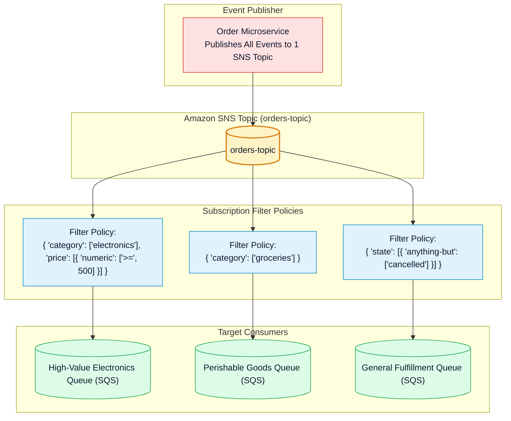
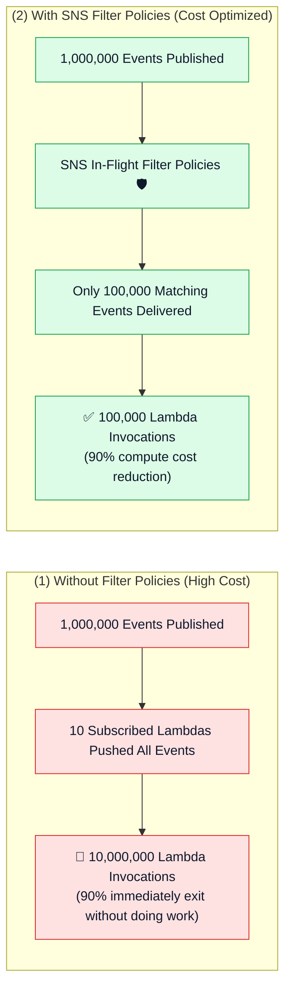

# 🎯 Amazon SNS Subscription Filter Policies, Message Attributes & Cost Optimization

- **Category**: Application Integration / Smart Event Routing & Downstream Cost Reduction
- **Language / ဘာသာစကား**: [English (Original)](/en/02-services/integration/sns/sns-subscription-filter-policies) | **မြန်မာဘာသာ (Burmese)**
- **Primary Use Case**: Message Attributes သို့မဟုတ် Payload contents ပေါ်အခြေခံ၍ သက်ဆိုင်ရာ subscriber များထံသို့သာ messages များကို route လုပ်ပေးပြီး မလိုအပ်သော downstream Lambda invocations များနှင့် SQS processing cost များကို လျှော့ချခြင်း။
- **Slide Reference**: Pages 499–525 in `[[AWSCertifiedDataEngineerSlides.pdf]]`
- **Hub Links**: `[[mm/index]]` | `[[mm/sns]]` | `[[mm/sns-standard-vs-fifo-topics]]` | `[[mm/sqs]]` | `[[mm/lambda]]`

---

## 1. High-Level Summary

မူလ default အားဖြင့် Amazon SNS topic တစ်ခုသည် publish ပြုလုပ်လိုက်သော **messages များအားလုံး (100%)** ကို subscribe ပြုလုပ်ထားသည့် endpoint တိုင်းထံသို့ push လုပ်ပေးပါသည်။ ကြီးမားသော enterprise data pipeline များတွင် ဤအချက်ကြောင့် downstream စနစ်များ၌ data bloat ဖြစ်ပေါ်စေပြီး မလိုအပ်ဘဲ compute cost များ ကုန်ကျစေပါသည် (ဥပမာ - မသက်ဆိုင်သော record များကို လက်ခံရရှိပြီး ချက်ချင်း discard လုပ်ပစ်ရန်အတွက်သာ Lambda execution ထောင်ပေါင်းများစွာကို run ရခြင်းမျိုး)။

**Subscription Filter Policies** သည် subscriber များအား JSON matching rules များကို သတ်မှတ်ကြေညာခွင့်ပေးပါသည်။ SNS သည် ဝင်ရောက်လာသော messages များကို ဤ rules များနှင့် တိုက်ဆိုင်စစ်ဆေးပြီး rule နှင့် **ကိုက်ညီသော messages များကိုသာ** subscriber ထံသို့ deliver လုပ်ပေးကာ မကိုက်ညီသော messages များကို delivery မလုပ်မီ drop (ဖျက်ထုတ်) ပေးပါသည်။



---

## 2. Filter Policy Scopes: Attributes vs. Payload Body

Amazon SNS သည် ကွဲပြားသော filter policy evaluation scope ၂ ခုကို ထောက်ပံ့ပေးထားပါသည် -

### 1. Message Attributes Filtering (Default Scope):
- Message ကို publish လုပ်သည့်အချိန်တွင် `MessageAttributes` ၌ တွဲဖက်ပေးပို့လိုက်သော key-value metadata များကို စစ်ဆေးအကဲဖြတ်သည်။
- *Advantage (အားသာချက်)* - အလွန်လျင်မြန်ပြီး lightweight ဖြစ်သည်၊ JSON body ကို parse လုပ်ရန် မလိုအပ်ပါ။

### 2. Message Body (Payload) Filtering:
- Message ၏ JSON payload body အတွင်းရှိ properties များကို တိုက်ရိုက် စစ်ဆေးအကဲဖြတ်သည်။
- *Configuration (သတ်မှတ်ပုံ)* - Subscription ပေါ်တွင် `FilterPolicyScope = MessageBody` ဟု သတ်မှတ်ပေးရမည်။
- *Advantage (အားသာချက်)* - Producer များအနေဖြင့် သီးခြား metadata attributes များကို တွဲဖက်ပေးပို့ရန် မလိုအပ်ပါ၊ SNS သည် nested JSON bodies များကို အလိုအလျောက် parse လုပ်ပေးပါသည်။

---

## 3. Supported JSON Filter Policy Operators

| Operator | JSON Policy Syntax Example | Matches If... (ကိုက်ညီသည့် အခြေအနေ) |
| :--- | :--- | :--- |
| **Exact Match** | `{"event_type": ["order_created", "order_updated"]}` | `event_type` သည် `order_created` သို့မဟုတ် `order_updated` ဖြစ်လျှင်။ |
| **Prefix Matching** | `{"customer_id": [{"prefix": "VIP-"}]}` | `customer_id` သည် `"VIP-"` string ဖြင့် စတင်လျှင်။ |
| **Suffix Matching** | `{"file_name": [{"suffix": ".parquet"}]}` | `file_name` သည် `".parquet"` extension ဖြင့် အဆုံးသတ်လျှင်။ |
| **Numeric Range** | `{"total_amount": [{"numeric": [">=", 100, "<=", 1000]}]}` | `total_amount` သည် \$100 နှင့် \$1,000 ကြား (အပါအဝင်) ဖြစ်လျှင်။ |
| **Anything-But** | `{"environment": [{"anything-but": ["test", "dev"]}]}` | `environment` သည် `test` သို့မဟုတ် `dev` မှအပ အခြားတန်ဖိုး ဖြစ်လျှင်။ |
| **Exists** | `{"fraud_risk_score": [{"exists": true}]}` | Message အတွင်း၌ `fraud_risk_score` field ပါဝင်နေလျှင်။ |

---

## 4. Multi-Attribute Evaluation Logic

ရှုပ်ထွေးသော filter policy များကို တည်ဆောက်သည့်အခါ SNS သည် ရှင်းလင်းတိကျသော Boolean evaluation rules များကို အသုံးပြုပါသည် -

```json
{
  "department": ["finance", "accounting"],
  "priority": ["high", "critical"],
  "amount": [
    {
      "numeric": [">=", 50000]
    }
  ]
}
```

- **Attribute array တစ်ခုတည်းအတွင်း၌ OR Logic အသုံးပြုခြင်း** - `department` သည် `"finance"` သို့မဟုတ် `"accounting"` ဖြစ်ပါက match ဖြစ်သည်။
- **မတူညီသော attribute keys များအကြား၌ AND Logic အသုံးပြုခြင်း** - Message တစ်ခုသည် (`department`) **AND** (`priority`) **AND** (`amount`) အားလုံးနှင့် ကိုက်ညီရမည် ဖြစ်သည်။

---

## 5. Cost Optimization Impact in Data Pipelines



- **Zero Cost for Filtering (Filtering အတွက် အပိုကုန်ကျစရိတ် မရှိခြင်း)** - Amazon SNS သည် subscription filter policy များကို စစ်ဆေးအကဲဖြတ်ခြင်းအတွက် **မည်သည့်အပိုကြေးမျှ ကောက်ခံခြင်း မရှိပါ** (at no additional charge)။
- Subscriber endpoint များထံသို့ အောင်မြင်စွာ deliver ပြုလုပ်နိုင်ခဲ့သော messages များအတွက်သာ ပေးဆောင်ရပါသည်။ မကိုက်ညီသော non-matching messages များကို downstream delivery မပြုလုပ်မီ အခမဲ့ drop လုပ်ပေးပါသည်။

---

## 6. DEA-C01 Exam Essentials

> [!IMPORTANT]
> **Filter Policies အတွက် အဓိက Exam Decision Triggers များ**:
>
> - **"SNS topic တစ်ခုတည်းက transaction အားလုံးကို လက်ခံသော်လည်း high-value transactions (> \$10,000) များကို fraud inspection queue သို့ route လုပ်ပြီး standard transactions များကို data lake queue သို့ ပို့လိုပါက"** $\rightarrow$ SQS subscription များပေါ်တွင် numeric range matching ကို အသုံးပြု၍ **SNS Subscription Filter Policies** ကို configure ပြုလုပ်ပါ။
> - **"Application filtering code ရေးသားစရာမလိုဘဲ SNS topic မှ မလိုအပ်သော downstream AWS Lambda invocations များကို လျှော့ချလိုပါက"** $\rightarrow$ SNS-to-Lambda subscription များပေါ်တွင် **Subscription Filter Policies** ကို တိုက်ရိုက် apply လုပ်ပါ။
> - **"Message headers များအစား JSON body အတွင်းရှိ fields များကို အခြေခံ၍ messages များကို filter လုပ်လိုပါက"** $\rightarrow$ Subscription ၏ **`FilterPolicyScope` ကို `MessageBody`** အဖြစ် သတ်မှတ်ပါ။
> - **"SNS Filter Policy တစ်ခုတွင် multiple keys များကို မည်သို့ evaluate လုပ်သနည်း?"** $\rightarrow$ Keys များကို **AND** logic ဖြင့် ပေါင်းစပ်စစ်ဆေးပြီး key တစ်ခုတည်းအတွင်းရှိ array values များကိုမူ **OR** logic ဖြင့် evaluate လုပ်ပါသည်။

---

## 📌 Related Notes
- `[[mm/sns]]` — SNS Master Hub
- `[[mm/sns-standard-vs-fifo-topics]]` — Standard vs FIFO Topics
- `[[mm/sqs]]` — Amazon SQS Queue Buffering
- `[[mm/lambda]]` — AWS Lambda Ingestion Consumers
