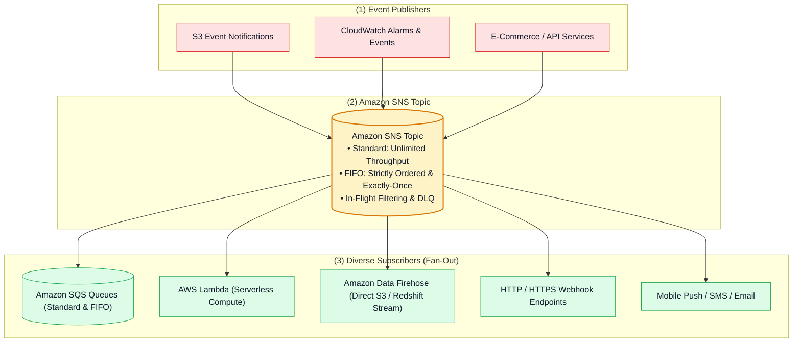

# 📢 Amazon SNS Hub (Simple Notification Service & Pub/Sub Fan-Out)

- **Category**: Application Integration / Publish-Subscribe Messaging & Event Fan-Out
- **Language / ဘာသာစကား**: [English (Original)](/en/02-services/integration/sns/sns) | **မြန်မာဘာသာ (Burmese)**
- **Primary Use Case**: Fully managed Pub/Sub messaging၊ single event တစ်ခုတည်းကို subscribers ထောင်ပေါင်းများစွာထံသို့ broadcast လုပ်ခြင်း (Fan-Out)၊ downstream ETL pipelines များကို trigger လုပ်ခြင်း နှင့် Amazon Data Firehose ထံသို့ data များကို တိုက်ရိုက် stream လုပ်ခြင်း။
- **Slide Reference**: `[[AWSCertifiedDataEngineerSlides.pdf]]` မှ Pages 499–525
- **Hub Links**: `[[mm/index]]` | `[[service-catalog]]` | `[[domain-1-ingestion-and-processing]]` | `[[domain-3-data-operations-and-support]]` | `[[sqs]]` | `[[kinesis]]`

---

## 1. High-Level Summary

**Amazon Simple Notification Service (Amazon SNS)** သည် high-throughput နှင့် အလွန်စိတ်ချရသော message delivery အတွက် ရည်ရွယ်ထုတ်လုပ်ထားသည့် fully managed, serverless publish/subscribe (Pub/Sub) messaging service တစ်ခု ဖြစ်ပါသည်။

ခေတ်မီ cloud data architectures များနှင့် data engineering pipelines များတွင် Amazon SNS သည် **ဗဟို event broadcaster (central event broadcaster)** အဖြစ် လုပ်ဆောင်ပေးပါသည်။ Publishers များ (ဥပမာ- microservices များ၊ CloudWatch Alarms များ၊ S3 Event Notifications များ၊ သို့မဟုတ် AWS Step Functions များ) သည် message တစ်ခုကို **SNS Topic** ထံသို့ တစ်ကြိမ်သာ ပေးပို့ပြီး၊ SNS သည် ထို message ကို အလိုအလျောက် ပွားယူကာ (duplicate လုပ်ကာ) မတူကွဲပြားသော subscribers အများအပြားထံသို့ တစ်ပြိုင်နက်တည်း push ပို့ပေးပါသည် (**Fan-Out pattern** ဖြစ်ပါသည်)။

---

## 2. Core Concepts & Messaging Mechanics

1. **Publish/Subscribe (Pub/Sub) Model**:
   - **Push Model**: SQS ကဲ့သို့ workers များက messages များကို poll လုပ်ရခြင်းမျိုး မဟုတ်ဘဲ၊ SNS သည် messages များကို publish လုပ်လိုက်သည်နှင့် register လုပ်ထားသော endpoints အားလုံးထံသို့ ချက်ချင်း push ပို့ပေးပါသည်။
   - **Zero Persistence / Ephemeral Delivery**: SNS သည် messages များကို ရေရှည်သိမ်းဆည်းထားခြင်း (store) မရှိပါ။ အကယ်၍ subscriber endpoint တစ်ခုသို့ ချိတ်ဆက်၍မရဘဲ Dead-Letter Queue (DLQ) configure မလုပ်ထားပါက၊ retry policies များ သက်တမ်းကုန်ဆုံးသွားပြီးနောက် message သည် အပြီးတိုင် drop ဖြစ်သွားပါမည် (ပျက်ပြယ်သွားပါမည်)။
2. **SNS Topics**:
   - Publishers များက messages ပေးပို့ရန်နှင့် subscribers များက subscriptions များ ချိတ်ဆက်ရန်အတွက် အသုံးပြုသော logical access point နှင့် communication channel တစ်ခု ဖြစ်ပါသည်။
3. **Message Payload Limits**:
   - Message တစ်ခုလျှင် text (JSON, XML, သို့မဟုတ် unformatted text) **256 KB** အထိ ပေးပို့နိုင်ပါသည်။
   - Smart routing ပြုလုပ်နိုင်ရန် **Subscription Filter Policies** များမှ အသုံးပြုသည့် **Message Attributes** (metadata key-value pairs အများဆုံး ၁၀ ခုအထိ) ကို support လုပ်ပါသည်။

---

## 3. Standard Topics vs. FIFO Topics

| Feature / Dimension | Standard Topic | FIFO (First-In, First-Out) Topic |
| :--- | :--- | :--- |
| **Throughput** | တစ်စက္ကန့်လျှင် **Unlimited** messages (အကန့်အသတ်မရှိ)။ | တစ်စက္ကန့်လျှင် 300 msg (batching ဖြင့် 3,000 msg); High Throughput mode ဖြင့် **30,000 msg/sec** အထိ ရရှိနိုင်သည်။ |
| **Delivery Ordering** | **Best-effort ordering** (အစီအစဉ်အတိုင်း ဖြစ်ရန် အတတ်နိုင်ဆုံး ကြိုးစားပေးသော်လည်း အာမမခံ)။ | **Strictly ordered** (First-In, First-Out တိကျသောအစီအစဉ် အာမခံချက်)။ |
| **Deduplication** | At-least-once delivery (တစ်ခါတစ်ရံ duplicate messages များ ဖြစ်ပေါ်နိုင်)။ | **Exactly-once delivery** (၅ မိနစ် deduplication window)။ |
| **Naming Requirement** | မည်သည့် alphanumeric အမည်မဆို ပေးနိုင်သည်။ | **အမည်၏ အဆုံးတွင် `.fifo` ဖြင့် ဆုံးရမည်** (ဥပမာ- `orders.fifo`)။ |
| **Supported Subscribers** | SQS (Standard), Lambda, Firehose, HTTP/S, Email, SMS, Push။ | **Amazon SQS FIFO Queues သာလျှင် (ONLY)**။ |
| **Required Identifiers** | မလိုအပ်ပါ။ | **Message Group ID** နှင့် **Message Deduplication ID**။ |

---

## 4. Modular SNS Deep-Dive Topics

**AWS Certified Data Engineer - Associate (DEA-C01)** စာမေးပွဲအတွက် Amazon SNS ကို ကျွမ်းကျင်စွာ နားလည်နိုင်ရန် အောက်ပါ modular notes များကို လေ့လာပါ:

1. `[[sns-standard-vs-fifo-topics]]` — **Standard vs. FIFO Topics, Message Group ID, Deduplication & SQS FIFO Integration**
2. `[[sns-subscription-filter-policies]]` — **Message Attributes, Payload-Based Filtering, Numeric Ranges & Ingestion Cost Optimization**
3. `[[sns-delivery-retries-and-dead-letter-queues]]` — **4-Phase Delivery Retry Policies, Subscription DLQs & Fault-Tolerant Fanout**
4. `[[sns-fanout-firehose-and-eventbridge]]` — **SNS + SQS Fan-Out, Direct Amazon Data Firehose Streaming & SNS vs. EventBridge vs. SQS Matrix**
5. `[[sns-security-access-policies-and-encryption]]` — **Topic Access Policies, SSE-KMS Encryption, Cross-Account Publishing & VPC Endpoints**

---

## 5. DEA-C01 Exam Essentials

> [!IMPORTANT]
> **Key Exam Rules for Amazon SNS**:
>
> - **Fan-Out Architecture**: စာမေးပွဲမေးခွန်းတွင် single event တစ်ခုတည်းကို မတူညီသော downstream systems အများအပြား (ဥပမာ- S3 data lake, auditing, fraud detection) သို့ ပေးပို့ရန် လိုအပ်ပါက၊ **multiple SQS Queues များသို့ fan out လုပ်ထားသော SNS Topic** ကို အသုံးပြုပါ။
> - **Direct S3 / Redshift Streaming without Compute**: SNS topics များသည် Lambda code ရေးသားရန် လုံးဝမလိုဘဲ messages များကို **Amazon Data Firehose** သို့ တိုက်ရိုက် deliver လုပ်နိုင်ပြီး၊ streams များကို S3, Redshift, OpenSearch သို့မဟုတ် Splunk ထံသို့ buffer လုပ်ကာ တိုက်ရိုက် သိမ်းဆည်းနိုင်ပါသည်။
> - **Eliminate Unnecessary Downstream Invocations**: Messages များကို သက်ဆိုင်ရာ subscribers များထံသို့သာ လမ်းကြောင်းပေးပို့နိုင်ရန် (route လုပ်နိုင်ရန်) **SNS Subscription Filter Policies** (attribute သို့မဟုတ် message-body filtering) ကို အသုံးပြုပါ။
> - **Strictly Ordered Pub/Sub**: **SQS FIFO Queues** (`.fifo`) သို့သာ subscribe လုပ်ထားသော **SNS FIFO Topic** (`.fifo`) ကို အသုံးပြုပါ။
> - **Subscription-Level DLQs**: SNS တွင် Dead-Letter Queues (DLQs) များကို Topic level တွင်မဟုတ်ဘဲ **Subscription level** တွင် configure လုပ်ရပါသည်။

---

## 📌 Related Notes
- `[[sns-standard-vs-fifo-topics]]` — Standard vs FIFO Topics
- `[[sns-subscription-filter-policies]]` — Subscription Filter Policies
- `[[sqs]]` — Amazon SQS Modular Deep-Dive Suite
- `[[kinesis-firehose]]` — Amazon Data Firehose Ingestion
- `[[cloudwatch-and-eventbridge]]` — EventBridge vs SNS Comparison
