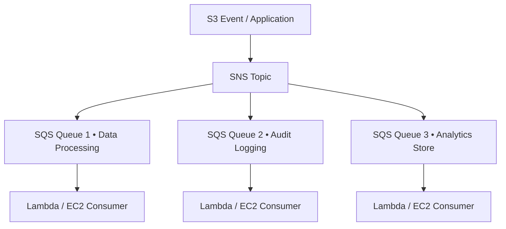

# ✉️ Amazon SQS & Amazon SNS

- **Category**: Application Integration
- **Language / ဘာသာစကား**: [English (Original)](/en/02-services/integration/sqs-and-sns) | **မြန်မာဘာသာ (Burmese)**
- **Primary Use Case**: Asynchronous message queuing, pub/sub notification fanout, microservices များကို decouple ပြုလုပ်ခြင်း။
- **Slide Reference**: `[AWSCertifiedDataEngineerSlides.pdf](/docs/AWSCertifiedDataEngineerSlides.pdf)` မှ Pages 499–525
- **Hub Links**: [[mm/index|index]] | [[mm/00-hub/service-catalog|service-catalog]] | [[mm/01-domains/domain-1-ingestion-and-processing|domain-1-ingestion-and-processing]]

---

## 1. High-Level Summary

**Amazon SQS (Simple Queue Service)** နှင့် **Amazon SNS (Simple Notification Service)** တို့သည် distributed systems များတွင် data producer များနှင့် consumer များကို decouple ပြုလုပ်ပေးပြီး၊ စိတ်ချယုံကြည်ရသော event delivery နှင့် message buffering ကို အာမခံပေးပါသည်။

---

## 2. Technical Breakdown & Comparison

| Feature | Amazon SQS (Queue) | Amazon SNS (Pub/Sub) |
| :--- | :--- | :--- |
| **Model** | **Pull** (Consumer များက queue မှ poll လုပ်သည်) | **Push** (Subscriber များထံသို့ event များကို တိုက်ရိုက် push လုပ်ပေးသည်) |
| **Patterns** | Point-to-Point message processing | SQS queue များစွာ၊ Lambda၊ HTTP endpoints များသို့ Fanout လုပ်ခြင်း |
| **Queue / Topic Types** | Standard (unlimited throughput, at-least-once delivery) နှင့် **FIFO** (exactly-once, strictly ordered) | Standard နှင့် **FIFO Topics** |
| **Retention** | 1 minute မှ အများဆုံး **14 days** အထိ | No storage (Subscriber များထံသို့ ချက်ချင်း push လုပ်သည်) |
| **Dead Letter Queue** | maxReceiveCount ကျော်လွန်ပြီး မလုပ်ဆောင်နိုင်သော message များကို ဖမ်းယူထားသည် | HTTP/Lambda subscriptions များအတွက် ထောက်ပံ့ပေးသည် |

---

## 3. SNS + SQS Fanout Architecture Pattern

---

## 4. DEA-C01 Exam Tips

> [!IMPORTANT]
> - **Fanout Pattern**: Event message ၁ ခုတည်းကို သီးခြားလွတ်လပ်သော processing queue များစွာသို့ တစ်ပြိုင်နက် ပေးပို့လိုပါက $\rightarrow$ **SQS Queue များစွာ ချိတ်ဆက်ထားသော SNS Topic (SNS Topic subscribed to multiple SQS Queues)** ကို အသုံးပြုပါ။
> - **Strict Order Processing**: **SQS FIFO Queue** ကို ရွေးချယ်ပါ (Message Group ID နှင့် Deduplication ID တို့ကို အသုံးပြု၍ ordering နှင့် exactly-once processing ကို အာမခံသည်)။

---

## 📌 Related Notes
- [[mm/02-services/integration/sqs/sqs|sqs]] — Amazon SQS Dedicated Modular Deep-Dive Suite
- [[mm/02-services/integration/sns/sns|sns]] — Amazon SNS Dedicated Modular Deep-Dive Suite
- [[mm/02-services/compute-containers/lambda|lambda]] — SQS/SNS အတွက် Lambda consumers များ
- [[mm/02-services/integration/step-functions/step-functions|step-functions]] — Workflow integration
