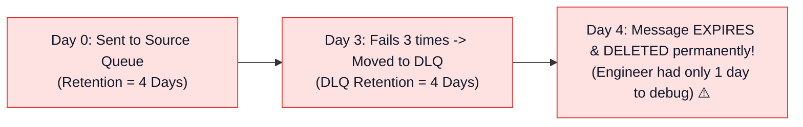
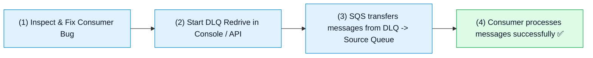

# ☠️ Amazon SQS Dead-Letter Queues (DLQ), Poison Pill Handling & DLQ Redrive

- **Category**: Application Integration / Fault Tolerance, Error Handling & Message Redrive
- **Language / ဘာသာစကား**: [English (Original)](/en/02-services/integration/sqs/sqs-dead-letter-queues-and-error-handling) | **မြန်မာဘာသာ (Burmese)**
- **Primary Use Case**: Process မလုပ်နိုင်သော poison pill message များကို သီးသန့်ခွဲထုတ်ခြင်း (quarantine/isolate လုပ်ခြင်း)၊ `RedrivePolicy` နှင့် `maxReceiveCount` configure ပြုလုပ်ခြင်း၊ အဆုံးမရှိ ထပ်ခါတလဲလဲ retry လုပ်နေသည့် loop များကို ကာကွယ်ခြင်း၊ နှင့် batch အလိုက် ပြန်လည် process လုပ်ရန် DLQ Redrive ကို run ခြင်း။
- **Slide Reference**: `[AWSCertifiedDataEngineerSlides.pdf](/docs/AWSCertifiedDataEngineerSlides.pdf)` မှ Pages 499–525
- **Hub Links**: `[[mm/index|index]]` | `[[mm/02-services/integration/sqs/sqs|sqs]]` | `[[mm/02-services/integration/sqs/sqs-standard-vs-fifo-queues|sqs-standard-vs-fifo-queues]]` | `[[mm/02-services/integration/sqs/sqs-timing-parameters-and-polling|sqs-timing-parameters-and-polling]]` | `[[mm/01-domains/domain-3-data-operations-and-support|domain-3-data-operations-and-support]]`

---

## 1. High-Level Summary

Distributed data pipeline များတွင် input data အမှားများ (ဥပမာ - corrupted JSON၊ schema မကိုက်ညီမှုများ၊ သို့မဟုတ် မျှော်လင့်မထားသော NULL တန်ဖိုးများ) ကြောင့် consumer application များ ထပ်ခါတလဲလဲ crash ဖြစ်စေနိုင်ပါသည်။ ဤပြဿနာရှိသော record များကို **Poison Pill Messages** ဟု ခေါ်ဆိုပါသည်။

Dead-Letter Queue မရှိပါက poison pill message တစ်ခုသည် ထပ်ခါတလဲလဲ fail ဖြစ်နေမည်ဖြစ်ပြီး Visibility Timeout သက်တမ်းကုန်ဆုံးချိန်တွင် queue ထဲသို့ ပြန်ရောက်လာကာ အဆုံးမရှိ loop ပတ်နေမည်ဖြစ်သောကြောင့် compute resource များကို ဖြုန်းတီးစေပြီး FIFO queue များကိုလည်း ရပ်တန့် (stall) သွားစေနိုင်ပါသည်။

Amazon SQS သည် ဤပြဿနာကို **`RedrivePolicy`** မှတစ်ဆင့် configure ပြုလုပ်ထားသော **Dead-Letter Queue (DLQ)** ကို အသုံးပြု၍ ဖြေရှင်းပေးပြီး fail ဖြစ်နေသော message များကို **`maxReceiveCount`** အကြိမ်ကြိုးစားပြီးနောက် အလိုအလျောက် သီးသန့်ခွဲထုတ် (quarantine လုပ်) ပေးပါသည်။

```mermaid
graph TD
    subgraph DLQ_Workflow["Poison Pill Quarantine & DLQ Redrive Architecture"]
        Producer["Data Producer / S3 Event"] --> SourceQ[("Primary Source Queue<br/>orders-queue")]

        SourceQ -->|ReceiveMessage (Attempt 1..3)| Worker["Consumer Application<br/>(Worker Crashes on Corrupted JSON 💥)"]
        Worker -.->|Processing Fails| SourceQ

        SourceQ -->|ReceiveCount > maxReceiveCount (e.g. 3)| DLQ[("Dead-Letter Queue (DLQ)<br/>orders-dlq<br/>(Retention: 14 Days)")]

        DLQ --> Alert["CloudWatch Alarm & SNS Notification<br/>(Alerts On-Call Engineer)"]
        DLQ --> Redrive["SQS DLQ Redrive Task<br/>(Moves fixed messages back to Source Queue)"]
        Redrive -.->|Reprocess After Bugfix| SourceQ
    end

    classDef src fill:#e0f2fe,stroke:#0284c7,stroke-width:1px,color:#0f172a;
    classDef worker fill:#fee2e2,stroke:#dc2626,stroke-width:1px,color:#0f172a;
    classDef dlq fill:#fef3c7,stroke:#d97706,stroke-width:2px,color:#0f172a;
    classDef fix fill:#dcfce7,stroke:#16a34a,stroke-width:1px,color:#0f172a;

    class Producer,SourceQ src;
    class Worker worker;
    class DLQ dlq;
    class Alert,Redrive fix;
```

---

## 2. Configuring the `RedrivePolicy`

Source SQS queue တစ်ခုသို့ Dead-Letter Queue ချိတ်ဆက်ရန်အတွက် JSON `RedrivePolicy` တစ်ခုကို configure လုပ်ပါ-

```json
{
  "deadLetterTargetArn": "arn:aws:sqs:us-east-1:123456789012:orders-dlq",
  "maxReceiveCount": 3
}
```

### Key Parameters များ:
1. **`deadLetterTargetArn`**: သတ်မှတ်ထားသော DLQ queue ၏ Amazon Resource Name (ARN) ဖြစ်သည်။
2. **`maxReceiveCount`**: မအောင်မြင်သော processing ကြိုးပမ်းမှုများအတွက် သတ်မှတ်ထားသော threshold ပမာဏ (ဥပမာ - 1 မှ 1,000 အထိ) ဖြစ်သည်။ `ReceiveCount` သည် `maxReceiveCount` ထက် ကျော်လွန်သွားပါက SQS သည် consumer ၏ ကြားဝင်ဆောင်ရွက်မှုမလိုဘဲ message ကို DLQ ထဲသို့ အလိုအလျောက် ရွှေ့ပြောင်းပေးပါသည်။

---

## 3. Strict DLQ Compatibility Rules

| Compatibility Requirement | Rule & Explanation |
| :--- | :--- |
| **Queue Type Matching** | **Standard Source Queues** များသည် **Standard DLQs** များသို့သာ route လုပ်ရမည်။<br/>**FIFO Source Queues** (`.fifo`) များသည် **FIFO DLQs** (`.fifo`) များသို့သာ route လုပ်ရမည်။ |
| **AWS Region & Account** | Source queue နှင့် DLQ တို့သည် **တူညီသော AWS Region နှင့် AWS Account အတွင်း၌သာ တည်ရှိရမည်**။ |
| **Dead-Letter Queue Redrive Allow Policy** | DLQ သည် မည်သည့် source queue များက ၎င်းထံသို့ dead-letter message များ ပေးပို့ခွင့်ရှိသည်ကို သတ်မှတ်သည့် permissions (`RedriveAllowPolicy`) များ (`allowAll`, `byQueue`, သို့မဟုတ် `denyAll`) ကို define လုပ်နိုင်ပါသည်။ |

---

## 4. The Critical Retention Period Nuance

> [!WARNING]
> **High-Yield DEA-C01 Exam Trap**:
> Dead-Letter Queue ထဲရှိ message တစ်ခု၏ expiration timer သည် DLQ ထဲသို့ ရွှေ့ပြောင်းခံရသည့် အချိန်ပေါ်တွင် အခြေမခံဘဲ **SOURCE queue သို့ မူလစတင်ပေးပို့ခဲ့သည့် timestamp ပေါ်တွင်သာ အခြေခံပါသည်**!



### Architectural Best Practice:
**DLQ ၏ Message Retention Period ကို အမြဲတမ်း 14 days** (ခွင့်ပြုထားသော အမြင့်ဆုံးပမာဏ) အဖြစ် သတ်မှတ်ပါ။ ဤသို့ပြုလုပ်ခြင်းဖြင့် source queue ထဲတွင် ရက်အနည်းငယ်ကြာ fail ဖြစ်နေခဲ့သော message များသည် data engineering team များက bug များကို စစ်ဆေးပြင်ဆင်နိုင်ခြင်းမရှိမီ သက်တမ်းမတိုင်မီ ပျက်ပြယ်သွားခြင်း (prematurely expire ဖြစ်ခြင်း) မရှိစေရန် အာမခံပေးပါသည်။

---

## 5. SQS DLQ Redrive (Automated Reprocessing)

Data engineer များသည် consumer application အတွက် code fix ကို ရှာဖွေတွေ့ရှိပြီး deploy လုပ်ပြီးသည်နှင့်:



- **DLQ Redrive**: Custom script ရေးသားရန် သို့မဟုတ် manual copy-pasting လုပ်ရန် မလိုဘဲ DLQ မှ message များကို မူလ source queue (သို့မဟုတ် custom queue) သို့ programmatic နည်းလမ်းဖြင့် ပြန်လည်ရွှေ့ပြောင်းပေးသည့် managed SQS capability တစ်ခုဖြစ်သည်။

---

## 6. DEA-C01 Exam Essentials

> [!IMPORTANT]
> **DLQs & Error Handling အတွက် စာမေးပွဲဆိုင်ရာ အဓိက Decision Triggers များ**:
>
> - **"Malformed event တစ်ခုကြောင့် consumer Lambda function များ ထပ်ခါတလဲလဲ fail ဖြစ်ပြီး downstream records များကို block ဖြစ်စေခြင်း"** $\rightarrow$ `maxReceiveCount` (ဥပမာ - 3) ဖြင့် **SQS Dead-Letter Queue (DLQ)** ကို configure ပြုလုပ်ပါ။
> - **"FIFO Queue DLQ Type"** $\rightarrow$ SQS FIFO source queue သည် `.fifo` ဖြင့် အဆုံးသတ်သော **FIFO DLQ** ကိုသာ အသုံးပြုရမည်။
> - **"Operator များ ပြဿနာကို မဖြေရှင်းမီ DLQ အတွင်းရှိ message များ သက်တမ်းကုန်ဆုံးသွားခြင်းကို ကာကွယ်ခြင်း"** $\rightarrow$ DLQ ၏ **Message Retention Period ကို 14 days** အဖြစ် configure လုပ်ပါ။
> - **"Downstream application bug ကို ပြင်ဆင်ပြီးနောက် fail ဖြစ်သွားသော message ပေါင်း 10,000 ကို ပြန်လည် process လုပ်ခြင်း"** $\rightarrow$ Message များကို primary source queue သို့ ပြန်လည်ရွှေ့ပြောင်းရန် **Amazon SQS DLQ Redrive** ကို execute လုပ်ပါ။

---

## 📌 Related Notes
- `[[mm/02-services/integration/sqs/sqs|sqs]]` — SQS Master Hub
- `[[mm/02-services/integration/sqs/sqs-standard-vs-fifo-queues|sqs-standard-vs-fifo-queues]]` — FIFO Ordering & Deduplication
- `[[mm/02-services/integration/sqs/sqs-timing-parameters-and-polling|sqs-timing-parameters-and-polling]]` — Visibility Timeouts & Polling
- `[[mm/01-domains/domain-3-data-operations-and-support|domain-3-data-operations-and-support]]` — Operational Monitoring and Support
