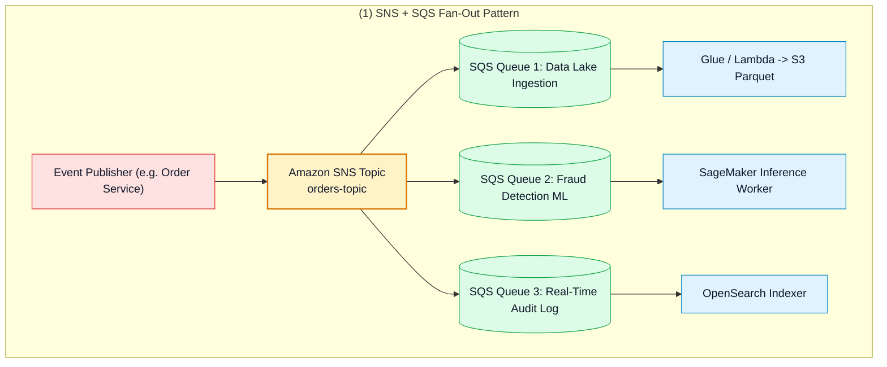
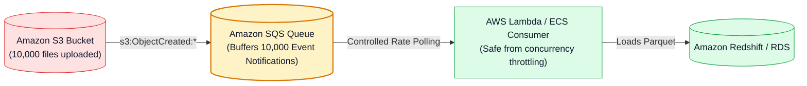
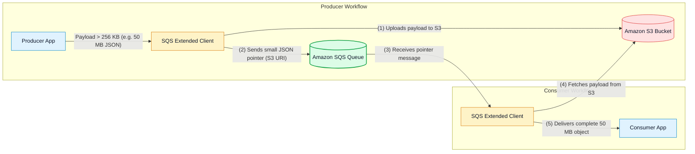

# 🔀 Amazon SQS Integration Patterns, SNS Fan-Out, S3 Events & Streaming Matrix

- **Category**: Application Integration / Distributed Patterns & Streaming Service Comparison
- **Language / ဘာသာစကား**: [English (Original)](/en/02-services/integration/sqs/sqs-integration-patterns-and-fanout) | **မြန်မာဘာသာ (Burmese)**
- **Primary Use Case**: SNS+SQS Fan-Out architecture ကို implement ပြုလုပ်ခြင်း၊ bursty ဖြစ်သော S3 event notifications များကို buffer ပြုလုပ်ခြင်း၊ SQS Extended Client Library ဖြင့် large payloads များကို ကိုင်တွယ်ခြင်း၊ နှင့် SQS အား Kinesis နှင့် MSK တို့နှင့် နှိုင်းယှဉ်သုံးသပ်ခြင်း။
- **Slide Reference**: Pages 499–525 in `[[AWSCertifiedDataEngineerSlides.pdf]]`
- **Hub Links**: `[[mm/index]]` | `[[mm/sqs]]` | `[[mm/sqs-standard-vs-fifo-queues]]` | `[[mm/s3-event-notifications]]` | `[[mm/kinesis]]` | `[[mm/msk]]`

---

## 1. High-Level Summary

Amazon SQS သည် resilient (ကြံ့ခိုင်မှုရှိပြီး) event-driven ဖြစ်သော data pipeline များကို တည်ဆောက်ရန်အတွက် အခြေခံအုတ်မြစ် (foundational building block) တစ်ခု ဖြစ်သည်။

**DEA-C01** စာမေးပွဲအတွက် **SNS+SQS Fan-Out**၊ **S3 File Upload Buffering**၊ **Database Protection အတွက် Buffer Leveling** စသည့် classic architectural design pattern များအပြင် **SQS သည် Kinesis Data Streams နှင့် Amazon MSK တို့နှင့် မည်သို့ကွဲပြား နှိုင်းယှဉ်နိုင်သည်** ကို သိရှိနားလည်ထားရန် လိုအပ်ပါသည်။

---

## 2. The SNS + SQS Fan-Out Architecture Pattern

Single event တစ်ခုကို သီးခြားလွတ်လပ်သော downstream application အများအပြားက asynchronous နည်းလမ်းဖြင့် process လုပ်ရန် လိုအပ်သောအခါ publisher အား queue အများအပြားနှင့် တိုက်ရိုက်ချိတ်ဆက်ခြင်းသည် tight coupling (အပြန်အလှန် မှီခိုမှု များပြားခြင်း) ကို ဖြစ်ပေါ်စေသည်။

### The Fan-Out Solution:
1. Publisher သည် single notification တစ်ခုကို **Amazon SNS Topic** သို့ ပေးပို့သည်။
2. **Amazon SQS Queue** အများအပြားက ထို SNS topic ကို subscribe ပြုလုပ်ထားသည်။
3. SNS သည် သက်ဆိုင်ရာ subscribed queue အားလုံးထံသို့ message ၏ copy များကို parallel အနေဖြင့် တစ်ပြိုင်နက် ပေးပို့ (deliver) သည်။
4. Queue တစ်ခုချင်းစီသည် ၎င်းတို့၏ ကိုယ်ပိုင် **Visibility Timeout**၊ **DLQ**၊ နှင့် consumer scaling policy များကို သီးခြားလွတ်လပ်စွာ configure ပြုလုပ်နိုင်သည်။
5. **SNS Subscription Filter Policies**: ကိုက်ညီသော subset event များကိုသာ သီးခြား queue များသို့ ရောက်ရှိစေရန် filter policy များကို သတ်မှတ်အသုံးပြုနိုင်သည် (ဥပမာ - high-value order $> \$10,000$ များကို executive audit queue သို့ route လုပ်ပေးခြင်း)။

---

## 3. S3 Event Notifications with SQS Buffering

စက္ကန့်ပိုင်းအတွင်း ဖိုင်ပေါင်း ထောင်နှင့်ချီ၍ Amazon S3 bucket ထဲသို့ upload ပြုလုပ်သည့်အခါ (ဥပမာ - IoT batch uploads သို့မဟုတ် midnight data exports များ) -

- S3 မှ Lambda သို့ တိုက်ရိုက် invoke ပြုလုပ်ခြင်း (Direct S3-to-Lambda invocation) သည် Lambda account concurrency limit များ ($1,000$ concurrent executions) ကို လျင်မြန်စွာ ကုန်ဆုံးသွားစေနိုင်သည်။
- **S3 နှင့် Lambda အကြားတွင် SQS Queue တစ်ခုကို ကြားခံထားရှိခြင်း (buffer)** ဖြင့် notifications များကို buffer လုပ်ပေးနိုင်ပြီး Lambda သည် **Event Source Mapping** (`BatchSize: 10`, `MaximumBatchingWindowInSeconds: 30`) ကို အသုံးပြုကာ message များကို ထိန်းညှိထားသော batch များဖြင့် အဆင်ပြေစွာ consume လုပ်နိုင်မည်ဖြစ်သည်။

---

## 4. Amazon SQS Extended Client Library for Large Payloads

- Message payload များသည် **SQS ၏ native limit ဖြစ်သော 256 KB** ထက် ကျော်လွန်ပါက **Amazon SQS Extended Client Library** (Java, Python နှင့် အခြား SDK များအတွက် ရရှိနိုင်သည်) ကို အသုံးပြုပါ။
- ဤ library သည် **2 GB** အထိရှိသော payload များကို Amazon S3 bucket ထဲသို့ အလိုအလျောက် offload (သိမ်းဆည်း) လုပ်ပေးပြီး၊ SQS queue မှတစ်ဆင့် S3 reference pointer ကို ပေးပို့ကာ၊ consumer ဘက်တွင် message ကို လက်ခံရရှိချိန်တွင် မူရင်း object အား transparent စွာ ပြန်လည်တည်ဆောက်ပေးပါသည်။

---

## 5. Definitive AWS Messaging & Streaming Comparison Matrix

| Evaluation Dimension | Amazon SQS | Amazon SNS | Amazon Kinesis Data Streams | Amazon MSK (Apache Kafka) |
| :--- | :--- | :--- | :--- | :--- |
| **Communication Model** | **Pull** (Consumers များက queue ကို poll လုပ်သည်)။ | **Push** (Subscribers များထံသို့ event များကို push လုပ်သည်)။ | **Pull / Enhanced Fan-Out Push** (Sharded stream)။ | **Pull** (Kafka consumer group offsets)။ |
| **Message Deletion** | Consumer မှ **Explicit deletion** ပြုလုပ်ရသည် (`DeleteMessage`)။ | No storage (ယာယီ notification သာဖြစ်သည်)။ | **Time-based retention** (Consumer အားလုံးအတွက် stream ထဲတွင် data ဆက်လက်တည်ရှိနေသည်)။ | **Time/Size retention** (Log ထဲတွင် data ဆက်လက်တည်ရှိနေသည်)။ |
| **Multiple Consumers** | **Competing Consumers** (Message ၁ ခုကို worker ၁ ယောက်ကသာ ဖတ်သည်)။ | **Fan-out** (Subscriber တိုင်း copy ၁ စုံစီ ရရှိသည်)။ | **Multiple independent consumer groups** များက stream တစ်ခုတည်းကို ဖတ်ရှုနိုင်သည် (Read same stream)။ | **Multiple consumer groups** များက topic partitions များကို ဖတ်ရှုနိုင်သည် (Read same partitions)။ |
| **Ordering** | FIFO Queue တွင်သာ ရရှိနိုင်သည် (`MessageGroupId` မှတစ်ဆင့်)။ | FIFO Topic တွင်သာ ရရှိနိုင်သည် (FIFO Topic only)။ | **Per-Shard ordering** (`PartitionKey` မှတစ်ဆင့်)။ | **Per-Partition ordering** (`Key` မှတစ်ဆင့်)။ |
| **Data Replayability** | **No** (Delete လုပ်ပြီးပါက message ပျောက်ကွယ်သွားသည်)။ | **No** (ယခင် event များကို ပြန်လည် replay လုပ်၍မရပါ)။ | **Yes** (24 နာရီ မှ 365 ရက် retention အတွင်း replay ပြုလုပ်နိုင်သည်)။ | **Yes** (Kafka consumer offsets များကို reset ပြုလုပ်ခြင်းဖြင့် replay ပြုလုပ်နိုင်သည်)။ |
| **Best Used For** | Asynchronous job queuing, worker task queues, microservices များအား decouple ပြုလုပ်ခြင်း။ | Multi-protocol alerts (Email/SMS), queue အများအပြားထံသို့ event များ broadcast လုပ်ခြင်း။ | Real-time analytics, continuous IoT ingestion, Flink streaming joins။ | Enterprise Kafka migrations, open-source ecosystem, custom Kafka Connectors။ |

---

## 6. DEA-C01 Exam Essentials

> [!IMPORTANT]
> **Key Exam Decision Triggers for Integration Patterns**:
>
> - **"Send a single transactional event to three different processing systems that scale independently"** $\rightarrow$ **Amazon SNS topic ဖြင့် Amazon SQS queue ၃ ခုထံ Fan-Out ပြုလုပ်ခြင်း** ကို အသုံးပြုပါ။
> - **"Prevent downstream Lambda functions from being overwhelmed by a sudden spike of 50,000 S3 file upload notifications"** $\rightarrow$ **S3 Event Notifications $\rightarrow$ Amazon SQS $\rightarrow$ Lambda Event Source Mapping** ကို configure ပြုလုပ်ပါ။
> - **"Send 10 MB payload messages through an SQS queue"** $\rightarrow$ **Amazon S3 နှင့် တွဲဖက်ထားသော Amazon SQS Extended Client Library** ကို အသုံးပြုပါ။
> - **"Replay data from 3 days ago for a newly developed analytics consumer"** $\rightarrow$ **Amazon Kinesis Data Streams** သို့မဟုတ် **Amazon MSK** ကို ရွေးချယ်ပါ (SQS သည် delete လုပ်ပြီးသော message များကို replay မလုပ်နိုင်ပါ)။

---

## 📌 Related Notes
- `[[mm/sqs]]` — SQS Master Hub
- `[[mm/sqs-standard-vs-fifo-queues]]` — Standard vs FIFO Queues
- `[[mm/s3-event-notifications]]` — S3 Event Triggers
- `[[mm/kinesis]]` — Kinesis Data Streams
- `[[mm/msk]]` — Amazon Managed Streaming for Apache Kafka
