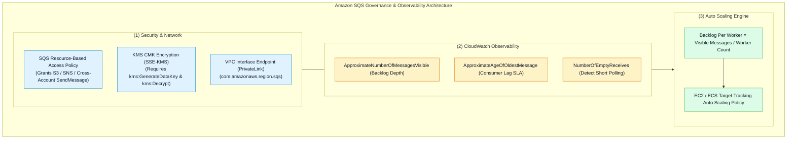
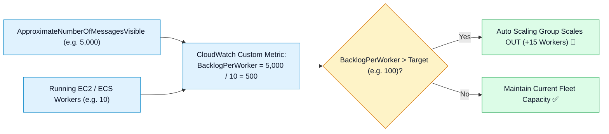

# 🛡️ Amazon SQS Security, CloudWatch Monitoring, Auto Scaling & Troubleshooting

- **Category**: Application Integration / Security Governance, Observability & Production Triage
- **Language / ဘာသာစကား**: [English (Original)](/en/02-services/integration/sqs/sqs-security-monitoring-and-troubleshooting) | **မြန်မာဘာသာ (Burmese)**
- **Primary Use Case**: Access Policies နှင့် KMS encryption ဖြင့် queue များကို လုံခြုံအောင် ပြုလုပ်ခြင်း၊ CloudWatch ဖြင့် backlog depth နှင့် message age ကို စောင့်ကြည့်ခြင်း၊ Backlog per Worker မှတစ်ဆင့် worker fleets များကို auto scale ပြုလုပ်ခြင်းနှင့် production failures များကို ဖြေရှင်းခြင်း (troubleshooting)။
- **Slide Reference**: Pages 499–525 in `[AWSCertifiedDataEngineerSlides.pdf](/docs/AWSCertifiedDataEngineerSlides.pdf)`
- **Hub Links**: `[[mm/index|index]]` | `[[mm/02-services/integration/sqs/sqs|sqs]]` | `[[mm/02-services/integration/sqs/sqs-timing-parameters-and-polling|sqs-timing-parameters-and-polling]]` | `[[mm/02-services/integration/sqs/sqs-dead-letter-queues-and-error-handling|sqs-dead-letter-queues-and-error-handling]]` | `[[mm/01-domains/domain-3-data-operations-and-support|domain-3-data-operations-and-support]]`

---

## 1. High-Level Summary

Production ပတ်ဝန်းကျင်တွင် Amazon SQS ကို စီမံခန့်ခွဲ လည်ပတ်ရာ၌ **Queue Access Policies**၊ **KMS encryption permissions**၊ **CloudWatch backlog metrics** နှင့် **Auto Scaling algorithms** များကို နက်နက်ရှိုင်းရှိုင်း နားလည်ထားရန် လိုအပ်ပါသည်။

**DEA-C01** စာမေးပွဲအတွက် EC2/ECS consumer များကို **Backlog per Worker** custom metric အသုံးပြု၍ scale ပြုလုပ်ပုံ၊ S3 bucket event delivery permissions ပေးအပ်ပုံနှင့် **FIFO queues များအတွင်း head-of-line blocking ဖြစ်ပေါ်မှုကို ဖြေရှင်းပုံ** များကို မဖြစ်မနေ သိရှိထားရမည် ဖြစ်ပါသည်။



---

## 2. SQS Security & Access Policies

### 1. Resource-Based Queue Access Policy:
ပြင်ပ service တစ်ခု (ဥပမာ - Amazon S3 သို့မဟုတ် Amazon SNS) သို့မဟုတ် အခြားသော AWS account တစ်ခုမှ မိမိ၏ queue သို့ messages များ ပေးပို့ခွင့်ပြုရန် **SQS Access Policy** တစ်ခုကို ချိတ်ဆက်သတ်မှတ်ပါ (attach):

```json
{
  "Version": "2012-10-17",
  "Statement": [
    {
      "Sid": "AllowS3ToPublishToQueue",
      "Effect": "Allow",
      "Principal": {
        "Service": "s3.amazonaws.com"
      },
      "Action": "sqs:SendMessage",
      "Resource": "arn:aws:sqs:us-east-1:123456789012:data-ingestion-queue",
      "Condition": {
        "ArnEquals": {
          "aws:SourceArn": "arn:aws:s3:::my-production-data-lake-bucket"
        }
      }
    }
  ]
}
```

---

### 2. Encryption (SSE-SQS vs. SSE-KMS):
- **SSE-SQS**: ထပ်ဆောင်းကုန်ကျစရိတ် (additional cost) မရှိဘဲ SQS မှ တိုက်ရိုက်စီမံခန့်ခွဲပေးသော 256-bit AES keys များဖြင့် ဆောင်ရွက်သည့် default server-side encryption ဖြစ်သည်။
- **SSE-KMS**: AWS Key Management Service Customer Managed Keys (CMK) များကို အသုံးပြုသည်။
  - *Exam Gotcha*: SSE-KMS ကို enable ပြုလုပ်ထားပါက producing service (ဥပမာ - S3 သို့မဟုတ် SNS) နှင့် consumer (ဥပမာ - Lambda သို့မဟုတ် EC2) တို့သည် KMS Key Policy တွင် `kms:GenerateDataKey` နှင့် `kms:Decrypt` permissions များ မဖြစ်မနေ ရှိထားရမည် ဖြစ်သည်!

---

## 3. Critical CloudWatch Metrics for SQS

| CloudWatch Metric | Description | What It Signifies / Operational Alarm |
| :--- | :--- | :--- |
| **`ApproximateNumberOfMessagesVisible`** | Queue အတွင်းမှ ထုတ်ယူဖတ်ရှုရန် အသင့်ရှိနေသော message အရေအတွက်။ | **Primary Backlog Metric**: Consumer Auto Scaling အတွက် အခြေခံအဖြစ် အသုံးပြုသည်။ |
| **`ApproximateNumberOfMessagesNotVisible`** | လောလောဆယ် in-flight ဖြစ်နေသော (Visibility Timeout အောက်တွင် consumers များ process လုပ်နေဆဲဖြစ်သော) message အရေအတွက်။ | တန်ဖိုးများပြားနေပါက consumers များသည် တက်ကြွစွာ အလုပ်လုပ်နေကြောင်း သို့မဟုတ် visibility timeout ကြာမြင့်လွန်းနေကြောင်း ဖော်ပြသည်။ |
| **`ApproximateAgeOfOldestMessage`** | Consume မလုပ်ရသေးဘဲ ကျန်ရှိနေသော သက်တမ်းအရင့်ဆုံး message ၏ အချိန် (စက္ကန့်ဖြင့်)။ | **SLA Alert**: ဤတန်ဖိုး ရုတ်တရက်မြင့်တက်လာပါက consumers များသည် နောက်ကျကျန်နေခြင်း (falling behind) သို့မဟုတ် poison pills ကြောင့် ရပ်တန့်သွားခြင်း ဖြစ်နိုင်သည်။ |
| **`NumberOfEmptyReceives`** | မည်သည့် message မျှ မရရှိခဲ့သော (zero messages) `ReceiveMessage` API calls အရေအတွက်။ | **Cost Indicator**: တန်ဖိုးများပြားနေပါက Short Polling အသုံးပြုနေကြောင်း ဖော်ပြပြီး Long Polling သို့ ပြောင်းလဲသင့်သည်။ |

---

## 4. Consumer Fleet Auto Scaling: Backlog per Worker

EC2 သို့မဟုတ် ECS consumer fleets များကို CPU utilization အပေါ်တွင်သာ အခြေခံ၍ scale ပြုလုပ်ခြင်းသည် မှားယွင်းနိုင်ပါသည်၊ အကြောင်းမှာ queue အတွင်း message ထောင်ပေါင်းများစွာ စုပုံနေသော်လည်း worker CPU မှာ နည်းပါးနေနိုင်သောကြောင့် ဖြစ်သည်။

### The Correct Formula: Backlog Per Worker
$$\text{Backlog Per Worker} = \frac{\text{ApproximateNumberOfMessagesVisible}}{\text{Running Worker Count}}$$



1. `BacklogPerWorker` ကို တွက်ချက်ပေးသည့် CloudWatch custom metric တစ်ခုကို ထုတ်ပြန်ပါ (publish)။
2. EC2 Auto Scaling သို့မဟုတ် ECS Service Auto Scaling တွင် instance တစ်ခုချင်းစီအတွက် လက်ခံနိုင်သော backlog ပမာဏ (ဥပမာ - worker တစ်ခုလျှင် 100 messages) ကို ပစ်မှတ်ထားသည့် **Target Tracking Auto Scaling Policy** တစ်ခုကို configure ပြုလုပ်ပါ။

---

## 5. Master Troubleshooting Cheat Sheet

| Symptom / Production Issue | Root Cause | Remediation / Long-Term Fix |
| :--- | :--- | :--- |
| **Duplicate processing of the same message** | Visibility Timeout သည် processing time ထက် ပိုမိုတိုတောင်းနေခြင်း။ | မူလ Visibility Timeout ကို တိုးမြှင့်ပါ သို့မဟုတ် heartbeat thread တစ်ခုအတွင်း `ChangeMessageVisibility` ကို အခါအားလျော်စွာ ခေါ်ယူပါ (periodically call)။ |
| **S3 bucket cannot deliver event notifications to SQS** | SQS queue access policy တွင် S3 service principal permissions ပျောက်ဆုံးနေခြင်း။ | `s3.amazonaws.com` အား `aws:SourceArn` condition ဖြင့် `sqs:SendMessage` ပြုလုပ်ခွင့်ပေးရန် SQS Access Policy ကို update လုပ်ပါ။ |
| **`AccessDenied` when publishing to KMS-encrypted queue** | IAM role သို့မဟုတ် S3 service တွင် KMS key policy ပေါ်၌ `kms:GenerateDataKey` permission မရှိခြင်း။ | Producer အား data keys များကို encrypt လုပ်ခွင့်ပြုရန် KMS Key Policy ကို update လုပ်ပါ။ |
| **Head-of-line blocking in FIFO queue** | သတ်မှတ်ထားသော `MessageGroupId` တစ်ခုအတွင်းရှိ poison pill message တစ်ခုသည် ထပ်ခါတလဲလဲ fail ဖြစ်နေခြင်း။ | မအောင်မြင်သော message ကို သီးခြားခွဲထုတ်နိုင်ရန် `maxReceiveCount` ဖြင့် **FIFO Dead-Letter Queue (DLQ)** တစ်ခုကို configure ပြုလုပ်ပါ၊ သို့မှသာ အဆိုပါ group အတွင်းရှိ နောက်ဆက်တွဲ messages များ ရှေ့ဆက်လုပ်ဆောင်နိုင်မည် ဖြစ်သည်။ |
| **High SQS API costs with mostly empty responses** | Short Polling ကို configure လုပ်ထားခြင်း (`WaitTimeSeconds = 0`)။ | Queue ပေါ်တွင် `ReceiveMessageWaitTimeSeconds = 20` သတ်မှတ်ခြင်းဖြင့် **Long Polling** ကို enable ပြုလုပ်ပါ။ |

---

## 6. DEA-C01 Exam Essentials

> [!IMPORTANT]
> **Security, Monitoring & Scaling အတွက် Key Exam Decision Triggers များ**:
>
> - **"Instance CPU utilization အစား queue depth အပေါ် အခြေခံ၍ EC2 worker fleet ကို scale ပြုလုပ်ရန်"** $\rightarrow$ **Backlog per Worker** (`ApproximateNumberOfMessagesVisible / InstanceCount`) အတွက် custom CloudWatch metric တစ်ခု ဖန်တီးပြီး **Target Tracking Scaling Policy** တစ်ခုကို ချိတ်ဆက်ပါ။
> - **"S3 Event Notification သည် Access Denied ဖြင့် မအောင်မြင်ဖြစ်နေခြင်း"** $\rightarrow$ `s3.amazonaws.com` အား `sqs:SendMessage` ခေါ်ယူခွင့်ပြုသည့် **SQS Queue Policy** တစ်ခုကို ချိတ်ဆက်သတ်မှတ်ပါ (attach)။
> - **"Processing SLA thresholds များကို ကျော်လွန်နေသော messages များကို ထောက်လှမ်းရန်"** $\rightarrow$ **`ApproximateAgeOfOldestMessage`** ပေါ်တွင် CloudWatch Alarm တစ်ခု သတ်မှတ်ပါ။
> - **"Process လုပ်၍မရသော transaction တစ်ခုတည်းကြောင့် FIFO Queue ပိတ်ဆို့နေခြင်း"** $\rightarrow$ `MessageGroupId` ပိတ်ဆို့မှုကို ဖြေရှင်းရန် နည်းပါးသော `maxReceiveCount` (ဥပမာ - 3) ဖြင့် **FIFO Dead-Letter Queue (DLQ)** တစ်ခုကို configure ပြုလုပ်ပါ။

---

## 📌 Related Notes
- `[[mm/02-services/integration/sqs/sqs|sqs]]` — SQS Master Hub
- `[[mm/02-services/integration/sqs/sqs-standard-vs-fifo-queues|sqs-standard-vs-fifo-queues]]` — Standard vs FIFO Architecture
- `[[mm/02-services/integration/sqs/sqs-timing-parameters-and-polling|sqs-timing-parameters-and-polling]]` — Visibility Timeouts & Polling
- `[[mm/02-services/integration/sqs/sqs-dead-letter-queues-and-error-handling|sqs-dead-letter-queues-and-error-handling]]` — DLQ Configuration & Redrive
- `[[mm/01-domains/domain-3-data-operations-and-support|domain-3-data-operations-and-support]]` — CloudWatch & Operational Excellence
