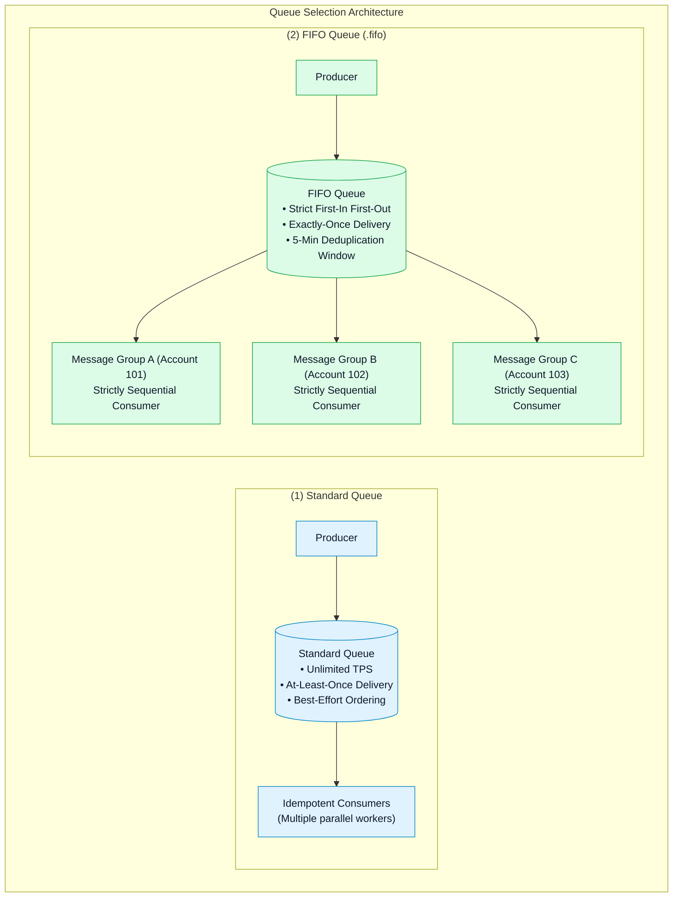
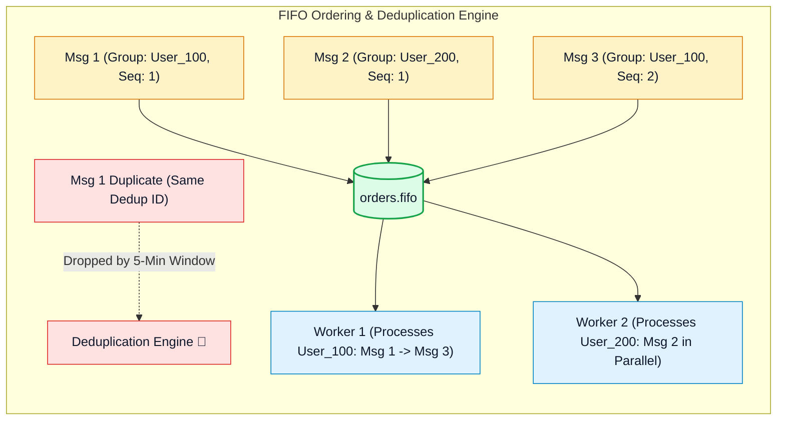

# ⚖️ Amazon SQS Standard vs. FIFO Queues, Message Grouping & Deduplication

- **Category**: Application Integration / Message Ordering & Delivery Semantics
- **Language / ဘာသာစကား**: [English (Original)](/en/02-services/integration/sqs/sqs-standard-vs-fifo-queues) | **မြန်မာဘာသာ (Burmese)**
- **Primary Use Case**: Standard နှင့် FIFO queue semantics အကြား ရွေးချယ်ခြင်း၊ အစဉ်လိုက် parallel processing ပြုလုပ်နိုင်ရန် Message Group IDs များ configure လုပ်ခြင်း၊ Content-Based Deduplication ကို enable လုပ်ခြင်း နှင့် High-Throughput FIFO mode ဖြင့် scale ပြုလုပ်ခြင်း။
- **Slide Reference**: `[[AWSCertifiedDataEngineerSlides.pdf]]` မှ Pages 499–525
- **Hub Links**: `[[mm/index]]` | `[[sqs]]` | `[[sqs-timing-parameters-and-polling]]` | `[[sqs-dead-letter-queues-and-error-handling]]`

---

## 1. High-Level Summary (အကျဉ်းချုပ် ခြုံငုံသုံးသပ်ချက်)

မှန်ကန်သင့်လျော်သော Amazon SQS queue အမျိုးအစားကို ရွေးချယ်ခြင်းသည် AWS data engineering တွင် အရေးအကြီးဆုံး architectural decisions များထဲမှ တစ်ခုဖြစ်ပါသည်။

- **Standard Queues** သည် **unlimited throughput** နှင့် **at-least-once delivery** ကို ထောက်ပံ့ပေးသော်လည်း message များ ရောက်ရှိသည့် order (အစီအစဉ်) ကို တင်းကျပ်စွာ အာမမခံပါ။
- **FIFO (First-In, First-Out) Queues** သည် **strict ordering** (တင်းကျပ်သော အစီအစဉ်အတိုင်း ရောက်ရှိခြင်း) နှင့် **exactly-once processing** (တစ်ကြိမ်သာ တိကျစွာ လုပ်ဆောင်ခြင်း) ကို အာမခံပြီး၊ group တစ်ခုချင်းစီအလိုက် order ကို ထိန်းသိမ်းထားရင်း မတူညီသော သီးခြား entities များအကြား parallel processing လုပ်ဆောင်နိုင်ရန် **Message Group IDs** ကို အသုံးပြုပါသည်။

---

## 2. Standard Queues အသေးစိတ်လေ့လာခြင်း (Standard Queues Deep Dive)

### 1. Unlimited Throughput:
Standard queues များသည် တစ်စက္ကန့်လျှင် API calls အရေအတွက် အကန့်အသတ်မရှိနီးပါး (`SendMessage`, `ReceiveMessage`, `DeleteMessage`) ထောက်ပံ့ပေးနိုင်သောကြောင့် high-velocity telemetry၊ clickstream buffering နှင့် ကြီးမားကျယ်ပြန့်သော web scraping လုပ်ငန်းဆောင်တာများ (workloads) အတွက် အထူးသင့်လျော်ပါသည်။

### 2. At-Least-Once Delivery & Idempotency:
SQS သည် AWS Region တစ်ခုအတွင်းရှိ redundant servers အများအပြားတွင် messages မိတ္တူများကို သိမ်းဆည်းထားသောကြောင့် network delays သို့မဟုတ် server failures များကြောင့် message တစ်ခုသည် တစ်ကြိမ်ထက်ပို၍ deliver ဖြစ်သွားနိုင်ပါသည်။

> [!IMPORTANT]
> **Idempotent Consumers**: Standard SQS queues မှ messages များကို process လုပ်သော consumers များသည် **idempotent** ဖြစ်ရန် မဖြစ်မနေ လိုအပ်ပါသည် (တူညီသော message ကို နှစ်ကြိမ်တိုင်တိုင် process လုပ်ခဲ့လျှင်ပင် မလိုလားအပ်သော ဘေးထွက်ဆိုးကျိုးများမရှိဘဲ တူညီသောရလဒ်ကိုသာ ထွက်ပေါ်စေရမည်ဖြစ်သည်၊ ဥပမာ - သာမန် `INSERT` အစား SQL တွင် `UPSERT` / `MERGE` ကို အသုံးပြုခြင်း)။

---

## 3. FIFO Queues အသေးစိတ်လေ့လာခြင်း (FIFO Queues Deep Dive)

Amazon SQS FIFO queues များကို လုပ်ငန်းဆောင်တာများနှင့် ဖြစ်ရပ်များ၏ အစီအစဉ် (order of operations and events) အလွန်အရေးကြီးပြီး duplicate data (ဒေတာထပ်နေခြင်း) ကြောင့် data corruption ဖြစ်ပေါ်နိုင်သော applications များအတွက် ရည်ရွယ်ထုတ်လုပ်ထားပါသည် (ဥပမာ - banking transactions၊ inventory adjustments နှင့် change data capture streams များ)။

### 1. Queue Naming Requirement:
SQS FIFO queue တစ်ခု၏ အမည်သည် **`.fifo` suffix ဖြင့် မဖြစ်မနေ အဆုံးသတ်ရမည်** ဖြစ်ပါသည် (ဥပမာ - `financial-transactions.fifo`)။

### 2. Message Group ID (Parallelism with Per-Group Ordering):
- `MessageGroupId` သည် **partition key** အဖြစ် လုပ်ဆောင်ပေးသော မဖြစ်မနေ ထည့်သွင်းရမည့် tag တစ်ခု ဖြစ်ပါသည်။
- တူညီသော **`MessageGroupId` တစ်ခုတည်းရှိသည့်** messages များကို **strict FIFO sequence** အတိုင်း တစ်ခုပြီးမှတစ်ခု တင်းကျပ်စွာ deliver လုပ်ပြီး process လုပ်ရန် အာမခံပါသည်။
- မတူညီသော **`MessageGroupId` များရှိသည့်** messages များကိုမူ multiple consumer threads များဖြင့် **တစ်ပြိုင်နက်တည်း ပြိုင်တူ (concurrently in parallel)** consume လုပ်ပြီး process ပြုလုပ်နိုင်ပါသည်။
- *Best Practice*: Customer transactions များကို အခြားသော customers များအတွက် bottleneck မဖြစ်စေဘဲ စဉ်ဆက်မပြတ် sequential အတိုင်း process လုပ်နိုင်ရန်အတွက် `MessageGroupId = CustomerId` သို့မဟုတ် `AccountId` အဖြစ် သတ်မှတ်ပေးပါ။

### 3. Exactly-Once Delivery & Deduplication ID:
SQS FIFO queues သည် **5-minute deduplication window** ကို ကျင့်သုံးပါသည်။ အကယ်၍ တူညီသော deduplication ID ရှိသည့် message တစ်ခုကို ၅ မိနစ်အတွင်း ထပ်မံပေးပို့ပါက SQS သည် request ကို လက်ခံသော်လည်း ထပ်နေသော duplicate message ကို လျစ်လျူရှု (ignore) ဖယ်ထုတ်ပေးပါသည်။

Deduplication နည်းလမ်း ၂ မျိုး ရှိပါသည်-
1. **Explicit Deduplication ID**: Producer ဘက်မှ သီးသန့်ဖြစ်သော `MessageDeduplicationId` တစ်ခုကို တိုက်ရိုက်သတ်မှတ် ပေးပို့ခြင်း (ဥပမာ - transaction hash, UUID သို့မဟုတ် order ID)။
2. **Content-Based Deduplication**: SQS မှ deduplication ID ကို အလိုအလျောက် ထုတ်ယူနိုင်ရန် message body တစ်ခုလုံး၏ **SHA-256 hash** ကို အလိုအလျောက် တွက်ချက်ဖန်တီးပေးခြင်း။

---

## 4. Standard vs. High-Throughput FIFO Mode

| Dimension (အတိုင်းအတာ) | Standard FIFO Queue | High-Throughput FIFO Queue |
| :--- | :--- | :--- |
| **Throughput without Batching** | **300 transactions / sec** | Up to **7,000 transactions / sec** အထိ |
| **Throughput with Batching (10 msg/batch)** | **3,000 transactions / sec** | Up to **70,000 transactions / sec** အထိ |
| **Configuration** | Default FIFO setting ဖြစ်သည်။ | SQS console / API တွင် **High throughput for FIFO queue** ကို enable လုပ်ပါ (`DeduplicationScope = messageGroup` နှင့် `FifoThroughputLimit = perMessageGroupId`)။ |
| **Requirement for Scaling** | Single queue partition ဖြစ်သည်။ | Internal partitions များအနှံ့ load ကို ခွဲဝေဖြန့်ကြက်နိုင်ရန် **Message Group IDs ၏ high cardinality** (ကွဲပြားခြားနားသော Group ID အရေအတွက် များပြားခြင်း) လိုအပ်ပါသည်။ |

---

## 5. Standard vs. FIFO Queue နှိုင်းယှဉ်ချက် (Standard vs. FIFO Queue Definitive Comparison)

| Architecture Feature | Standard Queue | FIFO Queue |
| :--- | :--- | :--- |
| **Throughput Capacity** | အကန့်အသတ်မရှိ (Unlimited)။ | 300 မှ 70,000 TPS အထိ (High-Throughput mode ဖြင့်)။ |
| **Ordering** | အတတ်နိုင်ဆုံး ကြိုးပမ်းပေးခြင်း (Best-effort - အစီအစဉ် လွဲချော်နိုင်သည်)။ | တင်းကျပ်စွာ အာမခံသည် (Strictly guaranteed - First-In, First-Out)။ |
| **Duplicates** | အနည်းဆုံး တစ်ကြိမ် ရောက်ရှိနိုင်သည် (At-least-once - Duplicates ဖြစ်နိုင်သည်)။ | တစ်ကြိမ်သာ တိကျစွာ ရောက်ရှိသည် (Exactly-once - 5-minute deduplication window)။ |
| **Message Group ID** | ထောက်ပံ့မထားပါ (Not supported)။ | **မဖြစ်မနေ လိုအပ်သည် (Mandatory)** (ordered stream ကို သတ်မှတ်သည်)။ |
| **Deduplication ID** | ထောက်ပံ့မထားပါ (Not supported)။ | **မဖြစ်မနေ လိုအပ်သည် (Mandatory)** (explicit သို့မဟုတ် Content-Based SHA-256)။ |
| **Pricing** | Requests ၁ သန်းလျှင် \$0.40 (\$0.40 per million requests)။ | Requests ၁ သန်းလျှင် \$0.50 (\$0.50 per million requests)။ |
| **Target Workload** | High-volume decoupled microservices များ၊ S3 file ingestion buffers များ။ | Bank account ledger updates များ၊ e-commerce order processing၊ state machines များ။ |

---

## 6. DEA-C01 စာမေးပွဲအတွက် အဓိကအချက်များ (DEA-C01 Exam Essentials)

> [!IMPORTANT]
> **Key Exam Decision Triggers for Queue Types**:
>
> - **"Need strictly ordered message processing where duplicate events cannot be tolerated"** $\rightarrow$ `.fifo` suffix ပါဝင်သော **SQS FIFO Queue** ကို ရွေးချယ်ပါ။
> - **"Process thousands of customer transactions concurrently while guaranteeing that no single customer's transactions are processed out of order"** $\rightarrow$ `MessageGroupId = CustomerId` ဖြင့် **SQS FIFO Queue** ကို အသုံးပြုပါ။
> - **"Prevent duplicate message ingestion without generating custom UUIDs on the producer"** $\rightarrow$ SQS FIFO queue ပေါ်တွင် **Content-Based Deduplication** ကို enable လုပ်ပါ။
> - **"Scale FIFO queue throughput beyond 3,000 TPS"** $\rightarrow$ `DeduplicationScope = messageGroup` ဖြင့် **High Throughput FIFO mode** ကို enable လုပ်ပြီး `MessageGroupId` ၏ high cardinality ရှိစေရန် သေချာပါစေ။
> - **"Standard Queue Duplicate Handling"** $\rightarrow$ Standard Queues ကို အသုံးပြုသည့်အခါ downstream consumers များကို **idempotent** ဖြစ်အောင် ဒီဇိုင်းဆွဲပါ။

---

## 📌 ဆက်စပ်မှတ်စုများ (Related Notes)
- `[[sqs]]` — SQS Master Hub
- `[[sqs-timing-parameters-and-polling]]` — Visibility Timeouts & Long Polling
- `[[sqs-dead-letter-queues-and-error-handling]]` — DLQs and Poison Pill Isolation
- `[[lambda]]` — SQS Batch Size and Scaling
