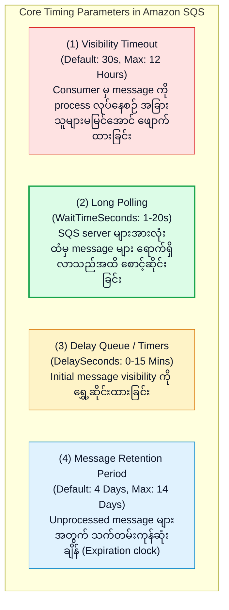
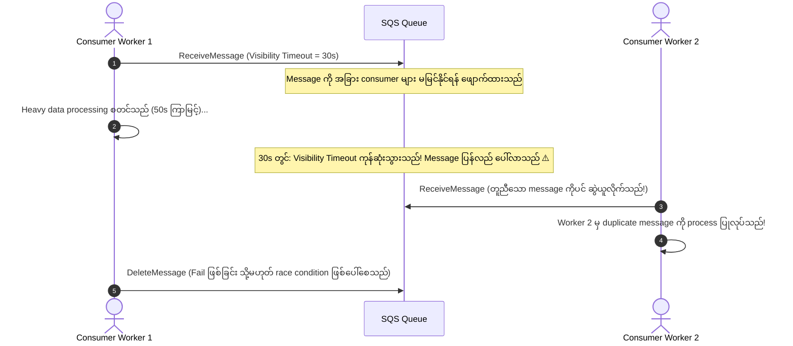
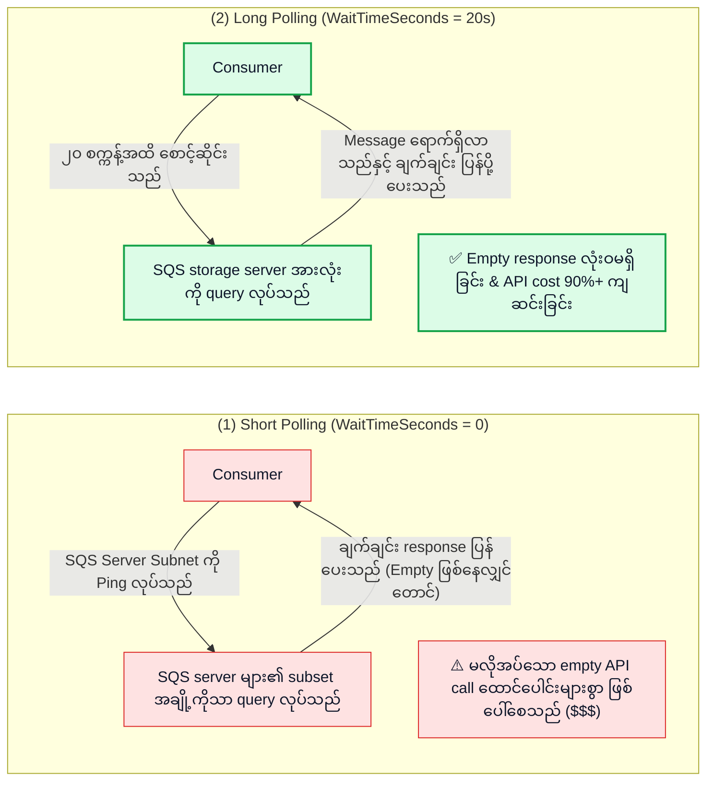

# ⏱️ Amazon SQS Timing Parameters, Visibility Timeout, Long Polling & Delay Queues

- **Category**: Application Integration / Queue Mechanics & Consumer Optimization
- **Language / ဘာသာစကား**: [English (Original)](/en/02-services/integration/sqs/sqs-timing-parameters-and-polling) | **မြန်မာဘာသာ (Burmese)**
- **Primary Use Case**: Duplicate processing မဖြစ်စေရန် visibility timeouts များကို configure ပြုလုပ်ခြင်း၊ long-running ETL job များအတွက် `ChangeMessageVisibility` ကို implement ပြုလုပ်ခြင်း၊ Long Polling ဖြင့် cost များကို လျှော့ချခြင်း နှင့် Delay Queues များကို configure ပြုလုပ်ခြင်း။
- **Slide Reference**: Pages 499–525 in `[[AWSCertifiedDataEngineerSlides.pdf]]`
- **Hub Links**: `[[mm/index]]` | `[[sqs]]` | `[[sqs-standard-vs-fifo-queues]]` | `[[sqs-dead-letter-queues-and-error-handling]]`

---

## 1. High-Level Summary

Amazon SQS တွင် timing parameters များကို စနစ်တကျ ချိန်ညှိခြင်း (fine-tuning) ပြုလုပ်ခြင်းသည် message processing လုပ်ငန်းစဉ်များကို ပိုမိုထိရောက်စေခြင်း၊ consumer failure များဖြစ်ပေါ်ပါက resilient ဖြစ်စေခြင်း နှင့် cost-effective ဖြစ်စေခြင်းတို့ကို သေချာစေပါသည်။

**DEA-C01** စာမေးပွဲအတွက် **Visibility Timeout mechanics** များ၊ **`ChangeMessageVisibility`** ကို မည်သည့်အချိန်တွင် call လုပ်ရမည်၊ **Long Polling** သည် empty response များကို မည်သို့ ဖယ်ရှားပေးပြီး cloud bill ကုန်ကျစရိတ်များကို မည်သို့ လျှော့ချပေးပုံ၊ နှင့် **Delay Queues** သည် message availability ကို မည်သို့ ရွှေ့ဆိုင်း (postpone) ပေးပုံတို့ကို ကျွမ်းကျင်စွာ နားလည်ထားရပါမည်။



---

## 2. Visibility Timeout & `ChangeMessageVisibility`

### 1. Visibility Timeout Mechanics:
- Consumer တစ်ခုသည် `ReceiveMessage` ကို အသုံးပြု၍ message တစ်ခုကို ရယူသည့်အခါ ထို message သည် **delete ဖြစ်သွားခြင်း မရှိသေးပါ**။
- ယင်းအစား SQS သည် ထို message ကို သတ်မှတ်ထားသော **Visibility Timeout** ကြာချိန်အတွင်း အခြားသော consumer များ မမြင်နိုင်အောင် ဖျောက်ထား (invisible ဖြစ်အောင် ပြုလုပ်) ပေးထားပါသည် (Default: **30 seconds**; Range: **0 seconds မှ 12 hours အထိ**).
- **အောင်မြင်စွာ Process ပြုလုပ်နိုင်ခြင်း (Successful Processing)**: Consumer သည် data processing လုပ်ငန်းစဉ် ပြီးဆုံးသွားသည့်အခါ timeout မကုန်ဆုံးမီ `DeleteMessage` ကို ခေါ်ယူ၍ queue ထဲမှ delete လုပ်ပါသည်။
- **Consumer Failure ဖြစ်ခြင်း / Timeout ကုန်ဆုံးသွားခြင်း (Consumer Failure / Timeout Expiration)**: အကယ်၍ consumer သည် crash ဖြစ်သွားခြင်း သို့မဟုတ် message ကို delete မလုပ်နိုင်မီ visibility timeout ကုန်ဆုံးသွားပါက ထို message သည် queue ထဲတွင် ပြန်လည် ပေါ်လာမည်ဖြစ်ပြီး အခြား consumer တစ်ခုမှ ယူငင် process ပြုလုပ်နိုင်မည် ဖြစ်ပါသည်။



---

### 2. Preventing Duplicate Processing: `ChangeMessageVisibility`
ကြာချိန် မခန့်မှန်းနိုင်သော သို့မဟုတ် heavy ဖြစ်သော data job များ (ဥပမာ - large file decompression, OCR, သို့မဟုတ် complex transformations များ) ကို process လုပ်ဆောင်သည့်အခါ worker သည် **`ChangeMessageVisibility`** API ကို ခေါ်ယူခြင်းဖြင့် message ပေါ်ရှိ lock ကြာချိန် (visibility timeout) ကို အချိန်အပိုင်းအခြားအလိုက် တိုးမြှင့် (extend) နိုင်ပါသည်-

```python
import boto3

sqs = boto3.client('sqs')

# Dynamically extend visibility timeout by another 60 seconds
sqs.change_message_visibility(
    QueueUrl='https://sqs.us-east-1.amazonaws.com/123456789012/my-queue',
    ReceiptHandle=message['ReceiptHandle'],
    VisibilityTimeout=60
)
```

> [!TIP]
> **Production Best Practice**: Job သည် actively run နေဆဲကာလအတွင်း consumer application ထဲတွင် စက္ကန့် ၂၀ တိုင်း `ChangeMessageVisibility` ကို call ပေးသည့် background heartbeat thread တစ်ခုကို implement ပြုလုပ်ထားပါ။

---

## 3. Short Polling vs. Long Polling



| Dimension | Short Polling (`WaitTimeSeconds = 0`) | Long Polling (`WaitTimeSeconds = 1 to 20`) |
| :--- | :--- | :--- |
| **Server Query Scope** | SQS distributed server များထဲမှ subset အချို့ကိုသာ sample ယူ၍ ရှာဖွေသည်။ | Fleet တစ်ခုလုံးရှိ **SQS storage server အားလုံး** ကို query လုပ်သည်။ |
| **Response Behavior** | Message ရှာမတွေ့ပါကလည်း ချက်ချင်း response ပြန်ပေးသည် (**Empty Response**)။ | Response မပြန်မီ message ရောက်ရှိလာစေရန် ၂၀ စက္ကန့်အထိ စောင့်ဆိုင်းသည်။ |
| **Cost & Efficiency** | မကြာခဏ empty polling loop များဖြစ်ပေါ်သဖြင့် API invocation cost မြင့်မားသည်။ | **အလွန် cost-effective ဖြစ်သည်**: Empty response များကို ဖယ်ရှားပေးပြီး API request အရေအတွက်ကို သိသိသာသာ လျှော့ချပေးသည်။ |
| **Configuration** | Wait time သတ်မှတ်မထားပါက အလုပ်လုပ်သော default behavior ဖြစ်သည်။ | Queue property `ReceiveMessageWaitTimeSeconds` သို့မဟုတ် API parameter `WaitTimeSeconds` ဖြင့် configure လုပ်သည်။ |

---

## 4. Delay Queues vs. Message Timers

Downstream system များတွင် cooldown သို့မဟုတ် warm-up period လိုအပ်သည့်အခါ Amazon SQS သည် new message များ၏ visibility ကို ရွှေ့ဆိုင်း (postpone) ပေးနိုင်စေပါသည်-

| Feature | Scope | Configuration | Common Use Case |
| :--- | :--- | :--- | :--- |
| **Delay Queue** | **Queue-Wide**: Queue ထဲသို့ ရောက်ရှိလာသော **new message အားလုံး** ၏ visibility ကို ရွှေ့ဆိုင်းပေးသည်။ | `DelaySeconds` (0 seconds မှ 15 minutes အထိ, Default: 0). | Background job များကို မ run မီ downstream microservices များ relational database ကို update လုပ်ရန် အချိန်ရစေခြင်း။ |
| **Message Timer** | **Per-Message**: **သီးခြား message တစ်ခုတည်း (single specific message)** ၏ visibility ကိုသာ ရွှေ့ဆိုင်းပေးသည်။ | Producer မှ `SendMessage` API call တွင် `DelaySeconds` (0 မှ 15 minutes) ထည့်သွင်းပေးပို့သည်။ | Retry attempt များကို schedule ဆွဲခြင်း သို့မဟုတ် notification များကို အချိန်ခွဲခြား ပေးပို့ခြင်း (staggered notification dispatches)။ |

> [!NOTE]
> SQS FIFO Queues များသည် queue level တွင် Delay Queues များကို support လုပ်သော်လည်း **per-message Message Timers များကိုမူ support မလုပ်ပါ**!

---

## 5. Message Retention & Payload Size Limits

1. **Message Retention Period**:
   - **1 minute မှ 14 days အထိ** စိတ်ကြိုက် configure လုပ်နိုင်ပါသည် (Default: **4 days**).
   - Message တစ်ခုသည် retention period သက်တမ်း ကုန်ဆုံးသွားပါက SQS သည် DLQ သို့ မပို့ဘဲ queue ထဲမှ အပြီးတိုင် ဖျက်ပစ် (permanently purge) ပါသည်။
2. **Payload Size Limits**:
   - Native message payload size: အနည်းဆုံး 1 byte မှ အများဆုံး **256 KB** text (JSON, XML သို့မဟုတ် unformatted text).
   - **Extended Client Library for Amazon SQS**: Payload ကြီးမားသော data များ (256 KB မှ **2 GB** အထိ) ကို သိမ်းဆည်းရန် **Amazon S3** ကို အသုံးပြုပြီး SQS queue message ထဲတွင် သေးငယ်သော S3 JSON pointer ကိုသာ ထည့်သွင်းသိမ်းဆည်းပေးပါသည်။

---

## 6. DEA-C01 Exam Essentials

> [!IMPORTANT]
> **SQS Timing & Polling အတွက် အဓိက စာမေးပွဲ Decision Trigger များ**:
>
> - **"Downstream consumers များသည် message တစ်ခုကို process လုပ်ရန် ၁၀ မိနစ်ကြာမြင့်သော်လည်း စက္ကန့် ၃၀ အကြာတွင် အခြား consumer ထံသို့ ထို message ထပ်မံ deliver ဖြစ်သွားသည်"** $\rightarrow$ Queue ၏ default **Visibility Timeout** ကို တိုးမြှင့်ပါ သို့မဟုတ် program ထဲမှ **`ChangeMessageVisibility`** ကို call လုပ်ပါ။
> - **"SQS polling application များမှ ကုန်ကျစရိတ်များကို လျှော့ချရန်နှင့် empty JSON response များကို ဖယ်ရှားရန်"** $\rightarrow$ `ReceiveMessageWaitTimeSeconds = 20` သတ်မှတ်ပြီး **Long Polling** ကို enable လုပ်ပါ။
> - **"External database replica synchronize ဖြစ်ရန် အချိန်ပေးနိုင်ရန် ဝင်လာသော message အားလုံးကို ၅ မိနစ် delay လုပ်ရန်"** $\rightarrow$ Queue ၏ **`DelaySeconds` ကို 300** သတ်မှတ်ပါ (Delay Queue)။
> - **"SQS ကို အသုံးပြု၍ 50 MB batch payload များကို သိမ်းဆည်းပြီး process လုပ်ရန်"** $\rightarrow$ **Amazon S3** နှင့်အတူ **Amazon SQS Extended Client Library for Java / Python** ကို အသုံးပြုပါ။

---

## 📌 Related Notes
- `[[sqs]]` — SQS Master Hub
- `[[sqs-standard-vs-fifo-queues]]` — Standard vs FIFO Queues
- `[[sqs-dead-letter-queues-and-error-handling]]` — Poison Pills & DLQs များကို ကိုင်တွယ်ဖြေရှင်းခြင်း
- `[[s3]]` — Extended Payloads များအတွက် S3 Object Storage
