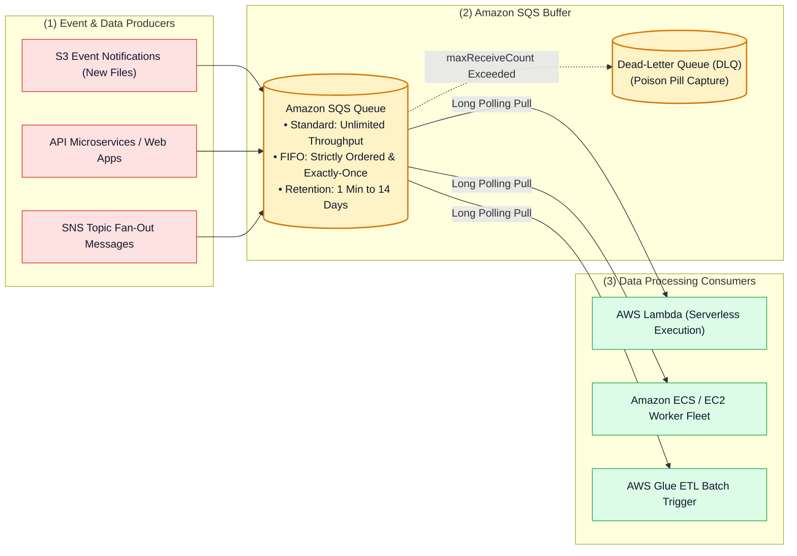
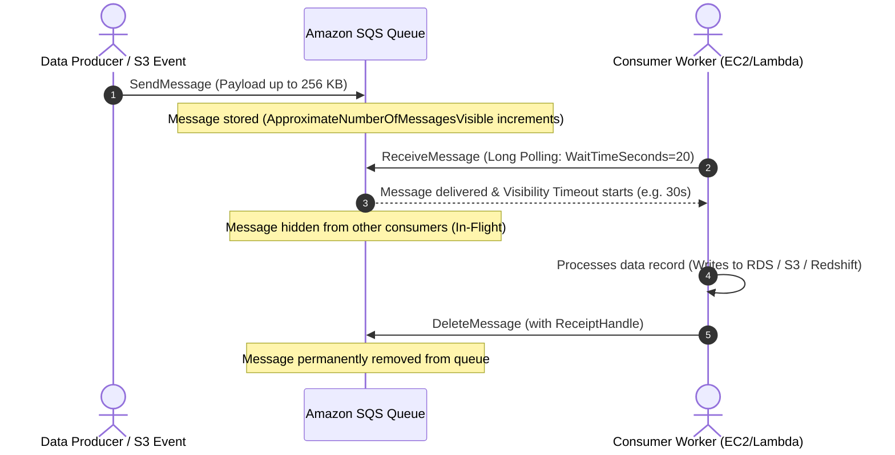

# ✉️ Amazon SQS Hub (Simple Queue Service & Asynchronous Decoupling)

- **Category**: Application Integration / Message Queuing & Distributed Systems Decoupling
- **Language / ဘာသာစကား**: [English (Original)](/en/02-services/integration/sqs/sqs) | **မြန်မာဘာသာ (Burmese)**
- **Primary Use Case**: Fully managed message queuing, data ingestion spikes များကို buffer လုပ်ခြင်း၊ microservices များနှင့် ETL pipelines များကို decouple လုပ်ခြင်း၊ နှင့် စိတ်ချရသော asynchronous batch processing ပြုလုပ်နိုင်စေခြင်း။
- **Slide Reference**: `[AWSCertifiedDataEngineerSlides.pdf](/docs/AWSCertifiedDataEngineerSlides.pdf)` မှ Pages 499–525
- **Hub Links**: `[[mm/index]]` | `[[service-catalog]]` | `[[domain-1-ingestion-and-processing]]` | `[[domain-3-data-operations-and-support]]` | `[[lambda]]` | `[[s3]]`

---

## 1. High-Level Summary

**Amazon Simple Queue Service (Amazon SQS)** သည် developers များနှင့် data engineers များအား microservices များ၊ distributed data processing systems များနှင့် serverless architectures များကို decouple လုပ်နိုင်ရန်နှင့် scale လုပ်နိုင်ရန် ကူညီပေးသော fully managed, serverless distributed message queuing service တစ်ခု ဖြစ်ပါသည်။

Data engineering pipelines များတွင် Amazon SQS သည် မြန်ဆန်သော ingestion producers များ (ဥပမာ- web servers များ၊ IoT sensors များ၊ သို့မဟုတ် S3 upload events များ) နှင့် downstream consumers များ (ဥပမာ- AWS Lambda, Amazon ECS workers များ၊ သို့မဟုတ် AWS Glue jobs များ) ကြားတွင် resilient buffer တစ်ခုအဖြစ် လုပ်ဆောင်ပေးပြီး overload ဖြစ်ခြင်းမှ ကာကွယ်ပေးကာ traffic spikes ဖြစ်ပေါ်ချိန်တွင် data ဆုံးရှုံးမှု လုံးဝမရှိစေရန် (zero data loss) သေချာစေပါသည်။

---

## 2. The SQS Message Lifecycle

SQS message တစ်ခု၏ lifecycle ကို နားလည်သဘောပေါက်ခြင်းသည် ingestion pipelines များတွင် ပြဿနာရှာဖွေဖြေရှင်းခြင်း (troubleshooting) နှင့် concurrency ကို ကိုင်တွယ်စီမံခြင်းတို့အတွက် အလွန်အရေးကြီးပါသည်-

1. **SendMessage**: Producer သည် payload **256 KB** အထိ (သို့မဟုတ် S3 နှင့်တွဲဖက်အသုံးပြုသော SQS Extended Client Library ဖြင့် 2 GB အထိ) ရှိသည့် message ကို publish လုပ်ပေးပို့ပါသည်။
2. **In-Queue & Available**: Message သည် queue ထဲတွင် ရောက်ရှိနေပြီး consumers များ ဖတ်ယူရန် အဆင်သင့် ဖြစ်နေပါသည်။
3. **ReceiveMessage & Visibility Timeout**: Consumer တစ်ခုမှ message ကို poll လုပ်ပြီး ရယူပါသည်။ SQS သည် အဆိုပါ message ကို **Visibility Timeout** (default: 30 seconds) ကြာမြင့်ချိန်အတွင်း အခြား consumers များ မမြင်နိုင်အောင် ဖျောက်ထားပေးပါသည်။
4. **DeleteMessage**: အောင်မြင်စွာ process လုပ်ပြီးနောက် consumer သည် သီးသန့်ဖြစ်သော **Receipt Handle** ကို အသုံးပြု၍ `DeleteMessage` ကို execute လုပ်ပါသည်။ အကယ်၍ consumer သည် visibility timeout မကုန်ဆုံးမီ message ကို delete မလုပ်နိုင်ပါက message သည် နောက်တစ်ကြိမ် reprocess လုပ်ရန်အတွက် ပြန်လည် visible ဖြစ်လာမည် ဖြစ်ပါသည်။

---

## 3. Standard Queues vs. FIFO Queues

| Feature / Dimension | Standard Queue | FIFO (First-In, First-Out) Queue |
| :--- | :--- | :--- |
| **Throughput** | တစ်စက္ကန့်လျှင် transactions အရေအတွက် ကန့်သတ်ချက်မရှိ (**Unlimited** TPS)။ | 300 msg/sec (batching ဖြင့် 3,000 msg/sec)၊ High Throughput mode ဖြင့် **70,000 msg/sec** အထိ ရရှိနိုင်သည်။ |
| **Delivery Guarantee** | **At-least-once delivery** (တစ်ခါတစ်ရံ duplicate messages များ ရောက်ရှိနိုင်သည်)။ | **Exactly-once processing** (5 မိနစ် deduplication window ပါဝင်သည်)။ |
| **Ordering** | **Best-effort ordering** (messages များသည် အစီအစဉ်အတိုင်း မဟုတ်ဘဲ ရောက်ရှိနိုင်သည်)။ | **Strictly ordered** (First-In, First-Out အာမခံချက်ရှိသည်)။ |
| **Naming Convention** | မည်သည့် valid string မဆို အသုံးပြုနိုင်သည် (ဥပမာ- `order-processing-queue`)။ | **`.fifo` ဖြင့် အဆုံးသတ်ရမည်** (ဥပမာ- `order-processing.fifo`)။ |
| **Required Identifiers** | မည်သည့် identifier မျှ မလိုအပ်ပါ။ | **Message Group ID** (ordering partition) နှင့် **Message Deduplication ID** လိုအပ်သည်။ |
| **Primary Use Cases** | High-volume microservices များကို decouple လုပ်ခြင်း၊ S3 file ingestion၊ clickstream data များကို buffer လုပ်ခြင်း။ | ဘဏ္ဍာရေးဆိုင်ရာ transactions များ၊ e-commerce order processing၊ sequence အစီအစဉ်တိကျမှုလိုအပ်သော data streams များ။ |

---

## 4. Modular SQS Deep-Dive Topics

**AWS Certified Data Engineer - Associate (DEA-C01)** စာမေးပွဲအတွက် Amazon SQS ကို ကျွမ်းကျင်ပိုင်နိုင်စေရန် အောက်ပါ modular notes များကို လေ့လာပါ-

1. `[[sqs-standard-vs-fifo-queues]]` — **Standard vs. FIFO Queues, Message Group ID, Deduplication ID & High-Throughput Mode**
2. `[[sqs-timing-parameters-and-polling]]` — **Visibility Timeout, ChangeMessageVisibility, Short vs. Long Polling & Delay Queues**
3. `[[sqs-dead-letter-queues-and-error-handling]]` — **Dead-Letter Queues (DLQ), RedrivePolicy, maxReceiveCount, Poison Pill Isolation & DLQ Redrive**
4. `[[sqs-integration-patterns-and-fanout]]` — **SNS + SQS Fan-Out, S3 Event Notifications, Extended Client Library & SQS vs. Kinesis vs. MSK Matrix**
5. `[[sqs-security-monitoring-and-troubleshooting]]` — **Queue Access Policies, KMS Encryption, CloudWatch Backlog Metrics & Production Triage**

---

## 5. DEA-C01 Exam Essentials

> [!IMPORTANT]
> **Amazon SQS အတွက် အဓိက စာမေးပွဲ စည်းမျဉ်းများ (Key Exam Rules)**:
>
> - **Decoupling Producers & Consumers**: Components များသည် message များကို မတူညီသော အရှိန်အဟုန် (different speeds) ဖြင့် process လုပ်ရသည့်အခါ သို့မဟုတ် ရုတ်တရက် traffic surges ဖြစ်ပေါ်မှုမှ downstream databases များကို ကာကွယ်ရန် လိုအပ်သည့်အခါ SQS ကို အသုံးပြုပါ။
> - **Eliminating Empty Responses & Reducing Costs**: API polling ကုန်ကျစရိတ်များကို သက်သာစေရန်နှင့် empty JSON responses များကို အနည်းဆုံးဖြစ်စေရန် အမြဲတမ်း **Long Polling** (`ReceiveMessageWaitTimeSeconds = 20`) ကို configure လုပ်ပါ။
> - **Preventing Duplicate Processing of Long Jobs**: Heavy file တစ်ခုကို process လုပ်ရန် consumer အနေဖြင့် default Visibility Timeout (30s) ထက် အချိန်ပိုမိုလိုအပ်ပါက `ChangeMessageVisibility` ကို dynamically ခေါ်ယူအသုံးပြုပါ။
> - **Handling Poison Pills**: Process မလုပ်နိုင်သော messages (poison pills) များကို `maxReceiveCount` (ဥပမာ- 3 မှ 5 ကြိမ် retries) ပါဝင်သော `RedrivePolicy` သတ်မှတ်ခြင်းဖြင့် **Dead-Letter Queue (DLQ)** သို့ လမ်းကြောင်းလွှဲပို့ (route) ပါ။
> - **Strict Sequence Processing**: **SQS FIFO Queues** ကို ရွေးချယ်ပါ။ Entity တစ်ခုချင်းစီအလိုက် (ဥပမာ- `CustomerId`) တိကျသော အစီအစဉ်ကို ထိန်းသိမ်းရန် **Message Group ID** ကို အသုံးပြုပြီး မတူညီသော groups များအကြားတွင် concurrent multi-threaded consumption ကို ပြုလုပ်နိုင်စေပါသည်။

---

## 📌 Related Notes
- `[[sqs-standard-vs-fifo-queues]]` — SQS Standard vs FIFO Architecture
- `[[sqs-timing-parameters-and-polling]]` — Visibility Timeouts & Long Polling
- `[[sqs-dead-letter-queues-and-error-handling]]` — DLQ Configuration & Redrive
- `[[lambda]]` — AWS Lambda SQS Event Source Mapping
- `[[s3-event-notifications]]` — Triggering SQS Queues from S3 Events
