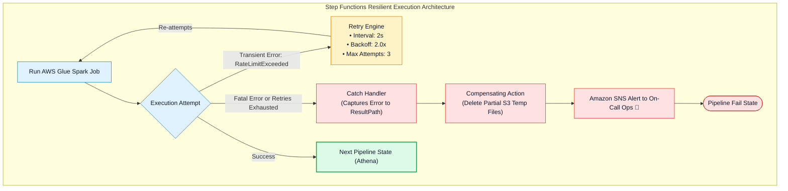

# 🛡️ AWS Step Functions Error Handling, Exponential Backoff Retries & Saga Pattern

- **Category**: Application Integration / Resilient Workflow Execution & Distributed Error Recovery
- **Language / ဘာသာစကား**: [English (Original)](/en/02-services/integration/step-functions/step-functions-error-handling-retry-and-sagas) | **မြန်မာဘာသာ (Burmese)**
- **Primary Use Case**: exponential backoff ပါဝင်သော automated `Retry` policies များကို configure လုပ်ခြင်း၊ `Catch` handlers များဖြင့် မအောင်မြင်သော pipeline states များကို သီးခြားခွဲထုတ်ကိုင်တွယ်ခြင်း (isolating failed states) နှင့် distributed compensating transactions များအတွက် Saga Pattern ကို အကောင်အထည်ဖော်ခြင်း (implementing Saga Pattern)။
- **Slide Reference**: Pages 526–529 in `[AWSCertifiedDataEngineerSlides.pdf](/docs/AWSCertifiedDataEngineerSlides.pdf)`
- **Hub Links**: `[[mm/index|index]]` | `[[mm/02-services/integration/step-functions/step-functions|step-functions]]` | `[[mm/02-services/integration/step-functions/step-functions-standard-vs-express-workflows|step-functions-standard-vs-express-workflows]]` | `[[mm/01-domains/domain-3-data-operations-and-support|domain-3-data-operations-and-support]]`

---

## 1. High-Level Summary (အကျဉ်းချုပ် ခြုံငုံသုံးသပ်ချက်)

Distributed data pipelines များတွင် ယာယီချို့ယွင်းချက်များ (transient failures ဖြစ်သည့် API rate limits၊ ယာယီ network timeouts သို့မဟုတ် concurrent job limit ပြည့်သွားခြင်း စသည်တို့) သည် ရှောင်လွှဲ၍ မရနိုင်ပါ။

AWS Step Functions သည် **Amazon States Language (ASL)** တွင် native ဖြစ်ပြီး declarative ဖြစ်သော error handling constructs များကို ထောက်ပံ့ပေးထားသည်:
- **`Retry`**: စိတ်ကြိုက် configure လုပ်နိုင်သော exponential backoff parameters များကို အသုံးပြု၍ မအောင်မြင်သော tasks များကို အလိုအလျောက် ပြန်လည်ကြိုးစားလုပ်ဆောင်ပေးခြင်း (automatically re-attempt)။
- **`Catch`**: Retry အားလုံး ကုန်ဆုံးသွားချိန်တွင် execution ကို သတ်မှတ်ထားသော fallback သို့မဟုတ် error-handling state သို့ လမ်းကြောင်းလွှဲပေးခြင်း (routes execution)။
- **`Saga Pattern`**: နောက်ပိုင်း pipeline stage တစ်ခု မအောင်မြင်ခဲ့ပါက state consistency ကို ထိန်းသိမ်းရန်အတွက် distributed services များတစ်လျှောက် compensating actions များကို ချိတ်ဆက်ညှိနှိုင်းဆောင်ရွက်ပေးခြင်း (coordinates compensating actions)။



---

## 2. Declarative `Retry` Mechanics & Exponential Backoff

ယာယီချို့ယွင်းချက်များ (transient errors) ဖြစ်ပေါ်လာသောအခါ Step Functions သည် `Retry` block ကို အစီအစဉ်လိုက် (sequentially) စစ်ဆေးတွက်ချက်ပါသည်:

```json
{
  "Type": "Task",
  "Resource": "arn:aws:states:::glue:startJobRun.sync",
  "Parameters": {
    "JobName": "DailySalesJob"
  },
  "Retry": [
    {
      "ErrorEquals": [
        "Glue.ConcurrentRunsExceededException",
        "States.Timeout"
      ],
      "IntervalSeconds": 2,
      "BackoffRate": 2.0,
      "MaxAttempts": 4
    }
  ],
  "Next": "ProcessResults"
}
```

### Key Parameters (အဓိက သတ်မှတ်ချက်များ):
1. **`ErrorEquals`**: တိုက်ဆိုင်စစ်ဆေးမည့် error အမည်များ၏ non-empty list ဖြစ်သည် (ဥပမာ `States.Timeout`, `States.ALL` သို့မဟုတ် service-specific errors များ)။
2. **`IntervalSeconds`**: ပထမဆုံး retry မစတင်မီ ကနဦး စောင့်ဆိုင်းရမည့် အချိန် (initial waiting delay) ဖြစ်သည် (ဥပမာ 2 seconds)။
3. **`BackoffRate`**: ယခင် စောင့်ဆိုင်းချိန်အပေါ် မြှောက်ပေးရမည့် multiplication factor ဖြစ်သည်။ Interval မှာ 2s ဖြစ်ပြီး rate မှာ 2.0 ဖြစ်ပါက retries များသည် **2s $\rightarrow$ 4s $\rightarrow$ 8s $\rightarrow$ 16s** အတိုင်း ဖြစ်ပေါ်လာမည်ဖြစ်သည်။
4. **`MaxAttempts`**: `Catch` block သို့ မရောက်မီ အများဆုံး ပြန်လည်ကြိုးစားမည့် အကြိမ်အရေအတွက် (maximum retry attempts) ဖြစ်သည် (default: 3)။

---

## 3. The `Catch` Handler & Error Routing

Retries အားလုံး မအောင်မြင်ပါက သို့မဟုတ် ပြန်လည်ပြင်ဆင်၍ မရနိုင်သော ချို့ယွင်းချက် (unrecoverable error) ဖြစ်ပေါ်လာပါက `Catch` handler သည် အဆိုပါ exception ကို ဖမ်းယူကြားဖြတ်ကိုင်တွယ်သည် (intercepts exception):

```json
{
  "Catch": [
    {
      "ErrorEquals": ["States.ALL"],
      "Next": "HandlePipelineFailure",
      "ResultPath": "$.errorInfo"
    }
  ]
}
```

- **`ResultPath`**: Debugging ပြုလုပ်နိုင်ရန် မူရင်း state data များကို ထိန်းသိမ်းထားရင်း error အသေးစိတ်အချက်အလက်များ (error code နှင့် cause string) ကို state ၏ JSON payload ထဲသို့ တိုက်ရိုက်ထည့်သွင်းပေးသည် (injects error details)။
- **Built-in Step Functions Errors (ပါဝင်ပြီးသား Step Functions Errors များ)**:
  - `States.ALL`: Errors အားလုံးနှင့် ကိုက်ညီသော Wildcard ဖြစ်သည်။
  - `States.Timeout`: State သည် `TimeoutSeconds` ထက် ကျော်လွန်သွားခြင်း။
  - `States.TaskFailed`: ချိတ်ဆက်ထားသော integrated service တွင် execution မအောင်မြင်ခြင်း။
  - `States.Permissions`: လုံလောက်သော IAM permissions မရှိခြင်းကြောင့် execution မအောင်မြင်ခြင်း။
  - `States.DataLimitExceeded`: Payload သည် 256 KB JSON limit ထက် ကျော်လွန်သွားခြင်း။

---

## 4. The Saga Pattern (Compensating Transactions)

Distributed cloud architectures များတွင် ရိုးရာ ACID database transactions များသည် S3, DynamoDB, Redshift နှင့် external APIs များတစ်လျှောက်လုံးကို လွှမ်းခြုံဆောင်ရွက်နိုင်စွမ်း မရှိပါ။

### Step Functions တွင် Saga Pattern အလုပ်လုပ်ပုံ (How the Saga Pattern Works in Step Functions):
အကယ်၍ multi-step pipeline တစ်ခုသည် Step 4 တွင် မအောင်မြင်ပါက (ဥပမာ Redshift Data Load ကျရှုံးခြင်း) Step Functions သည် ယခင်လုပ်ဆောင်ခဲ့သော side-effects များကို ပြန်လည်ပြင်ဆင်ပယ်ဖျက်ရန် (undo) **Compensating Actions** များကို ပြောင်းပြန်အစီအစဉ်အတိုင်း စတင်လုပ်ဆောင်စေပါသည်:

```mermaid
graph LR
    S1["(1) S3 Upload ✅"] --> S2["(2) Glue Transform ✅"]
    S2 --> S3["(3) DynamoDB Record ✅"]
    S3 --> S4["(4) Redshift COPY (💥 Fails)"]

    S4 -.->|Catch Handler Triggers Saga| C3["Undo (3): Delete DynamoDB Item"]
    C3 --> C2["Undo (2): Purge Intermediate Glue S3 Path"]
    C2 --> C1["Undo (1): Archive Corrupt Raw File"]

    classDef ok fill:#dcfce7,stroke:#16a34a,stroke-width:1px,color:#0f172a;
    classDef fail fill:#fee2e2,stroke:#dc2626,stroke-width:1px,color:#0f172a;
    classDef undo fill:#fef3c7,stroke:#d97706,stroke-width:1px,color:#0f172a;

    class S1,S2,S3 ok;
    class S4 fail;
    class C3,C2,C1 undo;
```



---

## 5. DEA-C01 Exam Essentials (စာမေးပွဲအတွက် မဖြစ်မနေသိထားရမည့် အချက်များ)

> [!IMPORTANT]
> **Error Handling အတွက် အဓိက စာမေးပွဲ Decision Triggers များ (Key Exam Decision Triggers for Error Handling)**:
>
> - **"Pipeline မကျရှုံးစေဘဲ အခါအားလျော်စွာ ဖြစ်ပေါ်တတ်သော AWS Glue `ConcurrentRunsExceededException` errors များကို အလိုအလျောက် ကိုင်တွယ်ဖြေရှင်းလိုခြင်း"** $\rightarrow$ သီးခြား Glue error code ကို ပစ်မှတ်ထားသည့် **exponential backoff (`BackoffRate: 2.0`) ပါဝင်သော `Retry` block** ကို ထည့်သွင်းပါ။
> - **"Pipeline ကျရှုံးသည့်အခါ error stack traces များကို ဖမ်းယူပြီး SNS မှတစ်ဆင့် data engineering team ထံသို့ အသိပေးချက် ပေးပို့လိုခြင်း"** $\rightarrow$ Amazon SNS publish state သို့ route လုပ်ပေးမည့် **`States.ALL` နှင့် `ResultPath` ပါဝင်သော `Catch` block** ကို configure ပြုလုပ်ပါ။
> - **"Downstream step တစ်ခု မအောင်မြင်သည့်အခါ ယာယီ S3 staging files များကို ရှင်းလင်းပြီး database updates များကို roll back လုပ်လိုခြင်း"** $\rightarrow$ **Step Functions `Catch` blocks များနှင့် compensating Lambda tasks များကို အသုံးပြု၍ Saga Pattern** ကို implement ပြုလုပ်ပါ။

---

## 📌 Related Notes (ဆက်စပ်လေ့လာရန်များ)
- `[[mm/02-services/integration/step-functions/step-functions|step-functions]]` — Step Functions Master Hub
- `[[mm/02-services/integration/step-functions/step-functions-service-integrations-and-sync-patterns|step-functions-service-integrations-and-sync-patterns]]` — Service Integrations (.sync)
- `[[mm/01-domains/domain-3-data-operations-and-support|domain-3-data-operations-and-support]]` — Incident Triage & Operations
- `[[mm/02-services/integration/sns/sns|sns]]` — Amazon SNS Alerting Destinations
