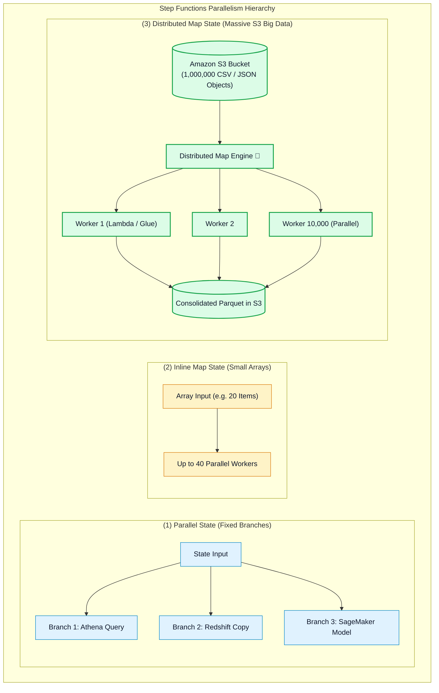
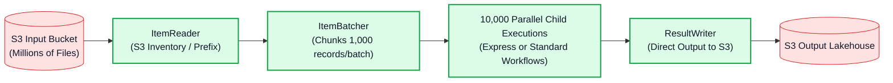

# ⚡ AWS Step Functions Parallel State, Inline Map & High-Throughput Distributed Map

- **Category**: Application Integration / High-Throughput Parallelism & Big Data Processing
- **Language / ဘာသာစကား**: [English (Original)](/en/02-services/integration/step-functions/step-functions-parallel-and-distributed-map) | **မြန်မာဘာသာ (Burmese)**
- **Primary Use Case**: Amazon S3 objects သန်းပေါင်းများစွာကို concurrent child executions ၁၀,၀၀၀ အထိဖြင့် process လုပ်ရန် Parallel branching, Inline Map iteration နှင့် Distributed Map တို့အကြား သင့်လျော်ရာကို ရွေးချယ်အသုံးပြုခြင်း။
- **Slide Reference**: Pages 526–529 in `[AWSCertifiedDataEngineerSlides.pdf](/docs/AWSCertifiedDataEngineerSlides.pdf)`
- **Hub Links**: `[[mm/index]]` | `[[step-functions]]` | `[[s3]]` | `[[lambda]]` | `[[domain-1-ingestion-and-processing]]`

---

## 1. High-Level Summary (အကျဉ်းချုပ် ခြုံငုံသုံးသပ်ချက်)

AWS Step Functions သည် parallel execution အတွက် မတူညီသော လုပ်ဆောင်ချက် ယန္တရား (၃) မျိုးကို ထောက်ပံ့ပေးထားသည်-
1. **`Parallel` State**: သီးခြား workflow branches အရေအတွက် အတိအကျကို တစ်ပြိုင်နက်တည်း (simultaneously) execute လုပ်ဆောင်သည်။
2. **`Inline Map` State**: State input ထဲတွင် ပေးပို့ထားသော static array ပေါ်တွင် dynamic iteration ပြုလုပ်သည် (concurrency သည် 40 အထိ)။
3. **`Distributed Map` State**: Big data engineering အတွက် အထူးရည်ရွယ် တည်ဆောက်ထားပြီး၊ serverless state machines များအနေဖြင့် **Amazon S3 အတွင်းရှိ objects သန်းပေါင်းများစွာကို တိုက်ရိုက်** iterate လုပ်ဆောင်နိုင်ကာ concurrency အနေဖြင့် **parallel child workflow executions ၁၀,၀၀၀ အထိ** scale လုပ်ဆောင်နိုင်သည်!

---

## 2. Parallel State vs. Inline Map State

### 1. `Parallel` State:
- တစ်ပြိုင်နက်တည်း run နိုင်သော **မတူညီသည့် tasks (different tasks)** များ ရှိသည့်အခါ အသုံးပြုသည်။
- *ဥပမာ (Example)*: Daily data pipeline တစ်ခုတွင် SNS notification တစ်ခု မပို့မီ Amazon Athena aggregation query တစ်ခု၊ Amazon Redshift staging copy တစ်ခုနှင့် SageMaker inference validation တစ်ခုတို့ကို တစ်ပြိုင်နက်တည်း (concurrently) run ရန် လိုအပ်သည့်အခါ။
- *အလုပ်လုပ်ပုံ (Behavior)*: State machine သည် ရှေ့သို့ ဆက်မသွားမီ **branches အားလုံး အောင်မြင်စွာ ပြီးဆုံးသည်အထိ (all branches finish successfully)** စောင့်ဆိုင်းသည်။ အကယ်၍ catch handler မပါဘဲ branch တစ်ခုခု fail ဖြစ်သွားပါက parallel state တစ်ခုလုံး fail ဖြစ်သွားမည်ဖြစ်သည်။

### 2. `Inline Map` State:
- **Items အစုအဝေးတစ်ခုလုံးပေါ်တွင် တူညီသော task (same task across a collection of items)** ကို execute လုပ်လိုသည့်အခါ အသုံးပြုသည်။
- Input array ကို state JSON payload ထဲတွင် တိုက်ရိုက် ထည့်သွင်းပေးပို့သည် (payload limit: **256 KB** ဖြစ်သည်)။
- Concurrency ကန့်သတ်ချက်- **Parallel child iterations ၄၀ အထိ** ဖြစ်သည်။

---

## 3. Distributed Map State Deep Dive

Distributed Map သည် AWS Step Functions အား **ကြီးမားသော distributed batch compute engine (massive distributed batch compute engine)** အဖြစ် ပြောင်းလဲပေးပြီး၊ ရိုးရှင်းသော file-based transformations များအတွက် သီးသန့် Spark clusters များ စတင် run ရန် (spin up လုပ်ရန်) မလိုတော့ပေ။

### Key Capabilities (အဓိက စွမ်းဆောင်ရည်များ):
1. **Direct S3 Integration (`ItemReader`)**: Items များကို state machine input payload ထဲသို့ load လုပ်စရာမလိုဘဲ S3 bucket သို့မဟုတ် S3 Inventory list မှ files များကို တိုက်ရိုက် ဖတ်ရှုပေးသည်။
2. **Item Batching (`ItemBatcher`)**: Compute cost နှင့် execution speed ကို အကောင်းဆုံးဖြစ်စေရန် items များကို batches များအဖြစ် စုစည်းပေးသည် (ဥပမာ Lambda invocation တစ်ခုလျှင် records ၅၀၀ စီ)။
3. **Massive Concurrency**: **Concurrent child workflow executions ၁၀,၀၀၀ အထိ** scale လုပ်ဆောင်နိုင်သည်။
4. **Direct S3 Result Writing (`ResultWriter`)**: စုစည်းထားသော execution logs များနှင့် outputs များကို Amazon S3 သို့ တိုက်ရိုက် stream ပြုလုပ်၍ အလိုအလျောက် ရေးသားပေးသည်။

---

## 4. Comprehensive Parallelism Comparison (ပြည့်စုံသော Parallelism နှိုင်းယှဉ်ချက်)

| Dimension | Parallel State | Inline Map State | Distributed Map State |
| :--- | :--- | :--- | :--- |
| **Execution Pattern** | ပုံသေ သတ်မှတ်ထားသော သီးခြားခွဲထွက် branches များ (Fixed divergent branches)။ | Memory အတွင်းရှိ array ပေါ်တွင် dynamic iteration ပြုလုပ်ခြင်း။ | **ပြင်ပရှိ ကြီးမားသော S3 datasets များပေါ်တွင် dynamic iteration ပြုလုပ်ခြင်း**။ |
| **Concurrency Limit** | ASL တွင် သတ်မှတ်ထားသော branches အရေအတွက်။ | **Iterations ၄၀ အထိ**။ | **Parallel child executions ၁၀,၀၀၀ အထိ**။ |
| **Input Data Source** | State JSON payload။ | State JSON payload (max 256 KB)။ | **Amazon S3 Objects, S3 Inventory, JSON, CSV files များ**။ |
| **Child Execution Type** | Parent state machine ၏ အစိတ်အပိုင်း။ | Parent state machine ၏ အစိတ်အပိုင်း။ | **Child Workflows (Standard သို့မဟုတ် Express)**။ |
| **Ideal Use Case** | Athena + Redshift + Glue တို့ကို parallel run ခြင်း။ | Database query မှ ရရှိသော customer IDs အခု ၂၀ ကို process လုပ်ခြင်း။ | **S3 အတွင်းရှိ images, logs သို့မဟုတ် CSV files ၅၀၀,၀၀၀ ကို batch processing လုပ်ခြင်း**။ |

---

## 5. DEA-C01 Exam Essentials (စာမေးပွဲအတွက် မဖြစ်မနေ သိထားသင့်သည်များ)

> [!IMPORTANT]
> **Parallelism & Distributed Map အတွက် အဓိက စာမေးပွဲ ဆုံးဖြတ်ချက် Triggers (Key Exam Decision Triggers)**:
>
> - **"Process hundreds of thousands of CSV files in Amazon S3 in parallel without managing an Apache Spark cluster"** $\rightarrow$ AWS Lambda workers များနှင့် တွဲဖက်၍ **AWS Step Functions Distributed Map state** ကို အသုံးပြုပါ။
> - **"Execute an Amazon Athena query and an Amazon Redshift COPY command concurrently, and only continue when both have completed"** $\rightarrow$ **`Parallel` state** ကို အသုံးပြုပါ။
> - **"State input exceeds 256 KB payload limit when passing thousands of records to a Map state"** $\rightarrow$ Inline Map မှ **Amazon S3 `ItemReader` ပါဝင်သော Distributed Map** သို့ ပြောင်းလဲအသုံးပြုပါ။
> - **"Control maximum parallel executions to avoid overwhelming a downstream RDS database"** $\rightarrow$ Map state ပေါ်တွင် **`MaxConcurrency` parameter** ကို သတ်မှတ်ပါ။

---

## 📌 Related Notes (ဆက်စပ် မှတ်စုများ)
- `[[step-functions]]` — Step Functions Master Hub
- `[[step-functions-standard-vs-express-workflows]]` — Standard vs Express Workflows
- `[[s3]]` — Amazon S3 Big Data Lake Storage
- `[[lambda]]` — AWS Lambda Serverless Workers
