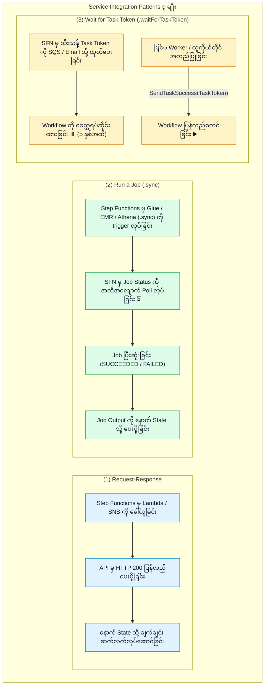
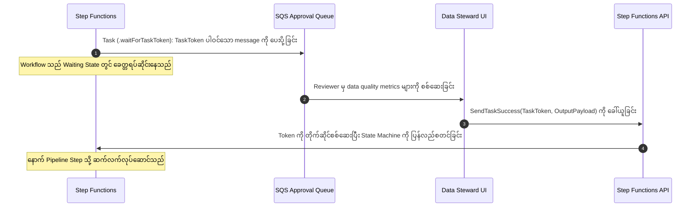

# 🔗 AWS Step Functions Service Integrations, Sync Patterns (.sync) & Task Tokens

- **Category**: Application Integration / Service Integration Patterns & Synchronous Polling
- **Language / ဘာသာစကား**: [English (Original)](/en/02-services/integration/step-functions/step-functions-service-integrations-and-sync-patterns) | **မြန်မာဘာသာ (Burmese)**
- **Primary Use Case**: `.sync` integrations များကို အသုံးပြု၍ asynchronous big data jobs များ (AWS Glue, Amazon EMR, Amazon Athena, Amazon Redshift) ကို ညှိနှိုင်းချိတ်ဆက်ခြင်း (coordinating) နှင့် `.waitForTaskToken` ဖြင့် လူကိုယ်တိုင် အတည်ပြုချက်များ (human approvals) ကို စီမံကိုင်တွယ်ခြင်း။
- **Slide Reference**: Pages 526–529 in `[[AWSCertifiedDataEngineerSlides.pdf]]`
- **Hub Links**: `[[mm/index]]` | `[[step-functions]]` | `[[step-functions-standard-vs-express-workflows]]` | `[[glue]]` | `[[emr]]` | `[[athena]]`

---

## 1. High-Level Summary (အကျဉ်းချုပ် ခြုံငုံသုံးသပ်ချက်)

AWS Step Functions ဖြင့် data pipelines များကို orchestrate လုပ်သည့်အခါ မတူညီသော AWS services များသည် မတူညီသော response behaviors များအောက်တွင် အလုပ်လုပ်ကြသည်။ Step Functions သည် ထင်ရှားသော **Service Integration Patterns** ၃ မျိုးကို ထောက်ပံ့ပေးသည်-

1. **Request-Response (Default)**: Service API ကို ခေါ်ယူပြီး downstream task ပြီးဆုံးသည်အထိ စောင့်ဆိုင်းခြင်းမရှိဘဲ နောက် state သို့ ချက်ချင်း ဆက်လက်လုပ်ဆောင်သည်။
2. **Run a Job (`.sync`)**: Step Functions သည် job ကို စတင်ပြီး **နောက်ကွယ်တွင် polling လုပ်ငန်းစဉ်ကို အလိုအလျောက် စီမံခန့်ခွဲပေးကာ (automatically manages polling behind the scenes)** နောက် state သို့ မတက်မီ job ပြီးဆုံးသည်အထိ စောင့်ဆိုင်းပေးသည်။
3. **Wait for a Task Token (`.waitForTaskToken`)**: ပြင်ပ worker သို့မဟုတ် human approver ထံမှ callback token တစ်ခု ပြန်လည်ပေးပို့လာသည်အထိ workflow ကို အကန့်အသတ်မရှိ ခေတ္တရပ်ဆိုင်း (pause) ထားသည်။



---

## 2. Optimized Integrations: The `.sync` Pattern (Optimized Integrations - `.sync` ပုံစံ)

Step Functions `.sync` မပါရှိသော ရိုးရာ architectures များတွင် data engineers များသည် AWS Glue Spark job သို့မဟုတ် EMR cluster တစ်ခု ပြီးဆုံးသည့်အချိန်ကို စစ်ဆေးရန် custom Lambda functions များနှင့် DynamoDB polling loops များကို ကိုယ်တိုင် ရေးသားခဲ့ရသည်။

### How `.sync` Works (`.sync` အလုပ်လုပ်ပုံ):
- Resource ARN ၏ အဆုံးတွင် `.sync` ထည့်သွင်းပေးခြင်းဖြင့် (ဥပမာ `arn:aws:states:::glue:startJobRun.sync`) Step Functions အား **status polling အားလုံးကို အလိုအလျောက် စီမံကိုင်တွယ်ရန်** ညွှန်ကြားစေသည်။
- Step Functions သည် underlying service ကို စောင့်ကြည့်စစ်ဆေးပြီး၊ job failures များကို ဖမ်းယူကာ၊ execution metrics များကို ထုတ်ယူပြီးနောက် ရလဒ် payload ကို downstream states များသို့ ပေးပို့ပေးသည်။

### Common `.sync` Task Definitions (အသုံးများသော `.sync` Task သတ်မှတ်ချက်များ):
```json
{
  "Type": "Task",
  "Resource": "arn:aws:states:::glue:startJobRun.sync",
  "Parameters": {
    "JobName": "DailySalesAggregationJob",
    "Arguments": {
      "--year": "2026",
      "--quarter": "Q3"
    }
  },
  "Next": "RunAthenaQuery"
}
```

---

## 3. Wait for Task Token (`.waitForTaskToken`) Pattern (Task Token စောင့်ဆိုင်းခြင်း ပုံစံ)

**လူကိုယ်တိုင် အတည်ပြုချက် (human approval)**၊ data stewardship စစ်ဆေးမှုများ သို့မဟုတ် on-premises legacy systems များနှင့် ချိတ်ဆက်ညှိနှိုင်းမှု လိုအပ်သော data engineering pipelines များအတွက်-



---

## 4. Integration Patterns Comparison Matrix (Integration Patterns နှိုင်းယှဉ်ချက် ဇယား)

| Integration Pattern | Resource ARN Suffix | State Progression (State ကူးပြောင်းမှု အခြေအနေ) | Use Case in Data Engineering (Data Engineering တွင် အသုံးပြုမှု) |
| :--- | :--- | :--- | :--- |
| **Request-Response** | `arn:aws:states:::lambda:invoke` | API invocation ပြီးဆုံးပြီးနောက် ချက်ချင်း နောက် state သို့ ကူးပြောင်းသည်။ | လျင်မြန်သော Lambda validations များကို trigger လုပ်ခြင်း၊ SNS notifications များ ပေးပို့ခြင်း၊ DynamoDB writes များ ပြုလုပ်ခြင်း။ |
| **Run a Job (`.sync`)** | `arn:aws:states:::glue:startJobRun.sync` | Job သည် terminal status သို့ ရောက်သည်အထိ **အလိုအလျောက် ခေတ္တရပ်ဆိုင်းပြီး poll လုပ်ပေးသည်**။ | AWS Glue jobs များ၊ Amazon EMR steps များ၊ Athena queries များနှင့် Redshift SQL statements များကို run ခြင်း။ |
| **Wait for Task Token** | `arn:aws:states:::sqs:sendMessage.waitForTaskToken` | `SendTaskSuccess` callback API ကို execute မလုပ်မချင်း **workflow ကို အကန့်အသတ်မရှိ ခေတ္တရပ်ဆိုင်းထားသည်**။ | လူကိုယ်တိုင် data quality အတည်ပြုချက်များ၊ ပြင်ပ legacy on-prem systems များနှင့် ချိတ်ဆက်ခြင်း။ |

---

## 5. DEA-C01 Exam Essentials (DEA-C01 စာမေးပွဲအတွက် မဖြစ်မနေ သိထားသင့်သည်များ)

> [!IMPORTANT]
> **Service Integrations အတွက် အဓိက စာမေးပွဲ ဆုံးဖြတ်ချက် Triggers (Key Exam Decision Triggers)**:
>
> - **"Execute an AWS Glue ETL job and wait for completion before running an Amazon Athena query, with zero custom polling code"** $\rightarrow$ Step Functions task ကို **`arn:aws:states:::glue:startJobRun.sync`** အသုံးပြု၍ configure လုပ်ပါ။
> - **"Pause a data pipeline until a data steward verifies data quality and approves the load"** $\rightarrow$ Task state ပေါ်တွင် **`.waitForTaskToken`** ကို အသုံးပြုပြီး အတည်ပြုချက်ရရှိပါက **`SendTaskSuccess`** ကို ခေါ်ယူပါ။
> - **"What happens if you omit `.sync` when configuring a Glue task?"** $\rightarrow$ Step Functions သည် `glue:startJobRun` (Request-Response) ကို ခေါ်ယူမည်ဖြစ်ပြီး Glue job သည် နောက်ကွယ်တွင် စတင်နေဆဲဖြစ်သော်လည်း နောက် state သို့ ချက်ချင်း ဆက်လက်လုပ်ဆောင်သွားမည် ဖြစ်သည်။

---

## 📌 Related Notes (ဆက်စပ် မှတ်စုများ)
- `[[step-functions]]` — Step Functions Master Hub
- `[[step-functions-standard-vs-express-workflows]]` — Standard vs Express Workflows
- `[[glue]]` — AWS Glue ETL & Spark Jobs
- `[[athena]]` — Amazon Athena Query Orchestration
