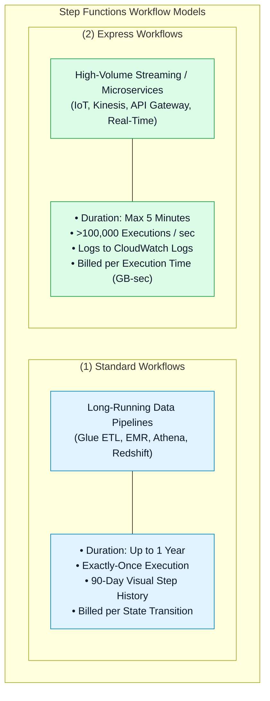

# ⚖️ AWS Step Functions Standard vs. Express Workflows & Cost Architecture

- **Category**: Application Integration / Workflow Types, Execution Guarantees & Pricing
- **Language / ဘာသာစကား**: [English (Original)](/en/02-services/integration/step-functions/step-functions-standard-vs-express-workflows) | **မြန်မာဘာသာ (Burmese)**
- **Primary Use Case**: Duration၊ throughput၊ execution semantics နှင့် cost efficiency တို့အပေါ် အခြေခံ၍ Standard နှင့် Express workflow အမျိုးအစားများအကြား ရွေးချယ်အသုံးပြုခြင်း။
- **Slide Reference**: `[[AWSCertifiedDataEngineerSlides.pdf]]` မှ Pages 526–529
- **Hub Links**: `[[mm/index]]` | `[[step-functions]]` | `[[step-functions-service-integrations-and-sync-patterns]]` | `[[domain-1-ingestion-and-processing]]`

---

## 1. High-Level Summary

AWS Step Functions သည် မတူညီသော workload profile များအတွက် optimize လုပ်ထားသည့် သီးခြား workflow အမျိုးအစားနှစ်မျိုးဖြစ်သော **Standard Workflows** နှင့် **Express Workflows** တို့ကို ထောက်ပံ့ပေးထားပါသည်။

Standard နှင့် Express အကြား ရွေးချယ်ခြင်းသည် **DEA-C01** စာမေးပွဲတွင် အမေးအများဆုံး topic များထဲမှ တစ်ခုဖြစ်ပါသည်။ Standard Workflows များကို **ကြာရှည် run ရသော (long-running)၊ audit ပြုလုပ်နိုင်သော၊ exactly-once batch ETL processes** များအတွက် ရည်ရွယ်ထုတ်လုပ်ထားပြီး Express Workflows များကို **high-throughput ရှိသော၊ ၅ မိနစ်အောက် streaming event processing** များအတွက် ရည်ရွယ်ထုတ်လုပ်ထားပါသည်။

---

## 2. Standard Workflows Deep Dive

Standard Workflows သည် Step Functions တွင် default state machine အမျိုးအစားဖြစ်ပါသည်-

1. **Maximum Duration**: **၁ နှစ် (up to 1 year) အထိ** ကြာမြင့်စွာ run နိုင်သဖြင့် long-running batch jobs များ၊ အဆင့်များစွာပါဝင်သော data pipelines များနှင့် လူကိုယ်တိုင်စစ်ဆေးအတည်ပြုရသော manual human approvals များအတွက် သင့်လျော်ပါသည်။
2. **Execution Guarantee**: **Exactly-once execution** ဖြစ်ပါသည် (retry ပြုလုပ်ရန် configure မလုပ်ထားပါက step တစ်ခုစီသည် တိကျစွာ တစ်ကြိမ်သာ run မည်ဖြစ်ကြောင်း အာမခံပါသည်)။
3. **Observability & Auditing**: အသေးစိတ် step-by-step visual execution history ကို AWS Management Console တွင် **ရက်ပေါင်း ၉၀ (90 days)** တိုင်အောင် ထိန်းသိမ်းထားရှိပေးပါသည်။
4. **Pricing Architecture**: **State Transition** အပေါ်တွင်သာ တိကျစွာ ကျသင့်ငွေကောက်ခံပါသည် (state transitions ၁,၀၀၀ လျှင် $0.025)။
5. **Key Use Cases**:
   - AWS Glue ETL jobs များကို orchestrate လုပ်ဆောင်ပြီး ပြီးဆုံးသည်အထိ စောင့်ဆိုင်းခြင်း။
   - EMR cluster steps များကို submit လုပ်ပြီး status ကို စောင့်ကြည့်ခြင်း။
   - ကြာရှည် run ရသော ဘဏ္ဍာရေးလကုန်စာရင်းညှိနှိုင်းမှုများ (month-end reconciliations)။
   - Task Tokens (`.waitForTaskToken`) ကို အသုံးပြုထားသော အဆင့်ဆင့်အတည်ပြုသည့် workflow များ (multi-step approval workflows)။

---

## 3. Express Workflows Deep Dive

Express Workflows ကို high-volume, event-driven microservices များနှင့် လျင်မြန်သော data ingestion များအတွက် ရည်ရွယ်၍ အထူးတည်ဆောက်ထားခြင်းဖြစ်ပါသည်-

1. **Maximum Duration**: Execution တစ်ခုလျှင် **အများဆုံး ၅ မိနစ် (up to 5 minutes)** သာ ကြာမြင့်နိုင်ပါသည်။
2. **Extreme Throughput**: **တစ်စက္ကန့်လျှင် executions ပေါင်း ၁၀၀,၀၀၀ ကျော် (over 100,000 executions per second)** အထိ scale လုပ်နိုင်ပါသည်။
3. **Execution Modes**:
   - **Asynchronous Express Workflows**: Background တွင် **at-least-once** delivery semantics ဖြင့် execute လုပ်ပါသည်။ Execution ARN ကို ချက်ချင်း return ပြန်ပေးပါသည်။
   - **Synchronous Express Workflows**: ချက်ချင်း execute လုပ်ပြီး ခေါ်ယူသူ (caller) ထံသို့ **response payload ကို တိုက်ရိုက်ပြန်လည်ပေးပို့နိုင်ရန် connection ကို ဖွင့်ထားပေးပါသည်** (API Gateway REST endpoints များအတွက် အထူးသင့်လျော်ပါသည်)။ Semantics မှာ **at-most-once** ဖြစ်ပါသည်။
4. **Observability**: Execution history ကို **Amazon CloudWatch Logs သို့ တိုက်ရိုက် stream လုပ်ပေးပါသည်** (console ပေါ်တွင် step-by-step visual viewer မပါဝင်ပါ)။
5. **Pricing Architecture**: **Request count (requests ၁ သန်းလျှင် $1.00)** နှင့် အသုံးပြုသည့် memory ပမာဏအပေါ် အခြေခံသော **compute duration (GB-seconds)** အလိုက် ကျသင့်ငွေကောက်ခံပါသည်။

---

## 4. Standard vs. Express Definitive Comparison

| Architectural Dimension | Standard Workflows | Express Workflows |
| :--- | :--- | :--- |
| **Max Execution Time** | **Up to 1 year (၁ နှစ်အထိ)** | **Up to 5 minutes (၅ မိနစ်အထိ)** |
| **Execution Rate** | Up to 2,000 / sec | **Over 100,000 / sec** |
| **Execution Guarantee** | **Exactly-once** | At-least-once (Async) / At-most-once (Sync) |
| **Pricing Model** | State Transitions ၁,၀၀၀ လျှင် $0.025 | Requests ၁ သန်းလျှင် $1.00 + duration (GB-seconds) |
| **Execution History** | Console တွင် Visual step history (ရက်ပေါင်း ၉၀) | **Amazon CloudWatch Logs** သို့ Stream လုပ်ခြင်း |
| **Service Integration Modes** | `.sync`၊ Request-Response နှင့် `.waitForTaskToken` တို့ကို support လုပ်ပါသည် | Request-Response နှင့် `.sync` (limited) ကို support လုပ်ပါသည် |
| **Synchronous Execution** | မရပါ (အမြဲတမ်း Asynchronous ဖြစ်သည်) | **ရပါသည်** (StartSyncExecution ကို support လုပ်သည်) |
| **Ideal Workload** | **Big Data ETL, EMR, Glue, Human Approvals** | **IoT Ingestion, Streaming Transforms, APIs** |

---

## 5. DEA-C01 Exam Essentials

> [!IMPORTANT]
> **Key Exam Decision Triggers for Workflow Types**:
>
> - **"Orchestrate a daily AWS Glue Spark ETL job that takes 45 minutes to complete"** $\rightarrow$ **Standard Workflows** ကို ရွေးချယ်ပါ (Express workflows သည် ၅ မိနစ်ကျော်ပါက timeout ဖြစ်သွားပါမည်)။
> - **"Process 50,000 IoT sensor events per second with high throughput and low cost"** $\rightarrow$ **Express Workflows** ကို ရွေးချယ်ပါ (ကုန်ကျစရိတ် သက်သာစွာဖြင့် >100k TPS ကို ကိုင်တွယ်နိုင်ပါသည်)။
> - **"Need visual step-by-step auditing and execution history in the console for compliance"** $\rightarrow$ **Standard Workflows** ကို ရွေးချယ်ပါ (console တွင် ရက်ပေါင်း ၉၀ သိုလှောင်ပေးပါသည်)။
> - **"Trigger a state machine synchronously from an Amazon API Gateway REST endpoint and return the result to the caller"** $\rightarrow$ **Synchronous Express Workflows** ကို ရွေးချယ်ပါ (ခေါ်ယူသူထံသို့ result ပြန်ပေးနိုင်ရန်)။
> - **"Pause workflow execution and wait up to 3 days for a data steward to approve a dataset"** $\rightarrow$ **`.waitForTaskToken` ပါဝင်သော Standard Workflows** ကို ရွေးချယ်ပါ (data steward ထံမှ အတည်ပြုချက်စောင့်ဆိုင်းရန်)။

---

## 📌 Related Notes
- `[[step-functions]]` — Step Functions Master Hub
- `[[step-functions-service-integrations-and-sync-patterns]]` — Service Integrations (.sync)
- `[[glue]]` — AWS Glue ETL Orchestration
- `[[kinesis-data-streams]]` — Express Workflows ဖြင့် Streaming Ingestion ပြုလုပ်ခြင်း
