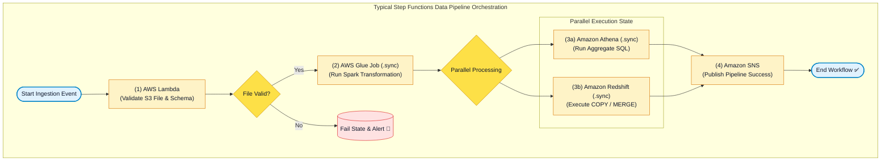

# 🔄 AWS Step Functions Hub (Serverless Visual Workflow Orchestration)

- **Category**: Application Integration / Serverless Workflow Orchestration & Data Pipeline Coordination
- **Language / ဘာသာစကား**: [English (Original)](/en/02-services/integration/step-functions/step-functions) | **မြန်မာဘာသာ (Burmese)**
- **Primary Use Case**: ရှုပ်ထွေးပြီး အဆင့်များစွာပါဝင်သော ETL workflows များ၊ data processing pipelines များ (AWS Glue, Amazon EMR, Amazon Athena, AWS Lambda, Amazon Redshift) ကို ညှိနှိုင်းပေါင်းစပ်ခြင်း (coordinating) နှင့် serverless state machines များဖြင့် အလိုအလျောက် error handling ဆောင်ရွက်ခြင်း။
- **Slide Reference**: Pages 526–529 in `[AWSCertifiedDataEngineerSlides.pdf](/docs/AWSCertifiedDataEngineerSlides.pdf)`
- **Hub Links**: `[[mm/index]]` | `[[service-catalog]]` | `[[domain-1-ingestion-and-processing]]` | `[[domain-3-data-operations-and-support]]` | `[[glue]]` | `[[emr]]` | `[[lambda]]`

---

## 1. High-Level Summary

**AWS Step Functions** သည် distributed applications များကို စီမံခန့်ခွဲ orchestrate ပြုလုပ်ရန်၊ ရှုပ်ထွေးသော processes များကို အလိုအလျောက် ဆောင်ရွက်ရန် (automate) နှင့် AWS services များတစ်လျှောက် data processing jobs များကို ပေါင်းစပ်ညှိနှိုင်းရန် အသုံးပြုသော fully managed, low-code serverless visual workflow service တစ်ခု ဖြစ်သည်။

ခေတ်မီ cloud data engineering architectures များတွင် Step Functions သည် **serverless state machine backbone** အဖြစ် ဆောင်ရွက်ပေးသည်။ ၎င်းသည် visual state transitions များ၊ native AWS service integrations များ (Glue နှင့် EMR အတွက် `.sync` optimized jobs များကဲ့သို့)၊ automated exponential backoff retries များ၊ error catching၊ parallel branching နှင့် **Distributed Map** ကို အသုံးပြု၍ ကြီးမားသော dataset များအပေါ် iteration ပြုလုပ်ခြင်းတို့ကို ထောက်ပံ့ပေးခြင်းဖြင့် ပျက်စီးလွယ်သော custom orchestrators များနှင့် cron scripts များကို အစားထိုးပေးပါသည်။

---

## 2. Core Concepts & Amazon States Language (ASL)

Step Functions ရှိ State machines များကို structured JSON-based specification language တစ်ခုဖြစ်သော **Amazon States Language (ASL)** ဖြင့် ရေးသားသတ်မှတ်ကြသည်။

### Core ASL State Types:
1. **`Task`**: AWS service တစ်ခုကို ခေါ်ယူအသုံးပြုခြင်းဖြင့် လုပ်ငန်းယူနစ်တစ်ခုကို ဆောင်ရွက်သည် (ဥပမာ - Lambda function တစ်ခုကို execute လုပ်ခြင်း၊ Glue ETL job တစ်ခုကို run ခြင်း၊ သို့မဟုတ် EMR cluster တစ်ခုကို စတင်ခြင်း)။
2. **`Choice`**: မတူညီသော execution paths များသို့ ခွဲထွက်ရန် Boolean logic conditions များကို စစ်ဆေးတွက်ချက်သည် (ဥပမာ - `StringEquals`, `NumericGreaterThan`)။
3. **`Wait`**: သတ်မှတ်ထားသော ကြာချိန်တစ်ခု (`Seconds`) သို့မဟုတ် သတ်မှတ်ထားသော timestamp တစ်ခု (`TimestampPath`) အထိ workflow execution ကို ရပ်ဆိုင်းစောင့်ဆိုင်းစေသည်။
4. **`Pass`**: မည်သည့်အလုပ်မျှ မလုပ်ဆောင်ဘဲ ၎င်း၏ input ကို output သို့ တိုက်ရိုက်ပေးပို့သည်፤ JSON shapes များကို အသွင်ပြောင်းလဲရန် သို့မဟုတ် mock data ထည့်သွင်းရန် မကြာခဏ အသုံးပြုသည်။
5. **`Parallel`**: States များ၏ branches အများအပြားကို တစ်ပြိုင်နက်တည်း (concurrently) execute လုပ်ပြီး branches အားလုံး ပြီးဆုံးသည်အထိ စောင့်ဆိုင်းသည်။
6. **`Map`**: Items အစုအဝေး (collection) တစ်ခုပေါ်တွင် iterate ပြုလုပ်ပြီး item တစ်ခုချင်းစီအတွက် states များကို execute လုပ်သည် (**Inline Map** နှင့် **Distributed Map** တို့ကို ထောက်ပံ့ပေးသည်)။
7. **`Fail` / `Succeed`**: Workflow ကို error သို့မဟုတ် success status ဖြင့် တိကျစွာ ရပ်တန့်အဆုံးသတ်စေသည်။

---

## 3. High-Yield Data Engineering Integrations

| AWS Service | Integration Type | DEA-C01 Pipeline Use Case |
| :--- | :--- | :--- |
| **AWS Glue** | `glue:startJobRun.sync` | Spark ETL jobs များကို run ပြီး downstream tasks များမစတင်မီ ပြီးဆုံးအောင် အလိုအလျောက် စောင့်ဆိုင်းခြင်း။ |
| **Amazon EMR / EMR Serverless** | `emr-serverless:startJobRun.sync` | ယာယီ (ephemeral) Spark/Hive clusters များကို provision ပြုလုပ်ပြီး big data analysis jobs များကို submit ပြုလုပ်ခြင်း။ |
| **Amazon Athena** | `athena:startQueryExecution.sync` | S3 data lakes ပေါ်တွင် analytical SQL queries များကို execute လုပ်ခြင်းနှင့် execution status ကို စစ်ဆေးခြင်း။ |
| **Amazon Redshift** | `redshift-data:executeStatement.sync` | Asynchronous SQL commands များကို run ခြင်း၊ data staging ပြုလုပ်ခြင်းနှင့် `MERGE` upserts များကို execute လုပ်ခြင်း။ |
| **AWS Lambda** | `lambda:invoke` | ပေါ့ပါးသော schema validation ပြုလုပ်ခြင်း၊ metadata lookups များနှင့် token generation ပြုလုပ်ခြင်း။ |
| **Amazon EventBridge & SNS** | `sns:publish`, `events:putEvents` | Alert notifications များကို trigger လုပ်ခြင်း သို့မဟုတ် downstream completion events များကို broadcast ပြုလုပ်ခြင်း။ |

---

## 4. Modular Step Functions Deep-Dive Topics

**AWS Certified Data Engineer - Associate (DEA-C01)** စာမေးပွဲအတွက် AWS Step Functions ကို ကျွမ်းကျင်စွာ တတ်မြောက်နိုင်ရန် အောက်ပါ modular notes များကို လေ့လာပါ:

1. `[[step-functions-standard-vs-express-workflows]]` — **Standard vs. Express Workflows, Execution Models & Cost Architecture**
2. `[[step-functions-service-integrations-and-sync-patterns]]` — **Service Integrations: `.sync`, Request-Response, Task Tokens, Glue, EMR & Athena Pipelines**
3. `[[step-functions-parallel-and-distributed-map]]` — **Parallel State, Inline Map & High-Throughput Distributed Map for S3 Big Data**
4. `[[step-functions-error-handling-retry-and-sagas]]` — **Error Handling, Exponential Backoff Retries, Catchers & Saga Pattern**
5. `[[step-functions-vs-mwaa-and-troubleshooting]]` — **Step Functions vs. Apache Airflow / MWAA Matrix, Observability, CloudWatch & X-Ray**

---

## 5. DEA-C01 Exam Essentials

> [!IMPORTANT]
> **Key Exam Rules for AWS Step Functions (AWS Step Functions အတွက် အဓိက စာမေးပွဲ စည်းမျဉ်းများ)**:
>
> - **Orchestrate Multi-Service Data Pipelines Serverlessly**: စာမေးပွဲမေးခွန်းတွင် **Lambda, Glue, EMR, Athena, နှင့် Redshift** တို့ကို automated retries များဖြင့် server ထိန်းသိမ်းစရာမလိုဘဲ (zero server maintenance) ပေါင်းစပ်ညှိနှိုင်းရန် (coordinate) မေးမြန်းပါက **AWS Step Functions** ကို ရွေးချယ်ပါ။
> - **Long-Running Workflows (Hours/Days)**: Standard Workflows များသည် visual state tracking နှင့် exactly-once execution ဖြင့် **၁ နှစ် (up to 1 year) အထိ** ကြာရှည်စွာ run နိုင်ပါသည်။
> - **Eliminate Custom Polling Logic**: Step Functions သည် Glue/EMR job status ကို အလိုအလျောက် စောင့်ကြည့်ပြီး job ပြီးဆုံးမှသာ ရှေ့ဆက်ဆောင်ရွက်နိုင်ရန် **Optimized Service Integrations (`.sync`)** ကို အသုံးပြုပါ။
> - **Process Millions of S3 Objects in Parallel**: S3 ပေါ်ရှိ သန်းနှင့်ချီသော objects များကို တစ်ပြိုင်နက် process ပြုလုပ်ရန် **Step Functions Distributed Map** ကို အသုံးပြုပါ (parallel executions ၁၀,၀၀၀ အထိ scale ပြုလုပ်နိုင်သည်)။
> - **Automate Error Recovery**: ခေတ္တဖြစ်ပေါ်သော service throttling ပြဿနာများကို အလိုအလျောက် ကိုင်တွယ်ဖြေရှင်းရန် exponential backoff (`BackoffRate`) ပါဝင်သော `Retry` blocks များကို configure ပြုလုပ်ပါ။

---

## 📌 Related Notes
- `[[step-functions-standard-vs-express-workflows]]` — Standard vs Express Workflows
- `[[step-functions-service-integrations-and-sync-patterns]]` — Service Integrations (.sync)
- `[[step-functions-parallel-and-distributed-map]]` — Distributed Map for Big Data
- `[[glue]]` — AWS Glue Spark ETL Jobs
- `[[emr]]` — Amazon EMR Big Data Processing
- `[[mwaa-airflow]]` — Managed Airflow vs Step Functions
