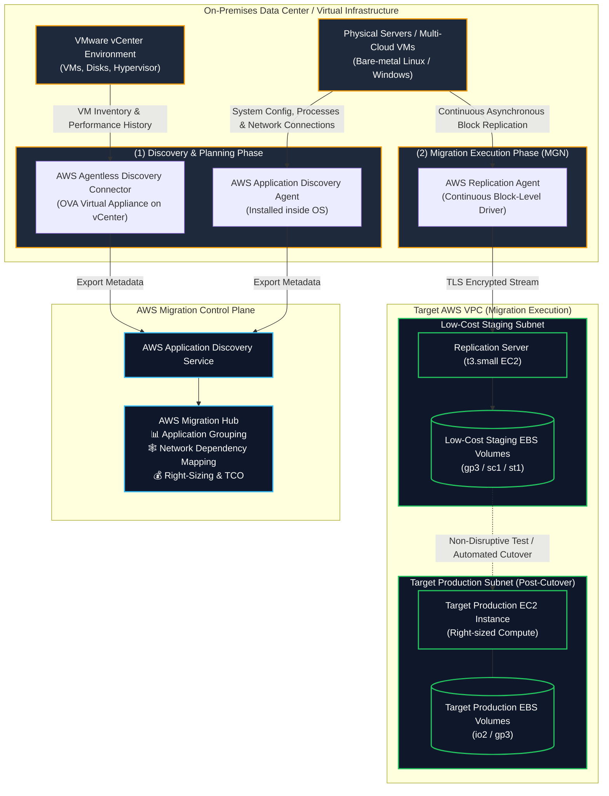
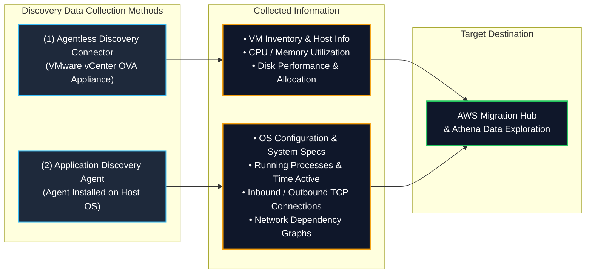
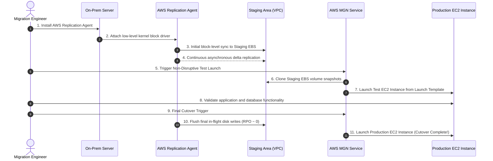
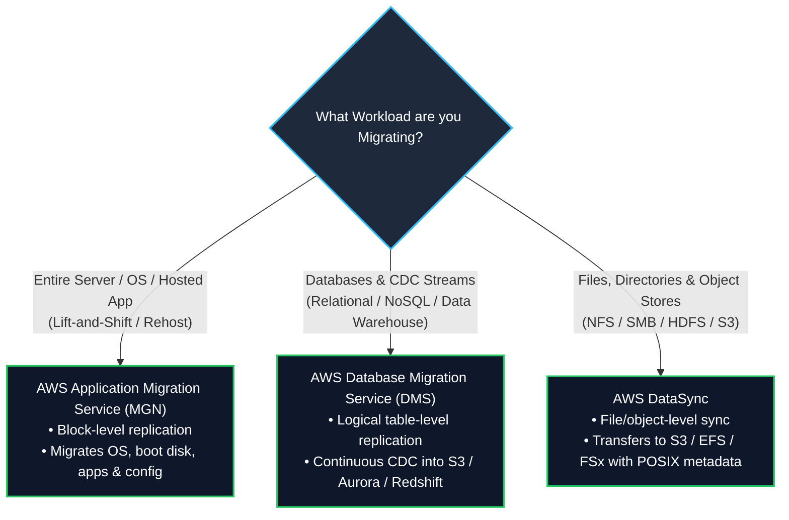

# 🔍 AWS Application Discovery Service & AWS Application Migration Service (MGN)

- **Category**: Migration & Transfer (Discovery, Assessment, Dependency Mapping & Automated Server Rehosting)
- **Language / ဘာသာစကား**: [English (Original)](/en/02-services/migration/application-discovery-and-mgn) | **မြန်မာဘာသာ (Burmese)**
- **Primary Use Case**: Enterprise cloud migration များကို စီစဉ်ရာတွင် on-premises server infrastructure များကို ရှာဖွေဖော်ထုတ်ခြင်း၊ dependency များကို မြေပုံဆွဲခြင်း နှင့် continuous block-level replication ကိုအသုံးပြုကာ အလိုအလျောက် lift-and-shift (rehost) server migration များကို လုပ်ဆောင်ခြင်း။
- **Slide Reference**: `[AWSCertifiedDataEngineerSlides.pdf](/docs/AWSCertifiedDataEngineerSlides.pdf)` ရှိ စာမျက်နှာ 267–268
- **Hub Links**: [[mm/index]] | [[service-catalog]] | [[domain-1-ingestion-and-processing]] | [[dms-and-sct]] | [[datasync-and-snow]] | [[data-exchange]] | [[transfer-family]]

---

## 1. High-Level Summary

Enterprise cloud migration များကို migration wave များ မလုပ်ဆောင်မီ လက်ရှိ on-premises inventory နှင့် workload dependency များကို နားလည်ခြင်းဖြင့် စတင်ပါသည်-

1. **AWS Application Discovery Service**: On-premises data center များမှ server specification၊ performance utilization (CPU, memory, disk I/O) နှင့် network connection metadata များကို စုဆောင်းပေးပါသည်။ စုဆောင်းရရှိသော data များကို **AWS Migration Hub** သို့ ပေးပို့ကာ server များကို application များအဖြစ် အုပ်စုဖွဲ့ခြင်း၊ inter-service network dependencies များကို မြေပုံဆွဲခြင်း နှင့် AWS compute instance များကို right-sizing လုပ်ရန်အတွက် Total Cost of Ownership (TCO) တွက်ချက်ခြင်းများကို ပြုလုပ်ပါသည်။
2. **AWS Application Migration Service (AWS MGN)**: **CloudEndure Migration** ၏ AWS-native ဆင့်ကဲပြောင်းလဲမှုဖြစ်ပြီး legacy **AWS Server Migration Service (SMS)** နေရာတွင် တရားဝင်အစားထိုးထားသော service ဖြစ်ပါသည်။ ၎င်းသည် **lift-and-shift (rehost)** migration များအတွက် အဓိကကျသော AWS service ဖြစ်ပြီး၊ continuous block-level data replication ကို အသုံးပြု၍ physical, virtual, သို့မဟုတ် cloud-hosted server များကို AWS သို့ အနှောင့်အယှက်မရှိ (non-disruptively) ကူးယူပေးပါသည်။

**AWS Certified Data Engineer – Associate (DEA-C01)** exam အတွက် အောက်ပါတို့ကို ကျွမ်းကျင်ရမည်-
- **Agentless vs. Agent-Based Discovery**: **AWS Agentless Discovery Connector** (VMware vCenter) ကို မည်သည့်အချိန်တွင် အသုံးပြုရမည်နှင့် **AWS Application Discovery Agent** (OS-level တွင် run နေသော process များနှင့် TCP network dependencies) ကို မည်သည့်အချိန်တွင် အသုံးပြုရမည်ဆိုသည်ကို ခွဲခြားသိရှိခြင်း။
- **AWS Migration Hub Integration**: DMS, MGN နှင့် partner tool များအကြား discovery, planning, နှင့် migration status များကို ခြေရာခံရန် ဗဟိုချုပ်ကိုင်ထားသော dashboard။
- **AWS MGN Lift-and-Shift Architecture**: ပေါ့ပါးသော replication agent၊ Amazon VPC အတွင်းရှိ ကုန်ကျစရိတ်နည်းပါးသော staging area၊ continuous asynchronous block-level replication၊ အနှောင့်အယှက်မရှိစမ်းသပ်ခြင်း (non-disruptive testing) နှင့် target EC2 instance များဆီသို့ အလိုအလျောက် cutover ပြုလုပ်ခြင်း။

---

## 2. AWS Application Discovery Service Deep Dive

Enterprise data နှင့် database migration တစ်ခုကို စီစဉ်ရာတွင် မှန်းဆတွက်ချက်ရမှုများကို ဖယ်ရှားရန်နှင့် system များအကြား ဖုံးကွယ်နေသော dependency များကြောင့် ဖြစ်ပေါ်လာနိုင်သည့် migration outage များကို တားဆီးရန် infrastructure attributes များကို စုဆောင်းရန် လိုအပ်ပါသည်။

### Agentless vs. Agent-Based Discovery Comparison Matrix

| Architectural Dimension | Agentless Discovery Connector | Application Discovery Agent |
| :--- | :--- | :--- |
| **Deployment Model** | VMware vCenter environment အတွင်းသို့ **OVA virtual appliance** အနေဖြင့် တိုက်ရိုက် deploy လုပ်ပါသည်။ | **Linux သို့မဟုတ် Windows OS** အသီးသီးတွင် တစ်ခုချင်းစီ install လုပ်ပါသည်။ (VMs, bare-metal physical servers, သို့မဟုတ် အခြား cloud များ) |
| **Administrative Overhead** | **အလွန်နည်းပါးသည်** (Hypervisor အဆင့်တွင် appliance တစ်ခုတည်းသာ install လုပ်ရသည်)။ | **ပိုများသည်** (Server များအားလုံးတွင် root/administrator ဖြင့် install လုပ်ရန် လိုအပ်သည်)။ |
| **Host System Access Required** | ❌ Host ၏ root/admin credentials များ မလိုအပ်ပါ။ | ✅ Agent ကို install လုပ်ရန် Host ၏ root/admin permissions များ လိုအပ်ပါသည်။ |
| **Collected Data Metrics** | VM inventory၊ hardware configuration၊ သမိုင်းကြောင်းအရ CPU/RAM/Disk performance averages များ။ | အသေးစိတ် hardware specs၊ system performance၊ **လက်ရှိ run နေသော process များ**၊ နှင့် **network connection telemetry**။ |
| **Network Dependency Mapping** | ❌ **မရှိပါ** (မတူညီသော application များအကြား TCP/IP network flows များကို မမြင်နိုင်ပါ)။ | ✅ **ရှိပါသည်** (Source/destination IP, port, packet rate များကို မှတ်တမ်းတင်ပြီး inter-server dependencies များကို မြေပုံဆွဲပေးသည်)။ |
| **Best DEA-C01 Use Case** | VMware server အုပ်စုကြီးများကို မြန်ဆန်ပြီး ဝင်ရောက်စွက်ဖက်မှုမရှိသော (non-intrusive) ကနဦး high-level discovery ပြုလုပ်ရန်။ | Migration wave planning ကို အသေးစိတ်ပြုလုပ်ရန်၊ migration မလုပ်မီ ဖုံးကွယ်နေသော database/ETL dependencies များကို ရှာဖွေဖော်ထုတ်ရန်။ |

---

## 3. AWS Application Migration Service (AWS MGN) Deep Dive

**AWS Application Migration Service (AWS MGN)** သည် အဖွဲ့အစည်းများအား physical, virtual, သို့မဟုတ် cloud-based application အများအပြားကို Amazon EC2 သို့ downtime အနည်းဆုံးနှင့် data လုံးဝမဆုံးရှုံးစေဘဲ (zero data loss) တိုက်ရိုက် lift-and-shift (rehost) လုပ်နိုင်စေရန် ကူညီပေးပါသည်။

### 1. Evolution from CloudEndure & SMS
- **AWS Server Migration Service (SMS)**: အသုံးမပြုတော့သော (deprecated) snapshot-based migration service ဖြစ်ပါသည်။ Server များကို အချိန်ပိုင်းအလိုက် snapshot များရယူ၍ migrate လုပ်သောကြောင့် RPO ပိုများ (နာရီပေါင်းများစွာ) ပါသည်။
- **CloudEndure Migration**: AWS မှ ဝယ်ယူခဲ့သော Third-party tool တစ်ခုဖြစ်ပြီး real-time continuous block-level data replication ကို စတင်မိတ်ဆက်ခဲ့ပါသည်။
- **AWS Application Migration Service (AWS MGN)**: CloudEndure ၏ ခေတ်မီပြီး၊ အပြည့်အဝပေါင်းစပ်ထားသော၊ AWS-native ဆင့်ကဲပြောင်းလဲမှု ဖြစ်ပါသည်။ Unified IAM authentication၊ AWS CloudTrail auditing၊ CloudWatch metrics နှင့် automated launch template orchestration တို့ကို ထောက်ပံ့ပေးပါသည်။

### 2. End-to-End Rehost Workflow

### 3. Key Components of AWS MGN Architecture

1. **AWS Replication Agent**:
   - Source server တွင် install လုပ်ထားသော ပေါ့ပါးသည့် software agent ဖြစ်ပါသည်။
   - OS driver level (file system ၏အောက်တွင်) မှ storage block များကို ဖတ်ပါသည်။ Source server ကို restart ချရန်မလိုဘဲ ပြောင်းလဲသွားသော block များအားလုံးကို စဉ်ဆက်မပြတ် (continuously) replicate လုပ်ပေးပါသည်။
2. **Staging Area Subnet**:
   - သင်၏ target AWS VPC အတွင်းရှိ သီးခြားခွဲထုတ်ထားသော (isolated) subnet တစ်ခုဖြစ်ပြီး ပေါ့ပါး၍ ကုန်ကျစရိတ်သက်သာသော EC2 replication server များ (ဥပမာ `t3.small`) နှင့် ကုန်ကျစရိတ်သက်သာသော EBS volume များ (ဥပမာ `sc1` သို့မဟုတ် `st1`) ပါဝင်ပါသည်။
   - ရက်သတ္တပတ်/လပေါင်းများစွာ replication synchronization လုပ်ဆောင်နေစဉ်အတွင်း cloud infrastructure ကုန်ကျစရိတ်များကို အနည်းဆုံးဖြစ်စေရန် ထိန်းသိမ်းပေးပါသည်။
3. **Launch Templates & Post-Launch Scripts**:
   - Target EC2 instance အမျိုးအစား (ဥပမာ `c6i.2xlarge`)၊ subnet၊ security group နှင့် production EBS volume အမျိုးအစား (`gp3`/`io2`) တို့ကို သတ်မှတ်ပေးပါသည်။
   - Post-launch action များသည် AWS Systems Manager (SSM) agent ကို အလိုအလျောက် install လုပ်ခြင်း၊ မိမိစိတ်ကြိုက် disaster recovery script များကို run ခြင်း သို့မဟုတ် database driver များကို install လုပ်ခြင်းတို့ကို လုပ်ဆောင်နိုင်ပါသည်။
4. **Non-Disruptive Testing**:
   - Source server ကို ရပ်တန့်ရန်မလိုဘဲ သို့မဟုတ် လက်ရှိလုပ်ဆောင်နေသော continuous replication ကို အနှောင့်အယှက်မဖြစ်စေဘဲ အချိန်မရွေး test EC2 instance များကို လွှင့်တင် (launch) နိုင်ပါသည်။

---

## 4. Migration Tool Selection: MGN vs. DMS vs. DataSync

မှန်ကန်သော data tier အတွက် မှန်ကန်သော migration tool ကို ရွေးချယ်ခြင်းသည် မကြာခဏတွေ့ရလေ့ရှိသော DEA-C01 architectural ဆုံးဖြတ်ချက်တစ်ခု ဖြစ်ပါသည်-

### Complete Feature Comparison Matrix

| Feature / Capability | AWS Application Migration Service (MGN) | AWS Database Migration Service (DMS) | AWS DataSync |
| :--- | :--- | :--- | :--- |
| **Migration Layer** | **Block Level (Physical/Virtual Disks)** | **Logical Database Level (Tables & Rows)** | **File & Object Level (Files & Metadata)** |
| **Primary Target** | **Amazon EC2 (AMIs & EBS Volumes)** | **Amazon RDS, Aurora, Redshift, S3, DynamoDB** | **Amazon S3, Amazon EFS, AWS FSx** |
| **Source Engine Change?** | ❌ မပြောင်းလဲပါ (Source OS ကို အတိအကျ bit-for-bit ကူးယူသည်) | ✅ ပြောင်းလဲနိုင်သည် (SCT ဖြင့် မတူညီသော (heterogeneous) engine ပြောင်းလဲမှုများကို ထောက်ပံ့သည်) | ❌ မပြောင်းလဲပါ (ထောက်ပံ့ထားသော protocol များမှတစ်ဆင့် file များကို transfer လုပ်သည်) |
| **Replication Mechanism** | စဉ်ဆက်မပြတ် OS block-level write intercept ပြုလုပ်ခြင်း | Transaction log ကို ခွဲခြမ်းစိတ်ဖြာခြင်း (WAL, binlogs, redo logs) | အချိန်သတ်မှတ်ချက် (Scheduled)/စဉ်ဆက်မပြတ် file delta များကို ချိန်ကိုက်ခြင်း (synchronization) |
| **Application Downtime** | အနည်းဆုံးဖြစ်သည် (နောက်ဆုံး DNS cutover ပြုလုပ်စဉ် မိနစ်အနည်းငယ်သာ) | နီးပါးမရှိပါ (Continuous CDC catch-up) | မသက်ဆိုင်ပါ (Storage data များကို synchronize လုပ်ရန်အတွက်သာ အသုံးပြုသည်) |
| **Data Transformation?** | ❌ Transformation မရှိပါ | ✅ ရှိပါသည် (Table mapping, column renaming, filtering) | ❌ Transformation မရှိပါ (File ၏ မူလအခြေအနေကို ထိန်းသိမ်းထားသည်) |

---

## 5. High-Yield DEA-C01 Exam Tips & Traps

> [!IMPORTANT]
> **Key Exam Trigger Keywords**:
> - **"Plan on-premises migration, discover server utilization and map network dependencies between systems"** $\rightarrow$ **AWS Application Discovery Service (Application Discovery Agent ဖြင့်တွဲလျက်)**.
> - **"Agentless discovery of VMware vCenter virtual machines"** $\rightarrow$ **AWS Agentless Discovery Connector**.
> - **"Track progress of migrations across multiple AWS tools (DMS, MGN) in a single centralized dashboard"** $\rightarrow$ **AWS Migration Hub**.
> - **"Lift-and-shift / rehost physical, virtual, or cloud servers to EC2 with minimal downtime and continuous block replication"** $\rightarrow$ **AWS Application Migration Service (MGN)**.
> - **"Evolution of CloudEndure Migration / Replacement for Server Migration Service (SMS)"** $\rightarrow$ **AWS Application Migration Service (MGN)**.

> [!WARNING]
> **Exam Traps & Failure Modes**:
> 1. **Agentless Discovery Cannot Map Network Dependencies**:
>    - အကယ်၍ exam မေးခွန်းတွင် **application များအကြား network connection များကို မြေပုံဆွဲရန်နှင့် ဖုံးကွယ်နေသော dependency များကို ရှာဖွေဖော်ထုတ်ရန်** လိုအပ်ပါက၊ **Agentless Discovery Connector သည် မလုံလောက်ပါ**။ Operating system အသီးသီးအတွင်း **Application Discovery Agent** ကို မဖြစ်မနေ install လုပ်ရပါမည်။
> 2. **MGN vs. DMS for Database Migrations**:
>    - ရည်ရွယ်ချက်သည် on-premises Oracle database တစ်ခုကို **Amazon Aurora PostgreSQL** သို့ modernize လုပ်ရန်ဖြစ်ပါက၊ AWS MGN ကို အသုံးမပြုဘဲ **AWS SCT + AWS DMS** ကို အသုံးပြုရပါမည်! AWS MGN သည် engine ကို convert လုပ်ခြင်း သို့မဟုတ် modernize လုပ်ခြင်းများမရှိဘဲ EC2 instance ပေါ်သို့ (rehost) တစ်ခုလုံးကို အရှိအတိုင်းသာ ပုံတူကူး (clone) ပေးပါသည်။
> 3. **Staging Area Cost Optimization**:
>    - MGN replication လုပ်ဆောင်နေစဉ်အတွင်း၊ source disk များသည် သေးငယ်သော EC2 replication instance များနှင့် ချိတ်ဆက်ထားသည့် ကုန်ကျစရိတ်သက်သာသော staging EBS volume များဆီသို့ replicate လုပ်ပါသည်။ အပြည့်အဝအသုံးပြုနိုင်မည့် (Full-sized) production compute instance များကို **testing လုပ်နေစဉ် သို့မဟုတ် နောက်ဆုံး cutover ပြုလုပ်စဉ်တွင်သာ provision လုပ်ပေးသောကြောင့်** migration ကုန်ကျစရိတ်များကို အနည်းဆုံးဖြစ်စေပါသည်။

---

## 📌 Related Notes

- [[dms-and-sct]] — AWS DMS & SCT for database migrations and CDC replication
- [[datasync-and-snow]] — AWS DataSync & Snow Family for file and object migration
- [[data-exchange]] — AWS Data Exchange for third-party datasets and Redshift integration
- [[transfer-family]] — AWS Transfer Family for SFTP/FTPS workflows
- [[domain-1-ingestion-and-processing]] — DEA-C01 Domain 1 Study Guide
- [[service-comparisons]] — Master DEA-C01 Service Decision Matrix
