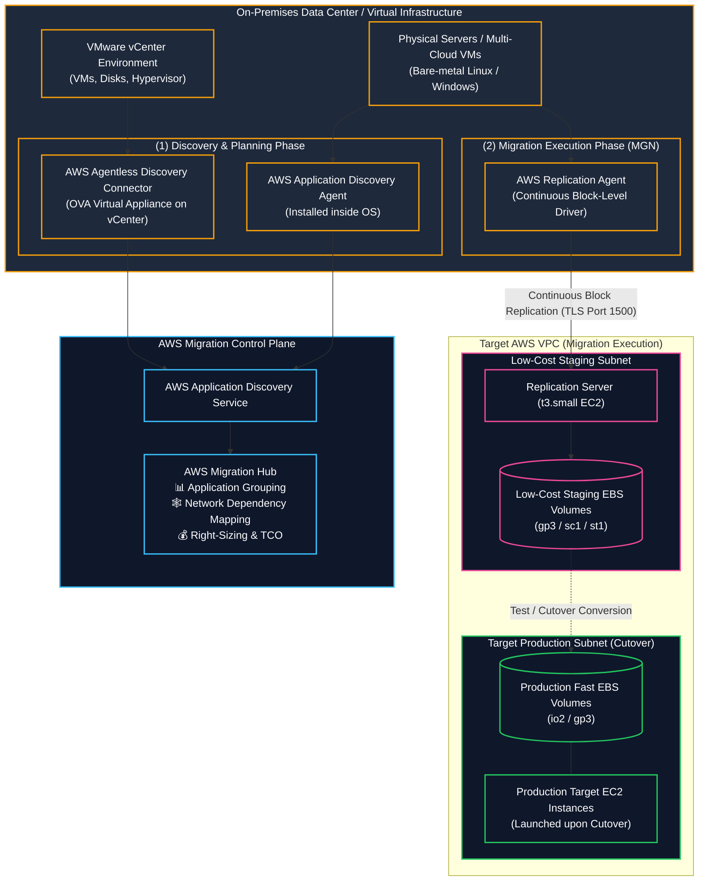

# 🔍 AWS Application Discovery Service & AWS Application Migration Service (MGN) (ဆာဗာ စူးစမ်းရှာဖွေခြင်းနှင့် ပြောင်းရွှေ့ခြင်း ဝန်ဆောင်မှုများ)

- **Category**: Migration & Transfer (Discovery, Assessment, Dependency Mapping & Automated Server Rehosting)
- **Language / ဘာသာစကား**: [English Version](file:///home/monetine/Workspace/Wathon/aws-dea-c01/content/en/02-services/migration/application-discovery-and-mgn.md) | **မြန်မာဘာသာ (Burmese)**
- **အဓိက အသုံးပြုမှု**: လုပ်ငန်းသုံး Data Center များရှိ Server များနှင့် Network Dependencies များကို ကြိုတင် စူးစမ်းဆန်းစစ်ခြင်း (Discovery)၊ နှင့် Physical/Virtual Servers များကို Continuous Block-level Replication ဖြင့် AWS EC2 ပေါ်သို့ Lift-and-Shift (Rehost) ပြောင်းရွှေ့ခြင်း (MGN)။
- **Slide Reference**: Pages 267–268 in `[[AWSCertifiedDataEngineerSlides.pdf]]`
- **Hub Links**: `[[mm/index]]` | `[[en/index]]` | `[[dms-and-sct]]` | `[[datasync-and-snow]]` | `[[data-exchange]]` | `[[transfer-family]]`

---

## ၁။ အကျဉ်းချုပ် (High-Level Summary)

Cloud သို့ ဆာဗာများ အလုံးစုံ ပြောင်းရွှေ့ရာတွင် အဆင့် ၂ ဆင့်ဖြင့် လုပ်ဆောင်ပါသည်-
1. **AWS Application Discovery Service**: လက်ရှိ On-premises Data Center ရှိ Server အချက်အလက်များ (CPU, Memory, Disk I/O) နှင့် Network ချိတ်ဆက်မှုများကို စုဆောင်းပေးသည်။ **AWS Migration Hub** တွင် Server များကို Application အလိုက် စုစည်းပေးပြီး ကုန်ကျစရိတ် TCO ကို ကြိုတင်တွက်ချက်ပေးသည်။
2. **AWS Application Migration Service (AWS MGN)**: Physical Servers၊ Virtual Machines သို့မဟုတ် အခြား Cloud ပေါ်ရှိ ဆာဗာများကို AWS ပေါ်သို့ အနှောင့်အယှက်မရှိစေဘဲ **Lift-and-Shift (Rehost)** ပြောင်းရွှေ့ပေးသည့် Primary AWS Service ဖြစ်သည်။

---

## ၂။ Agentless vs. Agent-Based Discovery နှိုင်းယှဉ်ချက်

| Discovery Method | တပ်ဆင်ပုံ (Deployment) | စုဆောင်းနိုင်သော အချက်အလက်များ (Data Captured) |
| :--- | :--- | :--- |
| **AWS Agentless Discovery Connector** | VMware vCenter ပေါ်တွင် OVA Virtual Appliance အဖြစ် တင်ရသည် | VM Specs, CPU/Memory Utilization, Disk I/O (VMware အဆင့်) |
| **AWS Application Discovery Agent** | ဆာဗာ OS တိုင်းတွင် Agent software သွင်းရသည် | **Process-level Information & TCP Inbound/Outbound Network Dependencies (အသေးစိတ် ကွန်ရက် ချိတ်ဆက်မှုများ)** |

---

## ၃။ DEA-C01 စာမေးပွဲ အဓိက အချက်အလက်များ (Exam Tips)

> [!IMPORTANT]
> **Key Exam Trigger Keywords**:
> - **"Lift-and-shift / rehost physical, virtual, or cloud-hosted servers to Amazon EC2 with continuous block-level replication"** $\rightarrow$ **AWS Application Migration Service (AWS MGN)**.
> - **"Discover on-premises server inventory, track CPU/memory utilization, and map network dependencies"** $\rightarrow$ **AWS Application Discovery Service**.
> - **"Map detailed TCP network connection dependencies between servers for migration planning"** $\rightarrow$ **AWS Application Discovery Agent (Agent-based)**.

---

## 📌 ဆက်စပ် မှတ်စုများ (Related Notes)

- `[[dms-and-sct]]` — AWS DMS & SCT Database Migration
- `[[datasync-and-snow]]` — AWS DataSync & Snowball Data Transfer
- `[[ec2-and-graviton]]` — Target Amazon EC2 Instances
