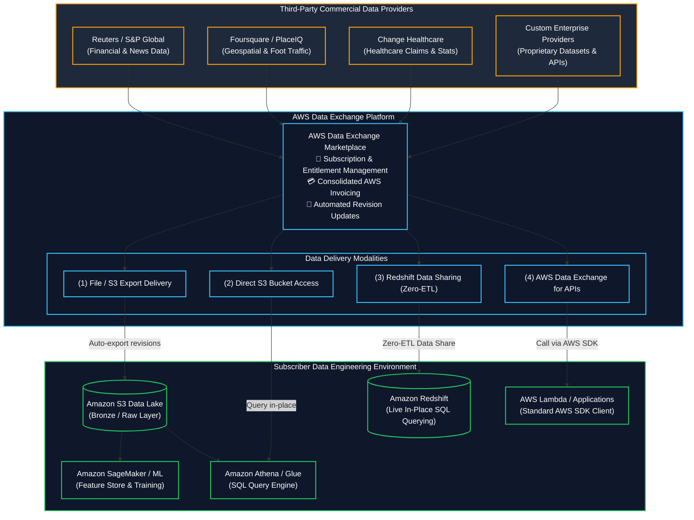

# 🌐 AWS Data Exchange (Third-Party Cloud Data Ingestion & Licensing) (ပြင်ပ Third-Party ဒေတာ ရယူခြင်းနှင့် စီမံခြင်း)

- **Category**: Migration & Transfer (Third-Party Data Ingestion, Data Marketplace & Data Licensing)
- **Language / ဘာသာစကား**: [English Version](file:///home/monetine/Workspace/Wathon/aws-dea-c01/content/en/02-services/migration/data-exchange.md) | **မြန်မာဘာသာ (Burmese)**
- **အဓိက အသုံးပြုမှု**: ပြင်ပ Third-party စီးပွားရေး ဒေတာများကို ရှာဖွေဝယ်ယူပြီး `[[s3]]` ထဲသို့ အလိုအလျောက် သွင်းယူခြင်း၊ `[[redshift]]` ထဲတွင် ETL မလိုဘဲ Direct Query လုပ်ခြင်း၊ နှင့် Standard AWS SDK ဖြင့် Third-party APIs များကို ခေါ်ယူခြင်း။
- **Slide Reference**: Pages 281–283 in `[[AWSCertifiedDataEngineerSlides.pdf]]`
- **Hub Links**: `[[mm/index]]` | `[[en/index]]` | `[[s3]]` | `[[redshift]]` | `[[lake-formation]]`

---

## ၁။ အကျဉ်းချုပ် (High-Level Summary)

**AWS Data Exchange** သည် စီးပွားရေးလုပ်ငန်းသုံး ပြင်ပ ဒေတာထုတ်ဝေသူများ (Reuters, Dun & Bradstreet, S&P Global, Foursquare) ထံမှ Third-party Datasets ထောင်ပေါင်းများစွာကို Cloud ပေါ်တွင် လွယ်ကူစွာ စာရင်းသွင်း ရယူနိုင်စေသည့် ဝန်ဆောင်မှု ဖြစ်သည်။ SFTP သို့မဟုတ် သီးခြား API Keys များ စီမံစရာမလိုဘဲ AWS IAM နှင့် ပေါင်းစပ်ပြီး ဒေတာများကို တိုက်ရိုက် ရယူနိုင်သည်။

---

## ၂။ ပံ့ပိုးထားသော ဒေတာရယူမှု ပုံစံ ၄ မျိုး (Delivery Modalities)

1. **Amazon S3 File Delivery**: Provider မှ Dataset အသစ် ထုတ်ဝေတိုင်း Subscriber ၏ S3 Bucket သို့ အလိုအလျောက် Export လုပ်ပေးသည်။
2. **AWS Data Exchange for Amazon Redshift**: Redshift Data Sharing ကို အသုံးပြု၍ Provider ၏ Redshift Cluster ထဲရှိ ဒေတာများကို မိမိ Redshift Cluster မှ **Zero-ETL ဖြင့် တိုက်ရိုက် SQL Query** လုပ်နိုင်သည်။
3. **AWS Data Exchange for Amazon S3**: Provider ၏ S3 Bucket ထဲရှိ Multi-terabyte ဒေတာများကို မိမိ Account သို့ ကူးယူစရာမလိုဘဲ In-place ဖတ်ရှုနိုင်သည်။
4. **AWS Data Exchange for APIs**: Third-party REST APIs များကို AWS SDK ဖြင့် IAM Authentication သုံး၍ ခေါ်ယူနိုင်သည်။

---

## ၃။ DEA-C01 စာမေးပွဲ အဓိက အချက်အလက်များ (Exam Tips)

> [!IMPORTANT]
> **Key Exam Trigger Keywords**:
> - **"Subscribe to and ingest commercial third-party datasets (financial, geospatial, healthcare) natively into AWS"** $\rightarrow$ **AWS Data Exchange**.
> - **"Query third-party vendor data directly in Amazon Redshift without building ETL pipelines"** $\rightarrow$ **AWS Data Exchange for Amazon Redshift (uses Redshift Data Sharing)**.
> - **"Invoke third-party REST APIs using native AWS IAM authentication"** $\rightarrow$ **AWS Data Exchange for APIs**.

---

## 📌 ဆက်စပ် မှတ်စုများ (Related Notes)

- `[[s3]]` — Amazon S3 Data Lake Ingestion
- `[[redshift]]` — Amazon Redshift & Redshift Data Sharing
- `[[lake-formation]]` — Data Lake Access Governance
