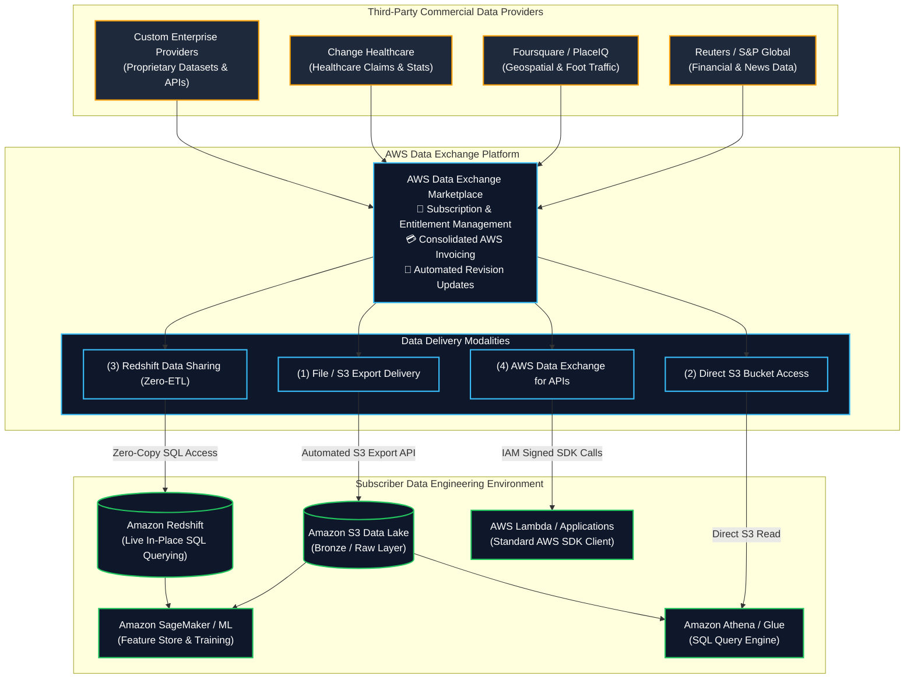
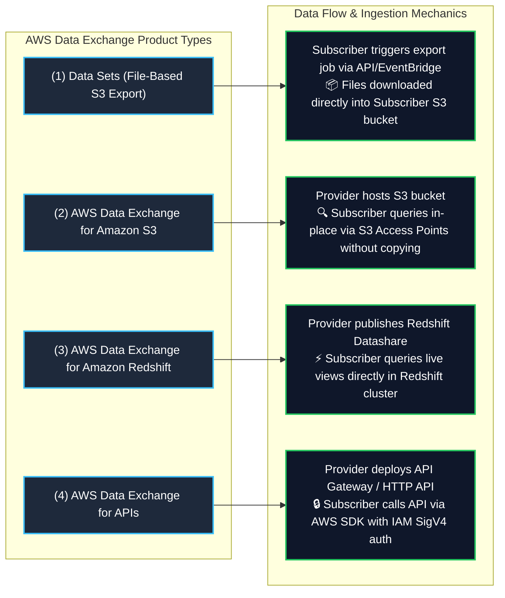
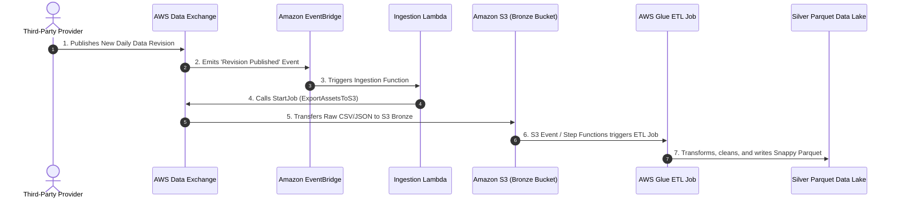

# 🌐 AWS Data Exchange (Third-Party Cloud Data Ingestion & Licensing)

- **Category**: Migration & Transfer (Third-Party Data Ingestion, Data Marketplace & Data Licensing)
- **Language / ဘာသာစကား**: [English (Original)](/en/02-services/migration/data-exchange) | **မြန်မာဘာသာ (Burmese)**
- **Primary Use Case**: Third-party external dataset များကို ရှာဖွေခြင်း၊ subscribe လုပ်ခြင်းနှင့် [[s3]] သို့ ချောမွေ့စွာ load လုပ်ခြင်း၊ ပြင်ပ data များကို ETL မလိုဘဲ [[redshift]] တွင် တိုက်ရိုက် query လုပ်ခြင်း၊ နှင့် native AWS IAM governance ကိုအသုံးပြုပြီး third-party API များကို ခေါ်ဆိုခြင်း (invoke) များအတွက်ဖြစ်ပါသည်။
- **Slide Reference**: `[AWSCertifiedDataEngineerSlides.pdf](/docs/AWSCertifiedDataEngineerSlides.pdf)` မှ Pages 281–283
- **Hub Links**: [[mm/index]] | [[service-catalog]] | [[domain-1-ingestion-and-processing]] | [[domain-2-data-store-management]] | [[s3]] | [[redshift]] | [[lake-formation]]

---

## 1. High-Level Summary

**AWS Data Exchange** သည် cloud ပေါ်တွင် commercial provider များ (ဥပမာ - Reuters, Dun & Bradstreet, Foursquare, Change Healthcare, S&P Global) ထံမှ third-party dataset ထောင်ပေါင်းများစွာကို လွယ်ကူစွာရှာဖွေရန်၊ subscribe လုပ်ရန်နှင့် အသုံးပြုရန် ပြုလုပ်ပေးသည်။ Custom SFTP pipeline များ၊ one-off API credentials များ၊ သို့မဟုတ် physical media contract များကို ကိုယ်တိုင်စီမံခန့်ခွဲနေမည့်အစား AWS Data Exchange သည် data ပေးပို့ခြင်း (data delivery)၊ အလိုအလျောက် update လုပ်ခြင်းများ၊ billing နှင့် governance တို့ကို AWS အတွင်းတွင် native အဖြစ် standard သတ်မှတ်ပေးသည်။

**AWS Certified Data Engineer – Associate (DEA-C01)** exam အတွက် သင် ကျွမ်းကျင်ထားရမည်မှာ-
1. **Core Data Ingestion into Amazon S3**: အသစ်ထုတ်ဝေသော dataset revision များကို [[s3]] data lake များသို့ အလိုအလျောက် export လုပ်ခြင်းဖြင့် [[glue]], [[athena]], နှင့် [[emr]] တို့မှ downstream processing ပြုလုပ်နိုင်ရန်။
2. **AWS Data Exchange for Amazon Redshift**: Live ဖြစ်သော third-party data များကို [[redshift]] table များမှနေ၍ **data ကူးယူခြင်း (သို့မဟုတ်) ETL pipeline များတည်ဆောက်ခြင်း မရှိဘဲ** တိုက်ရိုက် query လုပ်ခြင်း (Redshift Data Sharing ဖြင့် အလုပ်လုပ်သည်)။
3. **AWS Data Exchange for Amazon S3**: Multi-terabyte ရှိသော dataset များကို သင့် account ထဲသို့ copy မကူးဘဲ provider မှ စီမံထားသော S3 bucket များကို တိုက်ရိုက် access လုပ်ခြင်းနှင့် query လုပ်ခြင်း။
4. **AWS Data Exchange for APIs**: စံသတ်မှတ်ထားသော **AWS SDKs**, native IAM authentication, နှင့် ပေါင်းစည်းထားသော AWS billing တို့ဖြင့် third-party REST API များကို ခေါ်ဆိုခြင်း။
5. **Data Lake & ML Integrations**: ပြင်ပ market/financial/demographic data များကို အတွင်းပိုင်း operational dataset များနှင့် ပေါင်းစပ်၍ Amazon SageMaker တွင် machine learning အတွက်နှင့် [[quicksight]] တွင် analytics အတွက် အသုံးပြုခြင်း။



---

## 2. Core Delivery Modalities & Architecture

AWS Data Exchange သည် data engineering consumption model များအတွက် သီးသန့်ရည်ရွယ်ထုတ်လုပ်ထားသော native delivery mechanism ၄ မျိုးကို ပံ့ပိုးပေးသည်-



### 1. File-Based Revisions Export to Amazon S3
- **Data Model**: Data ကို အချိန်နှင့်အမျှပြောင်းလဲသော (chronological) **Revisions** များပါဝင်သည့် **Data Sets** အဖြစ် publish လုပ်ပြီး ယင်း Revisions များတွင် သီးခြား **Assets** (CSV, JSON, Parquet files) များပါဝင်သည်။
- **Automation**: Data provider သည် revision အသစ်တစ်ခုကို publish လုပ်သောအခါ (ဥပမာ - နေ့စဥ် market close prices များ)၊ Amazon EventBridge event တစ်ခုကို ထုတ်လွှင့် (emit) ပေးသည်။
- **Workflow**: AWS Lambda function သို့မဟုတ် AWS Step Functions workflow က အဆိုပါ event ကိုဖမ်းယူပြီး `SendRevisionAsyncJob` ကို invoke လုပ်ကာ revision asset များကို သင့် target **Amazon S3** Data Lake bucket အတွင်းသို့ တိုက်ရိုက် copy ကူးပေးသည်။

### 2. AWS Data Exchange for Amazon S3 (Zero-Copy S3 Access)
- Data subscriber များကို provider မှစီမံထားသော S3 object data များအား **မိမိတို့ account အတွင်းသို့ ဖိုင်များ copy ကူးစရာမလိုဘဲ S3 မှ တိုက်ရိုက် access လုပ်ရန်** ခွင့်ပြုသည်။
- Subscriber များသည် object များကို နေရာမှာပင် (in-place) ဖတ်ရှုရန် standard S3 APIs, Amazon Athena, AWS Glue, သို့မဟုတ် Amazon EMR ကို အသုံးပြုကြသည်။
- Storage replication ကုန်ကျစရိတ်များ၊ S3 data transfer လုပ်ဆောင်ရမှုများနှင့် file synchronization pipeline တည်ဆောက်ရမှုများကို ဖယ်ရှားပေးသည်။

### 3. AWS Data Exchange for Amazon Redshift (Direct SQL Querying)
- Subscriber များကို ၎င်းတို့ subscribe လုပ်ပြီး မိနစ်ပိုင်းအတွင်း live third-party table များနှင့် view များအား ၎င်းတို့၏ **Amazon Redshift** data warehouse အတွင်း၌ တိုက်ရိုက် query လုပ်နိုင်ရန် ပံ့ပိုးပေးသည်။
- **Powered by Redshift Data Sharing**:
  - Zero-ETL, zero-copy architecture.
  - Query များကို အများပြည်သူသုံးအင်တာနက်ပေါ်မှ data မရွေ့လျားစေဘဲ AWS account များအကြား လုံခြုံစွာ run နိုင်သည်။
  - Provider သည် ၎င်းတို့၏ Redshift data ကို update လုပ်သည်နှင့် တစ်ပြိုင်နက်၊ အပြောင်းအလဲများကို **subscriber SQL queries များအတွက် ချက်ချင်းမြင်တွေ့နိုင်သည်**။
  - Subscriber များသည် ပြင်ပ third-party dataset များကို အတွင်းပိုင်း transactional data table များနှင့် standard SQL ဖြင့် လွယ်ကူစွာ `JOIN` လုပ်နိုင်သည်။

```sql
-- Query external third-party demographic data directly in Amazon Redshift
SELECT 
    c.customer_id,
    c.zip_code,
    c.lifetime_spend,
    adx_demo.median_household_income,
    adx_demo.purchasing_power_index
FROM internal_schema.customers c
JOIN "third_party_demographics_datashare"."public"."us_income_metrics" adx_demo
    ON c.zip_code = adx_demo.zip_code
WHERE adx_demo.median_household_income > 85000;
```

### 4. AWS Data Exchange for APIs (Managed REST APIs)
- Developer များနှင့် data engineer များမှ third-party REST API များကို ခေါ်ဆိုသည့်ပုံစံကို စံသတ်မှတ်ပေးသည်။
- **Key Advantages**:
  - **No API Key Management**: Code ထဲတွင် third-party API token များ၊ secret key များ သို့မဟုတ် custom header များကို စီမံရခြင်းကို ဖယ်ရှားပေးသည်။
  - **Native IAM Authentication**: Request များကို standard AWS IAM credentials ဖြင့် sign လုပ်သည် (Signature Version 4 - SigV4)။
  - **Unified SDK**: API call များပြုလုပ်ရန် standard AWS SDKs (`aws-sdk`, `boto3`) ကို အသုံးပြုသည်။
  - **Consolidated Billing**: API အသုံးပြုမှု ကုန်ကျစရိတ်များကို ပုံမှန် AWS လစဉ် invoice တွင် တိုက်ရိုက်ဖော်ပြပေးသည်။

---

## 3. High-Yield Data Engineering Architecture Patterns

### Pattern A: Automated Third-Party Data Lake Ingestion Pipeline



### Pattern B: Real-Time Financial Market Enrichment in Amazon Redshift
- **Scenario**: Fintech platform တစ်ခုသည် customer ၏ portfolio transaction များကို commercial financial vendor မှပေးသော real-time foreign exchange (FX) rate များနှင့် stock market ticker feed များနှင့် ဖြည့်စွက် (enrich) ရန် လိုအပ်သည်။
- **Solution**: **AWS Data Exchange for Amazon Redshift** မှတဆင့် financial data product ကို subscribe လုပ်ပါ။
- **Architecture**:
  - AWS Data Exchange ရှိ vendor ၏ Redshift Data Share သို့ subscribe လုပ်ပါ။
  - Datashare ကို Amazon Redshift တွင် database reference အဖြစ် mount လုပ်ပါ-
    ```sql
    CREATE DATABASE market_data FROM DATA EXCHANGE 'arn:aws:dataexchange:us-east-1:...';
    ```
  - Data analyst များနှင့် BI dashboard များ ([[quicksight]]) သည် **latency လုံးဝမရှိဘဲနှင့် ETL overhead လုံးဝမရှိဘဲ** ပြင်ပ database နှင့်ချိတ်ဆက်၍ real-time join query များကို run နိုင်သည်။

---

## 4. Multi-Product Comparison Matrix

| Product Offering | Ingestion Latency | Subscriber Storage Cost | Compute Overhead | Best DEA-C01 Use Case |
| :--- | :--- | :--- | :--- | :--- |
| **AWS Data Exchange for S3 (Export)** | Batch / Scheduled (Minutes) | Subscriber က standard S3 storage fee များကို ပေးဆောင်ရသည် | Low (Batch S3 copy) | ဖိုင်များကို internal compliance bucket များတွင် သိမ်းဆည်းရန်လိုအပ်သော Standard data lake ingestion များ။ |
| **AWS Data Exchange for S3 (Direct)** | Real-Time (Immediate) | Base storage အတွက် **$0** (Provider မှ host လုပ်သည်) | Zero (Athena/EMR ဖြင့် နေရာတွင်ပင် (in-place) query လုပ်သည်) | Data ကို subscriber account သို့ ထပ်တူကူးယူရန် (duplicate လုပ်ရန်) ကုန်ကျစရိတ်ကြီးမားသော Petabyte-scale dataset များ။ |
| **AWS Data Exchange for Redshift** | **Near Real-Time (< 1 second)** | **$0** (Storage duplication မရှိပါ) | Zero ETL; Redshift query compute ကို အသုံးပြုသည် | Internal data warehouse table များနှင့် ပြင်ပ third-party market data တို့အကြား အချိန်နှင့်တပြေးညီ (instant) SQL join များ ပြုလုပ်ခြင်း။ |
| **AWS Data Exchange for APIs** | Real-Time / Request-Response | **$0** (Transient payload) | Standard application execution (Lambda/EC2) | အချိန်နှင့်တပြေးညီ သီးခြားမှတ်တမ်း (single-record) ရှာဖွေမှုများ (identity verification, live credit scoring, real-time address validation). |

---

## 5. High-Yield DEA-C01 Exam Tips & Traps

> [!IMPORTANT]
> **Key Exam Trigger Keywords**:
> - **"Find, subscribe to, and load third-party datasets directly into Amazon S3"** $\rightarrow$ **AWS Data Exchange**.
> - **"Query third-party vendor datasets directly in Amazon Redshift without building ETL pipelines or copying data"** $\rightarrow$ **AWS Data Exchange for Amazon Redshift (Redshift Data Sharing)**.
> - **"Subscribe to third-party commercial REST APIs using standard AWS SDKs, IAM authentication, and consolidated AWS billing"** $\rightarrow$ **AWS Data Exchange for APIs**.
> - **"Directly access multi-terabyte third-party S3 datasets without copying objects to the subscriber AWS account"** $\rightarrow$ **AWS Data Exchange for Amazon S3 (Direct Access)**.

> [!WARNING]
> **Exam Traps & Failure Modes**:
> 1. **Data Exchange for Redshift Does NOT Require S3 Staging**:
>    - **AWS Data Exchange for Redshift** ကို အသုံးပြုသည့်အခါ data ကို Amazon S3 သို့ export လုပ်ပြီး Redshift ထဲသို့ `COPY` command များ run ရန် **မလိုအပ်ပါ**။ Data များကို **Redshift Data Sharing** မှတဆင့် တိုက်ရိုက်နှင့် ချက်ချင်း query လုပ်နိုင်သည်။
> 2. **AWS Data Exchange vs. AWS AppFlow**:
>    - **AWS Data Exchange** သည် **commercial third-party dataset များနှင့် public feed များ** (Reuters, Foursquare, market data) ကို subscribe လုပ်ရန်အတွက် ဖြစ်သည်။
>    - **AWS AppFlow** သည် **သင့်အဖွဲ့အစည်း၏ ကိုယ်ပိုင် enterprise SaaS data** (Salesforce, ServiceNow, Marketo, Slack, Zendesk) ကို AWS ထဲသို့ transfer လုပ်ရန်အတွက် ဖြစ်သည်။
> 3. **API Key Trap**:
>    - AWS Data Exchange for APIs သည် third-party vendor ၏ API secret token များကို AWS Secrets Manager တွင် configure လုပ်ရန် **မလိုအပ်ပါ**; ၎င်းသည် native **AWS IAM SigV4** ကို အသုံးပြု၍ အလိုအလျောက် authenticate လုပ်ပေးသည်။

---

## 📌 Related Notes

- [[redshift]] — Amazon Redshift data warehouse, Datashares, and Spectrum
- [[s3]] — S3 Data Lake destination for Data Exchange revisions
- [[application-discovery-and-mgn]] — Application discovery and automated server migration
- [[transfer-family]] — Managed SFTP/FTPS file ingestion
- [[domain-1-ingestion-and-processing]] — DEA-C01 Domain 1 Study Guide
- [[service-comparisons]] — Master DEA-C01 Service Decision Matrix
