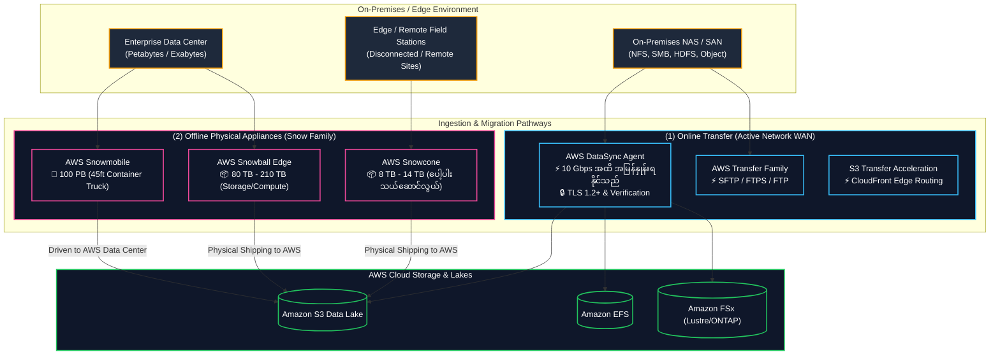

# 🚚 AWS DataSync & AWS Snow Family (Data Migration & Edge Transfer) (အွန်လိုင်းနှင့် အော့ဖ်လိုင်း ဒေတာရွှေ့ပြောင်းခြင်း စနစ်များ)

- **Category**: Migration & Transfer (Online High-Speed Network Transfer & Physical Offline Appliances)
- **Language / ဘာသာစကား**: [English Version](file:///home/monetine/Workspace/Wathon/aws-dea-c01/content/en/02-services/migration/datasync-and-snow.md) | **မြန်မာဘာသာ (Burmese)**
- **အဓိက အသုံးပြုမှု**: Network မှတစ်ဆင့် ဖိုင်များနှင့် အရာဝတ္ထုများကို `[[s3]]`၊ `[[efs-and-fsx]]` သို့ အရှိန်အဟုန်ဖြင့် ကူးယူခြင်း (AWS DataSync) နှင့် Terabyte/Petabyte အဆင့် ဒေတာများကို Physical စက်ပစ္စည်းများဖြင့် သယ်ယူပြောင်းရွှေ့ခြင်း (AWS Snow Family)။
- **Slide Reference**: Pages 276–285 in `[[AWSCertifiedDataEngineerSlides.pdf]]`
- **Hub Links**: `[[mm/index]]` | `[[en/index]]` | `[[s3]]` | `[[efs-and-fsx]]` | `[[dms-and-sct]]`

---

## ၁။ အကျဉ်းချုပ် (High-Level Summary)

ကြီးမားသော ဒေတာများကို AWS ပေါ်သို့ ရွှေ့ပြောင်းရာတွင် Network Bandwidth၊ Dataset အရွယ်အစားနှင့် အချိန်ကန့်သတ်ချက်များအပေါ် မူတည်၍ **အွန်လိုင်း Network ဖြင့် ရွှေ့ပြောင်းခြင်း (AWS DataSync)** သို့မဟုတ် **အော့ဖ်လိုင်း Physical စက်ပစ္စည်းဖြင့် ရွှေ့ပြောင်းခြင်း (AWS Snow Family)** ကို ရွေးချယ် အသုံးပြုရပါသည်-

---

## ၂။ AWS DataSync (အွန်လိုင်း Network အရှိန်မြှင့် ဒေတာပို့ဆောင်ခြင်း)

- **ပံ့ပိုးထားသော Source စနစ်များ**: NFS shares, SMB shares, Hadoop HDFS clusters, self-managed Object storage, Google Cloud Storage, Azure Blob Storage။
- **Target စနစ်များ**: **Amazon S3** (Standard, Glacier, Deep Archive), **Amazon EFS**, **Amazon FSx** (Lustre, NetApp ONTAP, OpenZFS, Windows File Server)။
- **အဓိက စွမ်းဆောင်ချက်များ**:
  - Open-source tools (rsync, scp) များထက် **၁၀ ဆ ပိုမိုမြန်ဆန်သော** သီးသန့် Network Protocol ကို အသုံးပြုသည်။
  - File Metadata၊ Permissions (POSIX / ACLs) နှင့် Timestamps များကို မူရင်းအတိုင်း ထိန်းသိမ်းပေးသည်။
  - ကူးယူပြီးချိန်တွင် Data Integrity ကို End-to-End Checksum ဖြင့် စစ်ဆေးပေးသည်။

---

## ၃။ AWS Snow Family (အော့ဖ်လိုင်း Physical စက်ပစ္စည်းများ)

Network Bandwidth မလုံလောက်သော သို့မဟုတ် သီတင်းပတ်ပေါင်းများစွာ ကြာမြင့်မည့် ပမာဏကြီးမားသော ဒေတာများအတွက် AWS Snow စက်ပစ္စည်းများကို အသုံးပြုပါသည်-

| Device | ပမာဏ (Storage Capacity) | ရည်ရွယ်ချက် (Primary Use Case) |
| :--- | :--- | :--- |
| **AWS Snowcone** | **8 TB HDD / 14 TB SSD** | အလွန်ပေါ့ပါးပြီး (4.5 lbs)၊ အင်တာနက်မရှိသော နေရာများ၊ ကွင်းဆင်း စခန်းများမှ ဒေတာစုဆောင်းရန်။ |
| **AWS Snowball Edge Storage Optimized** | **80 TB HDD / 210 TB NVMe** | ကြီးမားသော Data Center ဒေတာများ (Terabytes မှ Petabytes) ကို AWS ပေါ်သို့ Offline ရွှေ့ပြောင်းရန်။ |
| **AWS Snowball Edge Compute Optimized** | **42 TB HDD + 104 vCPUs / GPU** | Edge နေရာများတွင် Machine Learning Inference နှင့် ကြိုတင် Data Preprocessing လုပ်ရန်။ |
| **AWS Snowmobile** | **100 PB per truck** | Exabyte အဆင့် Data Center တစ်ခုလုံးကို 45-foot Ruggedized Shipping Container ဖြင့် ရွှေ့ပြောင်းရန်။ |

---

## ၄။ The 1-Week Bandwidth Rule (စာမေးပွဲ တွက်ချက်မှု ဆုံးဖြတ်ချက်)

> [!IMPORTANT]
> **DataSync vs. Snowball ဆုံးဖြတ်ချက် တွက်နည်း**:
> - အကယ်၍ ရှိပြီးသား Network လိုင်းဖြင့် ဒေတာအားလုံးကို ပို့ဆောင်ရန် **၁ ပတ် သို့မဟုတ် ၂ ပတ်ထက် ပိုမိုကြာမြင့်မည်ဆိုပါက $\rightarrow$ AWS Snowball Edge ကို ရွေးချယ်ပါ**။
> - အကယ်၍ **၁ ပတ်အောက် ကြာမြင့်မည်ဆိုပါက $\rightarrow$ AWS DataSync** ဖြင့် Network ပေါ်မှ တိုက်ရိုက် ပို့ဆောင်ပါ။

$$\text{Transfer Time (Seconds)} = \frac{\text{Data Size in Bits}}{\text{Effective Network Bandwidth in bps}}$$

---

## ၅။ DEA-C01 စာမေးပွဲ အဓိက အချက်အလက်များနှင့် ထောင်ချောက်များ (Exam Tips & Traps)

> [!IMPORTANT]
> **Key Exam Trigger Keywords**:
> - **"Automated high-speed network synchronization from on-premise NFS/SMB/HDFS to S3/EFS/FSx"** $\rightarrow$ **AWS DataSync**.
> - **"Offline physical data migration of 100 TB to Amazon S3 due to slow network"** $\rightarrow$ **AWS Snowball Edge Storage Optimized**.
> - **"Portable, battery-operated ruggedized edge data collection under 15 TB"** $\rightarrow$ **AWS Snowcone**.
> - **"Exabyte-scale offline data center migration"** $\rightarrow$ **AWS Snowmobile**.

---

## 📌 ဆက်စပ် မှတ်စုများ (Related Notes)

- `[[dms-and-sct]]` — AWS DMS Database Migration
- `[[s3]]` — Amazon S3 Storage Targets
- `[[efs-and-fsx]]` — Amazon EFS & FSx File Systems
- `[[transfer-family]]` — AWS Transfer Family (SFTP/FTPS/FTP)
