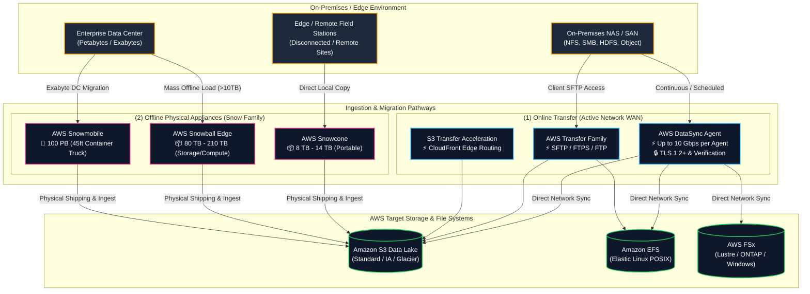
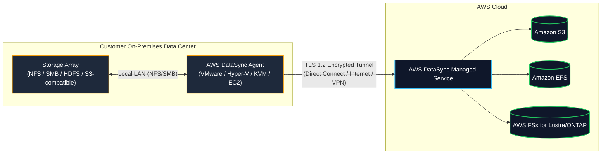
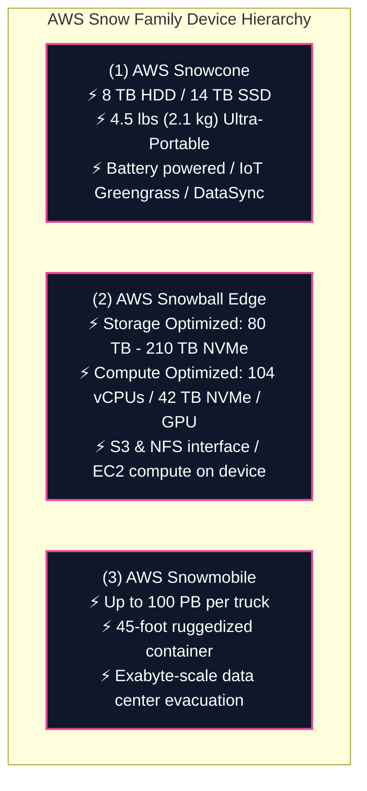
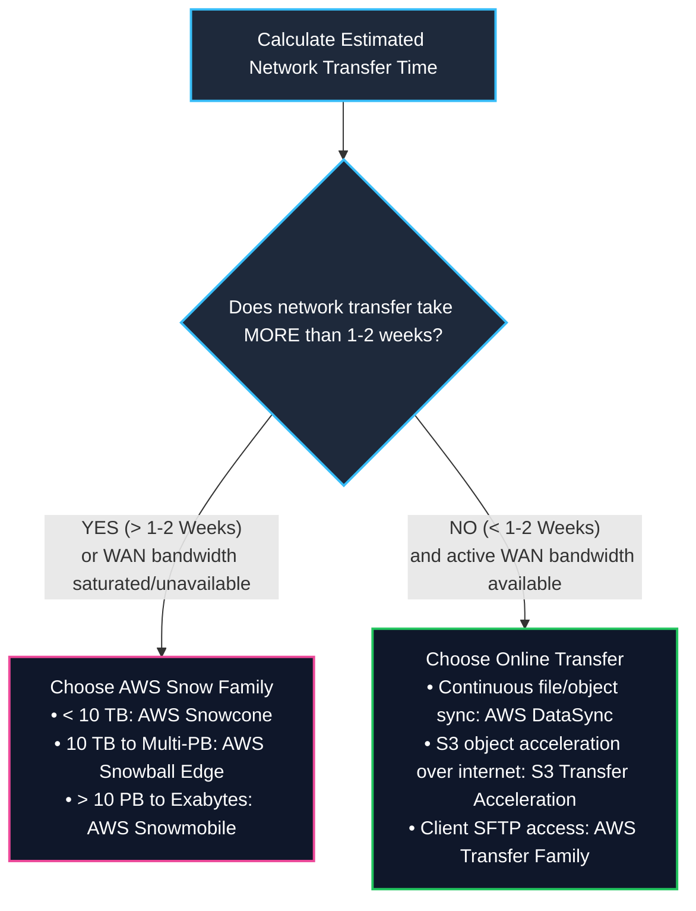
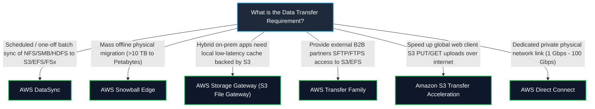

# 🚚 AWS DataSync & AWS Snow Family (Data Migration & Edge Transfer)

- **Category**: Migration & Transfer (Online High-Speed Network Transfer & Physical Offline Appliances)
- **Language / ဘာသာစကား**: [English (Original)](/en/02-services/migration/datasync-and-snow) | **မြန်မာဘာသာ (Burmese)**
- **Primary Use Case**: [[mm/02-services/storage/s3/s3|s3]], [[mm/02-services/storage/efs-and-fsx|efs-and-fsx]] များအတွင်းသို့ Large-scale online file နှင့် object synchronization ပြုလုပ်ရန်နှင့် petabyte/exabyte-scale offline physical data များ migration ပြုလုပ်ရန်။
- **Slide Reference**: `[AWSCertifiedDataEngineerSlides.pdf](/docs/AWSCertifiedDataEngineerSlides.pdf)` မှ Pages 276–285
- **Hub Links**: [[mm/index|index]] | [[mm/00-hub/service-catalog|service-catalog]] | [[mm/01-domains/domain-1-ingestion-and-processing|domain-1-ingestion-and-processing]] | [[mm/01-domains/domain-2-data-store-management|domain-2-data-store-management]] | [[mm/02-services/storage/s3/s3|s3]] | [[mm/02-services/storage/efs-and-fsx|efs-and-fsx]] | [[mm/02-services/migration/dms-and-sct|dms-and-sct]]

---

## 1. High-Level Summary

AWS အတွင်းသို့ large datasets များပြောင်းရွှေ့ရာတွင် ရရှိနိုင်သော network bandwidth, dataset size, security လိုအပ်ချက်များ နှင့် အချိန်ကန့်သတ်ချက်များအပေါ်မူတည်၍ **network-based online transfer** ([[mm/02-services/migration/datasync-and-snow|datasync-and-snow]] — AWS DataSync) နှင့် **physical appliance-based offline transfer** (AWS Snow Family) တို့အကြား ရွေးချယ်ရမည်ဖြစ်သည်။

**AWS Certified Data Engineer – Associate (DEA-C01)** exam အတွက် အောက်ပါအချက်များကို သိရှိထားရပါမည် -
1. **Online Transfer (AWS DataSync)**: NFS, SMB, HDFS, နှင့် Object storage များမှ [[mm/02-services/storage/s3/s3|s3]], [[mm/02-services/storage/efs-and-fsx|efs-and-fsx]] (EFS, FSx for Lustre/ONTAP/Windows/OpenZFS) အတွင်းသို့ Agent-based, accelerated network data transfer ပြုလုပ်ခြင်း။
2. **Offline Physical Transfer (AWS Snow Family)**: **AWS Snowcone** (8–14 TB), **AWS Snowball Edge** (80–210 TB Storage / Compute Optimized), နှင့် **AWS Snowmobile** (ကားတစ်စီးလျှင် 100 PB အထိ)။
3. **The 1–2 Week Network Bandwidth Rule**: DataSync နှင့် Snowball Edge အကြား ရွေးချယ်ရန် transfer time တွက်ချက်ခြင်းဆိုင်ရာ mathematical formulas များ။
4. **Service Differentiation**: **AWS DataSync** vs. **AWS Snowball** vs. **AWS Storage Gateway** vs. **AWS Transfer Family** vs. **S3 Transfer Acceleration** တို့အကြား ကွဲပြားချက်များကို ခွဲခြားသိမြင်ခြင်း။
5. **Hybrid Migration Workflows**: Initial mass data transfer အတွက် Snowball Edge ကိုအသုံးပြုပြီး ongoing delta catch-up အတွက် AWS DataSync သို့မဟုတ် [[mm/02-services/migration/dms-and-sct|dms-and-sct]] ကိုအသုံးပြုခြင်း။

---

## 2. AWS DataSync In-Depth

**AWS DataSync** သည် on-premises storage, edge locations, အခြားသော cloud providers များ နှင့် AWS storage services များအကြား အလိုအလျောက် မြန်နှုန်းမြင့် online data transfer ပြုလုပ်ပေးသော service တစ်ခုဖြစ်သည်။

### 1. Protocols & Supported Sources / Targets

| Supported Sources | Supported Targets | Key Integration Features |
| :--- | :--- | :--- |
| • Network File System (**NFS v3, v4.0, v4.1**) • Server Message Block (**SMB v2, v3**) • Hadoop Distributed File System (**HDFS**) • Self-managed Object Storage • Google Cloud Storage / Azure Blob • AWS S3 / EFS / FSx | • **Amazon S3** (All storage classes) • **Amazon EFS** • **AWS FSx for Lustre** • **AWS FSx for NetApp ONTAP** • **AWS FSx for Windows File Server** • **AWS FSx for OpenZFS** | • Parallel multi-threaded transfer architecture. • Automatic retry နှင့် network error recovery. • POSIX file metadata များကို ထိန်းသိမ်းပေးခြင်း (ownership, UID/GID, permissions, timestamps, ACLs). • `rsync` သို့မဟုတ် `scp` ကဲ့သို့သော open-source tools များထက် **10ဆ ပိုမိုမြန်ဆန်ခြင်း**။ |

### 2. Task Configuration & Operational Controls
- **Data Integrity Verification**:
  - **Verify only transferred data** (အသစ်/ပြောင်းလဲထားသော file များကိုသာ transfer လုပ်ပြီး integrity ကို verify လုပ်ခြင်း).
  - **Verify full dataset** (task ပြီးဆုံးချိန်တွင် source နှင့် target နှစ်ခုလုံးရှိ file အားလုံးကို verify လုပ်ခြင်း).
  - **Do not verify** (အမြန်ဆုံး transfer, checksum validation မလုပ်ခြင်း).
- **Bandwidth Throttling**: အများဆုံး network bandwidth သုံးစွဲမှုကို သတ်မှတ်ခြင်း (ဥပမာ - ရုံးချိန်အတွင်း 500 MB/s ဖြင့် ကန့်သတ်ပြီး၊ ပိတ်ရက်များတွင် uncapped အသုံးပြုခြင်း).
- **Scheduling**: Native cron-based task scheduling (နာရီအလိုက်, နေ့စဉ်, အပတ်စဉ်).
- **Filtering**: File paths, extensions သို့မဟုတ် regex patterns များအပေါ် အခြေခံ၍ include/exclude filters ပြုလုပ်ခြင်း.

### 3. AWS DataSync Discovery
- On-premises storage systems (ဥပမာ NetApp ONTAP, Dell EMC Isilon) များသို့ ချိတ်ဆက်ပြီး performance, capacity နှင့် utilization များကို profile လုပ်ပေးနိုင်သည့် automated discovery feature ပါဝင်သည်။
- Target AWS storage (S3, EFS, FSx) ကို right-size ဖြစ်စေရန် migration recommendations များကို ထုတ်ပေးသည်။

---

## 3. AWS Snow Family In-Depth (Physical Offline Appliances)

**AWS Snow Family** သည် network ချိတ်ဆက်မှု နှေးကွေးခြင်း၊ စျေးကြီးခြင်း သို့မဟုတ် လုံးဝမရရှိနိုင်သောအခါမျိုးတွင် massive data sets များကို AWS အတွင်းသို့ ရွှေ့ပြောင်းပေးရန် သီးသန့်ထုတ်လုပ်ထားသော လုံခြုံစိတ်ချရသည့်၊ ခိုင်ခံ့သော physical devices များဖြစ်သည်။

### 1. Technical Specifications Comparison

| Feature | AWS Snowcone | AWS Snowball Edge Storage Optimized | AWS Snowball Edge Compute Optimized | AWS Snowmobile |
| :--- | :--- | :--- | :--- | :--- |
| **Capacity** | **8 TB** usable HDD (သို့ 14 TB SSD) | **80 TB** usable HDD (သို့ 210 TB NVMe) | **42 TB** usable NVMe (သို့ 28 TB NVMe + 80 TB HDD) | **Up to 100 PB** |
| **Weight & Form** | 4.5 lbs (2.1 kg) — ကျောပိုးအိတ်ထဲ ထည့်သယ်နိုင်သည် | ~50 lbs (22.5 kg) — ruggedized case | ~50 lbs (22.5 kg) — ruggedized case | 45-foot shipping container truck |
| **Compute Onboard** | 2 vCPUs, 4 GB RAM | 40 vCPUs, 80 GB RAM | **104 vCPUs, 416 GB RAM** (Optional NVIDIA GPU) | Integrated operations van |
| **Edge Capabilities** | EC2 instances, AWS IoT Greengrass | EC2 AMIs, AWS Lambda, S3 & NFS APIs | EC2 AMIs, AWS Lambda, ML inference, clustering (up to 16 nodes) | Offline physical data transport |
| **Network Transfer** | ✅ **AWS DataSync pre-installed** သို့မဟုတ် physical ship | Physical shipping | Physical shipping | Physical truck transport |
| **Target Storage** | Amazon S3 | Amazon S3 | Amazon S3 | Amazon S3 |

### 2. Device Security & Management (AWS OpsHub)
- **Encryption**: Disk သို့ မရေးသွင်းမီ data အားလုံးကို [[mm/02-services/security-governance/kms-and-secrets|kms-and-secrets]] (AWS KMS) အသုံးပြုပြီး 256-bit keys ဖြင့် အလိုအလျောက် encrypt လုပ်ပေးသည်။
- **Hardware Security**: ဖောက်ထွင်းပါက အလိုအလျောက် ခြေရာဖျောက်ပေးနိုင်သော (cryptographic erasure) နှင့် tamper-evident seals များပါရှိသည့် onboard **Trusted Platform Module (TPM)** chip ကိုအသုံးပြုထားသည်။
- **AWS OpsHub**: Snow devices များကို unlock လုပ်ခြင်း၊ network settings များကို configure လုပ်ခြင်း၊ metrics များကို ကြည့်ရှုခြင်း၊ EC2 instances များ launch လုပ်ခြင်း နှင့် local NFS storage ကို manage လုပ်ခြင်းတို့အတွက် အသုံးပြုသော သီးသန့် desktop GUI application ဖြစ်သည်။

---

## 4. The 1–2 Week Decision Rule & Transfer Time Formulas

Online network transfer ([[mm/02-services/migration/datasync-and-snow|datasync-and-snow]] / Direct Connect) နှင့် offline physical transfer (Snowball Edge) အကြား ရွေးချယ်ရာတွင် အောက်ပါ transfer time formula ကိုအသုံးပြုနိုင်သည် -

$$\text{Transfer Time (Seconds)} = \frac{\text{Data Size (Bits)}}{\text{Available Bandwidth (Bits/Second)} \times \text{Network Efficiency Factor}}$$

$$\text{Transfer Time (Days)} = \frac{\text{Data Size (Bytes)} \times 8}{\text{Bandwidth (bps)} \times 86400 \times 0.80}$$

*(Standard အနေဖြင့် 80% practical network utilization factor ကိုယူဆတွက်ချက်သည်)*

### Network Transfer Time Reference Table (Theoretical vs. Practical)

| Data Volume | 100 Mbps WAN Connection | 1 Gbps WAN Connection | 10 Gbps Dedicated Direct Connect | Recommended Mechanism |
| :--- | :--- | :--- | :--- | :--- |
| **1 TB** | ~1.2 days | ~2.7 hours | ~16 minutes | **AWS DataSync** (Online) |
| **10 TB** | ~12 days | ~1.1 days | ~2.7 hours | **AWS DataSync** (or Snowcone/Snowball) |
| **100 TB** | **~120 days** (4 လ!) | **~12 days** | ~1.1 days | **AWS Snowball Edge** (<1 Gbps ဖြစ်လျှင်) သို့ DataSync (10 Gbps ဖြစ်လျှင်) |
| **500 TB** | **~600 days** (>1.5 နှစ်!) | **~60 days** (2 လ) | ~5.5 days | **AWS Snowball Edge Cluster** |
| **5 PB** | **~16 နှစ်!** | **~1.6 နှစ်!** | **~58 days** | **AWS Snowball Edge Cluster / Snowmobile** |

> [!IMPORTANT]
> **Exam Rule of Thumb**:
> - အကယ်၍ သင့်လက်ရှိ network connection ပေါ်မှ data transfer လုပ်ချိန်သည် **1 မှ 2 ပတ်ထက် ပိုကြာမည်** ဆိုပါက **AWS Snowball Edge** devices များကိုမှာယူပါ။
> - Snowball Edge အား ပို့ဆောင်ခြင်းနှင့် data load လုပ်ခြင်းသည် round-trip ခန့်မှန်းခြေ **5 မှ 7 ရက်** ကြာမြင့်မည်ဖြစ်သဖြင့် bandwidth အပြည့်ဖြစ်နေသော network ထက် များစွာပိုမိုမြန်ဆန်ပါသည်။

---

## 5. Master Multi-Service Decision Matrix

AWS data transfer နှင့် hybrid storage services များအကြား scenarios များကို ရွေးချယ်ဆုံးဖြတ်ရခြင်းသည် exam တွင် အကြိမ်ကြိမ်မေးလေ့ရှိသည့် အကြောင်းအရာဖြစ်သည် -

### Complete Service Comparison Table

| Service | Primary Purpose | Protocol / Ingestion Method | Directionality / Mode | Top DEA-C01 Keyword Triggers |
| :--- | :--- | :--- | :--- | :--- |
| **AWS DataSync** | Online high-speed automated file/object synchronization | NFS, SMB, HDFS, S3-API over WAN/Direct Connect | Scheduled / Continuous batch sync | *"Automated scheduled sync"*, *"preserve POSIX metadata"*, *"NFS/SMB to S3/EFS/FSx"*, *"10x faster than rsync"*. |
| **AWS Snowball Edge** | Offline physical appliance data migration & edge compute | Physical appliance shipping (S3/NFS endpoints locally) | Mass one-off offline load | *"Network transfer takes > 2 weeks"*, *"Petabyte migration"*, *"limited/no internet connectivity"*. |
| **AWS Storage Gateway** | Hybrid cloud storage bridge with local on-premises cache | NFS/SMB (File Gateway), iSCSI (Volume/Tape Gateway) | Real-time hybrid cached access | *"Local low-latency caching"*, *"seamless file share access backed by S3"*, *"replace physical tape library"*. |
| **AWS Transfer Family** | Fully managed file transfer for external partners | SFTP, FTPS, FTP, AS2 | Direct client upload/download | *"Migrate legacy SFTP workflows"*, *"seamless SFTP access directly into S3 or EFS"*, *"partner B2B file exchange"*. |
| **S3 Transfer Acceleration** | Accelerates global internet uploads into S3 buckets | HTTPS REST API routed via Amazon CloudFront Edge locations | Real-time global internet ingest | *"Global users uploading to central S3 bucket"*, *"speed up long-distance internet uploads"*. |
| **AWS Direct Connect** | Dedicated private physical network fiber connection | 1 Gbps to 100 Gbps private Ethernet link | Continuous dedicated network backbone | *"Bypass public internet"*, *"consistent dedicated network throughput"*, *"private hybrid cloud connectivity"*. |

---

## 6. Production Architecture Patterns

### Pattern A: Multi-Terabyte Scheduled Daily NAS Ingestion to S3 Data Lake
- **Scenario**: On-premises NAS storage array တစ်ခုမှ NFS ပေါ်တွင် 5 TB ခန့်ရှိသည့် log files အသစ်များကို နေ့စဉ်ထုတ်ပေးနေသည်။ ထို Data များကို ညတိုင်း 4 နာရီကြာ maintenance window အတွင်း S3 Bronze Data Lake bucket ထဲသို့ ingest လုပ်ရမည်။
- **Architecture**:
  - NAS သို့ 10 Gbps LAN ဖြင့်ချိတ်ဆက်ထားသော virtual machine တစ်ခုပေါ်တွင် **AWS DataSync Agent** ကို on-premises အဖြစ် deploy လုပ်ပါ။
  - Amazon S3 ကို target လုပ်ထားပြီး ညသန်းခေါင်ယံတွင် အလုပ်လုပ်မည့် DataSync Task တစ်ခုကို schedule ဆွဲပါ။
  - ပြောင်းလဲမှုမရှိသော file များကို ကျော်သွားစေရန်နှင့် throughput ကို အမြင့်ဆုံးရစေရန် **Verify only transferred data** ကို enable လုပ်ပါ။

### Pattern B: 500 TB On-Premises File Archive Migration (Hybrid Snowball + Delta Sync)
- **Scenario**: 500 TB ရှိသော active file repository ကို Amazon S3 သို့ လက်ရှိ 100 Mbps internet connection (WAN အသုံးပြုပါက ၁ နှစ်ခွဲကျော် ကြာမြင့်နိုင်သည်) ဖြင့် migration ပြုလုပ်ခြင်း။
- **Architecture**:
  - **Phase 1 (Base Load)**: **AWS Snowball Edge Storage Optimized** appliances များကို မှာယူပါ။
  - 500 TB baseline dataset ကို Snowball devices များသို့ locally copy ကူးပြီး AWS သို့ S3 အတွင်း automated ingestion လုပ်ရန် ပြန်ပို့ပါ။
  - **Phase 2 (Delta Catch-up)**: Snowball snapshot ရယူပြီးချိန်မှစ၍ ပြင်ဆင်/ဖန်တီးထားသော file များကိုသာ sync လုပ်ရန် on-premises တွင် **AWS DataSync** ကို deploy လုပ်ပါ၊ ၎င်းသည် နာရီပိုင်းအတွင်း cutover ကို ပြီးစီးစေမည်ဖြစ်သည်။

### Pattern C: Edge Data Collection & Disconnected Preprocessing
- **Scenario**: အင်တာနက်မရရှိသော ဝေးလံခေါင်သီသည့် ရေပြင်ဒေသများတွင် autonomous သုတေသနသင်္ဘောများသည် 15 TB ပမာဏရှိသော oceanographic sensor နှင့် video data များကို စုဆောင်းသည်။
- **Architecture**:
  - Onboard EC2 instances များပါဝင်သော **AWS Snowball Edge Compute Optimized** ကို သင်္ဘောပေါ်တွင် deploy လုပ်ပါ။
  - Sensor data များကို S3 API မှတဆင့် locally ingest လုပ်ပြီး onboard containerized ML models များဖြင့် telemetry data များကို preprocess နှင့် filter ပြုလုပ်ပါ။
  - ဆိပ်ကမ်းသို့ ပြန်လည်ရောက်ရှိချိန်တွင် device ကို network သို့ချိတ်ဆက်၍ DataSync ဖြင့် delta ကို sync လုပ်နိုင်သည် (သို့) AWS သို့ physical အရ ပို့ဆောင်နိုင်သည်။

---

## 7. High-Yield DEA-C01 Exam Tips & Traps

> [!IMPORTANT]
> **Key Exam Trigger Keywords**:
> - **"Scheduled, automated transfer of NFS or SMB file shares into Amazon S3, EFS, or FSx with metadata preservation"** $\rightarrow$ **AWS DataSync**.
> - **"Migrate multi-terabyte or petabyte datasets to S3 when network transfer exceeds 1-2 weeks"** $\rightarrow$ **AWS Snowball Edge Storage Optimized**.
> - **"Petabyte to Exabyte data center evacuation with dedicated security and shipping container truck"** $\rightarrow$ **AWS Snowmobile**.
> - **"External B2B partners require SFTP access to upload files directly into S3 or EFS without modifying client software"** $\rightarrow$ **AWS Transfer Family**.
> - **"Provide on-premises applications with low-latency NFS/SMB access to files while storing all data durably in S3"** $\rightarrow$ **AWS Storage Gateway (S3 File Gateway)**.
> - **"Speed up distributed global users uploading large files to an S3 bucket over the internet"** $\rightarrow$ **Amazon S3 Transfer Acceleration**.

> [!WARNING]
> **Exam Traps & Failure Modes**:
> 1. **DataSync vs. Storage Gateway Trap**:
>    - **AWS DataSync** သည် **batch, scheduled, သို့မဟုတ် one-off high-speed migrations နှင့် syncs** ပြုလုပ်ရန် ဒီဇိုင်းထုတ်ထားခြင်းဖြစ်သည်။ ၎င်းသည် real-time reads အတွက် live local NFS/SMB cache ကို မထောက်ပံ့ပေးပါ။
>    - **AWS Storage Gateway (S3 File Gateway)** သည် on-premises applications များအတွက် S3 တွင် backed လုပ်ထားသော file များကို တိုက်ရိုက်ဖတ်ရန်နှင့်ရေးရန် **continuous, real-time local cache** ကို ထောက်ပံ့ပေးသည်။
> 2. **DataSync vs. Transfer Family Trap**:
>    - External clients/partners များသည် standard **SFTP/FTPS/FTP** ဖြင့် ချိတ်ဆက်ရန် လိုအပ်သောအခါ **AWS Transfer Family** ကို အသုံးပြုပါ။ DataSync သည် third parties များအတွက် SFTP server အဖြစ် အလုပ်မလုပ်နိုင်ပါ။
> 3. **Snowball Edge Offline Ingestion to EFS / FSx**:
>    - Snowball Edge သည် **Amazon S3** သို့ တိုက်ရိုက် import လုပ်ပေးသည်။ နောက်ဆုံး destination သည် EFS သို့မဟုတ် FSx ဖြစ်ပါက၊ data များသည် S3 တွင် ဦးစွာရောက်ရှိပြီး ၎င်းမှတဆင့် **AWS DataSync** သို့မဟုတ် automated scripts များကိုအသုံးပြု၍ EFS/FSx သို့ synchronize ပြုလုပ်ရသည်။
> 4. **Snowball vs. Snowcone Capacity Limits**:
>    - Snowcone = **8 TB HDD / 14 TB SSD**. မေးခွန်းက 20 TB သို့မဟုတ် 80 TB ဟုမေးလာပါက၊ Snowcone ဖြင့် မလုံလောက်ပါ؛ **Snowball Edge (80 TB)** ကို ရွေးချယ်ပါ။

---

## 📌 Related Notes

- [[mm/02-services/migration/dms-and-sct|dms-and-sct]] — Database migrations နှင့် Snowball hybrid loads များအတွက် AWS DMS & SCT
- [[mm/02-services/storage/s3/s3|s3]] — Snowball နှင့် DataSync ingestion အတွက် Amazon S3 Data Lake target
- [[mm/02-services/storage/efs-and-fsx|efs-and-fsx]] — Amazon EFS နှင့် AWS FSx target shared file systems
- [[mm/02-services/storage/s3/s3-performance|s3-performance]] — S3 Multi-part uploads နှင့် S3 Transfer Acceleration
- [[mm/01-domains/domain-1-ingestion-and-processing|domain-1-ingestion-and-processing]] — DEA-C01 Domain 1 Study Guide
- [[mm/01-domains/domain-2-data-store-management|domain-2-data-store-management]] — DEA-C01 Domain 2 Study Guide
- [[mm/04-exam-tips/service-comparisons|service-comparisons]] — Master DEA-C01 Service Decision Matrix
