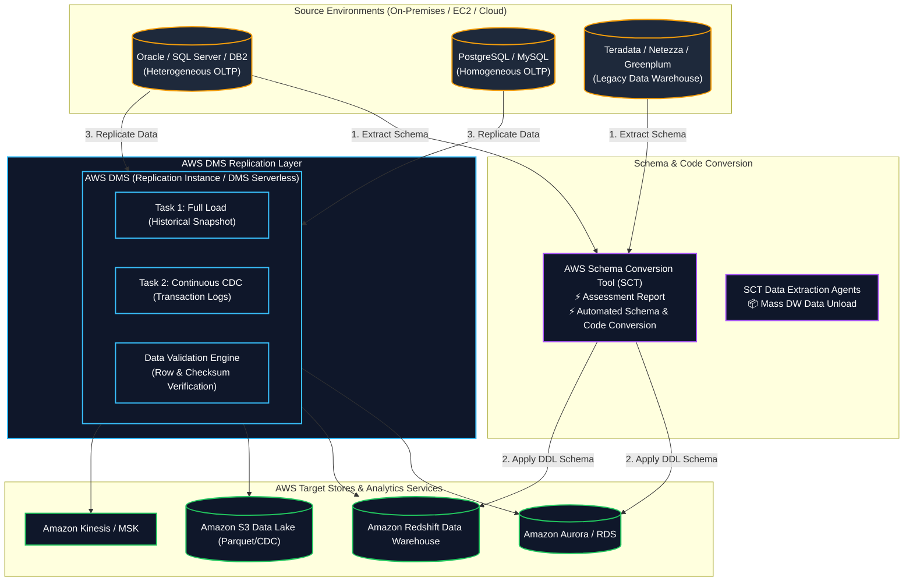
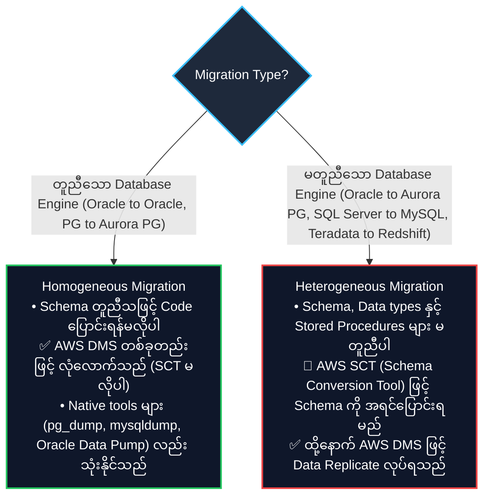
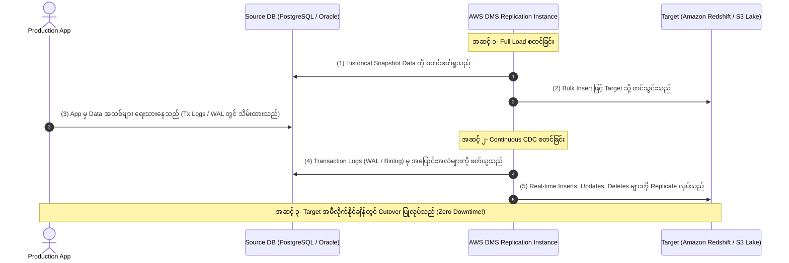

# 🔄 AWS Database Migration Service (DMS) & AWS Schema Conversion Tool (SCT) (ဒေတာဘေ့စ် ရွှေ့ပြောင်းခြင်းနှင့် စနစ်ပြောင်းကိရိယာ)

- **Category**: Migration & Transfer (Database & Analytics Migration, Continuous CDC Ingestion)
- **Language / ဘာသာစကား**: [English Version](file:///home/monetine/Workspace/Wathon/aws-dea-c01/content/en/02-services/migration/dms-and-sct.md) | **မြန်မာဘာသာ (Burmese)**
- **အဓိက အသုံးပြုမှု**: မတူညီသော (Heterogeneous) သို့မဟုတ် တူညီသော (Homogeneous) Database များကို Application Downtime အနည်းဆုံးဖြင့် ပြောင်းရွှေ့ခြင်း၊ Change Data Capture (CDC) ဖြင့် Amazon S3 Data Lakes၊ `[[redshift]]`၊ `[[kinesis]]`၊ `[[msk-kafka]]`၊ `[[dynamodb]]` သို့ Real-time ဒေတာ ပေးပို့ခြင်း။
- **Slide Reference**: Pages 269–275 in `[[AWSCertifiedDataEngineerSlides.pdf]]`
- **Hub Links**: `[[mm/index]]` | `[[en/index]]` | `[[rds-and-aurora]]` | `[[redshift]]` | `[[s3]]` | `[[datasync-and-snow]]`

---

## ၁။ အကျဉ်းချုပ် (High-Level Summary)

**AWS Database Migration Service (AWS DMS)** သည် Database နှင့် Analytics Workload များကို AWS ပေါ်သို့ အချိန်မဆိုင်းဘဲ (Downtime အနည်းဆုံးဖြင့်) လုံခြုံမြန်ဆန်စွာ ပြောင်းရွှေ့ပေးသည့် Managed Service ဖြစ်သည်။ DMS သည် **Change Data Capture (CDC)** နည်းပညာဖြင့် မူရင်း Database မှ အပြောင်းအလဲများကို AWS Targets များဆီသို့ မပြတ်တမ်း ကူးယူပေးနိုင်သည်။

**AWS Schema Conversion Tool (AWS SCT)** သည် မတူညီသော Database Engine များအကြား (ဥပမာ Oracle $\rightarrow$ PostgreSQL/Aurora၊ Teradata $\rightarrow$ Redshift) ပြောင်းရွှေ့ရာတွင် Schema၊ Stored Procedures၊ Views၊ Functions နှင့် Triggers များကို Target Database နှင့် ကိုက်ညီသော ပုံစံသို့ အလိုအလျောက် ပြောင်းလဲပေးသည့် Desktop Application ဖြစ်သည်။

---

## ၂။ Homogeneous vs. Heterogeneous Database Migrations (Core Exam Focus)

---

## ၃။ AWS DMS Task Types & CDC လုပ်ဆောင်ချက်များ

### DMS Task Types:
1. **Full Load**: Source ရှိ မူရင်း Snapshot ဒေတာအားလုံးကို တစ်ကြိမ်တည်း ကူးယူသည်။
2. **Full Load + CDC (အသုံးအများဆုံး)**: မူရင်းဒေတာကို အရင်တင်ပြီးနောက် အပြောင်းအလဲ Transaction Logs များကို မပြတ်တမ်း ဆက်လက် Replicate လုပ်ပေးသည်။
3. **CDC Only**: Full Load ကို အခြားနည်းလမ်း (ဥပမာ Snowball / Backup Restore) ဖြင့် ကြိုတင်တင်ထားပြီးမှ နောက်ဆက်တွဲ ပြောင်းလဲမှုများကိုသာ ဆက်ဖတ်သည်။

---

## ၄။ DMS Target အဖြစ် Amazon S3 သို့ CDC ရေးသားခြင်း

AWS DMS သည် S3 Data Lake သို့ Change Data Capture Record များကို ရေးသားရာတွင် `Op` (Operation Column) ကို ထည့်သွင်းပေးပါသည်-

| S3 CDC File Column | ရှင်းလင်းချက် (Description) |
| :--- | :--- |
| **`Op` = `I`** | **INSERT**: Record အသစ် ထည့်သွင်းခြင်း |
| **`Op` = `U`** | **UPDATE**: Record အဟောင်းကို ပြင်ဆင်ခြင်း |
| **`Op` = `D`** | **DELETE**: Record ကို ဖျက်ပစ်ခြင်း |

- **Apache Iceberg / Apache Hudi**: Amazon Athena နှင့် EMR Spark တို့တွင် CDC Record များကို Table အစစ်အမှန်အဖြစ် Merge လုပ်ရန် **Iceberg / Hudi / Delta Lake** ဖော်မတ်များကို အသုံးပြုသည်။

---

## ၅။ DEA-C01 စာမေးပွဲ အဓိက အချက်အလက်များနှင့် ထောင်ချောက်များ (Exam Tips & Traps)

> [!IMPORTANT]
> **Key Exam Trigger Keywords**:
> - **"Migrate on-premise Oracle / SQL Server database to Amazon Aurora with minimal downtime"** $\rightarrow$ **AWS SCT (for schema conversion) + AWS DMS (for data replication with CDC)**.
> - **"Migrate on-premise PostgreSQL to Amazon Aurora PostgreSQL"** $\rightarrow$ **AWS DMS standalone (Homogeneous migration, SCT not required)**.
> - **"Stream transactional inserts, updates, and deletes into Amazon S3 Data Lake in near-real-time"** $\rightarrow$ **AWS DMS with CDC targeting Amazon S3**.
> - **"Migrate massive 500 TB on-premises Data Warehouse (Teradata/Netezza) to Amazon Redshift"** $\rightarrow$ **AWS SCT Data Extraction Agents + AWS Snowball Edge (for offline initial load) + AWS DMS CDC (for online delta catch-up)**.

> [!WARNING]
> **Exam Traps (သတိထားရမည့် အချက်များ)**:
> 1. **SCT vs DMS Role Confusion**: AWS DMS သည် Schema (Stored Procedures, Triggers) များကို မပြောင်းလဲပေးနိုင်ပါ။ Heterogeneous Migration ဖြစ်ပါက **AWS SCT** ကို အရင် သုံးရမည်။
> 2. **LOB Mode Tradeoff**: **Limited LOB mode** သည် အလွန်မြန်သော်လည်း သတ်မှတ် Size ထက်ကြီးသော LOB များကို Truncate လုပ်ပစ်သည်။ Data Loss မဖြစ်စေရန် သေချာပါက သုံးရပြီး မသေချာပါက **Full LOB mode** (နှေးသော်လည်း စိတ်ချရသည်) ကို သုံးရမည်။

---

## 📌 ဆက်စပ် မှတ်စုများ (Related Notes)

- `[[datasync-and-snow]]` — AWS DataSync & Snowball Edge Data Transfer
- `[[rds-and-aurora]]` — Target Relational Databases
- `[[redshift]]` — Target Data Warehouse
- `[[s3]]` — Target S3 Data Lake CDC Architecture
