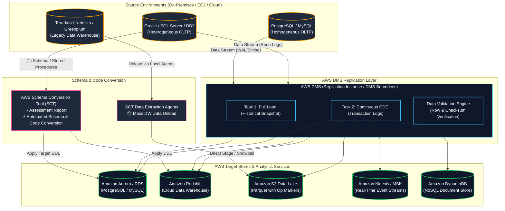
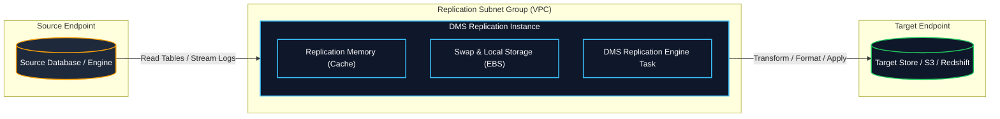
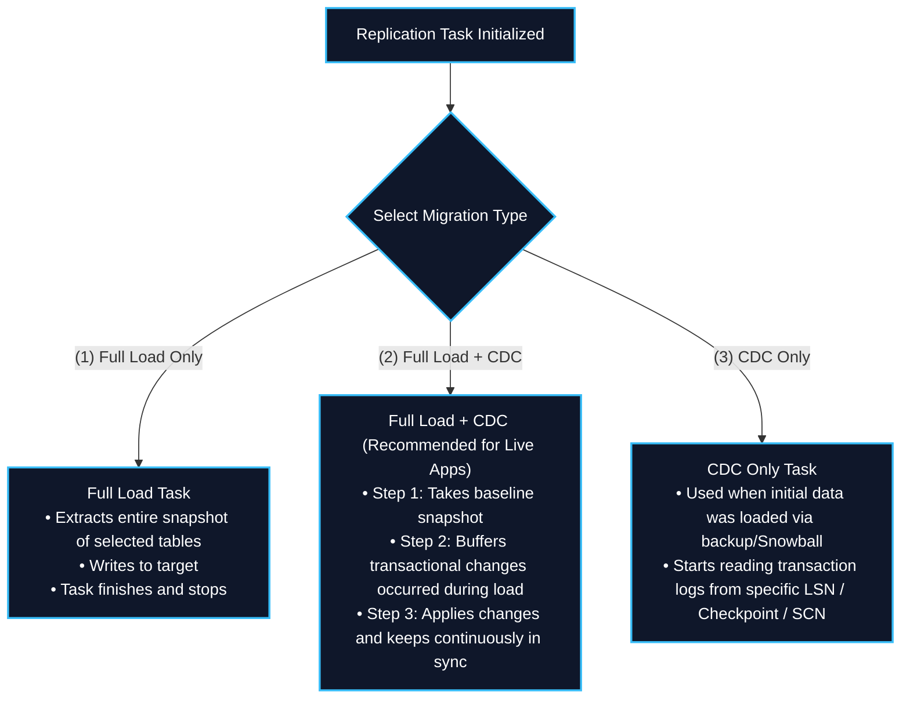
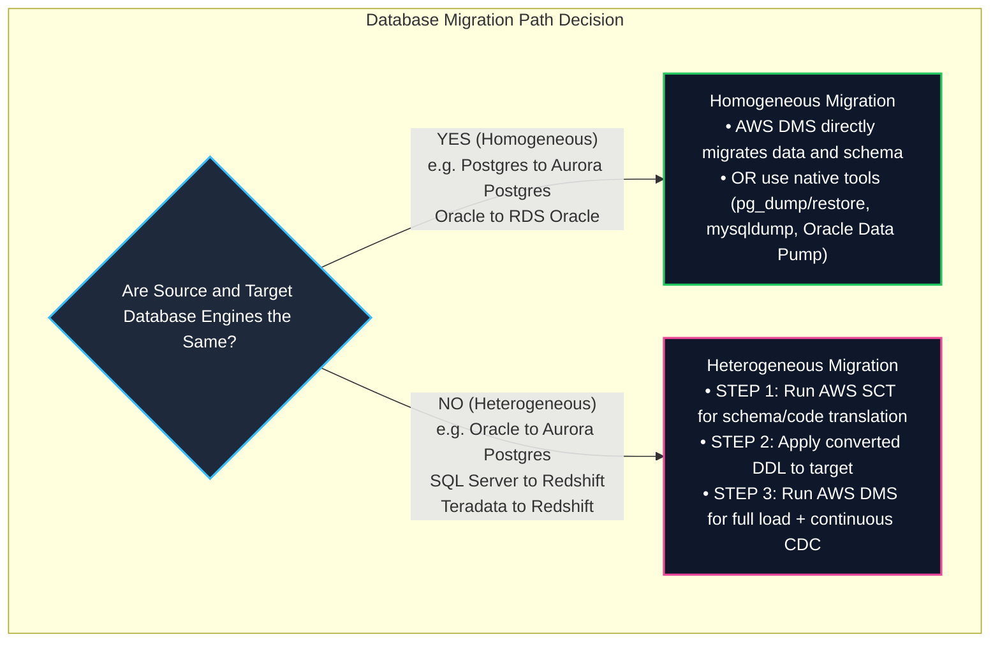
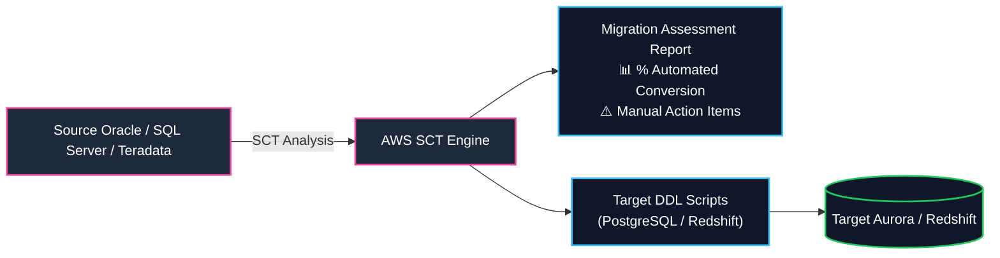
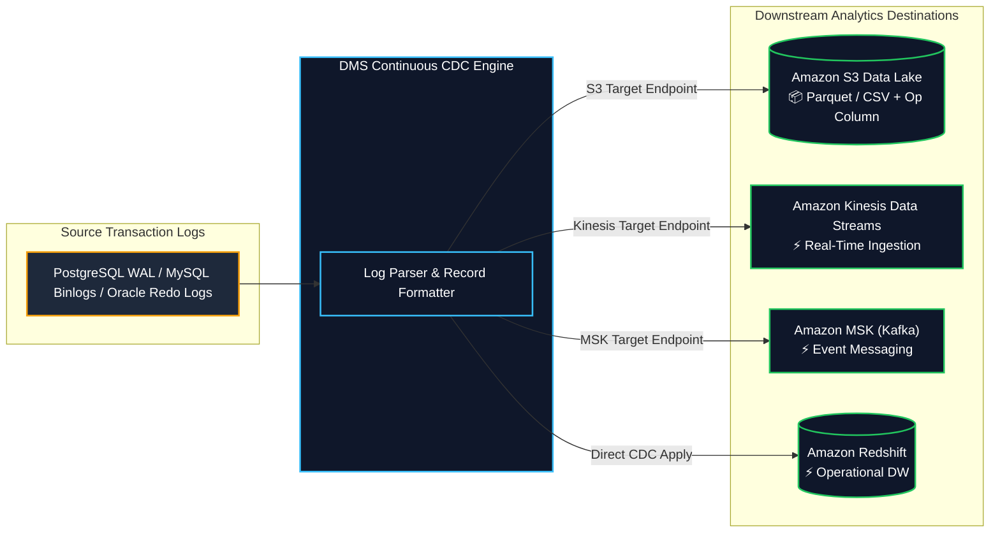
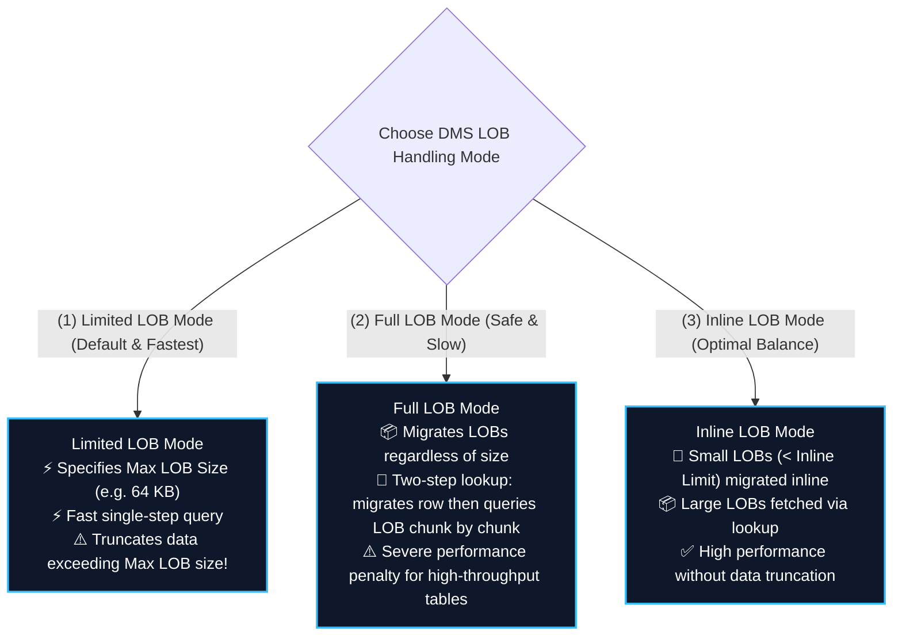
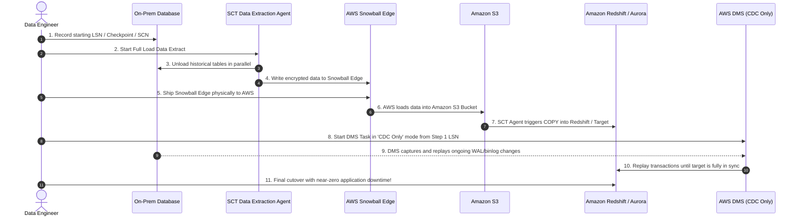

# 🔄 AWS Database Migration Service (DMS) & AWS Schema Conversion Tool (SCT)

- **Category**: Migration & Transfer (Database & Analytics Migration, Continuous CDC Ingestion)
- **Language / ဘာသာစကား**: [English (Original)](/en/02-services/migration/dms-and-sct) | **မြန်မာဘာသာ (Burmese)**
- **Primary Use Case**: Heterogeneous နှင့် homogeneous database migration များ၊ application downtime အနည်းဆုံးဖြင့် [[s3]] Data Lakes, [[redshift]], [[kinesis]], [[msk]], နှင့် [[dynamodb]] တို့သို့ ဆက်တိုက် Change Data Capture (CDC) streaming ပြုလုပ်ခြင်း။
- **Slide Reference**: `[[AWSCertifiedDataEngineerSlides.pdf]]` ရှိ Pages 269–275
- **Hub Links**: [[mm/index]] | [[service-catalog]] | [[domain-1-ingestion-and-processing]] | [[domain-2-data-store-management]] | [[rds-and-aurora]] | [[redshift]] | [[s3]] | [[datasync-and-snow]]

---

## 1. High-Level Summary

**AWS Database Migration Service (AWS DMS)** သည် database နှင့် analytics workload များကို **application downtime အနည်းဆုံးဖြင့်** AWS သို့ လျင်မြန် လုံခြုံစွာ ရွှေ့ပြောင်းပေးနိုင်သော managed migration နှင့် replication service တစ်ခုဖြစ်သည်။ AWS DMS သည် **Change Data Capture (CDC)** ကို အသုံးပြု၍ source database များမှ target data store များသို့ ဒေတာများကို ဆက်တိုက် (continuously) replicate လုပ်ပေးနိုင်သည်။

**AWS Schema Conversion Tool (AWS SCT)** သည် source database ၏ schema နှင့် အများစုသော database code object များ (views, stored procedures, functions, triggers) ကို target engine နှင့် ကိုက်ညီသော format သို့ အလိုအလျောက် convert လုပ်ပေးခြင်းဖြင့် heterogeneous database နှင့် data warehouse migration များကို မှန်းဆရလွယ်ကူစေသည်။

**AWS Certified Data Engineer – Associate (DEA-C01)** exam အတွက် သင် ကျွမ်းကျင်ရမည့် အချက်များမှာ -
1. **Homogeneous vs. Heterogeneous Migrations**: DMS ကို သီးခြား (standalone - same engine) အသုံးပြုနိုင်သည့် အခြေအနေ နှင့် AWS SCT ကို မဖြစ်မနေ လိုအပ်သည့် အခြေအနေ (different engines)။
2. **DMS Replication Tasks & Load Modes**: Full load, Full load + CDC, နှင့် CDC-only။
3. **Change Data Capture (CDC) Mechanics**: Transaction logs များကို ဖတ်ခြင်း (PostgreSQL WAL, MySQL binlogs, Oracle Redo/LogMiner, SQL Server MS-CDC) နှင့် inserts/updates/deletes များကို stream လုပ်ခြင်း။
4. **Target Data Lake & Streaming Integrations**: CDC event များကို [[s3]] သို့ CSV သို့မဟုတ် Apache Parquet format ( `Op` operation column ဖြင့်) ထုတ်ပေးခြင်း၊ [[kinesis]], နှင့် [[msk]] တို့သို့ ချိတ်ဆက်ခြင်း။
5. **LOB (Large Object) Handling Tradeoffs**: Limited LOB mode vs. Full LOB mode vs. Inline LOB mode.
6. **SCT Data Extraction Agents & Hybrid Snowball Migration**: [[datasync-and-snow]] (Snowball Edge) ကိုသုံး၍ offline ဖြင့် multi-terabyte/petabyte data warehouses များကို ပြောင်းရွှေ့ခြင်း (Teradata, Oracle, Greenplum) နှင့် DMS continuous CDC ဖြင့် ဆက်တိုက် catch-up လုပ်ခြင်း။
7. **DMS Serverless & DMS Fleet Advisor**: Replication capacity units (DCUs) ကို auto-scaling လုပ်ခြင်း နှင့် fleet များကို automated အနေဖြင့် ရှာဖွေဖော်ထုတ်ခြင်း (discovery)။



---

## 2. Core Architecture & Components

AWS DMS သည် အဓိက building blocks ၄ ခုဖြင့် အလုပ်လုပ်သည် -



### 1. Replication Instance
- Amazon VPC အတွင်း သီးသန့် replication software ကို run ပေးသည့် managed Amazon EC2 instance (ဥပမာ- `dms.c5`, `dms.r5`) တစ်ခုဖြစ်သည်။
- **Single-AZ vs. Multi-AZ**:
  - **Single-AZ**: Dev/test migration များ သို့မဟုတ် တစ်ကြိမ်သာလုပ်မည့် batch load များအတွက် ကုန်ကျစရိတ် သက်သာစေရန် သုံးနိုင်သည်။
  - **Multi-AZ**: Production နှင့် continuous CDC task များအတွက် အကြံပြုထားသည်။ DMS သည် AZ တစ်ခုတွင် active primary instance ကို ဖွင့်ပြီး ဒုတိယ AZ တွင် standby synchronous replica တစ်ခုကို ဖွင့်ထားသည်။ Failover သည် ဒေတာဆုံးရှုံးမှုလုံးဝမရှိဘဲ (zero data loss) အလိုအလျောက် လုပ်ဆောင်ပေးသည်။
- **Storage Subsystem**: Active CDC လုပ်နေစဉ်အတွင်း in-flight transactions များကို buffer လုပ်ရန်နှင့် Large Objects (LOBs) များကို cache လုပ်ရန် Amazon EBS storage ကို အသုံးပြုသည်။

### 2. Endpoints (Source & Target)
Endpoint တစ်ခုသည် connection properties, credentials (သို့မဟုတ် IAM roles / [[kms-and-secrets]] Secrets Manager ARNs), database type, network protocols, နှင့် Extra Connection Attributes (ECAs) တို့ကို သတ်မှတ်ပေးသည်။

| Dimension | Supported Sources | Supported Targets |
| :--- | :--- | :--- |
| **Relational Databases** | Oracle, Microsoft SQL Server, PostgreSQL, MySQL, MariaDB, IBM Db2, SAP ASE | Amazon Aurora (PostgreSQL/MySQL), Amazon RDS (all engines) |
| **Data Warehouses** | Teradata, Oracle Exadata, Microsoft SQL Server DW | **Amazon Redshift** |
| **Data Lakes & Object** | S3 (via CSV / Parquet) | **Amazon S3** (CSV, Parquet with Snappy/GZIP compression) |
| **NoSQL & Document** | MongoDB, DocumentDB | **Amazon DynamoDB**, Amazon DocumentDB |
| **Streaming Engines** | — | **Amazon Kinesis Data Streams**, **Amazon MSK (Apache Kafka)** |
| **Search & Analytics** | — | **Amazon OpenSearch Service** |

### 3. Replication Tasks & Migration Modes

Replication task တစ်ခုကို ဖန်တီးသောအခါ၊ အောက်ပါ အဓိက migration အမျိူးအစား ၃ ခုထဲမှ တစ်ခုကို configure လုပ်ရမည် -



#### Target Table Preparation Modes:
1. **`DO_NOTHING`**: DMS သည် target တွင် table များ ရှိနှင့်ပြီးသားဟု ယူဆသည် (ဥပမာ - AWS SCT မှ ကြိုတင်ဖန်တီးထားခြင်း)။ အကယ်၍ table များတွင် ဒေတာရှိနေပါက၊ DMS သည် ရှိပြီးသား row များကို မထိဘဲ ဒေတာအသစ်များကိုသာ append လုပ်ပေးသည်။
2. **`DROP_AND_CREATE_IF_EXISTS`**: DMS သည် ရှိပြီးသား target table များကို ဖျက်ပစ် (drop) ပြီး စံသတ်မှတ်ချက်အတိုင်း basic table အသစ်များကို ပြန်လည်ဖန်တီးပေးသည် (primary key များသာပါဝင်ပြီး secondary index များ၊ trigger များ မပါဝင်ပါ)။
3. **`TRUNCATE_BEFORE_LOAD`**: DMS သည် target table များကို truncate လုပ် (ဒေတာအားလုံးဖျက်) သော်လည်း schema structures, foreign keys, နှင့် indexes များကိုတော့ ထိန်းသိမ်းထားပေးသည်။

---

## 3. Homogeneous vs. Heterogeneous Database Migration

AWS SCT ကို မည်သည့်အချိန်တွင် မဖြစ်မနေလိုအပ်သည်၊ မည်သည့်အချိန်တွင် DMS သီးသန့်သုံးနိုင်သည်ကို နားလည်ခြင်းသည် DEA-C01 exam ၏ အရေးကြီးဆုံး အကြောင်းအရာတစ်ခုဖြစ်သည်။



### Comparative Summary: DMS vs. Native Database Utilities

| Migration Scenario | Recommended AWS Tooling | Alternative Native Tooling | Reason / Tradeoff |
| :--- | :--- | :--- | :--- |
| **Homogeneous MySQL $\rightarrow$ Aurora MySQL** | **AWS DMS** (Minimal downtime) | Aurora MySQL Read Replica from External Master / `mysqldump` | Native binlog replication သို့မဟုတ် DMS CDC သည် downtime လုံးဝမရှိဘဲ (zero-downtime) cutover လုပ်နိုင်သည်။ |
| **Homogeneous PostgreSQL $\rightarrow$ Aurora PostgreSQL** | **AWS DMS** (Minimal downtime) | `pg_dump` + `pg_restore` သို့မဟုတ် Logical Replication | `pg_dump` သည် maintenance downtime လိုအပ်သည်၊ DMS CDC သည် live sync လုပ်ခွင့်ပေးသည်။ |
| **Heterogeneous Oracle $\rightarrow$ Aurora PostgreSQL** | **AWS SCT + AWS DMS** | None native | SCT သည် PL/SQL နှင့် datatype များကို convert လုပ်ပေးသည်၊ DMS သည် ဒေတာများကို ရွှေ့ပြောင်းပြီး WAL ကို stream လုပ်ပေးသည်။ |
| **Heterogeneous Teradata / Netezza $\rightarrow$ Amazon Redshift** | **AWS SCT + SCT Data Extraction Agents** | Custom python ETL scripts | SCT သည် ရှုပ်ထွေးသော DW SQL query များ၊ schema များကို convert လုပ်ပေးပြီး ဒေတာများကို parallel chunk များဖြင့် extract လုပ်ပေးသည်။ |
| **Relational DB $\rightarrow$ S3 Data Lake** | **AWS DMS (CDC to Parquet)** | [[glue]] JDBC Jobs (Batch only) | DMS သည် S3 သို့ continuous streaming CDC ထောက်ပံ့ပေးသည်၊ Glue သည် scheduled batch အတွက်ဖြစ်သည်။ |

---

## 4. AWS Schema Conversion Tool (SCT) Deep Dive

### 1. SCT Migration Assessment Report
Schema တစ်ခုခုကို convert မလုပ်မီ၊ AWS SCT သည် source database ၏ ရှုပ်ထွေးမှုများကို စစ်ဆေးသုံးသပ်ပေးသည့် **Executive Assessment Report** တစ်ခုကို ထုတ်ပေးသည် -
- Database object များကို အောက်ပါအတိုင်း ခွဲခြားပြသသည် -
  - **Automatically convertible** (100% automated translation)။
  - **Simple manual intervention** (minor syntax အနည်းငယ်ပြင်ရန်)။
  - **Complex manual rewrite** (proprietary PL/SQL packages, spatial types, dynamic SQL, system procedures)။
- Manual code refactoring လုပ်ရန် လိုအပ်သည့် အချိန် (hours) နှင့် အဆင့်ဆင့် လုပ်ဆောင်ရမည့် လမ်းညွှန်မှုများကို အသေးစိတ် ဖော်ပြပေးသည်။



### 2. SCT Data Extraction Agents
ဆယ်ဂဏန်းမှ ရာဂဏန်းရှိသော terabyte ပမာဏရှိသည့် on-premises data warehouse ကြီးများကို (Teradata, Oracle Exadata, Netezza, Greenplum, SQL Server DW) migration လုပ်ရာတွင် -
- ပုံမှန် DMS replication instance များသည် I/O နှင့် network bottleneck ဖြစ်သွားနိုင်သည်။
- ထို့ကြောင့် **SCT Data Extraction Agents** ဟုခေါ်သော ပေါ့ပါးသည့် Java application များကို သီးသန့် on-premises server များတွင် install လုပ်လေ့ရှိသည်။
- အဆိုပါ Agent များသည် အလွန်ကြီးမားသော table များကို parallel အနေဖြင့် တိုက်ရိုက် **Amazon S3** သို့မဟုတ် **AWS Snowball Edge** appliance များသို့ extract, compress, encrypt, နှင့် unload လုပ်ပေးသည်။
- ထို့နောက် Redshift သည် high-speed `COPY` command များကို အသုံးပြု၍ ထို staged data များကို ingest လုပ်သည်။

---

## 5. Change Data Capture (CDC) & Data Lake Ingestion

AWS DMS သည် လက်ရှိအသုံးပြုနေသော (active) database table များကို query မလုပ်ဘဲ၊ source database များ၏ transactional transaction logs များကို တိုက်ရိုက်ဖတ်ပြီး inserts, updates, နှင့် deletes များကို stream လုပ်ပေးသည်။



### Target S3 CDC Event Structure
Amazon S3 ကို DMS CDC အတွက် target endpoint အဖြစ် configure လုပ်သောအခါ၊ DMS သည် အောက်ပါ metadata column များပါဝင်သည့် change record များကို S3 ဖိုင်များအတွင်း ရေးပေးသည် -

| Column Name | Type | Description / Values |
| :--- | :--- | :--- |
| **`Op`** (သို့မဟုတ် `_change_type`) | String | လုပ်ဆောင်ချက်အမျိုးအစား (Operation type) ပြညွှန်း - <br/>• `'I'` = INSERT <br/>• `'U'` = UPDATE <br/>• `'D'` = DELETE |
| **`timestamp`** | Timestamp | Source database တွင် transaction commit လုပ်သည့် အတိအကျ အချိန် (timestamp)။ |
| **`schema_name`** | String | Source database ၏ schema နာမည်။ |
| **`table_name`** | String | Source database ၏ table နာမည်။ |

#### Example S3 CDC Parquet / JSON Record:
```json
{
  "Op": "U",
  "timestamp": "2026-08-13T10:15:30.123456Z",
  "schema_name": "ecommerce",
  "table_name": "orders",
  "order_id": 98412,
  "customer_id": 5510,
  "order_status": "SHIPPED",
  "order_total": 249.99
}
```

> [!IMPORTANT]
> **Processing DMS CDC in S3 Data Lakes**:
> - အောက်ပိုင်းမှ အသုံးပြုသူများ (Downstream consumers) (ဥပမာ - [[glue]] ETL jobs, Apache Hudi, သို့မဟုတ် [[s3-tables]] Apache Iceberg) သည် Silver/Gold Data Lake table များပေါ်တွင် upserts (`INSERT` နှင့် `UPDATE`) နှင့် hard deletes (`DELETE`) တို့ကို apply လုပ်ရန် `Op` column နှင့် primary key များကို အသုံးပြုကြသည်။

---

## 6. Large Object (LOB) Modes Comparison

LOB column များကို (BLOB, CLOB, NCLOB, TEXT, JSON, XML) မည်သို့ ကိုင်တွယ်မည်ကို ဆုံးဖြတ်ခြင်းသည် DMS task ၏ စွမ်းဆောင်ရည်အတွက် အရေးအကြီးဆုံး configuration ဆုံးဖြတ်ချက်များထဲမှ တစ်ခုဖြစ်သည်။



### LOB Modes Detailed Matrix

| Dimension | Limited LOB Mode | Full LOB Mode | Inline LOB Mode |
| :--- | :--- | :--- | :--- |
| **Performance** | **Fastest** (Row တစ်ခုစီအတွက် round-trip တစ်ခုသာ) | **Slowest** (Network round-trip များစွာရှိ) | **Optimized / High** |
| **Data Safety** | ⚠️ LOB အရွယ်အစားသည် `Max LOB Size` ထက်ကြီးပါက **truncation ဖြစ်နိုင်ခြေရှိ (Risk of truncation)** | ✅ **Zero truncation** | ✅ **Zero truncation** |
| **Memory / Disk Impact** | Memory သုံးစွဲမှုနည်းပါး၊ ပုံသေ buffer size ရှိ | Replication instance ပေါ်တွင် disk/swap အသုံးပြုမှုများပြား | Buffer allocation ကို မျှတစွာအသုံးပြု |
| **When to Use** | Table အားလုံးရှိ အများဆုံး LOB အရွယ်အစားကို သေချာသိရှိပြီး ကန့်သတ်ချက်ဘောင်အတွင်းရှိသောအခါ (ဥပမာ - < 32 KB)။ | Table တွင် မသိနိုင်သော အလွန်ကြီးမားသည့် LOB များပါဝင်ပြီး data loss လုံးဝ လက်မခံနိုင်သောအခါ (isolated task ဖြင့်သုံးရန်)။ | သေးငယ်သော LOB များသာ အဓိကပါဝင်ပြီး ကြီးမားသော record များ ရံဖန်ရံခါသာ ပါဝင်သောအခါ (Best practice default အနေဖြင့်)။ |

---

## 7. Large-Scale Offline Hybrid Migration: Snowball Edge + DMS CDC

On-premises database တစ်ခုသည် သတ်မှတ်ထားသော အချိန်အတွင်း WAN မှတစ်ဆင့် transfer လုပ်ရန် အလွန်ကြီးမားလွန်းနေသောအခါ (ဥပမာ - 50 TB – 500 TB) -



---

## 8. DMS Serverless & DMS Fleet Advisor

### 1. AWS DMS Serverless
- EC2 instance (`dms.c5`/`dms.r5`) အရွယ်အစားကို ကိုယ်တိုင် သတ်မှတ်ပေးစရာမလိုဘဲ replication capacity ကို အလိုအလျောက် ပံ့ပိုး (provision), စီမံ (manage) နှင့် scale လုပ်ပေးသည်။
- Capacity ကို **DMS Capacity Units (DCUs)** (1 DCU = 2 GB RAM + compute) ဖြင့် တိုင်းတာသည်။
- Transaction ပမာဏ၊ source ၏ transaction log များမြင့်တက်လာမှု နှင့် target latency များအပေါ် မူတည်ပြီး DCU များကို အလိုအလျောက် scale up သို့မဟုတ် scale down လုပ်ပေးသည်။
- **Min DCU** (ကုန်ကျစရိတ်၏ အောက်ခြေကန့်သတ်ချက်) နှင့် **Max DCU** (ဘတ်ဂျက် အမြင့်ဆုံးကန့်သတ်ချက်) ကို သတ်မှတ်ပေးနိုင်သည်။

### 2. AWS DMS Fleet Advisor
- လုပ်ငန်းတစ်ခုလုံးရှိ database နှင့် analytics fleet များကို ရှာဖွေဖော်ထုတ်ပြီး (discover) ဆန်းစစ် (analyze) ပေးသည့် AWS DMS ၏ fully managed inventory feature တစ်ခုဖြစ်သည်။
- On-premises databases, schemas, operating systems, နှင့် version များကို အလိုအလျောက် inventory အနေဖြင့် တည်ဆောက်ပေးသည်။
- Migration ရှုပ်ထွေးမှုများကို သုံးသပ်ပြီး၊ dependency များကို ဖော်ထုတ်ကာ၊ သင့်လျော်သည့် AWS target engine များကို အကြံပြုပေးသည်။

---

## 9. Performance Tuning & Operational Monitoring

### Key Performance Tuning Strategies:
1. **Parallel Load Settings**:
   - Full Load အချိန်အတွင်း အလွန်ကြီးမားသော table များအတွက် task setting များတွင် **Parallel Load** option များကို ဖွင့်ပါ (ဥပမာ - primary key range သို့မဟုတ် sub-ranges များအလိုက် partition လုပ်ခြင်း)။
2. **Replication Instance Sizing**:
   - `CPUUtilization` နှင့် `FreeableMemory` ကို စောင့်ကြည့်ပါ (monitor လုပ်ပါ)။ မြင့်မားသော swap အသုံးပြုမှု သို့မဟုတ် `FreeableMemory` < 500 MB သည် task များနှေးကွေးခြင်း နှင့် replication ကျရှုံးမှုများကို ဖြစ်စေနိုင်သည်။
3. **Target Indexes & Constraints Timing**:
   - **Best Practice**: Full Load မတိုင်မီ target ပေါ်ရှိ foreign key များနှင့် secondary index များကို ဖျက် (drop) ပါ။ **Full Load ပြီးဆုံးပြီးနောက် CDC apply မစတင်မီ အချိန်တွင်** ၎င်းတို့ကို ပြန်လည်ဖန်တီး (recreate) ပါ။

### Critical Amazon CloudWatch Metrics for DMS:

| Metric Name | Unit | What It Indicates / Failure Warning |
| :--- | :--- | :--- |
| **`CDCLatencySource`** | Seconds | Source DB တွင် transaction တစ်ခုဖြစ်ပေါ်သည့်အချိန် နှင့် DMS မှ ထိုပြောင်းလဲမှုကို transaction logs များမှ ဖမ်းယူရရှိသည့် အချိန်ကြားရှိ နှောင့်နှေးမှု (latency)။ မြင့်မားသော latency သည် source log ဖတ်ရှုခြင်းဆိုင်ရာ ပိတ်ဆို့မှု (bottleneck) များကို ညွှန်ပြသည်။ |
| **`CDCLatencyTarget`** | Seconds | DMS မှ အပြောင်းအလဲတစ်ခုကို ဖတ်သည့်အချိန် နှင့် ထိုပြောင်းလဲမှုကို target endpoint သို့ commit လုပ်သည့်အချိန် ကြားရှိ latency။ မြင့်မားသော latency သည် target database တွင် lock ကျနေခြင်း သို့မဟုတ် target ၏ IOPS မလုံလောက်ခြင်းကို ညွှန်ပြသည်။ |
| **`CDCThroughputRows`** | Count/Sec | CDC engine မှ တစ်စက္ကန့်အတွင်း process လုပ်နိုင်သည့် row အရေအတွက်။ |
| **`FreeMemory`** | Bytes | DMS replication instance တွင် ရနိုင်သော RAM ပမာဏ။ |

---

## 10. High-Yield DEA-C01 Exam Tips & Traps

> [!IMPORTANT]
> **Key Exam Trigger Keywords**:
> - **"Heterogeneous database migration (e.g. Oracle to PostgreSQL, SQL Server to MySQL, Teradata to Redshift)"** $\rightarrow$ **AWS SCT (for schema/code) + AWS DMS (for data)**.
> - **"Homogeneous database migration with minimal downtime"** $\rightarrow$ **AWS DMS (Full Load + CDC)** သို့မဟုတ် native engine replication.
> - **"Continuous replication from on-premises database to S3 Data Lake with change markers"** $\rightarrow$ **AWS DMS CDC task with S3 target endpoint (`Op` column: 'I', 'U', 'D')**.
> - **"Unload hundreds of terabytes from on-premises data warehouse to S3/Redshift"** $\rightarrow$ **AWS SCT Data Extraction Agents**.
> - **"Replicate database changes to real-time streaming pipelines"** $\rightarrow$ **AWS DMS with target endpoint Amazon Kinesis Data Streams သို့မဟုတ် Amazon MSK**.
> - **"Large database (> 10 TB) with limited internet bandwidth, minimal downtime migration"** $\rightarrow$ **AWS Snowball Edge (for initial full load) + AWS DMS CDC-only (for continuous catch-up)**.

> [!WARNING]
> **Exam Traps & Failure Modes**:
> 1. **SCT vs. DMS Role Separation**:
>    - AWS SCT သည် **active production data များကို မည်သည့်အခါမျှ မရွှေ့ပါ**။ ၎င်းသည် schema, stored procedures, views များကိုသာ ပြောင်းလဲပေးပြီး (translate) extraction agent များကိုသာ စီမံ (orchestrate) ပေးသည်။ AWS DMS သည် **ရှုပ်ထွေးသော stored procedures သို့မဟုတ် PL/SQL များကို convert မလုပ်ပါ**။ ၎င်းသည် ဒေတာများကိုသာ ပြောင်းရွှေ့ပေးပြီး အခြေခံ table များကိုသာ ဖန်တီးပေးသည်။
> 2. **Limited LOB Mode Truncation Trap**:
>    - အကယ်၍ စာမေးပွဲ မေးခွန်းတစ်ခုတွင် migration task တစ်ခုလုပ်နေစဉ်အတွင်း ဒေတာများ အသံတိတ် (silently) truncate ဖြစ်သွားသည်ဟု ဆိုပါက၊ ၎င်း၏ အဓိက အကြောင်းရင်းမှာ **Limited LOB Mode ကိုသုံးပြီး Max LOB Size ကို အလွန်သေးငယ်စွာ သတ်မှတ်ထားခြင်း** ကြောင့်ဖြစ်သည်။ ထိုအခါ **Inline LOB Mode** သို့မဟုတ် **Full LOB Mode** သို့ ပြောင်းလဲအသုံးပြုရပါမည်။
> 3. **Single-AZ vs. Multi-AZ DMS Instance**:
>    - အရေးကြီးသော production CDC task များအတွက် host maintenance ပြုလုပ်စဉ် သို့မဟုတ် AZ ပြတ်တောက်စဉ် (outage) အတွင်း replication ရပ်တန့်ခြင်းမှ ကာကွယ်ရန် **Multi-AZ replication instance** ကို ရွေးချယ်ပါ။
> 4. **Pre-creating Secondary Indexes Before Full Load**:
>    - Full Load မတိုင်မီ target ပေါ်တွင် secondary index များကို ဖန်တီးထားခြင်းသည် ကြီးမားသော write amplification ကို ဖြစ်စေပြီး migration ကို နှေးကွေးစေသည်။ အမြဲတမ်း secondary index များကို Full Load ပြီးဆုံး **ပြီးနောက်** တွင်မှသာ apply လုပ်ပါ။

---

## 📌 Related Notes

- [[datasync-and-snow]] — AWS DataSync & Snowball Edge for offline hybrid database migration
- [[rds-and-aurora]] — Target operational database engines and RDS CDC configuration
- [[redshift]] — Amazon Redshift data warehouse target and Zero-ETL comparison
- [[s3]] — S3 Data Lake target for CDC Parquet ingestion
- [[kinesis]] — Streaming ingestion target for real-time CDC
- [[msk]] — Managed Kafka target for change stream event messaging
- [[domain-1-ingestion-and-processing]] — DEA-C01 Domain 1 Study Guide
- [[service-comparisons]] — Master DEA-C01 Service Decision Matrix
