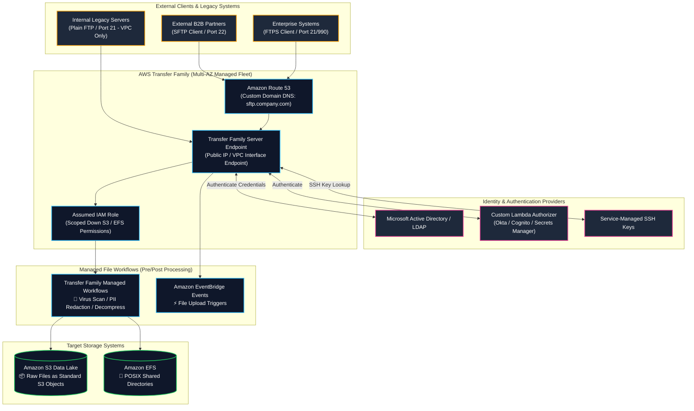
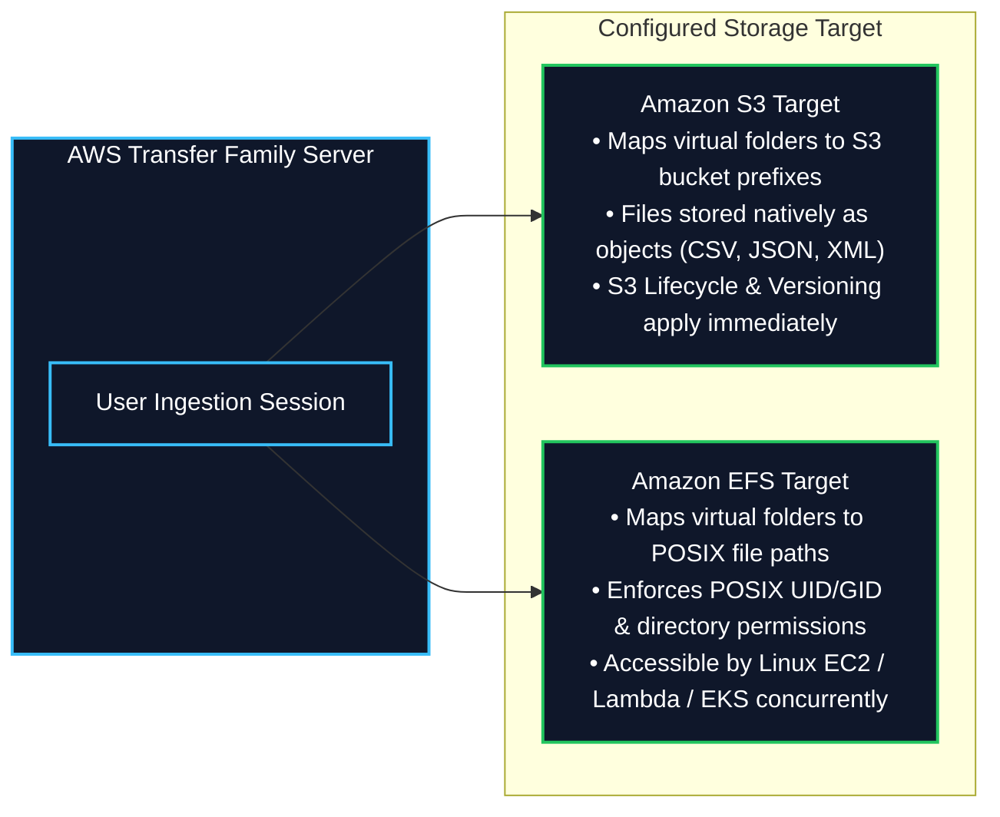
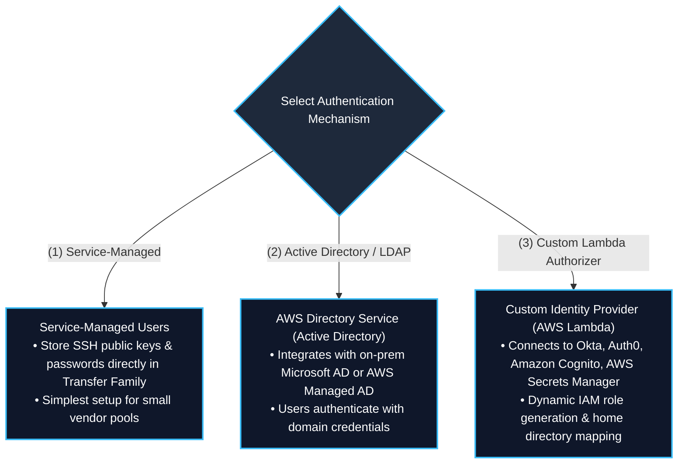
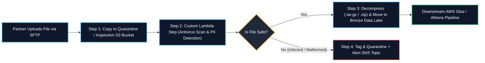
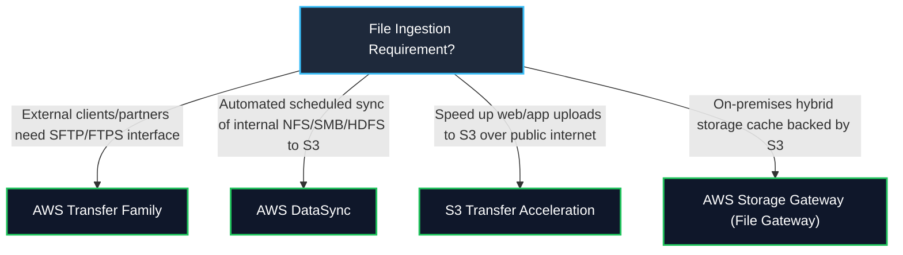

# 📂 AWS Transfer Family (Managed SFTP, FTPS, FTP & AS2)

- **Category**: Migration & Transfer (B2B Partner File Exchange & Managed File Transfer)
- **Language / ဘာသာစကား**: [English (Original)](file:///home/monetine/Workspace/Wathon/aws-dea-c01/content/en/02-services/migration/transfer-family.md) | **မြန်မာဘာသာ (Burmese)**
- **Primary Use Case**: ပြင်ပ စီးပွားရေးလုပ်ဖော်ကိုင်ဖက်များနှင့် legacy enterprise system များကို client ၏ workflow များ ပြောင်းလဲရန်မလိုဘဲ သို့မဟုတ် server များ စီမံခန့်ခွဲရန်မလိုဘဲ **SFTP, FTPS, FTP, AS2** မှတစ်ဆင့် လုံခြုံစိတ်ချရသော ဖိုင်လွှဲပြောင်းမှုဖြင့် [[s3]] Data Lakes များနှင့် [[efs-and-fsx]] (Amazon EFS) ထဲသို့ တိုက်ရိုက် ချိတ်ဆက်ပေးရန် ဖြစ်သည်။
- **Slide Reference**: Pages 284–285 in `[[AWSCertifiedDataEngineerSlides.pdf]]`
- **Hub Links**: [[mm/index]] | [[mm/service-catalog]] | [[mm/domain-1-ingestion-and-processing]] | [[mm/domain-2-data-store-management]] | [[mm/s3]] | [[mm/efs-and-fsx]] | [[mm/datasync-and-snow]]

---

## 1. High-Level Summary

**AWS Transfer Family** သည် **Amazon S3** နှင့် **Amazon EFS** များအတွင်းသို့ file transfer လုပ်ဆောင်မှုများကို အလွယ်တကူ migration ပြုလုပ်နိုင်ရန်နှင့် လုပ်ဆောင်နိုင်ရန် ကူညီပေးသော အပြည့်အဝ စီမံခန့်ခွဲပေးထားသည့် (fully managed)၊ မြင့်မားသောရရှိနိုင်မှုရှိသည့် (highly available)၊ Multi-AZ ဝန်ဆောင်မှုတစ်ခု ဖြစ်ပါသည်။ ၎င်းသည် လုပ်ငန်းသုံး စံသတ်မှတ်ချက် protocol များဖြစ်သော **SFTP** (SSH File Transfer Protocol), **FTPS** (FTP over SSL), **FTP** (unencrypted, VPC-only) နှင့် **AS2** (Applicability Statement 2 for EDI B2B transactions) တို့ကို ပံ့ပိုးပေးထားပါသည်။

**AWS Certified Data Engineer – Associate (DEA-C01)** စာမေးပွဲအတွက် အောက်ပါအချက်များကို သိရှိထားရမည်ဖြစ်သည်-
1. **Target Storage Backends**: **Amazon S3** (ဖိုင်များကို standard S3 objects များအနေဖြင့် တိုက်ရိုက်သိမ်းဆည်းပေးခြင်း) နှင့် **Amazon EFS** (POSIX directories) တို့သို့ တိုက်ရိုက် ချိတ်ဆက်အသုံးပြုနိုင်ပါသည်။
2. **Supported Transfer Protocols & Security**:
   - **SFTP** (Port 22): SSH keys (သို့) passwords များအသုံးပြု၍ Encrypted လုပ်ထားသော file transfer ဖြစ်သည်။
   - **FTPS** (Port 21/990): TLS ဖြင့် encrypt လုပ်ထားသော FTP ဖြစ်သည်။
   - **FTP** (Port 21): Plaintext FTP ဖြစ်ပြီး လုံခြုံရေးစည်းမျဉ်းများအရ **VPC endpoints များနှင့်သာ** အသုံးပြုခွင့် ကန့်သတ်ထားပါသည်။
   - **AS2** (Port 443): Non-repudiation နှင့် MDN receipts များပါဝင်သည့် စနစ်တကျတည်ဆောက်ထားသော B2B Electronic Data Interchange (EDI) အတွက် ဖြစ်သည်။
3. **Identity & Authentication Options**: Service-managed credentials, **Microsoft Active Directory** (AWS Directory Service မှတစ်ဆင့်), **LDAP**, **Okta**, **Amazon Cognito** သို့မဟုတ် မိမိစိတ်ကြိုက်ဖန်တီးထားသော **AWS Lambda authorizers** များကို အသုံးပြုနိုင်ပါသည်။
4. **Network & Endpoint Architecture**: Amazon Route 53 ဖြင့် custom domain names များကိုသုံးသည့် Public internet-facing endpoints များ နှင့် VPC-hosted endpoints များ (Elastic IPs သုံးသည့် internal သို့မဟုတ် internet-facing) ဆိုပြီး ရွေးချယ်နိုင်ပါသည်။
5. **Automated Managed Workflows**: ဖိုင်များ S3 သို့ မရောက်ရှိမီ pre-processing (antivirus scanning, PII redaction, file decompression) များကို အလိုအလျောက်လုပ်ဆောင်ခြင်းနှင့် post-processing အတွက် Amazon EventBridge နှင့် [[step-functions]] ကို အသုံးပြု၍ အသိပေးချက်များ (notifications) ပေးပို့ခြင်းတို့ ပါဝင်ပါသည်။

---

## 2. Core Protocol Capabilities & Storage Mapping

### 1. Protocol Capabilities Matrix

| Protocol | Encryption Standard | Network Exposure | Port(s) | Primary DEA-C01 Use Case |
| :--- | :--- | :--- | :--- | :--- |
| **AWS Transfer for SFTP** | SSH / AES-256 | Public Internet or VPC | **Port 22** | **Recommended Default**: လုံခြုံသော B2B partner ingestion၊ အလိုအလျောက် ERP/CRM file များကို S3 Data Lake အတွင်းသို့ ပို့ဆောင်ခြင်း။ |
| **AWS Transfer for FTPS** | TLS / SSL Encryption | Public Internet or VPC | **Port 21, 990** | SSL-secured FTP လိုအပ်သော legacy enterprise clients များအတွက်။ |
| **AWS Transfer for FTP** | ❌ None (Plaintext) | 🔒 **VPC Only** (Public internet မှ လုံးဝ ကန့်သတ်ထားသည်) | **Port 21** | Encryption အသုံးမပြုနိုင်သော legacy on-premises/VPC internal applications များအတွက်။ |
| **AWS Transfer for AS2** | S/MIME, SHA-2, Digital Signatures | Public Internet or VPC | **Port 443** | လက်ခံရရှိကြောင်း အတည်ပြုချက် (MDN) ဖြင့် Supply chain, logistics နှင့် EDI transaction အပြန်အလှန် ပေးပို့မှုများအတွက်။ |

### 2. Storage Mapping: Amazon S3 vs. Amazon EFS

- **Amazon S3 Target**: SFTP မှတစ်ဆင့် upload လုပ်သော file များကို native object များအနေဖြင့် S3 သို့ တိုက်ရိုက် ရေးသားပါသည်။ နောက်ဆက်တွဲ data lake tools များဖြစ်သော ([[glue]], [[athena]], [[redshift]]) တို့မှ အဆိုပါ file များကို ချက်ချင်း query ပြုလုပ်ခြင်းနှင့် transform ပြုလုပ်ခြင်းတို့ကို လုပ်ဆောင်နိုင်ပါသည်။
- **Amazon EFS Target**: SFTP မှတစ်ဆင့် upload လုပ်သော file များကို Amazon EFS file system သို့ ရေးသားပေးပြီး POSIX user permissions (UID/GID) များနှင့် directory hierarchies များကို ထိန်းသိမ်းထားပါသည်။

---

## 3. Identity, Authentication & Security Governance

AWS Transfer Family သည် စကားဝှက်များကို (passwords) ပြောင်းရွှေ့ရန် မလိုအပ်ဘဲ ရှိပြီးသား corporate directory များနှင့် ပေါင်းစပ်နိုင်ရန် ပြောင်းလွယ်ပြင်လွယ်ရှိသော authentication architecture များကို ပံ့ပိုးပေးထားပါသည်-

### Logical Directory Mapping & Chroot Jail
- ပြင်ပ partners များမှ မိမိတို့၏ internal S3 bucket အမည်များကို မြင်တွေ့ခြင်း သို့မဟုတ် ခွင့်ပြုချက်မရှိသော folder prefix များထံသို့ ဝင်ရောက်ခြင်းကို ကာကွယ်ရန် Transfer Family တွင် **Logical Directories (Chroot)** ကို ပံ့ပိုးပေးထားပါသည်-
  - မူလ bucket paths အပြည့်အစုံ (`s3://enterprise-data-lake-prod/incoming/partner_abc/`) အစား ရှင်းလင်းသော virtual root (`/`) ဖြင့် အစားထိုးပေးပါသည်။
  - အသုံးပြုသူများကို ၎င်းတို့၏ သက်ဆိုင်ရာ virtual directory jail အတွင်း၌သာ ကန့်သတ်ထားပါသည်။

---

## 4. Transfer Family Managed Workflows (Automated ETL Pre-Processing)

AWS Transfer Family တွင် file upload လုပ်လိုက်သည်နှင့် သက်ဆိုင်ရာ နေရာသို့ မရောက်မီ (သို့မဟုတ်) ရောက်ပြီးနောက် အလိုအလျောက် လုပ်ဆောင်ပေးမည့် processing step များကို **Managed Workflows** ဖြင့် ထည့်သွင်းထားပါသည်-

---

## 5. Master Data Ingestion Decision Matrix: Transfer Family vs. Alternatives

### Complete Comparative Matrix

| Service | Client Protocol | Client Software Changes? | Target Storage | Best DEA-C01 Use Case |
| :--- | :--- | :--- | :--- | :--- |
| **AWS Transfer Family** | **SFTP, FTPS, FTP, AS2** | ❌ **Zero changes** (Clients use standard FileZilla, WinSCP, scripts) | **Amazon S3, Amazon EFS** | ပြင်ပ vendor/partner များ၏ B2B file upload များကို data lakes ထဲသို့ တိုက်ရိုက်ပို့ဆောင်ခြင်း။ |
| **AWS DataSync** | NFS, SMB, HDFS, S3-API | Requires DataSync Agent VM | **Amazon S3, EFS, FSx** | အလိုအလျောက်နှင့် မြန်နှုန်းမြင့် internal data migration များနှင့် scheduled file server replication ပြုလုပ်ခြင်း။ |
| **Amazon S3 Transfer Acceleration** | HTTPS REST API | Change S3 endpoint URL | **Amazon S3** | Global web/mobile client များမှ CloudFront edge network ကိုအသုံးပြု၍ S3 သို့ တိုက်ရိုက် upload လုပ်ရာတွင် မြန်ဆန်စေရန်။ |
| **AWS Storage Gateway (File Gateway)** | NFS, SMB | ❌ Zero changes (Mount local IP) | **Amazon S3** | Low-latency file share access လိုအပ်သော on-premises applications များအတွက် Local hybrid caching အသုံးပြုခြင်း။ |

---

## 6. High-Yield DEA-C01 Exam Tips & Traps

> [!IMPORTANT]
> **Key Exam Trigger Keywords**:
> - **"Provide external vendors or partners with SFTP access to upload files directly into Amazon S3 or Amazon EFS without managing servers"** $\rightarrow$ **AWS Transfer Family**.
> - **"Migrate legacy SFTP workflows to AWS with Active Directory / LDAP authentication and custom domain name"** $\rightarrow$ **AWS Transfer Family (with Route 53 & Directory Service)**.
> - **"Automate virus scanning and file decompression upon SFTP file upload before landing in S3"** $\rightarrow$ **AWS Transfer Family Managed Workflows**.
> - **"Unencrypted FTP protocol compliance"** $\rightarrow$ **AWS Transfer for FTP configured with VPC-only endpoint (never public internet)**.

> [!WARNING]
> **Exam Traps & Failure Modes**:
> 1. **DataSync vs. Transfer Family Trap**:
>    - မေးခွန်းတွင် **third parties, external vendors (သို့) B2B partners** များက standard SFTP tools များကိုအသုံးပြု၍ files များကို upload လုပ်သည်ဟု ပါရှိပါက **AWS Transfer Family** ကို ရွေးချယ်ပါ။ **AWS DataSync** သည် ပြင်ပ clients များအတွက် SFTP server အဖြစ် အလုပ်မလုပ်နိုင်ပါ။
> 2. **Plain FTP Internet Exposure Trap**:
>    - Standard unencrypted FTP ကို AWS Transfer Family တွင် **public internet endpoint အဖြစ် အသုံးပြုခွင့် လုံးဝ တားမြစ်ထားပါသည်**။ FTP endpoint များကို Amazon VPC အတွင်း၌သာ အသုံးပြုနိုင်ပါသည်။
> 3. **IAM Scoping with Session Policies**:
>    - Multi-tenant SFTP server များကို ဖန်တီးရာတွင် ပြင်ပအသုံးပြုသူတစ်ဦးစီက အခြား vendors များ၏ data များကို ဝင်ရောက်မကြည့်ရှုနိုင်စေရန် **IAM Session Policies** သို့မဟုတ် **Logical Directory mappings** ကို အသုံးပြု၍ ၎င်းတို့၏ သက်ဆိုင်ရာ folder သို့သာ (`s3://bucket/home/${transfer:UserName}`) ကန့်သတ်ထားရမည်ဖြစ်ပါသည်။

---

## 📌 Related Notes

- [[mm/s3]] — SFTP file uploads များအတွက် Amazon S3 Data Lake target
- [[mm/efs-and-fsx]] — Transfer Family အတွက် Amazon EFS shared file system target
- [[mm/datasync-and-snow]] — AWS DataSync နှင့် Snow Family နှိုင်းယှဉ်ချက်
- [[mm/dms-and-sct]] — Database migration နှင့် CDC streaming
- [[mm/data-exchange]] — Third-party commercial dataset ရယူခြင်း
- [[mm/application-discovery-and-mgn]] — Application Discovery နှင့် MGN server migration
- [[mm/domain-1-ingestion-and-processing]] — DEA-C01 Domain 1 Study Guide
- [[mm/service-comparisons]] — Master DEA-C01 Service Decision Matrix
