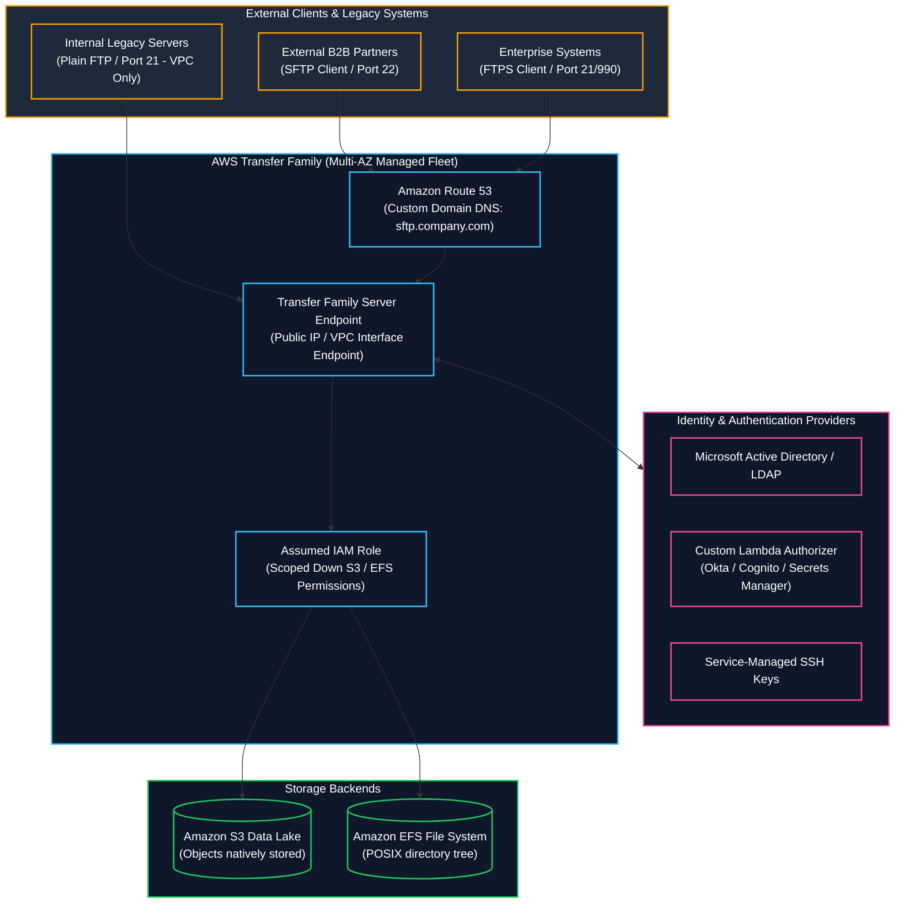

# 📂 AWS Transfer Family (Managed SFTP, FTPS, FTP & AS2) (စီမံခန့်ခွဲပေးထားသော ဖိုင်လွှဲပြောင်းမှု ဝန်ဆောင်မှု)

- **Category**: Migration & Transfer (B2B Partner File Exchange & Managed File Transfer)
- **Language / ဘာသာစကား**: [English Version](file:///home/monetine/Workspace/Wathon/aws-dea-c01/content/en/02-services/migration/transfer-family.md) | **မြန်မာဘာသာ (Burmese)**
- **အဓိက အသုံးပြုမှု**: ပြင်ပ B2B Partners များနှင့် လုပ်ငန်းသုံး စနစ်ဟောင်းများမှ ဖိုင်များကို **SFTP, FTPS, FTP, AS2** စံသတ်မှတ်ချက်များဖြင့် `[[s3]]` Data Lakes နှင့် `[[efs-and-fsx]]` (Amazon EFS) ထဲသို့ ဆာဗာ စီမံခန့်ခွဲစရာမလိုဘဲ တိုက်ရိုက် လွှဲပြောင်းပေးပို့ခြင်း။
- **Slide Reference**: Pages 284–285 in `[[AWSCertifiedDataEngineerSlides.pdf]]`
- **Hub Links**: `[[mm/index]]` | `[[en/index]]` | `[[s3]]` | `[[efs-and-fsx]]` | `[[datasync-and-snow]]`

---

## ၁။ အကျဉ်းချုပ် (High-Level Summary)

**AWS Transfer Family** သည် **SFTP** (SSH File Transfer Protocol)၊ **FTPS** (FTP over SSL)၊ **FTP** (VPC-only) နှင့် **AS2** (B2B Electronic Data Interchange) စသည့် လုပ်ငန်းသုံး ဖိုင်လွှဲပြောင်းမှု ပရိုတိုကောများကို အသုံးပြု၍ ဒေတာများကို **Amazon S3** နှင့် **Amazon EFS** ပေါ်သို့ တိုက်ရိုက် လွှဲပြောင်းပေးနိုင်သည့် Fully Managed, Multi-AZ ဝန်ဆောင်မှု ဖြစ်သည်။

---

## ၂။ Protocols & Security Architecture

1. **SFTP (SSH File Transfer Protocol - Port 22)**: Public Key Authentication သို့မဟုတ် Password ဖြင့် ချိတ်ဆက်သည်။ အသုံးအများဆုံး စံစနစ် ဖြစ်သည်။
2. **FTPS (FTP over TLS - Ports 21/990)**: TLS Certificate ဖြင့် Encrypted လုပ်ထားသော FTP ဖြစ်သည်။
3. **FTP (Plaintext FTP - Port 21)**: လုံခြုံရေးအရ **VPC Endpoints အတွင်းသာ အသုံးပြုခွင့် ကန့်သတ်ထားသည်** (Public Internet ပေါ်တွင် မရပါ)။
4. **AS2 (Applicability Statement 2 - Port 443)**: EDI စာရွက်စာတမ်းများ လဲလှယ်ရာတွင် သုံးပြီး MDN (Message Disposition Notification) ဖြင့် အရောက်ပို့ အတည်ပြုချက် ရရှိသည်။

---

## ၃။ DEA-C01 စာမေးပွဲ အဓိက အချက်အလက်များနှင့် ထောင်ချောက်များ (Exam Tips & Traps)

> [!IMPORTANT]
> **Key Exam Trigger Keywords**:
> - **"Secure SFTP / FTPS file transfer directly into Amazon S3 data lake or Amazon EFS without managing servers"** $\rightarrow$ **AWS Transfer Family**.
> - **"Integrate external partners via SFTP using Active Directory or custom authentication (Okta/Cognito)"** $\rightarrow$ **AWS Transfer Family with custom Lambda authorizer or AWS Directory Service**.
> - **"Plaintext FTP support"** $\rightarrow$ **AWS Transfer Family with VPC-hosted endpoint** (Public FTP is not permitted).

---

## 📌 ဆက်စပ် မှတ်စုများ (Related Notes)

- `[[s3]]` — Amazon S3 Data Lake Integration
- `[[efs-and-fsx]]` — Amazon EFS POSIX Storage
- `[[datasync-and-snow]]` — AWS DataSync (High-speed Network Transfer)
