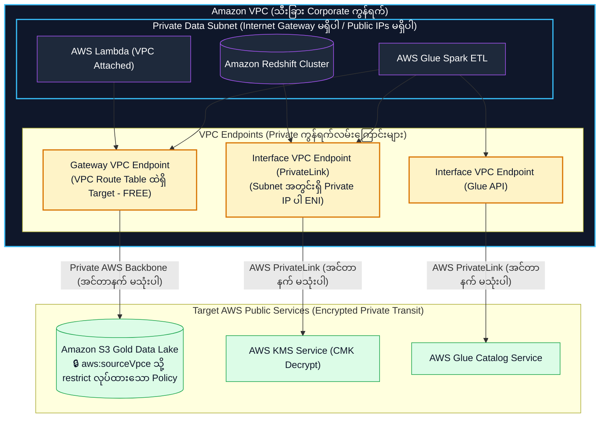
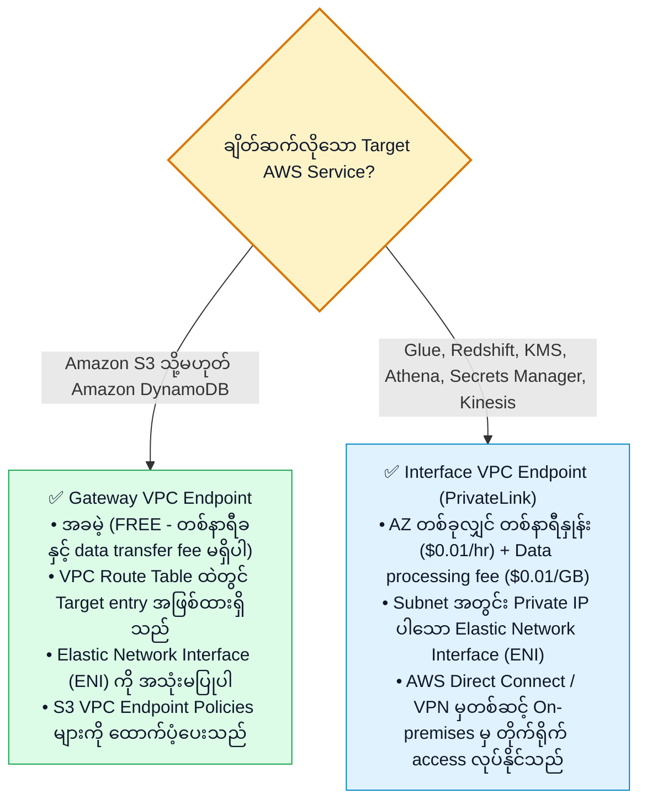
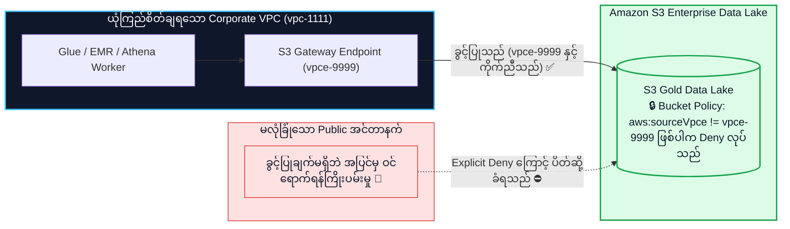

# 🌐 Data Engineers များအတွက် Amazon VPC, PrivateLink, Endpoints & Data Perimeter

- **Category**: Networking & Content Delivery / Network Isolation & Private Data Transport
- **Language / ဘာသာစကား**: [English (Original)](/en/02-services/networking-monitoring/vpc-and-networking) | **မြန်မာဘာသာ (Burmese)**
- **Primary Use Case**: Data resources များ (Amazon Redshift, RDS, EMR, Lambda, Glue) ကို private subnets များအတွင်း သီးခြားခွဲထုတ်ထားခြင်း (isolating)၊ VPC Endpoints & AWS PrivateLink မှတစ်ဆင့် private connectivity တည်ဆောက်ခြင်း၊ နှင့် S3 Data Perimeters များကို enforce ပြုလုပ်ခြင်း။
- **Slide Reference**: Pages 590–617 in `[AWSCertifiedDataEngineerSlides.pdf](/docs/AWSCertifiedDataEngineerSlides.pdf)`
- **Hub Links**: `[[mm/index]]` | `[[service-catalog]]` | `[[domain-4-data-security-and-governance]]` | `[[s3]]` | `[[redshift]]` | `[[glue]]`

---

## 1. High-Level အကျဉ်းချုပ် (High-Level Summary)

Production enterprise data architectures များတွင် အရေးကြီး sensitive data store များဖြစ်သော (**Amazon Redshift, Amazon RDS/Aurora, Amazon EMR, AWS Glue**) တို့ကို public internet သို့ လုံးဝ expose မလုပ်သင့်ပါ။

**AWS Certified Data Engineer - Associate (DEA-C01)** စာမေးပွဲအတွက် networking ကျွမ်းကျင်မှုတွင် အဓိက အာရုံစိုက်ရမည့်အချက်များမှာ:
1. **Private Subnet Isolation**: Database နှင့် compute resource များကို Internet Gateway သို့မဟုတ် Public IP များ မပါရှိသော private subnet များထဲတွင် deploy လုပ်ခြင်း။
2. **VPC Endpoints (Gateway vs. Interface Endpoints)**: AWS private backbone ကွန်ရက်မှတစ်ဆင့် AWS services များ (S3, DynamoDB, Glue, KMS, Secrets Manager) သို့ traffic များကို privately လမ်းကြောင်းပေးခြင်း (routing)။
3. **Establishing an S3 Data Perimeter**: ဒေတာများကို ခွင့်ပြုထားသော corporate VPC များမှသာ ဝင်ရောက်ရယူနိုင်စေရန် S3 Bucket Policies များနှင့် **VPC Endpoint Policies** များ (`aws:sourceVpce`, `aws:PrincipalOrgID`) ကို အသုံးပြု၍ သတ်မှတ်ခြင်း။



---

## 2. Security Groups နှင့် Network Access Control Lists (NACLs) နှိုင်းယှဉ်ချက်

| အင်္ဂါရပ် (Feature Dimension) | Security Groups | Network ACLs (NACLs) |
| :--- | :--- | :--- |
| **လုပ်ဆောင်သည့် အဆင့် (Operates At)** | **Instance Level** (Elastic Network Interface - ENI)။ | **Subnet Level** (Subnet တစ်ခုလုံး၏ နယ်နိမိတ်)။ |
| **Statefulness** | **Stateful**: Inbound rules မည်သို့ပင်ရှိစေကာမူ Return traffic ကို အလိုအလျောက် ခွင့်ပြုသည် (automatically allowed)။ | **Stateless**: Outbound rules ထဲတွင် Return traffic ကို explicitly ခွင့်ပြုပေးရမည်! |
| **Rule အမျိုးအစားများ (Rule Types)** | **ALLOW rules သာရရှိ** (အခြားအရာအားလုံးအတွက် implicit deny ဖြစ်သည်)။ | **ALLOW နှင့် DENY rules နှစ်မျိုးလုံး** ကို ထောက်ပံ့ပေးသည်။ |
| **Rule စစ်ဆေးသည့် အစီအစဉ် (Rule Evaluation Order)** | Access မပေးမီ **Rules အားလုံး** ကို စစ်ဆေးတွက်ချက်သည်။ | Rules များကို **ဂဏန်းစဉ်အလိုက် အတိအကျ (strict numerical order)** စစ်ဆေးသည် (ငယ်ရာမှ ကြီးရာသို့၊ ဥပမာ Rule 200 မတိုင်မီ Rule 100 ကို အရင်စစ်သည်)။ |
| **Data Engineering Use Case** | Glue/EMR security group မှ Redshift သို့ port 5439 ဖြင့် ချိတ်ဆက်ခွင့်ပြုခြင်း။ | အန္တရာယ်ရှိသော malicious IP subnet တစ်ခုမှ database subnet သို့ ဝင်ရောက်ခြင်းကို တားမြစ် (block) ခြင်း။ |

---

## 3. Gateway Endpoints vs. Interface Endpoints (AWS PrivateLink)

Public internet ကို ဖြတ်သန်းစရာမလိုဘဲ private subnet များကို AWS services များနှင့် ချိတ်ဆက်ရန် **VPC Endpoints** များ လိုအပ်ပါသည်:



### အသေးစိတ် Endpoint နှိုင်းယှဉ်ချက်ဇယား (Detailed Endpoint Comparison Matrix):

| အင်္ဂါရပ် (Feature Dimension) | Gateway VPC Endpoints | Interface VPC Endpoints (PrivateLink) |
| :--- | :--- | :--- |
| **ထောက်ပံ့ပေးသော Services များ (Supported Services)** | **Amazon S3** နှင့် **Amazon DynamoDB** သာ ဖြစ်သည်။ | **AWS Services ပေါင်း ၁၅၀ ကျော်** (Glue, KMS, Redshift, Athena, Secrets Manager, EMR)။ |
| **ကုန်ကျစရိတ် ဖွဲ့စည်းပုံ (Cost Architecture)** | **၁၀၀% အခမဲ့** (တစ်နာရီခ သုည၊ data fee သုည)။ | ENI တစ်နာရီနှုန်း + per-GB data processing fee ဖြင့် ကောက်ခံသည်။ |
| **Routing ယန္တရား (Routing Mechanism)** | Route table prefix list entry (`pl-xxxx`)။ | Subnet အတွင်း private IP address ပါရှိသော Elastic Network Interface (ENI)။ |
| **On-Premises မှ ချိတ်ဆက်မှု (On-Premises Access)** | On-premises မှ VPN/Direct Connect ဖြင့် တိုက်ရိုက် access မလုပ်နိုင်ပါ။ | Direct Connect / Site-to-Site VPN မှတစ်ဆင့် **On-premises မှ တိုက်ရိုက် access လုပ်နိုင်သည်**။ |
| **Endpoint Policies** | Access ကို ကန့်သတ်ရန် VPC Endpoint Policies များကို ထောက်ပံ့ပေးသည်။ | Access ကို ကန့်သတ်ရန် VPC Endpoint Policies များကို ထောက်ပံ့ပေးသည်။ |

---

## 4. S3 Data Perimeter တည်ဆောက်ခြင်း (Building an S3 Data Perimeter)

**S3 Data Perimeter** သည် အဖွဲ့အစည်း၏ အရေးကြီး sensitive data များကို ယုံကြည်စိတ်ချရသော ကွန်ရက် (trusted networks) နှင့် ယုံကြည်စိတ်ချရသော identities များမှသာ ဝင်ရောက်ရယူနိုင်ကြောင်း အာမခံချက်ပေးပါသည်။



### VPC Endpoint မှတစ်ဆင့်သာ S3 Access ကို သီးသန့်ကန့်သတ်ခြင်း (Enforcing S3 Access Exclusively via VPC Endpoint):
```json
{
  "Version": "2012-10-17",
  "Statement": [
    {
      "Sid": "RestrictAccessToSpecificVPC",
      "Effect": "Deny",
      "Principal": "*",
      "Action": "s3:*",
      "Resource": [
        "arn:aws:s3:::enterprise-gold-lake",
        "arn:aws:s3:::enterprise-gold-lake/*"
      ],
      "Condition": {
        "StringNotEquals": {
          "aws:sourceVpce": "vpce-0123456789abcdef0"
        }
      }
    }
  ]
}
```

---

## 5. DEA-C01 စာမေးပွဲအတွက် မဖြစ်မနေသိထားရမည့်အချက်များ (DEA-C01 Exam Essentials)

> [!IMPORTANT]
> **VPC & Networking ဆိုင်ရာ အဓိက စာမေးပွဲ ဆုံးဖြတ်ချက် Triggers များ (Key Exam Decision Triggers)**:
>
> - **"Private subnet အတွင်း run နေသော AWS Glue Spark jobs များကို NAT Gateway data transfer fee မပေးရဘဲ သို့မဟုတ် Internet Gateway မသုံးဘဲ Amazon S3 သို့ ချိတ်ဆက်လိုခြင်း"** $\rightarrow$ **Gateway VPC Endpoint for Amazon S3** ကို ဖန်တီးပါ (၁၀၀% အခမဲ့ဖြစ်သည်)။
> - **"Private Redshift cluster သို့မဟုတ် AWS Glue job ကို public internet အသုံးမပြုဘဲ AWS KMS နှင့် Secrets Manager သို့ ချိတ်ဆက်လိုခြင်း"** $\rightarrow$ `kms` နှင့် `secretsmanager` အတွက် **Interface VPC Endpoints (AWS PrivateLink)** ကို ဖန်တီးပါ။
> - **"Corporate VPC အတွင်းမှသာ objects များကို read/write ပြုလုပ်နိုင်ရန် Amazon S3 bucket access ကို ကန့်သတ်လိုခြင်း"** $\rightarrow$ `"aws:sourceVpce": "vpce-xxxx"` Condition ကို အသုံးပြုပြီး `Deny` statement ပါသော S3 Bucket Policy တစ်ခုကို ထည့်သွင်းပါ။
> - **"Amazon S3 ကို privately query ပြုလုပ်ရန် on-premises Hadoop cluster တစ်ခုကို AWS Direct Connect မှတစ်ဆင့် ချိတ်ဆက်လိုခြင်း"** $\rightarrow$ **S3 Interface VPC Endpoints** ကို အသုံးပြုပါ (Gateway Endpoints များသည် on-premises traffic ကို route မလုပ်နိုင်သောကြောင့်ဖြစ်သည်)။
> - **"Private subnet အတွင်းရှိ AWS Glue job တစ်ခုကို အခြား security group ထဲရှိ Amazon RDS PostgreSQL database သို့ ချိတ်ဆက်ခွင့်ပြုလိုခြင်း"** $\rightarrow$ **Glue Security Group ID** မှ port 5432 ဖြင့် TCP traffic ကို ခွင့်ပြုရန် **RDS Security Group inbound rules** ကို update လုပ်ပါ။

---

## 📌 ဆက်စပ်လေ့လာရန် မှတ်စုများ (Related Notes)
- `[[iam]]` — IAM Policy Evaluation & Condition Keys (`aws:sourceVpce`)
- `[[s3]]` — S3 Gateway Endpoints & Bucket Policies
- `[[redshift]]` — Redshift VPC Deployment & Enhanced VPC Routing
- `[[kms-and-secrets]]` — KMS & Secrets Manager သို့ PrivateLink ဖြင့် ချိတ်ဆက်ခြင်း
- `[[domain-4-data-security-and-governance]]` — DEA-C01 Domain 4 လေ့လာရန်လမ်းညွှန်
