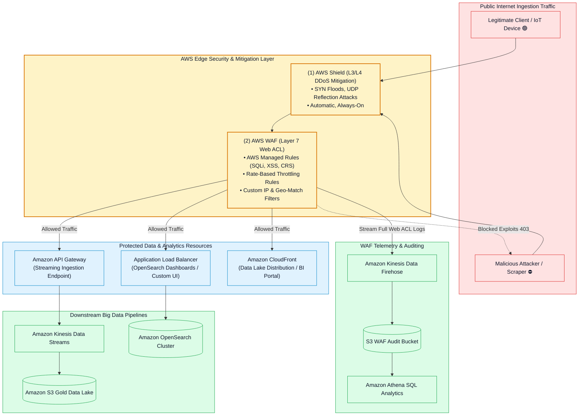
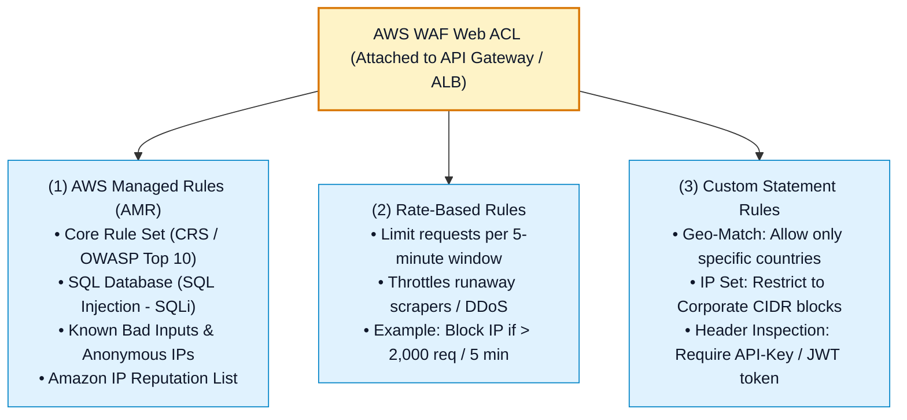
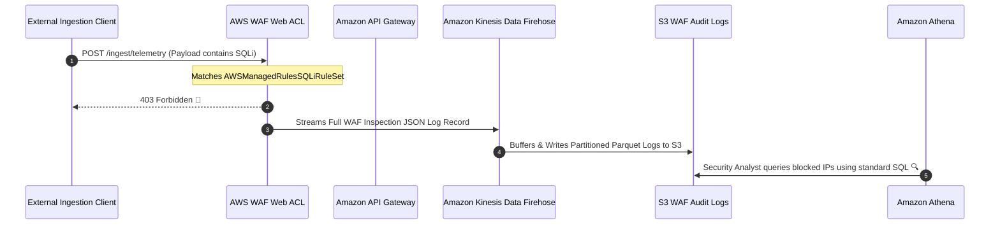
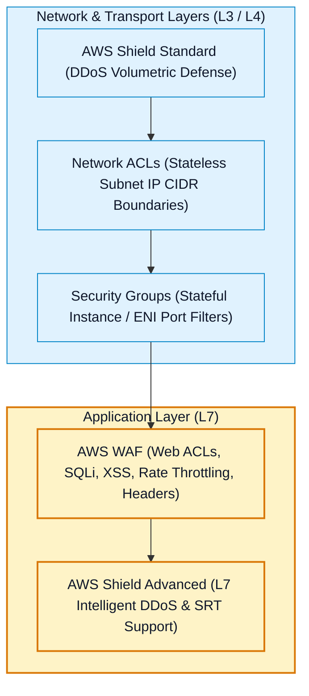

# 🛡️ AWS WAF, AWS Shield & Edge Protection for Data Pipelines

- **Category**: Security, Identity, & Compliance / Web Application Firewall & DDoS Mitigation
- **Language / ဘာသာစကား**: [English (Original)](/en/02-services/networking-monitoring/waf-and-shield) | **မြန်မာဘာသာ (Burmese)**
- **Primary Use Case**: Data ingestion endpoints (Amazon API Gateway, AWS AppSync, ALBs) များနှင့် search/BI portals (Amazon OpenSearch, Amazon CloudFront) များကို web exploits (SQLi, XSS), runaway API scraping များနှင့် Distributed Denial of Service (DDoS) တိုက်ခိုက်မှုများမှ ကာကွယ်ခြင်း။
- **Slide Reference**: Pages 600–625 in `[AWSCertifiedDataEngineerSlides.pdf](/docs/AWSCertifiedDataEngineerSlides.pdf)`
- **Hub Links**: `[[mm/index]]` | `[[service-catalog]]` | `[[domain-4-data-security-and-governance]]` | `[[vpc-and-networking]]` | `[[kinesis]]` | `[[opensearch-security-and-monitoring]]`

---

## 1. High-Level Summary

Production data engineering architecture များတွင် streaming ingestion endpoints များနှင့် analytics dashboard များသည် internet traffic သို့ မကြာခဏ expose ဖြစ်နေတတ်သည်။ Edge protection မရှိပါက data pipeline များသည် **Layer 7 web application exploits** (streaming payloads များအတွင်းသို့ SQL injection ထည့်သွင်းခြင်း)၊ **brute-force scraping** နှင့် **DDoS resource exhaustion attacks** (resource များ ကုန်ခမ်းသွားစေရန် တိုက်ခိုက်ခြင်း) များကို ရင်ဆိုင်ရနိုင်ပါသည်။

**AWS Certified Data Engineer - Associate (DEA-C01)** စာမေးပွဲအတွက် edge security သည် အောက်ပါအချက်များအပေါ် အဓိက အခြေခံထားပါသည်:
1. **AWS WAF (Web Application Firewall)**: SQLi, XSS များကို block ရန်၊ excessive API calls များကို rate-limit ကန့်သတ်ရန်နှင့် IP/Geo whitelisting ကို enforce ပြုလုပ်ရန်အတွက် HTTP(S) request များကို Layer 7 တွင် စစ်ဆေးခြင်း (inspecting)။
2. **AWS Shield (Standard vs. Advanced)**: Layer 3/4 network volumetric floods တိုက်ခိုက်မှုများကို ကာကွယ်ခြင်း (Standard - အခမဲ့) နှင့် financial cost protection ပါဝင်သော advanced Layer 7 enterprise DDoS တိုက်ခိုက်မှုများကို ကာကွယ်ခြင်း (Advanced)။
3. **WAF Log Streaming**: စစ်ဆေးမှု telemetry အပြည့်အစုံကို **Amazon Kinesis Data Firehose** $\rightarrow$ **Amazon S3** သို့ ပေးပို့ကာ **Amazon Athena** ဖြင့် audit analysis ပြုလုပ်ခြင်း။

---

## 2. AWS WAF Core Components & Rule Architecture

**AWS WAF** သည် **Layer 7 (Application Layer)** တွင် အလုပ်လုပ်ပြီး အောက်ပါတို့နှင့် ချိတ်ဆက်အသုံးပြုနိုင်ပါသည်:
- **Amazon API Gateway** (data streaming ingestion အတွက် အသုံးပြုသော REST / HTTP APIs များ)။
- **AWS AppSync** (data lakes များအတွက် GraphQL APIs များ)။
- **Application Load Balancer (ALB)** (OpenSearch Dashboards, EMR Studio, သို့မဟုတ် custom ETL web portals များရှေ့တွင် ထားရှိခြင်း)။
- **Amazon CloudFront** (content delivery distributions များ)။
- **AWS App Runner** နှင့် **Amazon Cognito User Pools**။

### Data Engineers များအတွက် အဓိက WAF Rule အမျိုးအစားများ:

1. **AWS Managed Rules (AMRs)**:
   - *SQL Injection Rule Set (`AWSManagedRulesSQLiRuleSet`)*: Database များ သို့မဟုတ် Spark SQL ingestion jobs များထံ မရောက်ရှိမီ မလိုလားအပ်သော malicious SQL code များကို ပိတ်ဆို့ရန်အတွက် ဝင်ရောက်လာသော HTTP payloads, query strings နှင့် headers များကို စစ်ဆေးခြင်း (inspects)။
   - *Core Rule Set (`AWSManagedRulesCommonRuleSet`)*: အထွေထွေ web exploits များ (Cross-Site Scripting XSS, command injection, path traversal) ကို ကာကွယ်ပေးခြင်း။
   - *Anonymous IP List (`AWSManagedRulesAnonymousIpList`)*: လိမ်လည်တုပထားသော event stream များကို ပေးပို့ရန် ကြိုးစားသည့် VPNs, Tor exit nodes နှင့် anonymous proxies များမှ လာသော traffic များကို block ပြုလုပ်ခြင်း။

2. **Rate-Based Rules (Ingestion Overload မဖြစ်အောင် ကာကွယ်ခြင်း)**:
   - သတ်မှတ်ထားသော ၅ မိနစ် (5-minute rolling window) အတွင်း originating IP address တစ်ခုစီမှ request rate ပမာဏကို စောင့်ကြည့်ခြေရာခံခြင်း။
   - *ဥပမာ*: အကယ်၍ unauthenticated client တစ်ခုသည် API Gateway ingestion endpoint သို့ $5\text{ မိနစ်လျှင် requests } > 1,000$ ( $> 1,000\text{ requests / 5 minutes}$) ပေးပို့လာပါက request rate ပြန်လည်လျော့ကျသွားသည်အထိ WAF သည် HTTP `429 (Too Many Requests)` သို့မဟုတ် HTTP `403 (Forbidden)` ဖြင့် အလိုအလျောက် တုံ့ပြန်ပိတ်ဆို့ပါသည်။

3. **Custom Inspection Rules**:
   - သီးခြား headers များ (ဥပမာ- `X-Custom-Ingestion-Token` ကို စစ်ဆေးအတည်ပြုခြင်း)၊ query parameters များ သို့မဟုတ် request body size များ (ဥပမာ- downstream Lambda buffers များကို ကာကွယ်ရန် payloads $> 10\text{ MB}$ ရှိသည်များကို block ပြုလုပ်ခြင်း) ကို စစ်ဆေးခြင်း။

---

## 3. WAF Traffic Logging & Security Analytics Pipeline

Compliance framework များအရ web ACL ဆုံးဖြတ်ချက်များ (Allowed, Blocked, Counted) အားလုံးကို ထိန်းသိမ်းထားရှိပြီး audit စစ်ဆေးနိုင်ရမည်ဟု သတ်မှတ်ထားပါသည်:

> [!TIP]
> **WAF Logs များကို Athena ဖြင့် Query ပြုလုပ်ခြင်း**:
> WAF log များကို Kinesis Data Firehose မှတစ်ဆင့် Amazon S3 သို့ stream ပြုလုပ်ခြင်းဖြင့် security team များအနေဖြင့် သီးသန့် log server များ ထားရှိစရာမလိုဘဲ top blocked IP address များ၊ ပစ်မှတ်ထားခံရသော URI path များနှင့် attack signature များကို ရှာဖွေဖော်ထုတ်ရန် Athena တွင် SQL queries များ run နိုင်စေပါသည်။

---

## 4. AWS Shield Deep Dive (Standard vs. Advanced)

**AWS Shield** သည် AWS application များအတွက် managed **Distributed Denial of Service (DDoS)** ကာကွယ်မှုကို ပေးစွမ်းပါသည်:

| Dimension | AWS Shield Standard | AWS Shield Advanced |
| :--- | :--- | :--- |
| **Pricing & Cost (ဈေးနှုန်းနှင့် ကုန်ကျစရိတ်)** | **100% FREE** (AWS customer အားလုံးအတွက် အလိုအလျောက် အခမဲ့ပါဝင်သည်)။ | **\$3,000 / month** + Data transfer fees (Enterprise commitment လိုအပ်)။ |
| **Layers Protected (ကာကွယ်ပေးသော Layer များ)** | **Layer 3 (Network)** & **Layer 4 (Transport)**။ | **Layer 3, Layer 4 & Layer 7 (Application)**။ |
| **Attack Types Mitigated (ကာကွယ်ပေးနိုင်သော တိုက်ခိုက်မှုပုံစံများ)** | SYN Floods, UDP Reflection attacks, ACK Floods။ | Volumetric floods, HTTP floods, DNS query floods, Layer 7 DDoS။ |
| **Supported Resources (အသုံးပြုနိုင်သော Resource များ)** | AWS internet-facing endpoints အားလုံး (EC2, CloudFront, Route 53, ALB)။ | Amazon CloudFront, Route 53, Elastic IPs, Application Load Balancers, AWS Global Accelerator။ |
| **24/7 Security Team (၂၄/၇ လုံခြုံရေးအဖွဲ့)** | ❌ မရှိပါ။ | ✅ တိုက်ခိုက်မှုဖြစ်ပွားနေစဉ် custom WAF rules များ ရေးသားနိုင်ရန် **AWS Shield Response Team (SRT) သို့ 24/7 access ရရှိခြင်း**။ |
| **Financial Cost Protection (ငွေကြေးဆိုင်ရာ ကုန်ကျစရိတ် ကာကွယ်မှု)** | ❌ မရှိပါ။ | ✅ **DDoS Cost Protection**: DDoS တိုက်ခိုက်မှုများကြောင့် ဖြစ်ပေါ်လာသော autoscaling spikes (EC2, CloudFront, ALB) များအတွက် service credits များ ပေးအပ်ခြင်း။ |
| **Health-Based Detection (Health အပေါ် အခြေခံ၍ စစ်ဆေးခြင်း)** | ❌ မရှိပါ။ | ✅ False positives များကို လျှော့ချရန် **Amazon Route 53 Health Checks** နှင့် တွဲဖက်ချိတ်ဆက်ခြင်း။ |

---

## 5. Defense-in-Depth နှိုင်းယှဉ်ချက် Matrix

WAF နှင့် Shield တို့သည် VPC Security Groups နှင့် Network ACLs များနှင့်အတူ မည်သည့်နေရာတွင် အံဝင်ခွင်ကျ အလုပ်လုပ်သနည်း?

| Security Layer | AWS Mechanism | Evaluates (စစ်ဆေးသည့်အရာ) | Data Engineering Use Case |
| :--- | :--- | :--- | :--- |
| **Layer 3 / 4 (DDoS)** | **AWS Shield Standard** | Packet volume, SYN/UDP flood signatures. | Public API endpoint များကို ပစ်မှတ်ထားသော volumetric flood များကို အလိုအလျောက် ကာကွယ်စုပ်ယူပေးခြင်း။ |
| **Layer 4 (Subnet)** | **Network ACLs (NACL)** | Source/Destination IP CIDR and Ports (Stateless). | VPC boundary တွင် compromised ဖြစ်နေသော subnet CIDR block တစ်ခုလုံးကို ပိတ်ဆို့ခြင်း။ |
| **Layer 4 (Instance)** | **Security Groups** | Inbound/Outbound Port & Security Group IDs (Stateful). | AWS Glue သို့မဟုတ် Lambda မှ Amazon Redshift သို့ port 5439 ဖြင့် ချိတ်ဆက်ခွင့်ပြုခြင်း။ |
| **Layer 7 (Application)** | **AWS WAF** | HTTP body, headers, query strings, SQLi, XSS, request rates. | API Gateway streaming ingestion ကို ပစ်မှတ်ထားသော SQL injection payload များကို ပိတ်ဆို့ခြင်း။ |
| **Layer 7 (Enterprise DDoS)** | **AWS Shield Advanced** | Application-level anomalies, HTTP request spikes. | 24/7 SRT ၏ ပါဝင်ကူညီမှုနှင့် financial cost spike protection ကို ပေးစွမ်းခြင်း။ |

---

## 6. DEA-C01 Exam Essentials

> [!IMPORTANT]
> **WAF & Shield အတွက် အဓိက စာမေးပွဲ Decision Triggers များ**:
>
> - **"Public Amazon API Gateway streaming ingestion endpoint တစ်ခုကို SQL Injection (SQLi) နှင့် Cross-Site Scripting (XSS) တိုက်ခိုက်မှုများမှ ကာကွယ်ရန်"** $\rightarrow$ **AWS Managed Rules (`AWSManagedRulesSQLiRuleSet`)** ပါဝင်သော **AWS WAF Web ACL** တစ်ခုကို ချိတ်ဆက်ပါ (Attach)။
> - **"Automated scraping သို့မဟုတ် brute-force requests များကြောင့် Amazon API Gateway သို့မဟုတ် OpenSearch dashboard ပေါ်တွင် ဝန်ပိသွားခြင်း (overwhelming) မှ ကာကွယ်ရန်"** $\rightarrow$ ၅ မိနစ် window အတွင်း သတ်မှတ်ထားသော request threshold ထက်ကျော်လွန်သည့် IP များကို block သို့မဟုတ် throttle ပြုလုပ်ရန် **AWS WAF Rate-Based Rule** ကို configure ပြုလုပ်ပါ။
> - **"Internet-facing data analytics applications များကို အပိုကုန်ကျစရိတ်မရှိဘဲ (zero additional cost) SYN floods နှင့် UDP reflection တိုက်ခိုက်မှုများမှ ကာကွယ်ရန်"** $\rightarrow$ **AWS Shield Standard** ကို အသုံးပြုပါ (AWS accounts အားလုံးတွင် အလိုအလျောက် enable လုပ်ထားပြီးဖြစ်သည်)။
> - **"Layer 7 DDoS တိုက်ခိုက်မှုအတွင်း AWS security ကျွမ်းကျင်သူများထံမှ 24/7 သီးသန့် အကူအညီရယူရန်နှင့် auto-scaling cost spikes များအတွက် ငွေကြေးဆိုင်ရာ အကာအကွယ်ရရှိရန်"** $\rightarrow$ **AWS Shield Response Team (SRT)** access ပါဝင်သော **AWS Shield Advanced** ကို subscribe ပြုလုပ်ပါ။
> - **"API Gateway ingestion endpoint သို့ ဝင်ရောက်လာသော allowed နှင့် blocked HTTP requests အားလုံးကို standard SQL ဖြင့် မှတ်တမ်းယူ (capture) ပြီး ခွဲခြမ်းစိတ်ဖြာရန်"** $\rightarrow$ **AWS WAF logging ကို Amazon Kinesis Data Firehose** သို့ enable ပြုလုပ်ပြီး logs များကို **Amazon S3** သို့ သိမ်းဆည်းကာ **Amazon Athena** ဖြင့် query ပြုလုပ်ပါ။

---

## 📌 Related Notes
- `[[vpc-and-networking]]` — Amazon VPC, Security Groups & NACLs
- `[[kinesis]]` — Amazon Kinesis Data Streams & Firehose Ingestion
- `[[opensearch-security-and-monitoring]]` — OpenSearch Dashboard Access & Security
- `[[macie-and-cloudtrail]]` — AWS CloudTrail API Auditing
- `[[domain-4-data-security-and-governance]]` — DEA-C01 Domain 4 Study Guide
