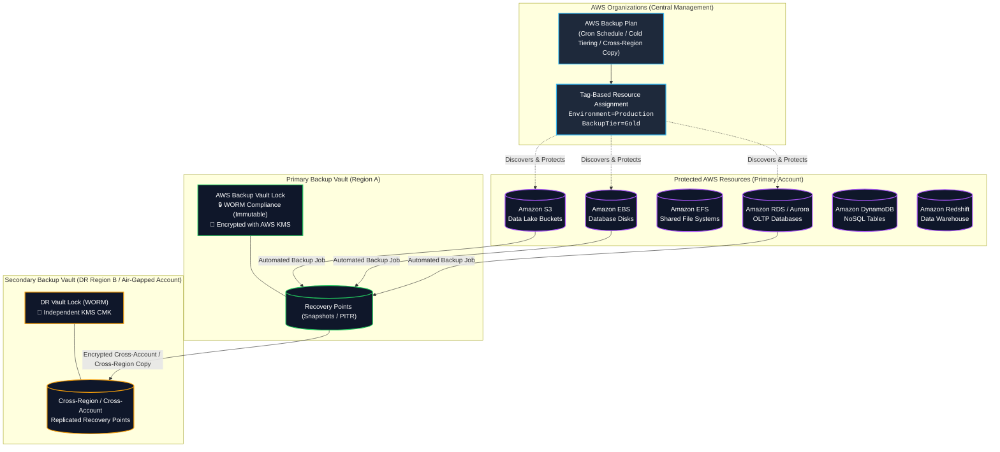
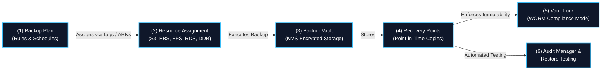
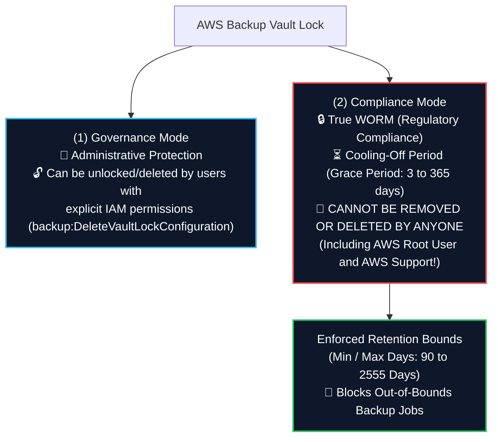
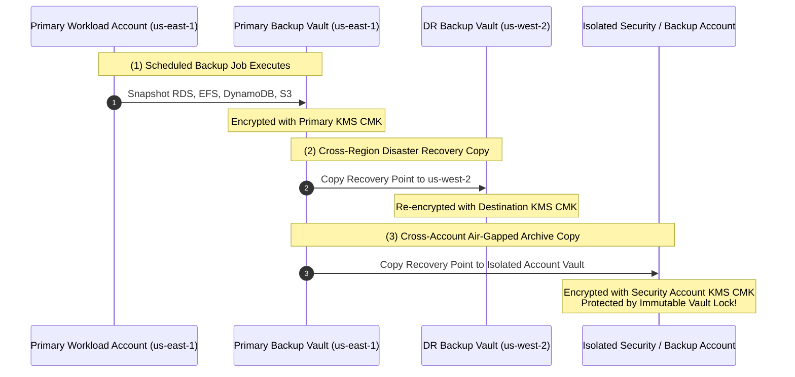
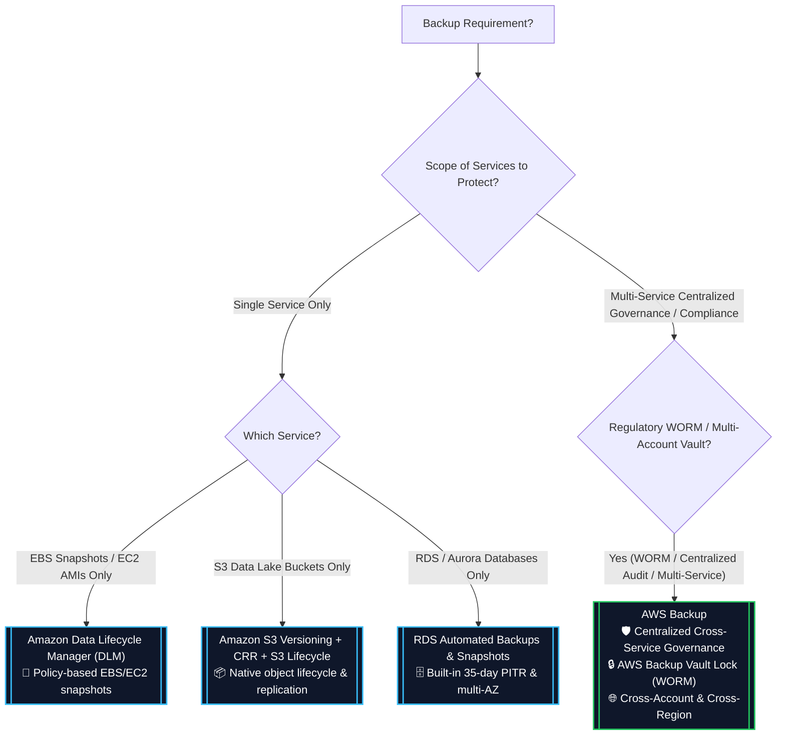
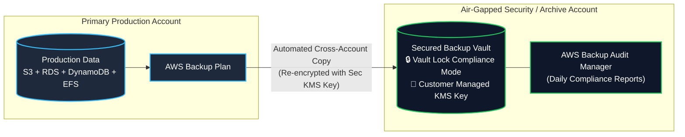

# 🛡️ AWS Backup (Centralized Policy-Based Data Protection) (မြန်မာဘာသာ)

- **Category**: Security, Governance & Storage Management
- **Language / ဘာသာစကား**: [English (Original)](/en/02-services/security-governance/aws-backup) | **မြန်မာဘာသာ (Burmese)**
- **Primary Use Case**: ဗဟိုချုပ်ကိုင်မှုရှိပြီး မူဝါဒအခြေပြု (centralized, automated, policy-driven) backup management၊ disaster recovery၊ WORM compliance (**AWS Backup Vault Lock**) နှင့် AWS services များအနှံ့ cross-account / cross-Region data protection လုပ်ဆောင်ခြင်း။
- **Slide Reference**: `[AWSCertifiedDataEngineerSlides.pdf](/docs/AWSCertifiedDataEngineerSlides.pdf)` မှ Pages 139–154, 410–430
- **Hub Links**: `[[mm/index|index]]` | `[[mm/00-hub/service-catalog|service-catalog]]` | `[[mm/01-domains/domain-4-data-security-and-governance|domain-4-data-security-and-governance]]` | `[[mm/01-domains/domain-2-data-store-management|domain-2-data-store-management]]` | `[[mm/02-services/storage/s3/s3|s3]]` | `[[mm/02-services/storage/ebs-and-instance-store|ebs-and-instance-store]]` | `[[mm/02-services/storage/efs-and-fsx|efs-and-fsx]]`

---

## 1. High-Level Summary

**AWS Backup** သည် AWS ဝန်ဆောင်မှုများ (Amazon S3, EBS, EFS, FSx, RDS, Aurora, DynamoDB, Redshift, DocumentDB, Neptune, Timestream နှင့် EC2) အပြင် hybrid on-premises workload များအနှံ့ data protection လုပ်ငန်းစဉ်များကို ဗဟိုမှ ထိန်းချုပ်ကာ အလိုအလျောက် ဆောင်ရွက်ပေးသည့် (fully managed, policy-based) ဝန်ဆောင်မှုတစ်ခု ဖြစ်သည်။

**AWS Certified Data Engineer – Associate (DEA-C01)** စာမေးပွဲအတွက် AWS Backup သည် အောက်ပါ scenario များတွင် စံအဖြေ (standard answer) ဖြစ်သည်:
1. **Centralized Cross-Service Backup Governance**: Custom snapshot script များနှင့် service တစ်ခုချင်းစီအလိုက် ပြန့်ကျဲနေသော backup tool များကို စုစည်းထားသည့် tag-driven **Backup Plans** များဖြင့် အစားထိုးခြင်း။
2. **Ransomware & Tamper Protection (WORM)**: **AWS Backup Vault Lock** ကို *Compliance Mode* တွင် အသုံးပြု၍ backup များကို immutable ဖြစ်စေပြီး AWS Account Root User အပါအဝင် မည်သူမျှ ဖျက်ပစ်၍ မရအောင် ပြုလုပ်ခြင်း။
3. **Cross-Account & Cross-Region Disaster Recovery**: **AWS Organizations** အတွင်းရှိ secondary AWS Region တစ်ခုရှိ သီးခြားခွဲထုတ်ထားသော (air-gapped) security account သို့ encrypted recovery point များကို အလိုအလျောက် replicate ပြုလုပ်ခြင်း။
4. **Automated Audit & Compliance**: **AWS Backup Audit Manager** ကို အသုံးပြု၍ data protection policy များသည် အဖွဲ့အစည်း၏ SLA များနှင့် ကိုက်ညီမှုရှိမရှိ စဉ်ဆက်မပြတ် စစ်ဆေးအကဲဖြတ်ခြင်း (evaluate ပြုလုပ်ခြင်း)။

---

## 2. Core Architectural Components

### 1. Backup Plans
**Backup Plan** ဆိုသည်မှာ AWS Backup မှ မိမိ၏ resource များကို မည်သည့်အချိန်တွင် မည်သို့ကာကွယ်ရမည်ကို သတ်မှတ်ပေးသည့် policy definition တစ်ခု ဖြစ်သည်:
- **Backup Frequency**: Cron expressions များဖြင့် အချိန်ဇယားဆွဲ သတ်မှတ်ခြင်း (ဥပမာ - နာရီအလိုက်၊ နေ့စဉ် 02:00 UTC တွင်၊ အပတ်စဉ်)။
- **Backup Window**: Backup စတင်မည့် အချိန်သတ်မှတ်ချက် window (ဥပမာ - ၈ နာရီအတွင်း စတင်ရမည်) နှင့် ပြီးစီးရမည့် ကြာချိန် (completion duration) ကို သတ်မှတ်ခြင်း။
- **Lifecycle Rules**:
  - သတ်မှတ်ရက် $X$ ရက်ကျော်လွန်ပါက **Cold Storage** သို့ ပြောင်းရွှေ့ခြင်း (Amazon EFS, DynamoDB, S3, EBS စသည်တို့တွင် အသုံးပြုနိုင်သည်)။
  - သတ်မှတ်ရက် $Y$ ရက်ကျော်လွန်ပါက recovery point များကို **Expire / Delete** ပြုလုပ်ခြင်း (ဥပမာ - regulatory compliance အရ ၃၆၅ ရက် ထိန်းသိမ်းထားရှိခြင်း)။
- **Copy Actions**: မိမိ၏ AWS Organization အတွင်းရှိ အခြား **AWS Region** သို့မဟုတ် အခြား **AWS Account** သို့ recovery point များကို အလိုအလျောက် replicate ပြုလုပ်မည့် စည်းမျဉ်းများ။

### 2. Resource Assignment
- **Tags** (ဥပမာ - `BackupPolicy = DailyGold`, `DataType = FinancialRecords`) သို့မဟုတ် တိကျသော Resource ARNs များကို အသုံးပြု၍ resource များကို Backup Plans များသို့ အလိုအလျောက် ချိတ်ဆက်ပေးသည်။
- အသစ်ဖန်တီးလိုက်သော resource များကို manual reconfiguration ပြုလုပ်ရန်မလိုဘဲ dynamically ရှာဖွေချိတ်ဆက်ပေးသည်။

### 3. Backup Vaults & Access Policies
- **Backup Vault** သည် **Recovery Points** များကို သိမ်းဆည်းရန်နှင့် စနစ်တကျ စီမံရန်အတွက် AWS Backup တွင် ပါဝင်သော လုံခြုံစိတ်ချရသည့် logical container တစ်ခု ဖြစ်သည်။
- **Encryption**: Vault တိုင်းကို **AWS KMS Key** (AWS managed key `aws/backup` သို့မဟုတ် Customer Managed Key CMK) ဖြင့် at rest encryption ပြုလုပ်ထားသည်။
- **Vault Access Policy**: Permission များကို ကန့်သတ်ရန် vault သို့ ချိတ်ဆက်ထားသော JSON resource-based policy ဖြစ်သည် (ဥပမာ - non-admin role များအားလုံးကို `backup:DeleteRecoveryPoint` ခွင့်မပြုဘဲ deny ပြုလုပ်ခြင်း)။

### 4. Recovery Points
- **Recovery Point** သည် သတ်မှတ်ထားသော point in time တစ်ခုရှိ AWS resource တစ်ခု၏ backup လုပ်ထားသော အကြောင်းအရာကို ကိုယ်စားပြုသည် (ဥပမာ - EBS snapshot, EFS snapshot, RDS automated snapshot သို့မဟုတ် S3 continuous PITR baseline)။

---

## 3. AWS Backup Vault Lock (WORM Compliance & Ransomware Defense)

**AWS Backup Vault Lock** သည် backup vault များပေါ်တွင် **WORM (Write Once, Read Many)** immutability ကို enforce လုပ်ပေးသည့် အရေးပါသော security နှင့် compliance လုပ်ဆောင်ချက်တစ်ခု ဖြစ်သည်။ ၎င်းသည် ခွင့်ပြုချက်မရှိသော အသုံးပြုသူများ၊ compromised ဖြစ်သွားသော credential များ သို့မဟုတ် ransomware တိုက်ခိုက်မှုများကြောင့် backup များကို ဖျက်ပစ်ခြင်း သို့မဟုတ် ပြင်ဆင်ပြောင်းလဲခြင်း မခံရအောင် ကာကွယ်ပေးသည်။

### Governance Mode vs. Compliance Mode

| Dimension | Governance Mode | Compliance Mode (WORM) |
| :--- | :--- | :--- |
| **Primary Goal** | Operator များ မတော်တဆ ဖျက်မိခြင်းမှ ကာကွယ်ရန် guardrail ပြုလုပ်ခြင်း | တင်းကြပ်သော စည်းမျဉ်းစည်းကမ်းများ (SEC Rule 17a-4, HIPAA, FINRA) နှင့် ကိုက်ညီမှုရှိစေရန်နှင့် Ransomware ကာကွယ်ရန် |
| **Can Lock be Removed?** | ✅ **Yes** (`backup:DeleteVaultLockConfiguration` ခွင့်ပြုချက်ရှိသော user များ ဖယ်ရှားနိုင်သည်) | ❌ **NO** (Cooling-off period ကုန်ဆုံးသွားပါက lock သည် အပြီးတိုင် အတည်ဖြစ်သွားသည်) |
| **Can Backups be Deleted Early?** | ✅ **Yes** (Administrative IAM permissions ရှိသော user များ ဖျက်နိုင်သည်) | ❌ **NO (AWS Root Account နှင့် AWS Support အပါအဝင် မည်သူမျှ ဖျက်၍မရပါ)** |
| **Cooling-Off Grace Period** | မရှိပါ (ချက်ချင်း configure လုပ်နိုင်သည်) | မဖြစ်မနေ လိုအပ်သော grace period (**၃ ရက်မှ ၃၆၅ ရက်အထိ**) ရှိပြီး ထိုကာလအတွင်း lock ကို ဖျက်ပစ်နိုင်သေးသည် |
| **Retention Bounds Enforcement** | စိတ်ကြိုက်ရွေးချယ်နိုင်သည် (Optional) | **မဖြစ်မနေ လိုအပ်သည် (Mandatory)**: Recovery point အားလုံးပေါ်တွင် `MinRetentionDays` နှင့် `MaxRetentionDays` ကို enforce လုပ်သည် |

> [!CAUTION]
> **Compliance Mode Lock is Irreversible (နောက်ပြန်ပြင်၍မရပါ)**:
> Compliance Mode တွင် cooling-off grace period ကုန်ဆုံးသွားပါက AWS account root user၊ organization administrator များ သို့မဟုတ် AWS Technical Support **အပါအဝင် မည်သူတစ်ဦးတစ်ယောက်မျှ** vault lock ကို ဖျက်ပစ်ခြင်း သို့မဟုတ် သတ်မှတ်ထားသော retention သက်တမ်းမကုန်မီ recovery point များကို ဖျက်ပစ်ခြင်း မပြုလုပ်နိုင်တော့ပါ!

---

## 4. Cross-Region & Cross-Account Backup Architecture

တင်းကြပ်သော Business Continuity and Disaster Recovery (BC/DR) လိုအပ်ချက်များကို ပြည့်မီစေရန်အတွက် AWS Backup သည် **AWS Organizations** အတွင်း cross-region နှင့် cross-account copy operation များကို native ပံ့ပိုးပေးထားသည်။

### Key Multi-Account & Multi-Region Rules

1. **Cross-Account Copy Prerequisites (ကြိုတင်လိုအပ်ချက်များ)**:
   - Source နှင့် destination account နှစ်ခုစလုံးသည် **တူညီသော AWS Organization** အတွင်း ရှိရပါမည်။
   - AWS Organizations root/OU level တွင် **Backup Policies** ကို enable ပြုလုပ်ထားရပါမည်။
   - Destination Backup Vault Access Policy သည် source account ၏ AWS Backup service principal (`backup.amazonaws.com`) အား recovery point များကို ကူးယူခွင့် ပြုထားရပါမည်။
2. **KMS Re-Encryption**:
   - Recovery point တစ်ခုကို အခြား Region သို့မဟုတ် အခြား Account သို့ copy ကူးယူသည့်အခါ ၎င်းကို **source KMS key ဖြင့် in-flight decrypt လုပ်ပြီး destination vault ၏ KMS key ဖြင့် အလိုအလျောက် re-encrypt လုပ်ဆောင်ပေးသည်**။
   - AWS default managed keys (`aws/backup`) များကို account အချင်းချင်း share လုပ်၍မရပါ; cross-account copy ပြုလုပ်ရန်အတွက် **Customer Managed Keys (KMS CMKs)** ကို မဖြစ်မနေ အသုံးပြုရပါမည်။

---

## 5. Supported AWS Services Matrix for Data Engineers

| AWS Service | Backup Type / Granularity | Continuous Backup (PITR) | Lifecycle to Cold Storage | Primary Data Engineering Use Case |
| :--- | :--- | :---: | :---: | :--- |
| **Amazon S3** | Scheduled bucket snapshots + Continuous PITR | ✅ **Yes** (၃၅ ရက်အထိ) | ✅ **Yes** | Data Lake metadata နှင့် object store များကို မတော်တဆ ဖျက်မိခြင်းမှ ကာကွယ်ရန် |
| **Amazon EFS** | Entire file system snapshot | ❌ No | ✅ **Yes** | Container များ၏ မျှဝေသုံး persistent volume များနှင့် Lambda code/model repository များ |
| **Amazon EBS** | Block-level incremental snapshots | ❌ No | ✅ **Yes** (EBS Archive) | EC2 ပေါ်ရှိ Self-hosted PostgreSQL, MySQL နှင့် Kafka broker disk များ |
| **Amazon DynamoDB** | Table-level snapshots + Continuous PITR | ✅ **Yes** (၃၅ ရက်အထိ) | ✅ **Yes** | Application state store များနှင့် real-time streaming metadata များ |
| **Amazon RDS / Aurora** | Database instance snapshots + PITR | ✅ **Yes** (၃၅ ရက်အထိ) | ❌ No | အဓိက transactional relational database များ |
| **Amazon Redshift** | Provisioned cluster manual / automated snapshots | ❌ No | ❌ No | Petabyte-scale analytical data warehouse cluster များ |
| **AWS FSx (Lustre, ONTAP, Windows)** | Entire file system snapshots | ❌ No | ❌ No | HPC cluster staging နှင့် enterprise file server များ |
| **Amazon DocumentDB / Neptune** | Cluster snapshots | ❌ No | ❌ No | NoSQL document နှင့် graph database cluster များ |

---

## 6. AWS Backup vs. DLM vs. S3 Native vs. RDS Native

Native tool များနှင့် AWS Backup ကို မည်သည့်အချိန်တွင် ရွေးချယ်အသုံးပြုရမည်ကို နားလည်ထားခြင်းသည် **Domain 2, 3 နှင့် 4** တစ်လျှောက် မကြာခဏ မေးလေ့ရှိသော အဓိက အကြောင်းအရာ ဖြစ်သည်။

### Detailed Feature Comparison

| Feature Dimension | AWS Backup | Amazon Data Lifecycle Manager (DLM) | S3 Native (Versioning / CRR) | RDS Native Backups |
| :--- | :--- | :--- | :--- | :--- |
| **Supported Services** | **AWS ဝန်ဆောင်မှု ၁၅ ခုကျော်** (S3, EBS, EFS, RDS, DDB, Redshift, FSx) | **EBS Volumes & EC2 AMIs သာ** | Amazon S3 သာ | Amazon RDS & Aurora သာ |
| **Centralized Console** | ✅ **Yes** (ဝန်ဆောင်မှုအားလုံးအတွက် မျက်နှာပြင်တစ်ခုတည်းမှ စီမံနိုင်သည်) | ❌ No (EC2 console သာ) | ❌ No (S3 console သာ) | ❌ No (RDS console သာ) |
| **WORM Tamper Protection** | ✅ **Yes (Vault Lock Compliance Mode)** | ❌ No | ✅ Yes (S3 Object Lock) | ❌ No |
| **Cross-Account Replication** | ✅ **Yes** (AWS Organizations ဖြင့် ချိတ်ဆက်ထားသည်) | ✅ Yes (EBS snapshots သာ) | ✅ Yes (S3 CRR / Batch Copy) | ⚠️ Manual snapshot share |
| **Automated Restore Testing** | ✅ **Yes** (AWS Backup Restore Testing) | ❌ No | ❌ No | ❌ No |
| **Compliance Auditing** | ✅ **Yes** (AWS Backup Audit Manager) | ❌ No | ❌ No | ❌ No |

---

## 7. Production Architecture Patterns for Data Engineers

### Pattern A: Ransomware-Resistant Air-Gapped Data Lake & Database Backup

- **Challenge (စိန်ခေါ်မှု)**: S3, DynamoDB နှင့် RDS ရှိ အရေးကြီး analytical table များသည် admin credential များ compromised ဖြစ်သွားခြင်း သို့မဟုတ် production database များကို ဖျက်ပစ်မည့် ransomware တိုက်ခိုက်မှုများ၏ အန္တရာယ်နှင့် ကြုံတွေ့ရနိုင်သည်။
- **Solution (ဖြေရှင်းချက်)**:
  - AWS Organizations တွင် အလိုအလျောက် နာရီအလိုက်/နေ့စဉ် backup ပြုလုပ်မည့် central **Backup Plan** တစ်ခုကို ဖန်တီးပါ။
  - သီးခြားခွဲထုတ်ထားသော (air-gapped) **Security/Archive AWS Account** သို့ ပို့ဆောင်ပေးမည့် **Cross-Account Copy Rule** တစ်ခုကို configure ပြုလုပ်ပါ။
  - Destination vault ပေါ်တွင် ၃၆၅ ရက် retention policy ဖြင့် **AWS Backup Vault Lock in Compliance Mode** ကို enforce လုပ်ပါ။
- **Result (ရလဒ်)**: Primary workload AWS account တစ်ခုလုံး လုံးဝ compromised ဖြစ်သွားခြင်း သို့မဟုတ် ဖျက်ဆီးခံရခြင်း ဖြစ်ပေါ်လျှင်ပင် recovery point အားလုံးသည် မပျက်မစီးဘဲ immutable ဖြစ်နေမည်ဖြစ်ပြီး security account မှနေ၍ ပြန်လည် restore လုပ်နိုင်မည်ဖြစ်သည်။

### Pattern B: Automated Restore Validation & RTO/RPO Compliance

- **Challenge (စိန်ခေါ်မှု)**: စည်းမျဉ်းစည်းကမ်းဆိုင်ရာ စံနှုန်းများအရ backup များသည် corrupt မဖြစ်ကြောင်းနှင့် တင်းကြပ်သော Recovery Time Objectives (RTO) များကို ပြည့်မီနိုင်ကြောင်း စစ်ဆေးအတည်ပြုရန် လိုအပ်သည်။
- **Solution (ဖြေရှင်းချက်)**:
  - **AWS Backup Restore Testing** ကို enable ပြုလုပ်ပါ။
  - သီးခြားခွဲထားသော test instance များ (ဥပမာ - test RDS instance သို့မဟုတ် test EFS file system) ကို စတင် run ပြီး synthetic data verification query များကို run ကာ စစ်ဆေးပြီးနောက် test infrastructure များကို သန့်ရှင်းစွာ ပြန်ဖျက်ပေးမည့် automated restore plan များကို configure ပြုလုပ်ပါ။
  - Compliance auditor များ၏ စစ်ဆေးမှုကို ကျေနပ်စေရန် **AWS Backup Audit Manager** မှတစ်ဆင့် automated audit report များကို ထုတ်ယူပါ။

---

## 8. DEA-C01 Exam Tips, Pitfalls & Scenario Triggers

> [!IMPORTANT]
> **Key Exam Trigger Keywords**:
>
> - **"Centralized, automated policy-driven backup across multiple AWS services (S3, EBS, EFS, RDS, DynamoDB)"** $\rightarrow$ **AWS Backup**။
> - **"Prevent deletion or modification of backups by ANY user including the root user / ransomware protection / WORM"** $\rightarrow$ **AWS Backup Vault Lock in Compliance Mode**။
> - **"Allow authorized administrators to delete backups for cost control while preventing standard operators from doing so"** $\rightarrow$ **AWS Backup Vault Lock in Governance Mode**။
> - **"Automatically copy backups to an isolated secondary account in a different AWS Region"** $\rightarrow$ **AWS Backup Cross-Account & Cross-Region Copy with AWS Organizations**။
> - **"Continuously validate backup compliance and automated restore capabilities"** $\rightarrow$ **AWS Backup Audit Manager & Restore Testing**။
> - **"Automate snapshot schedules for EBS volumes and EC2 instances ONLY"** $\rightarrow$ **Amazon Data Lifecycle Manager (DLM)**။

> [!WARNING]
> **Exam Traps & Failure Modes**:
>
> 1. **Vault Lock Compliance Mode is Permanent (အပြီးတိုင် အတည်ဖြစ်ခြင်း)**:
>    - Cooling-off period ကုန်ဆုံးသွားပါက Compliance Mode ကို AWS account root သို့မဟုတ် AWS Support မှပင် ဖျက်၍မရတော့ပါ။ အကယ်၍ ပုစ္ဆာလိုအပ်ချက်တွင် ကုန်ကျစရိတ်လျှော့ချရန် administrator များအနေဖြင့် backup များကို ဖျက်ပစ်နိုင်ရမည်ဟု ဖော်ပြထားပါက Compliance Mode ကို မရွေးချယ်ပါနှင့်။
> 2. **Cross-Account KMS Key Requirement (Cross-Account အတွက် KMS Key လိုအပ်ချက်)**:
>    - Cross-account backup copying အတွက် AWS default managed keys (`aws/backup` သို့မဟုတ် `aws/s3`) များကို အသုံးပြု၍ မရပါ။ KMS key policy တွင် cross-account access ခွင့်ပြုထားသော **Customer Managed Key (CMK)** ကို **မဖြစ်မနေ အသုံးပြုရပါမည်**။
> 3. **AWS Backup vs. DLM Scope (အသုံးပြုနိုင်သည့် နယ်ပယ်)**:
>    - DLM သည် EBS volumes နှင့် EC2 AMIs များကိုသာ ကိုင်တွယ်နိုင်သည်။ အကယ်၍ scenario တွင် **EFS**, **RDS**, **DynamoDB** သို့မဟုတ် **S3** ပါဝင်နေပါက DLM သည် မှားယွင်းပြီး အဖြေမှန်မှာ **AWS Backup** ဖြစ်ရပါမည်။
> 4. **S3 Backup vs. S3 Versioning**:
>    - S3 Versioning သည် bucket တစ်ခုတည်းအတွင်း မတော်တဆ ဖျက်မိခြင်းမှ ကာကွယ်ပေးသည်။ S3 အတွက် AWS Backup သည် centralized management၊ cross-account vault storage နှင့် မူလ S3 bucket ၏ ပြင်ပတွင် independent lifecycle retention ကို ထောက်ပံ့ပေးသည်။

---

## 📌 Related Notes

- [[mm/02-services/security-governance/kms-and-secrets|kms-and-secrets]] — AWS KMS encryption keys, CMKs, and cross-account key policies
- [[mm/02-services/security-governance/lake-formation|lake-formation]] — Data Lake security, governance, and centralized access control
- [[mm/02-services/security-governance/macie-and-cloudtrail|macie-and-cloudtrail]] — Amazon Macie PII discovery and CloudTrail API auditing
- [[mm/02-services/storage/s3/s3|s3]] — Amazon S3 object storage and central Data Lake protection
- [[mm/02-services/storage/ebs-and-instance-store|ebs-and-instance-store]] — Amazon EBS volume snapshots and lifecycle management
- [[mm/02-services/storage/efs-and-fsx|efs-and-fsx]] — Amazon EFS and AWS FSx backup integrations
- [[mm/02-services/storage/ebs-vs-efs-vs-instance-store|ebs-vs-efs-vs-instance-store]] — Storage Decision Matrix (EFS vs. EBS vs. Instance Store)
- [[mm/01-domains/domain-4-data-security-and-governance|domain-4-data-security-and-governance]] — DEA-C01 Domain 4 Study Guide
- [[mm/01-domains/domain-2-data-store-management|domain-2-data-store-management]] — DEA-C01 Domain 2 Study Guide
- [[mm/01-domains/domain-3-data-operations-and-support|domain-3-data-operations-and-support]] — DEA-C01 Domain 3 Study Guide
