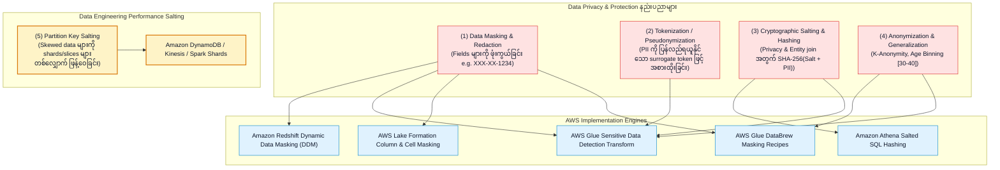
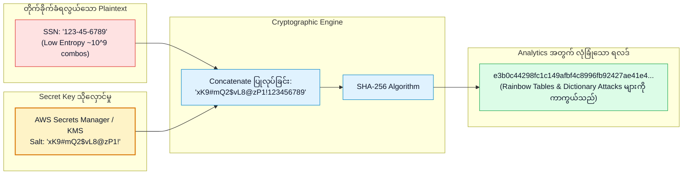
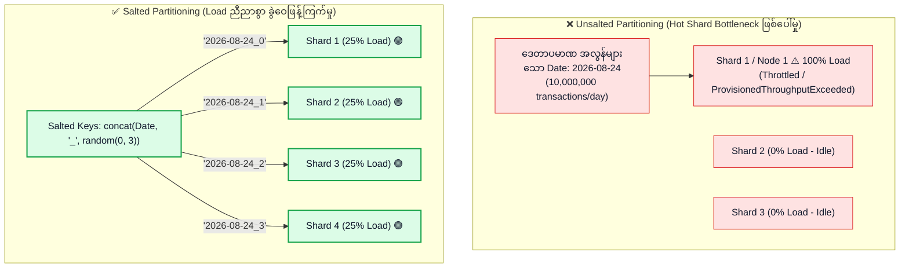
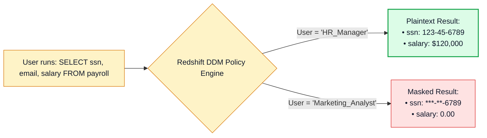

# 🎭 Data Masking, Anonymization, Pseudonymization & Key Salting

- **Category**: Security, Identity, & Compliance / Data Privacy, Cryptographic Protection & Performance Engineering
- **Language / ဘာသာစကား**: [English (Original)](/en/02-services/security-governance/data-masking-anonymization-and-salting) | **မြန်မာဘာသာ (Burmese)**
- **Primary Use Case**: Data masking၊ tokenization၊ cryptographic key salting ဖြင့် hashing ပြုလုပ်ခြင်းတို့ကို အသုံးပြု၍ data engineering lifecycle တစ်လျှောက်လုံးတွင် Personally Identifiable Information (PII) များကို ကာကွယ်ခြင်းနှင့် partition key salting ကို အသုံးပြု၍ data skew ပြဿနာများကို ရှင်းထုတ်ခြင်း။
- **Slide Reference**: `[AWSCertifiedDataEngineerSlides.pdf](/docs/AWSCertifiedDataEngineerSlides.pdf)` ရှိ စာမျက်နှာ 630–675
- **Hub Links**: `[[mm/index]]` | `[[service-catalog]]` | `[[domain-4-data-security-and-governance]]` | `[[redshift]]` | `[[glue]]` | `[[athena]]` | `[[kinesis]]` | `[[dynamodb]]`

---

## 1. High-Level Summary (အကျဉ်းချုပ်)

Production data engineering pipeline များတွင် data privacy စည်းမျဉ်းစည်းကမ်းများဖြစ်သော (**GDPR, HIPAA, PCI-DSS, CCPA**) အရ ခွင့်ပြုချက်မရှိသော အသုံးပြုသူများနှင့် downstream analytics workloads များသည် မူရင်း Personally Identifiable Information (**PII**) များကို access လုပ်ခွင့် မရှိစေရန် သတ်မှတ်ထားသည်။ 

တစ်ချိန်တည်းမှာပင် **"Key Salting"** အယူအဆကို **AWS DEA-C01** စာမေးပွဲတွင် ကွဲပြားပြီး အရေးကြီးသော နယ်ပယ် ၂ ခု၌ စစ်ဆေးလေ့ရှိသည်-
1. **Security & Cryptography (Cryptographic Key Salting)**: Rainbow table attacks၊ dictionary attacks နှင့် frequency analysis များကို ကာကွယ်ရန် hash မပြုလုပ်မီ ထိခိုက်လွယ်သော တန်ဖိုးများရှေ့/နောက်တွင် လျှို့ဝှက် cryptographic salt string တစ်ခုကို ပေါင်းထည့် (append/prepend) ပေးခြင်း။
2. **Big Data & NoSQL Performance (Partition Key Salting)**: **Amazon DynamoDB**၊ **Amazon Kinesis**၊ **AWS Glue / Apache Spark** နှင့် **Amazon Redshift** တို့တွင် data skew နှင့် hot partition ပြဿနာများကို ရှင်းထုတ်ရန် partition key များတွင် random သို့မဟုတ် deterministic numeric suffix များကို ပေါင်းထည့်ပေးခြင်း။



---

## 2. Privacy Techniques Comparison Matrix (Privacy နည်းပညာများ နှိုင်းယှဉ်ချက် Matrix)

| Technique | Description (ဖော်ပြချက်) | Reversibility (မူလအတိုင်း ပြန်ပြောင်းနိုင်မှု) | Preserves Format? (Format ထိန်းသိမ်းနိုင်မှု) | Preserves Join / Analytics Utility? (Join / Analytics အသုံးဝင်မှု) | Primary AWS Implementation (အဓိက AWS ဝန်ဆောင်မှုများ) |
| :--- | :--- | :--- | :--- | :--- | :--- |
| **Masking / Redaction** | စာလုံးများကို သတ်မှတ်ထားသော mask များဖြင့် အစားထိုးခြင်း (ဥပမာ- `***-**-1234` သို့မဟုတ် `NULL`)။ | **Irreversible** (One-way / ပြန်ပြောင်း၍မရ)။ | ✅ Yes (partial mask တွင်ရနိုင်) သို့မဟုတ် No (full mask)။ | ❌ Low (mask ပြုလုပ်ထားသော တန်ဖိုးများကို join ရန် သို့မဟုတ် aggregate လုပ်ရန် မဖြစ်နိုင်ပါ)။ | **Amazon Redshift DDM**, **AWS Lake Formation**, **AWS Glue Studio**။ |
| **Cryptographic Hashing (Salted)** | လျှို့ဝှက် salt (`SHA-256(Salt + SSN)`) ကို အသုံးပြု၍ one-way cryptographic digest တွက်ချက်ခြင်း။ | **Irreversible** (One-way / ပြန်ပြောင်း၍မရ)။ | ❌ No (ပုံသေ 64-char hex string ဖြစ်သွားသည်)။ | ✅ **High** (Deterministic ဖြစ်သော entity resolution နှင့် joins များကို ပြုလုပ်ခွင့်ပေးသည်)။ | **Amazon Athena SQL**, **AWS Glue PySpark**, **AWS Secrets Manager**။ |
| **Tokenization / Pseudonymization** | PII ကို လုံခြုံသော lookup vault ထဲတွင် သိမ်းဆည်းထားသည့် သီးသန့် randomized token ဖြင့် အစားထိုးခြင်း။ | **Reversible** (ခွင့်ပြုချက်ရရှိသော token vault မှတစ်ဆင့် ပြန်လည်ရယူနိုင်သည်)။ | ✅ Yes (ပုံမှန် format ကို ဆက်လက်ထိန်းသိမ်းနိုင်သည်)။ | ✅ High (Tokenization သည် deterministic ဖြစ်ပါက join ပြုလုပ်နိုင်သည်)။ | **AWS Lambda Token Vault**, **DynamoDB**, **Secrets Manager**။ |
| **Generalization / Binning** | တိကျသော တန်ဖိုးများကို ပိုမိုကျယ်ပြန့်သော အပိုင်းအခြား (range) များဖြင့် အစားထိုးခြင်း (ဥပမာ- Age `34` $\rightarrow$ `[30-39]`)။ | **Irreversible** (One-way / ပြန်ပြောင်း၍မရ)။ | ❌ No။ | ✅ High (စာရင်းအင်းဆိုင်ရာ အစီရင်ခံခြင်းနှင့် k-anonymity အတွက် အလွန်သင့်တော်သည်)။ | **AWS Glue DataBrew**, **Amazon EMR Spark**။ |
| **Differential Privacy / Perturbation** | တစ်ဦးချင်းစီ၏ record များကို ကာကွယ်ရန် query output များထဲသို့ တွက်ချက်ထားသော သင်္ချာဆိုင်ရာ noise များ ထည့်သွင်းပေးခြင်း။ | **Irreversible** (One-way / ပြန်ပြောင်း၍မရ)။ | ❌ No။ | ✅ High (Macro population trends များကို လေ့လာဆန်းစစ်ရန် ကောင်းမွန်သည်)။ | **AWS Clean Rooms Differential Privacy**။ |

---

## 3. Cryptographic Key Salting Deep Dive (Cryptographic Key Salting အသေးစိတ် လေ့လာခြင်း)

### Why Raw Hashing is Vulnerable (အဘယ်ကြောင့် ရိုးရိုး Hashing ပြုလုပ်ခြင်းသည် အားနည်းချက်ရှိသနည်း):
အကယ်၍ သင်သည် ဂဏန်း ၉ လုံးပါဝင်သော Social Security Number ကို ရိုးရိုး SHA-256 (`SHA-256("123456789")`) ဖြင့်သာ hash လုပ်ပါက တိုက်ခိုက်သူ (attacker) သည် **Precomputed Rainbow Tables** သို့မဟုတ် **Brute-Force Dictionary Lookups** များကို အသုံးပြု၍ မူလအချက်အလက်ကို အလွယ်တကူ ဖော်ထုတ်ဖောက်ထွင်းနိုင်သည် (အကြောင်းမှာ ဖြစ်နိုင်ခြေရှိသော SSN အရေအတွက်သည် $10^9 = 1\text{ billion}$ သာရှိသောကြောင့် ဖြစ်သည်)။

### How Cryptographic Salting Protects PII (Cryptographic Salting က PII ကို မည်သို့ ကာကွယ်ပေးသနည်း):
**Cryptographic Salt** ဆိုသည်မှာ hash function မသုံးမီ plaintext တန်ဖိုး၏ ရှေ့ သို့မဟုတ် နောက်တွင် ပေါင်းထည့်ပေးသော လျှို့ဝှက်ပြီး random ဖြစ်သော high-entropy string တစ်ခုဖြစ်သည်:

$$\text{SecureHash} = \text{SHA-256}(\text{Secret Salt} \parallel \text{PII Value})$$



### Salted Hashing in Amazon Athena SQL (Amazon Athena SQL တွင် Salted Hashing ပြုလုပ်ခြင်း):
```sql
-- Application layer သို့မဟုတ် parameter မှ ရယူထားသော secret salt ဖြင့် SSN ကို hash ပြုလုပ်ခြင်း
SELECT 
    customer_id,
    order_date,
    to_hex(sha256(to_utf8(concat('EnterpriseSecretSalt_2026!', ssn)))) AS anonymized_ssn_key,
    order_amount
FROM "gold_lake"."orders_raw";
```

> [!IMPORTANT]
> **Data Engineering တွင် Deterministic vs. Randomized Salting**:
> - **Consistent / Global Salt**: Table များတစ်လျှောက် **တူညီသော secret salt** ကို အသုံးပြုခြင်းဖြင့် မူရင်း plaintext SSN ကို ဘယ်သောအခါမျှ ထုတ်ဖော်ပြသရန်မလိုဘဲ cross-table entity joins (`JOIN on anonymized_ssn_key`) များကို ပြုလုပ်နိုင်သည်။
> - **Randomized Per-Record Salt**: Row တစ်ခုချင်းစီအတွက် မတူညီသော unique salt များကို ထုတ်ပေးသည်; password သိမ်းဆည်းမှုအတွက် လုံခြုံရေးအမြင့်ဆုံး ပေးစွမ်းနိုင်သော်လည်း **cross-table join ပြုလုပ်ခြင်းကို မဖြစ်နိုင်စေပါ**။

---

## 4. Partition Key Salting (Big Data & NoSQL Performance) (Partition Key Salting - Big Data နှင့် NoSQL စွမ်းဆောင်ရည် မြှင့်တင်ခြင်း)

Distributed storage နှင့် streaming architectures များဖြစ်သော (**Amazon DynamoDB, Amazon Kinesis Data Streams, Apache Spark, Amazon Redshift**) တို့တွင် ဒေတာ key များသည် တစ်ဖက်စောင်းနင်း မညီမညာဖြစ်ခြင်း (heavily skewed data) ကြောင့် **Hot Shards / Hot Partitions** ပြဿနာများ ဖြစ်ပေါ်စေပြီး တစ်ခုလုံးဆိုင်ရာ pipeline throughput ကို နှေးကွေး (bottleneck) စေသည်။

**Partition Key Salting** သည် ဒေတာများကို physical storage node များတစ်လျှောက် ညီညာစွာ ခွဲဝေဖြန့်ကြက်ပေးသည်:



### Partition Salting Across AWS Services (AWS Services များတစ်လျှောက် Partition Salting အသုံးပြုပုံ):

1. **Amazon DynamoDB**:
   - *ပြဿနာ (Problem)*: `PartitionKey = SensorType` ဖြစ်နေသော IoT sensor record များကို သိမ်းဆည်းရာတွင် (ဥပမာ- `TemperatureSensor` သည် partition တစ်ခုချင်းစီ၏ ကန့်သတ်ချက်ဖြစ်သော 1,000 WCU limit ကို ကျော်လွန်ကာ 50k writes/sec အထိ ရောက်ရှိခြင်း)။
   - *ဖြေရှင်းချက် (Solution)*: Random integer suffix တစ်ခုကို ပေါင်းထည့်ပေးခြင်း (`TemperatureSensor_0` မှ `TemperatureSensor_9` အထိ)။
   - *Query ပြုလုပ်ခြင်း (Querying)*: Read workers များသည် partition key ၁၀ ခုလုံးကို parallel query ပြုလုပ်ပြီး ရလဒ်များကို စုစည်း (aggregate) ယူသည်။
2. **Amazon Kinesis Data Streams**:
   - *ပြဿနာ (Problem)*: Producer သည် record အားလုံးကို တူညီသော `PartitionKey` (ဥပမာ- `Country = US`) ဖြင့် ပေးပို့ခြင်းကြောင့် Kinesis shard တစ်ခုတည်းသို့ ဝန်ပိသွားခြင်း (1 MB/sec သို့မဟုတ် 1,000 records/sec ကန့်သတ်ချက်သို့ ရောက်ရှိခြင်း)။
   - *ဖြေရှင်းချက် (Solution)*: Partition key များတွင် random salts များပေါင်းထည့်ထုတ်လုပ်ခြင်း (`US_1`, `US_2` ... `US_N`) သို့မဟုတ် UUIDs များကို အသုံးပြုခြင်း။
3. **Apache Spark / AWS Glue (Skewed Joins)**:
   - *ပြဿနာ (Problem)*: ကြီးမားသော fact table တစ်ခုကို skewed dimension key ဖြင့် join သောအခါ Spark executor တစ်ခုတည်းက နာရီပေါင်းများစွာကြာအောင် run နေရပြီး memory ပြည့်သွားခြင်း (out of memory)။
   - *ဖြေရှင်းချက် (Solution)*: Dimension rows များကို `0..N` salt များဖြင့် replicate ပြုလုပ်ပြီး fact table join key တွင် salt ထည့်ပေးခြင်း (`concat(key, '_', floor(rand() * N))`)။

---

## 5. Amazon Redshift Dynamic Data Masking (DDM)

**Amazon Redshift Dynamic Data Masking** သည် data administrator များအား storage တွင်ရှိသော မူရင်းဒေတာများကို မပြောင်းလဲစေဘဲ တိကျသေချာသော masking policy များဖြင့် ထိခိုက်လွယ်သည့် ဒေတာများအပေါ် access control သတ်မှတ်နိုင်ရန် ခွင့်ပြုပေးသည်:



### SQL Implementation Example (SQL အသုံးပြုပုံ ဥပမာ):

```sql
-- 1. စိတ်ကြိုက် Partial Masking Policy တစ်ခု တည်ဆောက်ခြင်း
CREATE MASKING POLICY mask_ssn
WITH (ssn_col VARCHAR(11))
USING (
    CASE 
        WHEN CURRENT_USER = 'hr_admin' THEN ssn_col
        ELSE '***-**-' || RIGHT(ssn_col, 4)
    END
);

-- 2. Full Hash Masking Policy တစ်ခု တည်ဆောက်ခြင်း
CREATE MASKING POLICY hash_email
WITH (email_col VARCHAR(256))
USING (SHA2(email_col, 256));

-- 3. Masking Policies များကို Table Columns များသို့ ချိတ်ဆက် (Attach) ခြင်း
ATTACH MASKING POLICY mask_ssn ON payroll.employees(ssn) TO ROLE analyst_role;
ATTACH MASKING POLICY hash_email ON payroll.employees(email) TO ROLE analyst_role;
```

---

## 6. AWS Glue Sensitive Data Detection Transform

AWS Glue သည် PySpark နှင့် Glue Studio visual jobs များအတွင်း တိုက်ရိုက်အသုံးပြုနိုင်သော built-in PII detection စွမ်းဆောင်ရည်ကို ထောက်ပံ့ပေးထားသည်:

```python
import sys
from awsglue.transforms import *
from awsglue.utils import getResolvedOptions
from pyspark.context import SparkContext
from awsglue.context import GlueContext
from awsglue.dynamicframe import DynamicFrame

glueContext = GlueContext(SparkContext.getOrCreate())

# S3 မှ raw dataset ကို ဖတ်ယူခြင်း
raw_dyf = glueContext.create_dynamic_frame.from_options(
    connection_type="s3",
    connection_options={"paths": ["s3://raw-landing-zone/customers/"]},
    format="json"
)

# REDACT action ဖြင့် DetectSensitiveData transform ကို အသုံးပြုခြင်း
sensitive_data_dyf = DetectSensitiveData.apply(
    frame=raw_dyf,
    entity_types_to_detect=["USA_SSN", "EMAIL", "CREDIT_CARD"],
    output_actions=["REDACT"], # ရွေးချယ်စရာများ: REDACT, HASH, DROP, EXTRACT
    redaction_symbol="*"
)

# သန့်စင်ပြီးသား dataset ကို Gold S3 Data Lake သို့ ရေးသားသိမ်းဆည်းခြင်း
glueContext.write_dynamic_frame.from_options(
    frame=sensitive_data_dyf,
    connection_type="s3",
    connection_options={"path": "s3://gold-data-lake/customers_clean/"},
    format="parquet"
)
```

---

## 7. DEA-C01 Exam Essentials (စာမေးပွဲအတွက် မဖြစ်မနေသိထားရမည့် အချက်များ)

> [!IMPORTANT]
> **Masking, Anonymization & Salting အတွက် အဓိက စာမေးပွဲ ဆုံးဖြတ်ချက် Triggers များ**:
>
> - **"Amazon Redshift တွင် သီးခြား SQL roles များအတွက် query run သည့်အချိန်၌ ထိခိုက်လွယ်သော credit card နှင့် SSN columns များကို dynamic စွာ mask ပြုလုပ်ရန်"** $\rightarrow$ **Amazon Redshift Dynamic Data Masking (DDM)** (`ATTACH MASKING POLICY ... TO ROLE`) ကို အသုံးပြုပါ။
> - **"Downstream joins များအတွက် PII data များကို hash ပြုလုပ်ရာတွင် rainbow table attacks နှင့် frequency analysis များကို ကာကွယ်ရန်"** $\rightarrow$ **AWS Secrets Manager** သို့မဟုတ် KMS တွင် သိမ်းဆည်းထားသော secret salt key ဖြင့် **Cryptographic Key Salting** (`SHA-256(Salt + PII)`) ကို အသုံးပြုပါ။
> - **"မူရင်း SSN များကို plain text အနေဖြင့် ထုတ်ဖော်ပြသခြင်းမရှိဘဲ customer identifier များပေါ်တွင် cross-table data joins များ ပြုလုပ်ခွင့်ပေးရန်"** $\rightarrow$ Ingestion pipelines အားလုံးတွင် **Consistent / Global Secret Salt** ကို အသုံးပြု၍ identifier များကို hash ပြုလုပ်ပါ။
> - **"Single date partition key တစ်ခုတည်းသို့ 50,000 writes/sec ဝင်ရောက်မှုကြောင့် ဖြစ်ပေါ်လာသော DynamoDB write throttling ကို ရှင်းထုတ်ရန်"** $\rightarrow$ Random integer suffix (`2026-08-24_0` မှ `2026-08-24_9`) ပေါင်းထည့်ခြင်းဖြင့် **Partition Key Salting** ကို အသုံးပြုပါ။
> - **"Key တစ်ခုတည်းက fact table records ၉၀% ပါဝင်နေသော Spark skewed executor joins ပြဿနာကို ဖြေရှင်းရန်"** $\rightarrow$ Records များကို worker partitions အများအပြားသို့ ခွဲဝေဖြန့်ကြက်ရန် table နှစ်ခုလုံး၏ **join key ပေါ်တွင် Salting** ပြုလုပ်ပါ။
> - **"Parquet files များကို Amazon S3 သို့ မရေးသားမီ ETL job လုပ်ဆောင်နေစဉ်အတွင်း PII records များကို in-flight redact သို့မဟုတ် hash ပြုလုပ်ရန်"** $\rightarrow$ **AWS Glue Sensitive Data Detection transform** (`DetectSensitiveData`) ကို အသုံးပြုပါ။

---

## 📌 Related Notes
- `[[macie-and-cloudtrail]]` — Amazon Macie & AWS CloudTrail Auditing
- `[[iam]]` — IAM Policies & Lake Formation Fine-Grained Permissions
- `[[redshift]]` — Amazon Redshift Architecture & Performance Tuning
- `[[glue]]` — AWS Glue Studio & PySpark Transforms
- `[[dynamodb]]` — Amazon DynamoDB Partitioning & Performance
- `[[domain-4-data-security-and-governance]]` — DEA-C01 Domain 4 Study Guide
