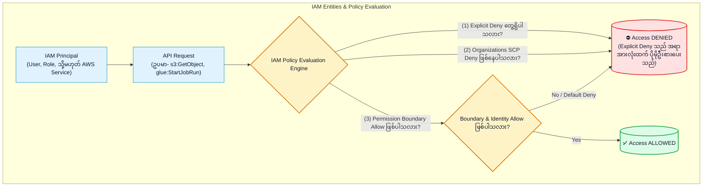
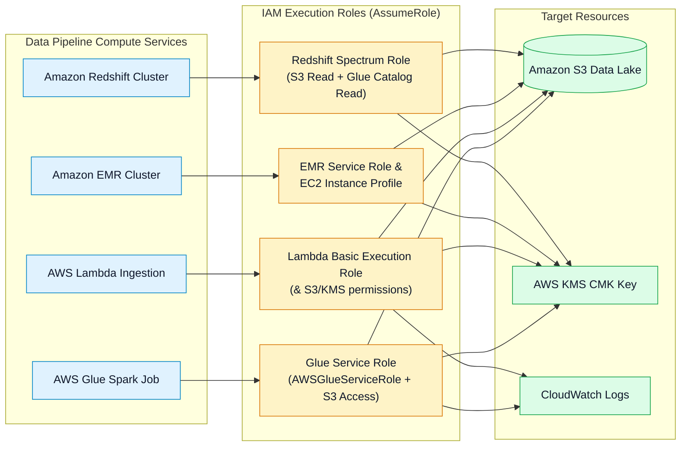
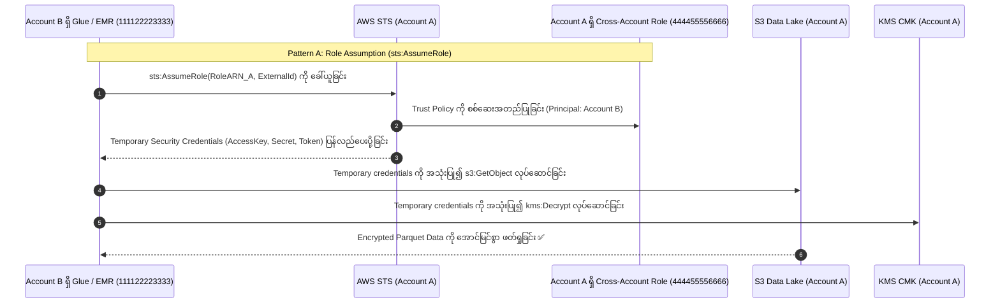
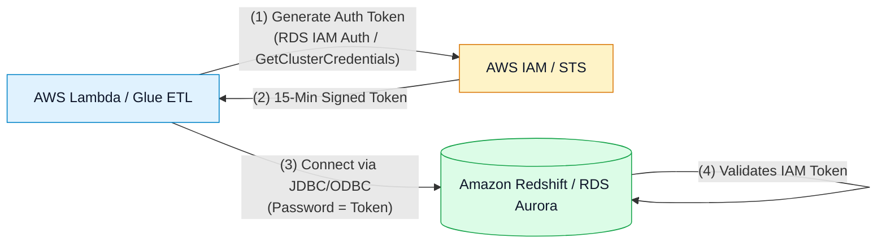

# 🔑 AWS IAM, Execution Roles, Cross-Account Access & Policy Evaluation

- **Category**: Security, Identity, & Compliance / Access Management & Data Authorization
- **Language / ဘာသာစကား**: [English (Original)](/en/02-services/security-governance/iam) | **မြန်မာဘာသာ (Burmese)**
- **Primary Use Case**: Least-privilege identity access management၊ pipeline execution roles (AWS Glue, Lambda, EMR, Redshift)၊ cross-account data lake access နှင့် IAM database authentication။
- **Slide Reference**: `[[AWSCertifiedDataEngineerSlides.pdf]]` ရှိ စာမျက်နှာ 542–559
- **Hub Links**: `[[mm/index]]` | `[[service-catalog]]` | `[[domain-4-data-security-and-governance]]` | `[[lake-formation]]` | `[[kms-and-secrets]]` | `[[glue]]` | `[[redshift]]`

---

## 1. High-Level Summary (ခြုံငုံသုံးသပ်ချက်)

**AWS Identity and Access Management (IAM)** သည် AWS data services အားလုံးတွင် authentication (မည်သူမည်ဝါဖြစ်ကြောင်း အတည်ပြုခြင်း) နှင့် authorization (လုပ်ပိုင်ခွင့် ခွင့်ပြုခြင်း) တို့ကို စီမံခန့်ခွဲပေးသည့် အဓိကအခြေခံ engine တစ်ခုဖြစ်ပါသည်။

**AWS Certified Data Engineer - Associate (DEA-C01)** စာမေးပွဲအတွက် ပြင်ဆင်နေသော data engineers များအနေဖြင့် IAM နှင့် ပတ်သက်၍ အောက်ပါအချက်များကို ကျွမ်းကျင်စွာ နားလည်ထားရန် လိုအပ်ပါသည်:
1. **The Policy Evaluation Logic**: Explicit `Deny`၊ explicit `Allow`၊ Permission Boundaries နှင့် SCPs (Service Control Policies) တို့ အပြန်အလှန် မည်သို့အလုပ်လုပ်ပုံ။
2. **Service Execution Roles**: Compute engines များ (**AWS Glue, AWS Lambda, Amazon EMR, Amazon Redshift**) ထံသို့ least-privilege roles များ ချိတ်ဆက်သတ်မှတ်ပုံ။
3. **Cross-Account Data Lake Access**: Trust policies နှင့်တွဲဖက်ထားသော **`sts:AssumeRole`** သို့မဟုတ် cross-account **S3 Bucket Policies** + **KMS Key Policies** များကို configure လုပ်ဆောင်ပုံ။
4. **IAM Database Authentication**: **Amazon RDS, Aurora နှင့် Redshift** များအတွက် သက်တမ်းတို short-lived IAM database authentication tokens များကို ထုတ်ယူအသုံးပြုခြင်းဖြင့် hardcoded database passwords များ ထည့်သွင်းအသုံးပြုရခြင်းကို ဖယ်ရှားပုံ။



---

## 2. IAM Policy Structure & Evaluation Logic (IAM Policy တည်ဆောက်ပုံနှင့် ဆန်းစစ်ဆုံးဖြတ်မှု လုပ်ငန်းစဉ်)

IAM Policy ဆိုသည်မှာ statements တစ်ခု သို့မဟုတ် တစ်ခုထက်ပိုမိုပါဝင်သော JSON document တစ်ခု ဖြစ်ပါသည်:

```json
{
  "Version": "2012-10-17",
  "Statement": [
    {
      "Sid": "AllowGlueS3GoldReadWrite",
      "Effect": "Allow",
      "Action": [
        "s3:GetObject",
        "s3:PutObject",
        "s3:ListBucket"
      ],
      "Resource": [
        "arn:aws:s3:::company-gold-lakehouse",
        "arn:aws:s3:::company-gold-lakehouse/*"
      ],
      "Condition": {
        "Bool": {
          "aws:SecureTransport": "true"
        }
      }
    }
  ]
}
```

### Core Policy Elements (အဓိက ပါဝင်သော အစိတ်အပိုင်းများ):
- **`Effect`**: `Allow` သို့မဟုတ် `Deny` ဖြစ်သည်။
- **`Principal`**: လုပ်ပိုင်ခွင့်ရရှိမည့် account၊ user၊ role သို့မဟုတ် service ဖြစ်သည် (S3 Bucket Policies ကဲ့သို့သော **Resource-Based Policies** များတွင် ထည့်သွင်းရန် လိုအပ်ပြီး Identity-Based policies များတွင် ထည့်သွင်းရန်မလိုပါ)။
- **`Action`**: ခွင့်ပြုထားသော သို့မဟုတ် တားမြစ်ထားသော သီးခြား API actions များ (ဥပမာ `s3:GetObject`၊ `glue:StartJobRun`)။
- **`Resource`**: ပစ်မှတ်ထားသော AWS resource ၏ ARN (ဥပမာ `arn:aws:s3:::bucket-name/*`)။
- **`Condition`**: Policy စတင်အကျိုးသက်ရောက်မည့် သတ်မှတ်ချက် Key-value ကန့်သတ်ချက်များ:
  - `aws:SecureTransport`: Data transit ကာလအတွင်း HTTPS/TLS ကို မဖြစ်မနေ အသုံးပြုစေခြင်း။
  - `aws:PrincipalArn`: ခေါ်ယူအသုံးပြုသည့် သီးခြား role များကိုသာ ကန့်သတ်ခွင့်ပြုခြင်း။
  - `s3:x-amz-server-side-encryption`: Data upload ပြုလုပ်စဉ် encryption header ပါဝင်စေရန် မဖြစ်မနေ သတ်မှတ်ခြင်း။
  - `aws:sourceVpce`: သီးခြား VPC Gateway Endpoint တစ်ခုမှတစ်ဆင့် ဝင်ရောက်အသုံးပြုမှုကိုသာ ကန့်သတ်ခြင်း။

### Policy Evaluation Rules (Policy ဆန်းစစ်ဆုံးဖြတ်မှု စည်းမျဉ်းများ):
1. **Default Deny**: ပုံမှန်အားဖြင့် request အားလုံးကို implicitly deny (အလိုအလျောက် ပိတ်ပင်) ထားပါသည်။
2. **Explicit Allow**: Identity-based၊ resource-based သို့မဟုတ် boundary policies များတွင် ကိုက်ညီမှုရှိပါက access ခွင့်ပြုပေးပါသည်။
3. **Explicit Deny Overrides All**: မည်သည့်သက်ဆိုင်ရာ policy တွင်မဆို ပါဝင်သော explicit `Deny` သည် `Allow` statement မည်မျှပင် ရှိစေကာမူ access ကို ချက်ချင်း ပိတ်ပင်တားဆီးပါသည်။

---

## 3. Service Execution Roles for Data Pipelines (Data Pipelines အတွက် Service Execution Roles များ)

Data services များသည် သင့်ကိုယ်စား လုပ်ငန်းဆောင်တာများကို ဆောင်ရွက်ရန်အတွက် **IAM Execution Roles** လိုအပ်ပါသည်:



### 1. AWS Glue Execution Role
- **Trust Policy Principal**: `glue.amazonaws.com` ဖြစ်သည်။
- **Managed Policy**: `AWSGlueServiceRole` (Glue အနေဖြင့် network interfaces ဖန်တီးခြင်း၊ Data Catalog နှင့် ချိတ်ဆက်ဆက်သွယ်ခြင်းနှင့် CloudWatch သို့ logs ရေးသားခြင်းတို့ကို ခွင့်ပြုသည်)။
- **Custom Policy**: Data lake buckets များပေါ်တွင် S3 read/write permissions + S3 KMS key ပေါ်တွင် `kms:Decrypt` နှင့် `kms:GenerateDataKey` လုပ်ပိုင်ခွင့်များ။

### 2. Amazon EMR Roles
- **EMR Service Role**: EMR control plane အား EC2 instances များ provision လုပ်ခြင်း၊ EBS volumes များ ချိတ်ဆက်ခြင်းနှင့် security groups များကို configure လုပ်ခြင်းတို့အတွက် ခွင့်ပြုပေးပါသည်။
- **EC2 Instance Profile (Job Flow Role)**: အောက်ခံ EC2 nodes များသို့ သတ်မှတ်ပေးပြီး Hadoop/Spark applications များအား Amazon S3 (`EMRFS`) မှ data ဖတ်ရှု/ရေးသားခွင့် ပြုပေးပါသည်။

### 3. Amazon Redshift Spectrum IAM Role
- **Trust Policy Principal**: `redshift.amazonaws.com` ဖြစ်သည်။
- **Permissions**: `AmazonS3ReadOnlyAccess` (ပြင်ပ S3 data lake ပေါ်တွင်) + `AWSGlueConsoleFullAccess` / `glue:GetTable` (Glue Catalog metadata ကို ဖတ်ရှုရန်)။

---

## 4. Cross-Account Data Lake Access Patterns (Cross-Account Data Lake ဝင်ရောက်အသုံးပြုမှု ပုံစံများ)

Enterprise data mesh ပတ်ဝန်းကျင်များတွင် Account A ရှိ analytical datasets များကို Account B ရှိ Glue/Athena/EMR jobs များမှ မကြာခဏ ရယူသုံးစွဲရန် လိုအပ်ပါသည်။



### Pattern Comparison: Role Assumption vs. Bucket Policy (ပုံစံနှစ်မျိုး နှိုင်းယှဉ်ချက် - Role Assumption နှင့် Bucket Policy)

| Dimension (ရှုထောင့်) | Pattern A: Cross-Account IAM Role (`AssumeRole`) | Pattern B: Cross-Account S3 Bucket Policy |
| :--- | :--- | :--- |
| **How It Works (အလုပ်လုပ်ပုံ)** | Account B သည် AWS STS ကို အသုံးပြု၍ Account A ရှိ role တစ်ခုကို assume လုပ်သည်။ | Account A ၏ S3 Bucket Policy သည် Account B ၏ IAM principal သို့ တိုက်ရိုက် access ခွင့်ပြုပေးသည်။ |
| **KMS Decryption (KMS Data ဖြေဖျက်ခြင်း)** | Temporary credentials များသည် Account A ၏ standard KMS key policy ကို အသုံးပြုပြီး Account A အတွင်း၌သာ execute လုပ်ဆောင်သည်။ | Account A ၏ KMS Key Policy တွင် **Account B ၏ principal သို့ `kms:Decrypt` လုပ်ပိုင်ခွင့်ကို explicitly ပေးထားရမည်**။ |
| **Object Ownership (Object ပိုင်ဆိုင်မှု)** | Upload လုပ်လိုက်သော objects များကို **Account A မှ ပိုင်ဆိုင်သည်** (Account A ရှိ Role က ရေးသားသောကြောင့်ဖြစ်သည်)။ | **S3 Object Ownership (Bucket Owner Enforced)** ကို enable မလုပ်ထားပါက upload လုပ်သော objects များကို မူလအားဖြင့် Account B မှ ပိုင်ဆိုင်သည်။ |
| **Best Used When (အသုံးပြုရန် အသင့်တော်ဆုံး အခြေအနေ)** | Account A အတွင်း၌ လုပ်ပိုင်ခွင့် အတူတူ လိုအပ်သော Third-party vendors များ သို့မဟုတ် multi-step pipelines များအတွက် သင့်တော်သည်။ | Role switching ပြုလုပ်ရန်မလိုဘဲ account များအကြား S3 buckets များကို တိုက်ရိုက် query လုပ်လိုသော Athena သို့မဟုတ် EMR များအတွက် သင့်တော်သည်။ |

---

## 5. IAM Database Authentication (RDS, Aurora & Redshift)

ETL connection strings သို့မဟုတ် config files များတွင် database passwords များကို hardcode ရေးသားခြင်းသည် enterprise security စံနှုန်းများနှင့် မကိုက်ညီပါ။



1. **Amazon RDS & Aurora IAM Database Authentication**:
   - AWS SDK (`rds:connect`) ကို အသုံးပြု၍ သက်တမ်းတို **15-minute authentication token** ကို ထုတ်ယူပေးပါသည်။
   - Database user ကို `IDENTIFIED WITH AWSAuthenticationPlugin` ဖြင့် configure ပြုလုပ်ထားပါသည်။
2. **Amazon Redshift IAM Authentication**:
   - Database user တစ်ဦးအတွက် temporary database credentials များ (သက်တမ်း ၁၅ မိနစ်) ထုတ်ယူရန် `redshift:GetClusterCredentials` ကို ခေါ်ယူပါသည်။
   - Users များကို အလိုအလျောက် provision ပြုလုပ်ပေးခြင်း သို့မဟုတ် IAM groups များကို Redshift database groups များနှင့် ချိတ်ဆက်ပေးခြင်း (mapping) တို့ကို လုပ်ဆောင်ပေးပါသည်။

---

## 6. S3 Bucket Policies vs. IAM Policies vs. Lake Formation

| Capability (လုပ်ဆောင်နိုင်စွမ်း) | IAM Policy | S3 Bucket Policy | AWS Lake Formation |
| :--- | :--- | :--- | :--- |
| **Attachment Target (ချိတ်ဆက်ရမည့် ပစ်မှတ်)** | Users, Groups, Roles. | S3 Bucket (Resource-based). | Glue Data Catalog Tables, Columns, Rows. |
| **Object-Level Control (Object အဆင့် ထိန်းချုပ်မှု)** | ✅ Yes (`s3:GetObject`, `s3:PutObject`). | ✅ Yes (`s3:GetObject`, `s3:PutObject`). | ✅ Yes (S3 data access ကို စီမံခန့်ခွဲသည်). |
| **Column-Level Masking (ကော်လံအဆင့် Masking ပြုလုပ်မှု)** | ❌ No (Columns များကို filter မလုပ်နိုင်ပါ). | ❌ No (Columns များကို filter မလုပ်နိုင်ပါ). | ✅ **Yes (Columns များကို Exclude / Mask ပြုလုပ်နိုင်သည်)**. |
| **Row-Level Filtering (အတန်းအဆင့် Filtering ပြုလုပ်မှု)** | ❌ No (Rows များကို filter မလုပ်နိုင်ပါ). | ❌ No (Rows များကို filter မလုပ်နိုင်ပါ). | ✅ **Yes (SQL row filter expressions များဖြင့် ရရှိသည်)**. |
| **Cross-Account Sharing (Cross-Account မျှဝေမှု)** | `sts:AssumeRole` မှတစ်ဆင့်။ | Direct principal grants များမှတစ်ဆင့်။ | **AWS RAM (LF Resource Share) မှတစ်ဆင့်**။ |

---

## 7. DEA-C01 Exam Essentials (စာမေးပွဲအတွက် မဖြစ်မနေ သိထားသင့်သည့် အချက်များ)

> [!IMPORTANT]
> **Key Exam Decision Triggers for IAM (IAM ဆိုင်ရာ အဓိက စာမေးပွဲ ဆုံးဖြတ်ချက် လမ်းညွှန်များ)**:
>
> - **"Grant an AWS Glue Spark job access to an S3 data lake encrypted with AWS KMS"** $\rightarrow$ `AWSGlueServiceRole`၊ S3 bucket permissions (`s3:GetObject`, `s3:PutObject`) နှင့် KMS permissions (`kms:Decrypt`, `kms:GenerateDataKey`) ပါဝင်သော IAM Role တစ်ခုကို ချိတ်ဆက်သတ်မှတ်ပေးပါ။
> - **"Eliminate hardcoded database passwords in AWS Lambda connecting to Amazon Redshift"** $\rightarrow$ **IAM Database Authentication** (`redshift:GetClusterCredentials`) သို့မဟုတ် **AWS Secrets Manager** ကို အသုံးပြုပါ။
> - **"Cross-Account S3 access fails with Access Denied even though S3 Bucket Policy allows Account B"** $\rightarrow$ S3 bucket သည် **KMS Customer Managed Key (CMK)** ဖြင့် encrypt လုပ်ထားခြင်း ရှိမရှိ စစ်ဆေးပြီး **KMS Key Policy တွင် Account B သို့ `kms:Decrypt` ကို explicitly ခွင့်ပြုထားကြောင်း** သေချာအောင် လုပ်ဆောင်ပါ။
> - **"Enforce TLS 1.2+ encryption in transit on an S3 data lake"** $\rightarrow$ `"aws:SecureTransport": "false"` ဖြစ်ချိန်တွင် S3 Bucket Policy ထဲ၌ explicit `Deny` statement တစ်ခုကို ထည့်သွင်းပါ။
> - **"Restrict access to S3 data lake exclusively from within a VPC"** $\rightarrow$ S3 Bucket Policy တွင် `"aws:sourceVpce": "vpce-12345678"` ဟူသော Condition key ကို ထည့်သွင်းပါ။

---

## 📌 Related Notes (ဆက်စပ် လေ့လာရန်များ)
- `[[lake-formation]]` — Fine-Grained Lake Formation Governance vs IAM
- `[[kms-and-secrets]]` — KMS Key Policies & Secrets Manager
- `[[glue]]` — AWS Glue Execution Roles
- `[[redshift]]` — Amazon Redshift Spectrum IAM Role & Query Federation
- `[[domain-4-data-security-and-governance]]` — DEA-C01 Domain 4 Study Guide
