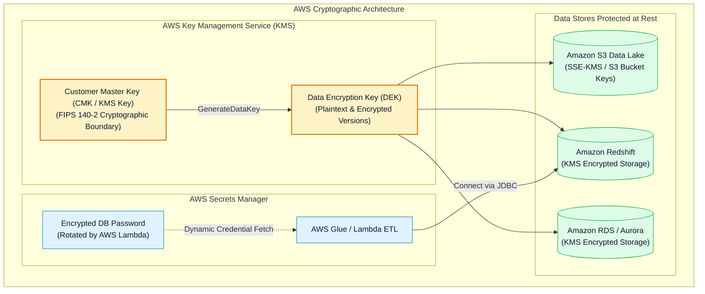
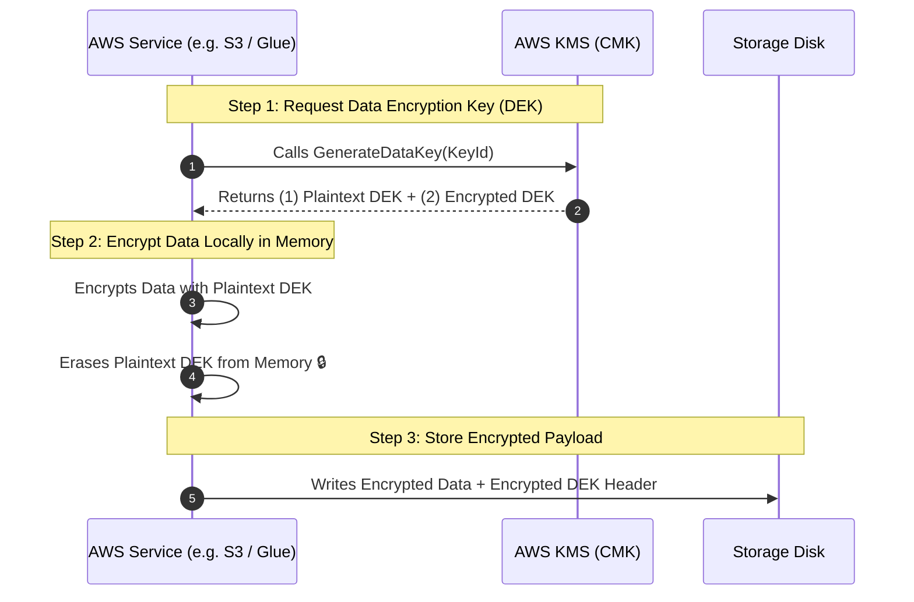
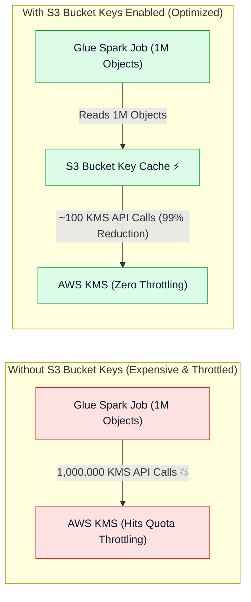
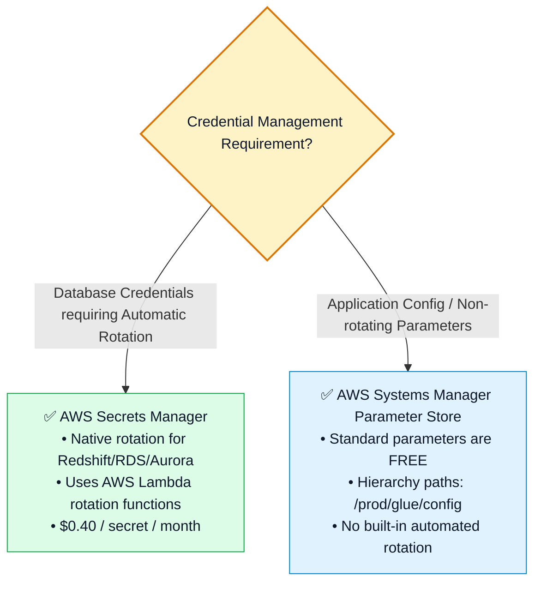

# 🔐 AWS KMS Encryption, S3 Bucket Keys, Secrets Manager & Parameter Store (မြန်မာဘာသာ)

- **Category**: Security, Identity, & Compliance / Cryptography, Data Protection & Secrets Governance
- **Language / ဘာသာစကား**: [English (Original)](/en/02-services/security-governance/kms-and-secrets) | **မြန်မာဘာသာ (Burmese)**
- **Primary Use Case**: Cryptographic keys များကို စီမံခန့်ခွဲရန် (AWS KMS)၊ S3/Redshift/RDS အနှံ့ data at rest များကို လုံခြုံစေရန်၊ S3 Bucket Keys ဖြင့် big data KMS ကုန်ကျစရိတ်များကို သက်သာစေရန် (optimize ပြုလုပ်ရန်) နှင့် AWS Secrets Manager ဖြင့် database credential rotation များကို automate ပြုလုပ်ရန်။
- **Slide Reference**: `[[AWSCertifiedDataEngineerSlides.pdf]]` မှ Pages 560–575
- **Hub Links**: `[[mm/index]]` | `[[service-catalog]]` | `[[domain-4-data-security-and-governance]]` | `[[iam]]` | `[[s3]]` | `[[redshift]]` | `[[glue]]`

---

## 1. High-Level Summary

Enterprise analytics အတွက် data protection ပြုလုပ်ရာတွင် **Encryption at Rest**၊ **Encryption in Transit** နှင့် **Automated Secrets Management** တို့ ပါဝင်သော ပြည့်စုံသည့် cryptographic strategy တစ်ခု လိုအပ်ပါသည်။

**AWS Certified Data Engineer - Associate (DEA-C01)** စာမေးပွဲအတွက် အောက်ပါအချက်များကို မဖြစ်မနေ ကျွမ်းကျင်နားလည်ထားရပါမည်:
1. **Envelope Encryption & AWS KMS Keys**: KMS သည် Customer Master Keys (CMKs) နှင့် Data Encryption Keys (DEKs) များကို အသုံးပြု၍ petabytes ချီသော data များကို မည်သို့ ကာကွယ်ပေးသည်ကို နားလည်ခြင်း။
2. **S3 Encryption နည်းလမ်း ၄ မျိုး**: **SSE-S3၊ SSE-KMS၊ DSSE-KMS နှင့် SSE-C** တို့အကြား သင့်လျော်ရာကို ရွေးချယ်ခြင်း။
3. **S3 Bucket Keys**: S3 Bucket Keys ကို enable ပြုလုပ်ခြင်းဖြင့် ကြီးမားသော AWS Glue နှင့် Amazon EMR workload များအတွက် KMS request traffic နှင့် API ကုန်ကျစရိတ်များကို **99%** အထိ မည်သို့ လျှော့ချပေးသည်ကို နားလည်ခြင်း။
4. **AWS Secrets Manager vs. SSM Parameter Store**: Pipeline downtime မဖြစ်ပေါ်စေဘဲ Amazon Redshift၊ RDS နှင့် Aurora တို့အတွက် database password များကို စီမံခန့်ခွဲခြင်းနှင့် rotation ကို automate ပြုလုပ်ခြင်း။



---

## 2. AWS KMS & Envelope Encryption Mechanics

AWS KMS သည် ကြီးမားလှသော data set များကို network ပေါ် ဖြတ်သန်း၍ KMS ထံသို့ ပေးပို့စရာမလိုဘဲ data များကို encrypt ပြုလုပ်ရန် **Envelope Encryption** ကို အသုံးပြုပါသည်။



### AWS KMS Key အမျိုးအစားများ:
1. **AWS Owned Keys**: Account အများအပြားတွင် ဖြတ်သန်းအသုံးပြုသော AWS ၏ internal key များ ဖြစ်ပါသည် (free ဖြစ်ပြီး မိမိ account ထဲတွင် မမြင်တွေ့နိုင်ပါ)။
2. **AWS Managed Keys**: `aws/s3`၊ `aws/redshift`၊ `aws/glue` ဟု အမည်ပေးထားသော default service key များ ဖြစ်ပါသည် (အလိုအလျောက် ဖန်တီးပေးပြီး cross-account မျှဝေ၍ မရပါ၊ key storage အတွက် အခမဲ့ ဖြစ်ပါသည်)။
3. **Customer Managed Keys (CMKs)**: အသုံးပြုသူကိုယ်တိုင် ဖန်တီးထားသော KMS key များ ဖြစ်ပါသည် (key တစ်ခုလျှင် တစ်လ $1.00):
   - **Custom KMS Key Policies** များကို ထောက်ပံ့ပေးပါသည် (cross-account data access အတွက် မဖြစ်မနေ လိုအပ်ပါသည်)။
   - **Automatic annual key rotation** ကို ထောက်ပံ့ပေးပါသည်။
   - Cryptographic deletion scheduling (၇ ရက်မှ ၃၀ ရက်အထိ) သတ်မှတ်ခြင်းကို ထောက်ပံ့ပေးပါသည်။

---

## 3. Amazon S3 Server-Side Encryption Breakdown

| Encryption Option | Key Managed By | CloudTrail Key Audit Trail | Cross-Account Sharing | Primary Use Case & Exam Decision |
| :--- | :--- | :---: | :---: | :--- |
| **SSE-S3 (AES-256)** | AWS (S3 Managed) | ❌ မရှိပါ (No) | ✅ ရရှိပါသည် (Yes) | S3 bucket များအတွက် default ဖြစ်ပြီး zero-cost baseline encryption ဖြစ်ပါသည်။ |
| **SSE-KMS** | Customer & KMS | ✅ **ရှိပါသည် (Yes)** | ✅ **ရရှိပါသည် (CMK Key Policy မှတစ်ဆင့်)** | Audit log များနှင့် key rotation လိုအပ်သော enterprise data lake များအတွက် standard ဖြစ်ပါသည်။ |
| **DSSE-KMS** | Customer & KMS | ✅ **ရှိပါသည် (Yes)** | ✅ **ရရှိပါသည် (Yes)** | တင်းကျပ်သော regulatory standard များ (FedRAMP, DoD) နှင့် ကိုက်ညီစေရန်အတွက် **Dual-Layer** encryption ဖြစ်ပါသည်။ |
| **SSE-C** | Customer (Client သည် HTTP header တွင် raw key ကို ထည့်သွင်းပေးရသည်) | ❌ မရှိပါ (No) | ⚠️ Custom | မည်သည့်အခြေအနေတွင်မဆို key များကို AWS ပေါ်၌ သိမ်းဆည်းထားခွင့်မရှိသော တင်းကျပ်သည့် compliance mandate များအတွက် ဖြစ်ပါသည်။ |

---

## 4. S3 Bucket Keys (Big Data Performance & Cost Optimization)

Analytics engine များ (**AWS Glue, Amazon EMR, Amazon Athena**) သည် SSE-KMS ဖြင့် encrypt လုပ်ထားသော bucket တစ်ခုအတွင်းရှိ သန်းနှင့်ချီသော file အသေးစားလေးများကို scan ဖတ်သည့်အခါ:
- **Without S3 Bucket Keys**: S3 object request တစ်ခုချင်းစီတိုင်းသည် AWS KMS သို့ သီးခြား `kms:Decrypt` API call တစ်ခုစီကို trigger ပြုလုပ်စေပါသည်။
  - *ရလဒ် (Result)*: KMS request quota များကို လျင်မြန်စွာ ကုန်ဆုံးစေပြီး (ဥပမာ - 10,000 req/sec)၊ **`KMS.KMSInvalidStateException`** သို့မဟုတ် **`ThrottlingException`** ကို ဖြစ်ပေါ်စေကာ ကြီးမားလှသော KMS billing cost များကိုလည်း ဖြစ်ပေါ်စေပါသည်!
- **With S3 Bucket Keys Enabled**: Amazon S3 သည် bucket prefix တူညီသော object များကို encrypt/decrypt ပြုလုပ်ရန်အတွက် KMS ထံမှ သက်တမ်းတို (short-lived) intermediate bucket-level key တစ်ခုကို ဖန်တီးပေးပါသည်။
  - *ရလဒ် (Result)*: Throttling ဖြစ်ပေါ်မှုကို ဖယ်ရှားပေးသည့်အပြင် **KMS API call များနှင့် billing cost များကို 99% အထိ လျှော့ချပေးပါသည်**!



---

## 5. KMS Key Policies & Cross-Account Decryption

Account B ရှိ IAM role တစ်ခုမှ Account A ရှိ encrypted S3 data များကို ဖတ်ရှုနိုင်ရန်အတွက်:
1. **Account A ရှိ S3 Bucket Policy** သည် Account B ၏ role အား `s3:GetObject` ကို ခွင့်ပြုပေးရပါမည် (grant ပြုလုပ်ပေးရမည်)။
2. **Account A ရှိ KMS Key Policy** သည် Account B ၏ role အား `kms:Decrypt` နှင့် `kms:DescribeKey` ကို ခွင့်ပြုပေးရပါမည်:

```json
{
  "Sid": "AllowCrossAccountDecryption",
  "Effect": "Allow",
  "Principal": {
    "AWS": "arn:aws:iam::222233334444:role/GlueDataMeshConsumerRole"
  },
  "Action": [
    "kms:Decrypt",
    "kms:DescribeKey",
    "kms:GenerateDataKey"
  ],
  "Resource": "*"
}
```

---

## 6. S3 Policies မှတစ်ဆင့် Encryption in Transit & Rest ကို မဖြစ်မနေ အသုံးပြုစေခြင်း (Enforcing Encryption)

```json
{
  "Version": "2012-10-17",
  "Statement": [
    {
      "Sid": "EnforceHTTPSInTransit",
      "Effect": "Deny",
      "Principal": "*",
      "Action": "s3:*",
      "Resource": [
        "arn:aws:s3:::corporate-data-lake",
        "arn:aws:s3:::corporate-data-lake/*"
      ],
      "Condition": {
        "Bool": {
          "aws:SecureTransport": "false"
        }
      }
    },
    {
      "Sid": "EnforceKMSEncryptionAtRest",
      "Effect": "Deny",
      "Principal": "*",
      "Action": "s3:PutObject",
      "Resource": "arn:aws:s3:::corporate-data-lake/*",
      "Condition": {
        "StringNotEquals": {
          "s3:x-amz-server-side-encryption": "aws:kms"
        }
      }
    }
  ]
}
```

---

## 7. AWS Secrets Manager vs. SSM Parameter Store



### အသေးစိတ် Feature နှိုင်းယှဉ်ချက် (Detailed Feature Comparison):

| Feature Dimension | AWS Secrets Manager | AWS Systems Manager (SSM) Parameter Store |
| :--- | :--- | :--- |
| **Native Automatic Rotation** | ✅ **ရရှိပါသည် (Yes)** (RDS, Aurora, Redshift, DocumentDB တို့အတွက် built-in Lambda template များ ပါဝင်သည်) | ❌ မရရှိပါ (No) (Custom EventBridge + Lambda setup ပြုလုပ်ရန် လိုအပ်သည်) |
| **Cross-Account Secret Access** | ✅ **ရရှိပါသည် (Yes)** (Native resource-based secret policy များ ပါဝင်သည်) | ❌ မရရှိပါ (No) (Cross-account access ရှုပ်ထွေးပြီး ကန့်သတ်ချက်များ ရှိသည်) |
| **Cost (ကုန်ကျစရိတ်)** | Secret တစ်ခုလျှင် တစ်လ \$0.40 + API call ၁၀,၀၀၀ လျှင် \$0.05 | **အခမဲ့ (FREE)** (Standard parameter များအတွက်) |
| **Maximum Value Size** | **64 KB** | 4 KB (Standard) / 8 KB (Advanced) |
| **Ideal Data Engineering Use Case** | **Glue/Lambda အတွက် Amazon Redshift & RDS database credentials များ** | **Configuration paths၊ table names နှင့် environment constants များ** |

---

## 8. DEA-C01 Exam Essentials

> [!IMPORTANT]
> **KMS & Secrets Manager အတွက် အဓိက Exam Decision Triggers များ**:
>
> - **"SSE-KMS ဖြင့် encrypt လုပ်ထားသော S3 object သန်းပေါင်းများစွာကို scan ဖတ်နေသည့် AWS Glue သို့မဟုတ် EMR Spark job များသည် KMS throttling error များဖြင့် fail ဖြစ်သွားသည်"** $\rightarrow$ KMS API call များကို 99% လျှော့ချရန်အတွက် S3 bucket ပေါ်တွင် **Amazon S3 Bucket Keys** ကို enable ပြုလုပ်ပါ။
> - **"Amazon Redshift / RDS database credentials များကို လုံခြုံစွာ သိမ်းဆည်းပြီး code ပြင်ဆင်ရန် မလိုဘဲ ရက် ၃၀ တိုင်း အလိုအလျောက် rotate ပြုလုပ်လိုသည်"** $\rightarrow$ Credentials များကို automatic Lambda rotation enable ပြုလုပ်ထားသော **AWS Secrets Manager** တွင် သိမ်းဆည်းပါ။
> - **"အခြား account တစ်ခုရှိ S3 bucket ကို ဖတ်ရှုနေသော Cross-Account Glue job တစ်ခုသည် Access Denied error ဖြစ်ပေါ်နေသည်"** $\rightarrow$ Source account ၏ **KMS Key Policy တွင် destination account ၏ IAM role သို့ `kms:Decrypt` permission များကို တိကျစွာ ခွင့်ပြုထားခြင်း ရှိ/မရှိ (explicitly grant)** စစ်ဆေးပါ။
> - **"Amazon S3 သို့ upload တင်သော data အားလုံးကို SSE-KMS ဖြင့် encrypt ပြုလုပ်ရန်နှင့် TLS ပေါ်မှသာ transmit ပြုလုပ်ရန် မဖြစ်မနေ သတ်မှတ်လိုသည်"** $\rightarrow$ `"aws:SecureTransport": "false"` နှင့် `"s3:x-amz-server-side-encryption": "aws:kms"` ကို စစ်ဆေးသည့် `Deny` rule များပါဝင်သော S3 Bucket Policy တစ်ခုကို apply ပြုလုပ်ပါ။
> - **"တင်းကျပ်သော defense/financial compliance အတွက် Dual-layer server-side encryption လိုအပ်သည်"** $\rightarrow$ **DSSE-KMS** ကို ရွေးချယ်ပါ။

---

## 📌 Related Notes
- `[[iam]]` — IAM Service Roles & Cross-Account Trust Policies
- `[[s3]]` — Amazon S3 Storage & Encryption Defaults
- `[[redshift]]` — Amazon Redshift Credential Management & KMS Encryption
- `[[glue]]` — AWS Glue Security Configurations & Connection Secrets
- `[[domain-4-data-security-and-governance]]` — DEA-C01 Domain 4 Study Guide
