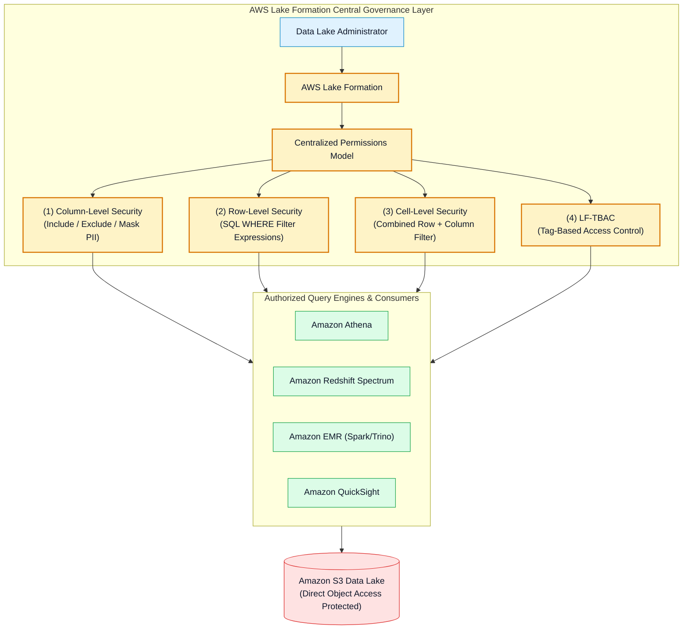
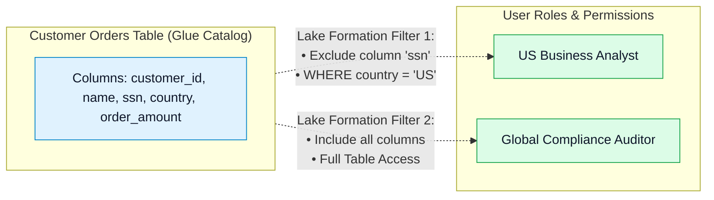
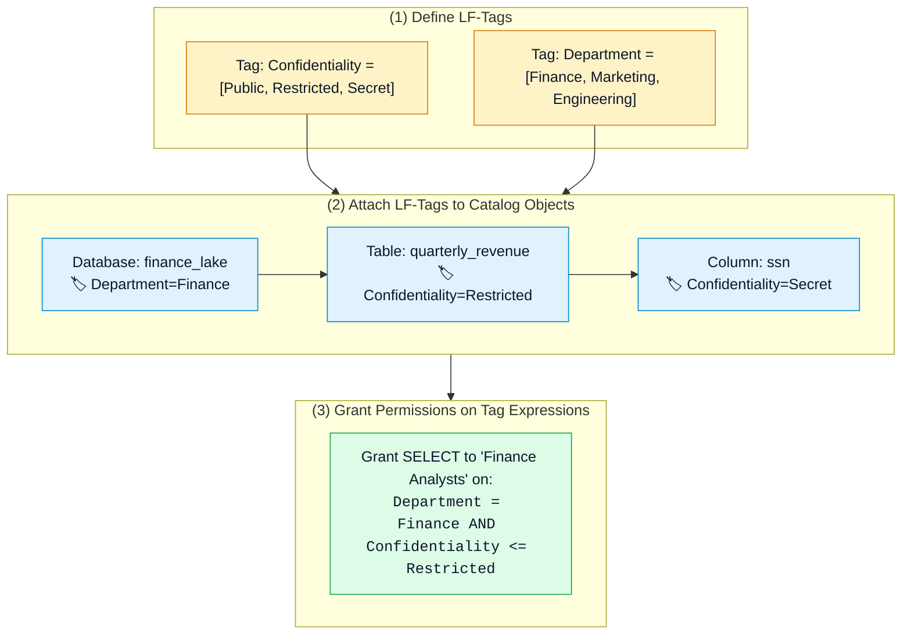
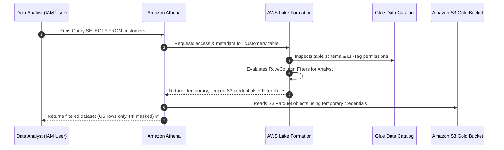

# 🛡️ AWS Lake Formation, Fine-Grained Access Control & LF-TBAC

- **Category**: Security, Identity, & Compliance / Data Lake Governance & Authorization
- **Language / ဘာသာစကား**: [English (Original)](/en/02-services/security-governance/lake-formation) | **မြန်မာဘာသာ (Burmese)**
- **Primary Use Case**: Centralized data lake security management, fine-grained access control (column-level, row-level, နှင့် cell-level filtering), Lake Formation Tag-Based Access Control (LF-TBAC), နှင့် AWS RAM မှတစ်ဆင့် cross-account data sharing ပြုလုပ်ခြင်း။
- **Slide Reference**: `[AWSCertifiedDataEngineerSlides.pdf](/docs/AWSCertifiedDataEngineerSlides.pdf)` မှ Pages 360–364 & 576–589
- **Hub Links**: `[[mm/index|index]]` | `[[mm/00-hub/service-catalog|service-catalog]]` | `[[mm/01-domains/domain-4-data-security-and-governance|domain-4-data-security-and-governance]]` | `[[mm/02-services/security-governance/iam|iam]]` | `[[mm/02-services/analytics-streaming/glue/glue|glue]]` | `[[mm/02-services/analytics-streaming/athena/athena|athena]]` | `[[mm/02-services/database/redshift|redshift]]`

---

## 1. High-Level Summary (အကျဉ်းချုပ်)

**AWS Lake Formation** သည် Amazon S3 နှင့် AWS Glue Data Catalog ပေါ်ရှိ data lake governance ကို ဗဟိုချုပ်ကိုင်မှုရှိစေရန် (centralize)၊ ရိုးရှင်းလွယ်ကူစေရန် (simplify) နှင့် လုံခြုံစိတ်ချရစေရန် (secure) ပြုလုပ်ပေးသော fully managed service တစ်ခုဖြစ်ပါသည်။

ရိုးရာ data lake architecture များတွင် **IAM Policies** နှင့် **S3 Bucket Policies** များကိုသာ အသုံးပြု၍ security ကို စီမံခန့်ခွဲခြင်းသည် အောက်ပါအကြောင်းများကြောင့် စီမံခန့်ခွဲရခက်ခဲလာပါသည်-
- IAM နှင့် S3 policies များသည် **object level** (`s3://bucket/prefix/file.parquet`) တွင်သာ အလုပ်လုပ်နိုင်ပါသည်။
- ၎င်းတို့သည် column-level masking၊ row-level filtering သို့မဟုတ် cell-level security များကို **မလုပ်ဆောင်နိုင်ပါ (cannot enforce)**။
- Policy size ကန့်သတ်ချက်များ (IAM policy တစ်ခုလျှင် 5 KB) ကြောင့် table ရာပေါင်းများစွာအတွက် scale ပြုလုပ်ရန် အခက်အခဲရှိပါသည်။

**AWS Lake Formation သည် ဤပြဿနာကို ဖြေရှင်းပေးပါသည်** — ၎င်းသည် centralized data authorization နှင့် credential vending engine အဖြစ် လုပ်ဆောင်ပေးပါသည်။ Data engineer များအနေဖြင့် granular table၊ column နှင့် row permission များကို Lake Formation console တွင် တစ်ကြိမ်သာ သတ်မှတ်ပေးရုံဖြင့် **Amazon Athena၊ Amazon Redshift Spectrum၊ Amazon EMR နှင့် Amazon QuickSight** တို့တွင် အလိုအလျောက် enforce လုပ်ဆောင်ပေးပါသည်။

---

## 2. Core Lake Formation Permissions Architecture (အဓိက ခွင့်ပြုချက် ဗိသုကာ)

Lake Formation သည် three-tier permission model ဖြင့် အလုပ်လုပ်ပါသည်-

### 1. Data Catalog Permissions
AWS Glue Data Catalog အတွင်းရှိ metadata access ကို ထိန်းချုပ်ပါသည်-
- **Database Level**: `CREATE_TABLE`, `ALTER`, `DROP`, `DESCRIBE`။
- **Table Level**: `SELECT`, `INSERT`, `ALTER`, `DROP`, `DESCRIBE`။

### 2. Data Location Permissions
မည်သည့် IAM user သို့မဟုတ် role များသည် underlying **Amazon S3 bucket path** များသို့ ညွှန်ပြသော table များကို register ပြုလုပ်ခွင့် သို့မဟုတ် create ပြုလုပ်ခွင့် ရှိသည်ကို ထိန်းချုပ်ပါသည်-
- Lake Formation service-linked role (`AWSServiceRoleForLakeFormationDataAccess`) ကို အသုံးပြု၍ S3 path များကို register ပြုလုပ်ပါသည်။
- ခွင့်ပြုချက်မရှိသော အသုံးပြုသူများ (rogue users) အနေဖြင့် ခွင့်ပြုမထားသော S3 location များသို့ ညွှန်ပြသည့် table အသစ်များ ဖန်တီးခြင်းမှ ကာကွယ်ပေးပါသည်။

### 3. Fine-Grained Access Control (FGAC) Data Permissions
Table များကို query လုပ်သည့်အခါ ပြန်လည်ရရှိမည့် actual data record များကို ထိန်းချုပ်ပါသည်-

- **Column-Level Security**: Principal တစ်ခုအနေဖြင့် မည်သည့် column များကို မြင်တွေ့ခွင့်ရှိသည်ကို တိကျစွာ ရွေးချယ်သတ်မှတ်ခြင်း (ဥပမာ - `customer_id`, `order_amount` များကို ခွင့်ပြုပြီး `ssn` နှင့် `credit_card` များကို ဖျောက်ထားခြင်း)။
- **Row-Level Security (Data Filters)**: Row များ မြင်တွေ့နိုင်မှုကို ကန့်သတ်ရန် SQL Boolean expression တစ်ခု သတ်မှတ်ခြင်း (ဥပမာ - `country = 'US'` သို့မဟုတ် `dept_id = 101`)။
- **Cell-Level Security**: သီးခြား cell များကို ကန့်သတ်ရန်အတွက် column exclusion နှင့် row filter expression များကို ပေါင်းစပ်အသုံးပြုခြင်း။

---

## 3. Lake Formation Tag-Based Access Control (LF-TBAC)

Table ထောင်ပေါင်းများစွာနှင့် user ရာပေါင်းများစွာကို စီမံခန့်ခွဲသည့်အခါ တစ်ခုချင်းစီအတွက် table permission သတ်မှတ်ခြင်းသည် ကြီးမားသော administrative overhead ကို ဖြစ်စေပါသည်။ **LF-TBAC** သည် metadata tag များကို အသုံးပြု၍ permissions များကို dynamic ဖြစ်စွာ scale လုပ်ပေးပါသည်။

### အဓိက LF-TBAC စည်းမျဉ်းများ (Key LF-TBAC Rules):
1. **Tag Inheritance**: Table များသည် ၎င်းတို့၏ parent Database ထံမှ tag များကို ဆက်ခံရရှိပါသည် (inherit)။ Column များသည်လည်း သီးခြား override မလုပ်ထားပါက ၎င်းတို့၏ parent Table ထံမှ tag များကို ဆက်ခံရရှိပါသည်။
2. **Dynamic Permission Evaluation**: ကိုက်ညီသော LF-Tags ပါဝင်သည့် table သို့မဟုတ် column အသစ်များ ထပ်ထည့်သည့်အခါ ခွင့်ပြုချက်ရရှိထားသော user များသည် **IAM သို့မဟုတ် Lake Formation policy များကို ပြင်ဆင်ရန်မလိုဘဲ အလိုအလျောက် access ရရှိပါသည်**။

---

## 4. Credential Vending & Query Execution Workflow (Credential ထုတ်ပေးခြင်းနှင့် Query လုပ်ဆောင်မှု အဆင့်ဆင့်)

Athena သို့မဟုတ် Redshift Spectrum မှ data များကို query ပြုလုပ်သည့်အခါ Lake Formation သည် S3 ပေါ်ရှိ permission များကို မည်သို့ enforce လုပ်ဆောင်ပါသနည်း။

- User များအနေဖြင့် underlying data lake bucket ပေါ်တွင် **တိုက်ရိုက် `s3:GetObject` IAM permissions ရှိရန် မလိုအပ်ပါ**။
- Lake Formation သည် integrated analytical engine (Athena, Redshift Spectrum, EMR) များထံသို့ **သက်တမ်းတို temporary S3 credentials များကို ထုတ်ပေးပါသည် (vends)**။

---

## 5. Hybrid Access Mode & Migrating from IAM (IAM မှ ပြောင်းရွှေ့အသုံးပြုခြင်း)

လက်ရှိလည်ပတ်နေသော production pipeline များကို မပျက်ယွင်းစေဘဲ လက်ရှိ S3 data lake တစ်ခုကို Lake Formation သို့ ပြောင်းရွှေ့ (migrate) ရန်အတွက် Lake Formation သည် **Hybrid Access Mode** ကို အသုံးပြုပါသည်-
- Default အားဖြင့် လက်ရှိ Glue table များသည် **`IAMAllowedPrincipals`** ဟုခေါ်သော virtual principal ထံသို့ permissions ပေးအပ်ထားပါသည်။
- ယင်းကြောင့် လက်ရှိ IAM policy များသည် access ကို ဆက်လက် ထိန်းချုပ်ခွင့် ရရှိစေပါသည်။
- Lake Formation fine-grained security ကို စတင်အသုံးပြုရန် data engineer များသည် သက်ဆိုင်ရာ database သို့မဟုတ် table များမှ **`IAMAllowedPrincipals` ကို revoke ပြုလုပ်ပြီး** explicit Lake Formation grant များဖြင့် အစားထိုးရပါမည်။

---

## 6. Cross-Account Data Sharing via AWS RAM (AWS RAM မှတစ်ဆင့် အကောင့်အချင်းချင်း Data မျှဝေခြင်း)

Lake Formation သည် **physical S3 file များကို replicate လုပ်ရန် သို့မဟုတ် copy ကူးရန် မလိုဘဲ** AWS account များအကြား Glue Data Catalog database များနှင့် table များကို မျှဝေရန် **AWS Resource Access Manager (AWS RAM)** နှင့် ပေါင်းစပ်လုပ်ဆောင်ပါသည်-
1. Account A (Data Lake Producer) သည် Lake Formation Resource Share မှတစ်ဆင့် Account B သို့ catalog database ကို share ပေးပါသည်။
2. Account B သည် RAM share ကို လက်ခံပြီး ၎င်း၏ local Glue Catalog တွင် **Resource Link** တစ်ခု ဖန်တီးပါသည်။
3. Account B ရှိ Athena user များသည် resource link ကို ချောမွေ့စွာ query လုပ်နိုင်ပြီး Account A ရှိ Lake Formation က column/row filter များကို enforce လုပ်ကာ S3 credential vending ကို စီမံခန့်ခွဲပေးပါသည်။

---

## 7. Lake Formation vs. IAM vs. S3 Bucket Policies

| ကဏ္ဍ (Dimension) | AWS Lake Formation | IAM Policies | S3 Bucket Policies |
| :--- | :--- | :--- | :--- |
| **Granularity** | **Column, Row, Cell နှင့် Table level** | Object နှင့် Bucket level သာ | Object နှင့် Bucket level သာ |
| **Tag-Based Access** | **LF-TBAC (Catalog metadata tags)** | ABAC (IAM session tags) | Resource tags (ကန့်သတ်ချက်ရှိ) |
| **S3 Credential Model** | **Credential Vending (Temporary scoped credentials)** | Permanent IAM user / Assumed Role | Target account credentials |
| **Cross-Account Sharing** | **AWS RAM (Zero file copies, ဗဟိုချုပ်ကိုင်မှုရှိသော audit)** | Cross-account IAM roles / STS | Cross-account bucket policies |
| **Supported Engines** | Athena, Redshift Spectrum, EMR, QuickSight | AWS Services အားလုံး | AWS Services အားလုံး |

---

## 8. DEA-C01 Exam Essentials (စာမေးပွဲအတွက် မဖြစ်မနေသိထားရမည့်အချက်များ)

> [!IMPORTANT]
> **Lake Formation အတွက် အဓိက စာမေးပွဲ Decision Triggers များ**:
>
> - **"Enforce column-level masking or row-level filtering for Amazon Athena queries on S3 data lake"** $\rightarrow$ **AWS Lake Formation** ကို ရွေးချယ်ပါ (IAM နှင့် S3 bucket policies များသည် row/column filter မလုပ်နိုင်ပါ)။
> - **"Scale access permissions across thousands of Glue Data Catalog tables for multiple departments"** $\rightarrow$ **Lake Formation Tag-Based Access Control (LF-TBAC)** ကို အသုံးပြုပါ။
> - **"Share S3 Data Lake tables with another AWS account without copying files or managing cross-account IAM roles"** $\rightarrow$ **AWS RAM (Resource Links) ဖြင့် Lake Formation Cross-Account Sharing** ကို အသုံးပြုပါ။
> - **"Why can an IAM user query a table in Athena even though they lack direct `s3:GetObject` permissions on the bucket?"** $\rightarrow$ **Lake Formation Credential Vending** သည် user ကိုယ်စား သက်တမ်းတို temporary access credential များကို ထုတ်ပေးသောကြောင့် ဖြစ်ပါသည်။
> - **"How to transition from IAM permissions to Lake Formation fine-grained security without pipeline downtime?"** $\rightarrow$ **Hybrid Access Mode** ကို အသုံးပြုပြီး **`IAMAllowedPrincipals` ကို တဖြည်းဖြည်းချင်း revoke လုပ်ပါ**။

---

## 📌 Related Notes
- `[[mm/02-services/security-governance/iam|iam]]` — IAM Service Roles & Policy Evaluation Logic
- `[[mm/02-services/analytics-streaming/glue/glue|glue]]` — AWS Glue Data Catalog & Crawler Metadata
- `[[mm/02-services/analytics-streaming/athena/athena|athena]]` — Amazon Athena Query Engine & Lake Formation Integration
- `[[mm/02-services/database/redshift|redshift]]` — Amazon Redshift Spectrum External Tables
- `[[mm/01-domains/domain-4-data-security-and-governance|domain-4-data-security-and-governance]]` — DEA-C01 Domain 4 Study Guide
